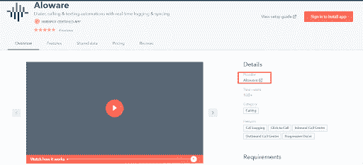
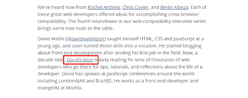
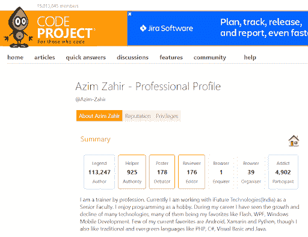

# 适用于开发者的 8 个链接构建策略

> 原文:[https://simple programmer . com/link-building-strategies-for-developers/](https://simpleprogrammer.com/link-building-strategies-for-developers/)

Backlinks are the digital vote of confidence. You need to have credible backlinks pointing to your [developer website or portfolio](https://simpleprogrammer.com/web-development-business/) if you wish to rank high on the search engine result page (SERP). If you don’t have a portfolio yet, you can always build backlinks to your social profile to build your online presence and credibility. However, to get the most out of the link-building strategies discussed in this blog, it’s best to have an online portfolio.

反向链接向搜索引擎发出信号，表明某个网站拥有高质量、可信的信息。因此，它们是离页搜索引擎优化(SEO)的本质。这就是为什么 SERP 中排名靠前的页面有 3.8 倍于 T1 的反向链接。然而，并不是所有的反向链接在谷歌的天平上都一样重要。

所以让我们看看一个高质量的反向链接是什么样的，然后我们将讨论八个链接建设策略，你可以作为一个开发人员或程序员使用。

## 高质量反向链接的特征

你的反向链接档案决定了谷歌对你的开发者或程序员网站、作品集或社交档案的排名是否靠前。以下是一个[质量反向链接](https://www.woorank.com/en/edu/seo-guides/evaluate-backlink-quality)所拥有的一些属性:

*   **相关性:**需要来自相关网站。
*   **域名和页面权限**:链接网站的域名权限(DA)和链接页面的页面权限(PA)越高，来自它的反向链接的权重就越大。
*   **位置:**链接是否来源于博客正文、作者简介、博文、主页、评论等。，它也影响反向链接的权重——主页链接最重要；然而，评论链接的影响最小。
*   被关注的链接:关注链接更可信，因为它们更可靠地传递链接信息，不像不关注或具有其他属性的链接。
*   锚文本:尽管有时你可能无法控制，但如果锚文本与你网站上链接的页面主题相关，效果会更好。
*   **链接多样性:**自然的反向链接配置文件是多样的。确保你得到了一个很好的链接组合，如跟随，不跟随，高域权限，低域权限，个人简历中的链接，博客正文中的链接等。

现在你知道了一个高质量的反向链接是什么样的，让我们看看作为一名开发者或程序员，你如何为你的博客获得最可信的反向链接。

## 利用应用程序集成进行反向链接

开发者经常不得不[集成不同的应用](https://simpleprogrammer.com/apis-help-developers-build-apps/)来完成一项任务，否则单个应用不可能完成这项任务。这些集成相当常见，许多工具在它们的网站上提到了它们的集成伙伴，通常是在主页上或专门的页面上。

因此，如果你对整合你的应用持怀疑态度，或者如果你的整合伙伴还没有与你联系，你绝对应该提出这个话题。一些公司也联合营销他们的产品，所以如果这样的机会出现，它可以变成反向链接的金矿。

你可以从记者、评论网站和有影响力的人那里获得反向链接，甚至可能获得更多未来合作的机会。通过时事通讯或社交媒体提及以及联合活动和网络研讨会，整合也是扩大您的影响力和接触合作伙伴客户群的绝佳方式。

这里有一个 HubSpot 集成应用程序；请注意提供者的链接。

## 创建值得链接的链接诱饵

大多数人创建信息图或坚持幻灯片作为链接诱饵来吸引有机反向链接。但是作为一名开发人员或程序员为你打开了一套全新的[链接诱饵选项](https://socialnomics.net/2021/05/11/20-proven-link-bait-examples-you-can-try-today/)。想想插件、主题、工具、游戏、应用……前途无量。

那么如何通过 link-bait 获得链接呢？这个过程非常简单:

1.  找到与你的链接诱饵相关的潜在客户网站和博客，并经常链接到这些产品。
2.  向他们推销你的链接诱饵，并主动为你的链接诱饵写一篇博文或自定义介绍。
3.  主机博客或网站以你的链接为诱饵，链接到你的源。

根据您创建的链接诱饵，您可以使用各种策略，如[创意链接诱饵](https://moz.com/blog/how-to-build-links-with-infographics)(如下所述)、[断开链接建设](https://ahrefs.com/blog/broken-link-building/)(用于资源指南)，或[摩天大楼方法](https://backlinko.com/skyscraper-technique)(也用于资源)来发现您的资产前景。

这里有一些链接诱饵的例子。

### 创建免费工具

为什么不呢？找出你所处领域的差距，创造一个轻量级的工具来帮助人们。确保你的工具比市场上其他类似的工具更好或者有一些独特的方面。现在在你的网站上发布你的工具，让你的观众知道。接近记者和有影响力的人，围绕你的创作制造轰动效应。反向链接也会跟进。

### 创建一个有趣的应用程序或游戏

这不一定是糖拉什或真人快打。创建一些基本的东西，如拼图或泡泡射击游戏，任何令人兴奋的东西来吸引人们并让他们开始谈论它。Rafael Caferati 已经把他的主页变成了一个游戏。他谅你也不敢毁掉它！另外，他的代码实验室里有一些很酷的代码片段。

### 创建免费的学习资源

开发人员和程序员总是希望学习和改进他们的代码。所以如果你在你的网站上建立了一个资源，并且免费提供，它本身就可以吸引很多反向链接。或者你可以谈论不同的行业相关话题，比如埃里克·伯恩哈德森(Erik Bernhardsson)和你的专家意见。他创建了资源和深入的指南，使他成为数据领域的权威。另一种吸引读者和提高帖子可分享性的方法是混合一些幽默，如[的《编码恐怖》](https://blog.codinghorror.com/about-me/)，他独特的写作风格与他的观众联系在一起。

## 自愿为你的公司博客投稿

科技公司喜欢让他们的技术员工通过做一些简单的事情来为他们的博客做出贡献，比如接受采访，就某个技术主题写一篇内容，或者回答常见问题(FAQ)。这对双方都是双赢的:公司为他们的观众获得了真实的内容，而你获得了你的作品集或网站的反向链接。

科技公司通常拥有良好的领域评级和可靠的营销策略。自然，他们的内容在谷歌上排名更高。因此，你的在线形象也会得到提升。因此，通过这种方式，从你公司的技术博客获得多个到你网站的反向链接是从高权威网站获得反向链接的最简单的方法。

大卫·沃尔什是一个众所周知的有影响力的人，这是他在 Mozilla 做前端开发的采访。注意下面截图中他网站的反向链接。

## 为批量反向链接提供免费主题

有一个陷阱，用这种简单的方法不需要太多努力就能获得数千个反向链接。类似于创建链接诱饵，你可以做免费的主题。然而，不要推销反向链接的免费资源，你只需要在页脚添加你的链接。

现在，让我们假设你创建了一个很酷的主题，你在第一周就获得了 1000 次下载。这意味着你可能有 1000 个新旧网站的反向链接。他们中的大多数可能有很低的域权限，所以无论如何这些都不是高质量的链接。此外，反向链接的数量取决于下载主题后将页脚留在原处的人数。

很多人在很长一段时间内不会考虑改变页脚，因为他们更关注网站建设的其他方面。

还有的怕弄乱代码，不一头扎进去。只有少数网站所有者会在实现你的主题后立即改变页脚。

你可以设置一套完整的免费主题来建立批量反向链接。这是一次性的努力，随着每次下载不断取得成果，尤其是当你增加了你的观众和建立了你的在线存在。

## 从权威开发者资源网站建立反向链接

任何写过一行代码的人都知道堆栈溢出和 GitHub。有许多资源可供开发人员一起开发代码，并找到他们问题的答案。

这些网站不仅有很高的域名权威，而且它们的声誉也非常好，所以制作一个配置文件并从它们那里获得反向链接是提升你的反向链接配置文件的一个很好的方法。这些网站的大部分反向链接都是没有关注的，除非你建立了自己的权威并获得了最低的声誉点。但是请记住，正如我们前面提到的，你的反向链接应该是多样化的，所以获得一些非关注链接也没有坏处！

例如，最初，您的栈溢出配置文件链接是不跟随的。如果你有 2000 分的声誉，你可以获得一个 do-follow 链接，并且你的“关于我们”部分中的链接与网站部分中的链接精确匹配，甚至到最后一个反斜杠。

同样，你可以在 GitHub、CodeProject 和 GitLab 等网站上创建你的个人资料。

[来源](https://www.codeproject.com/Members/Azim-Zahir)

## 成为相关播客和会议的嘉宾

诚然，通过播客和会议获取链接可能需要一些努力。你要么必须在会议上发言，要么出现在播客中。然而，这是建立你的权威和赢得有价值的反向链接的最好方法之一，因为你可以获得巨大的曝光率。播客和会议通常也会得到更多的媒体关注。

它是这样工作的:

1.  注册在活动中发言，或者在播客中作为嘉宾推销自己。
2.  如果您被接受，您将获得来自活动网站、合作伙伴组织、在其博客上发布相关信息的合作者以及参加活动并在其社交媒体上发布相关信息的影响者的链接。
3.  您也可以将您的网站链接通过电子邮件发送给活动组织者，以便传递给与会者作为参考。

你可以在互联网上搜索你所在行业的会议和播客。选择那些有相当多的观众和产生轰动的潜力的。

## 评价你最喜欢的软件，并与行业权威人士联系

你有一套离不开的软件和工具吗？为什么不写评论或推荐，这样其他博主可能会觉得它们有帮助，并链接到你的专家推荐！

另一种表达你的欣赏和获得反向链接的方式是接近创作者，并提供一份证明。这些评价可以出现在主页上、新闻简报中，或者成为他们社交媒体推广活动的一部分。

无论你是从他们的网站还是社交媒体上获得链接，这都将有助于你的反向链接档案多样化，就像一个自然的反向链接档案一样。

另一个聪明的获得反向链接的方法是给著名的博客留下有意义的评论，目的是建立关系。在这种情况下，评论中的链接并不是非常重要。你与影响者的融洽关系可以开启未来建立联系和合作的机会。影响者关系也能提升你的网上声誉。

在建立联系之前，要有耐心，真正专注于建立真正的关系。正如杰夫·弗格森所说，“链接建设不是一个诡计，而是公共关系。开始工作吧。”

## 特定行业出版物上的客座博文

如前所述，技术网站总是在寻找专家为他们的受众写作。而[客座博文](https://www.amazon.com/dp/163161018X/makithecompsi-20)是最常见的链接建设策略之一。因为你是技术专家，你可以在你擅长的其他出版物上发表客座博文，为你的网站生成链接。

此外，通过客座博文，您还可以获得显著的品牌曝光率，从不同来源获得有机流量，并与行业影响者建立关系。

然而，如果你想在客座博文上取得成功，你需要想出与你的网站和目标博客都相关的独特内容。然后写一个高质量的、权威的博客，把他们的读者和 t 联系起来。

你可以这样做:

1.  寻找接受客座博文的开发者网站。
2.  向他们推销你的想法。
3.  如果他们接受了，写一个高质量的博客，在你的网站上提供一些相关内容的链接。
4.  发出你的客座博文，然后等待它的发表。
5.  一些网站和博客还会在作者简介中添加一个反向链接。

只选择域评级高(DR)的网站。(域评级和域权限差不多)。首先，为中等域名评级的网站写几篇客座博文，建立你的反向链接档案。然后联系在你的领域有高域名评级或有影响力的出版物的博客。最后，当你发送电子邮件展示你的推介时，添加一些你表现最好的帖子的链接。这将建立信誉。

## 明智地使用反向链接，为你的网站赢得更多的流量

反向链接是所有搜索引擎优化技术和策略中最有效的。这是一个既定的事实，一个有强大反向链接的网站在搜索引擎中排名更高，从谷歌获得更多的[有机流量](https://ahrefs.com/blog/search-traffic-study/)。

毫无疑问，有很多很多合法的方法来建立高质量的链接。然而，我们在这里讨论的八种链接构建技术利用了您作为开发人员的特殊技能。这些策略将帮助你建立超级相关的高质量链接，并可以给你一个超过你的竞争对手的优势。

你还在等什么？去建立那些反向链接！