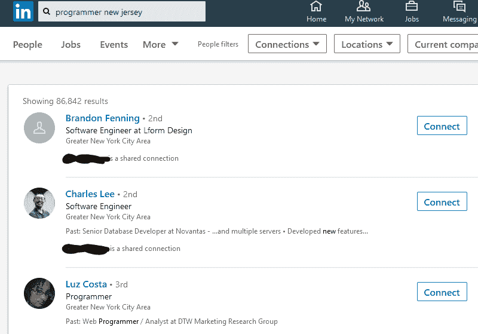
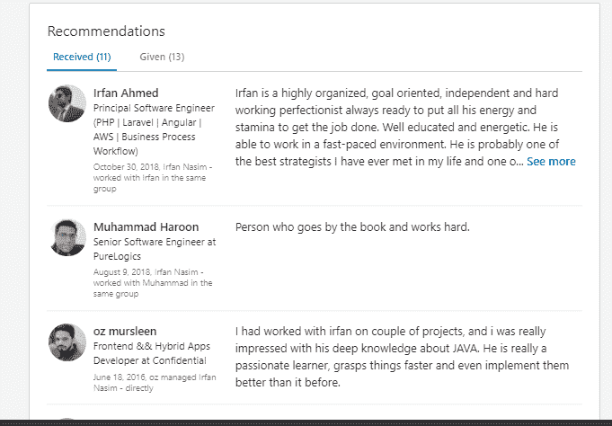

# LinkedIn 如何帮助你获得编程工作

> 原文：<https://simpleprogrammer.com/linkedin-programming-job/>

可以说，程序员的就业市场从未像现在这样竞争激烈。虽然对程序员的需求很高，但远程工作和全球劳动力的访问为公司提供了更多的潜在员工，同时降低了劳动力成本..

这意味着如果你想得到你梦想中的编程工作，你需要超越自我。获得一份好工作不再仅仅是拥有某个职位所需的技能，而是如何向未来的雇主展示这些技能和你自己。

这就是 LinkedIn 可以帮忙的地方。在本文中，我将向您展示世界上最大的专业网络平台如何帮助您获得梦想中的编程工作。

## 为什么你应该考虑 LinkedIn 来寻找你的下一份编程工作

LinkedIn 是一个职业社交网站。它拥有超过 7 亿用户，根据 Omnicore Agency 的数据，其中 9000 万用户是高层影响者。另有 6300 万人担任决策职位。全世界有超过 5000 万家公司使用 LinkedIn。

**来源:** [LinkedIn](https://content.linkedin.com/content/dam/me/news/en-us/images/FY20Q4MembershipNumbersMap_UpdatedJul22.png)

如果你正在寻找下一份[编程工作](https://www.amazon.com/Self-Taught-Programmer-Definitive-Programming-Professionally/dp/0999685902/)，做出招聘决定的人可能就在 LinkedIn 上。根据 [Jobscan](https://www.jobscan.co/blog/recruiters-find-linkedin/) 的数据，87%的招聘人员使用该平台寻找求职者。这比所有其他主要社交媒体平台的招聘人数加起来还多！

在 LinkedIn 上拥有强大的影响力会让你直接面对这些招聘人员。毕竟，如果他们不知道你的存在，他们就不会考虑你的理想工作。通过[优化你的个人资料](https://www.amazon.com/Ignite-Your-LinkedIn-Profile-Secrets/dp/1733805907/)，你可以给自己最好的被关注和被雇佣的机会。

既然你已经理解了在 LinkedIn 上拥有强大影响力的重要性，让我们来看看有抱负的程序员如何充分利用这个网站。

## 程序员如何建立一个令人敬畏的 LinkedIn 个人资料

也许你已经有了一个 LinkedIn 账户，或者发誓在读完这篇文章后马上创建一个。但是，仅仅在平台上有存在感还不足以获得工作机会。编程是一个高度竞争的行业，所以你需要[脱颖而出](https://www.amazon.com/Become-Successful-Programmer-Without-Degree/dp/1520498349/)来获得招聘人员和雇主的注意。为此，你需要一个出色的 LinkedIn 账户。

这里有五个简单的步骤，你可以最大化你的机会。

### 完成您的个人资料

你应该填写个人资料的每一部分。一份完整的个人资料不仅对希望尽可能多地了解候选人详细信息的招聘人员和决策者来说看起来不错，而且在 LinkedIn 搜索结果中也会更好。换句话说，你更有可能被合适的人发现。

如果您的个人资料中包含以下内容，LinkedIn 将认为您的资料完整:

*   个人资料图片。
*   地理位置。
*   行业。
*   至少三项技能。
*   过往就业经历。
*   至少 50 个连接。
*   教育细节。

如果你刚从大学毕业，工作经验有限，不要惊慌。你在学习期间做过兼职吗？作为你课程的一部分，实习或实习怎么样？如果是的话，列出这段经历和你从中获得的技能。你还应该包括任何自愿的经历。

我上面说的这些只是最低要求。你能添加的细节越多越好！

### 使最优化

为了进一步提升你在 LinkedIn 搜索结果中的排名，你需要优化你的个人资料，并加入相关的关键词。换句话说，你希望人们键入什么术语来找到你？

既然你正在寻找编程工作，你可能会想包括“程序员”、“网络开发者”或“软件工程师”这样的术语。

下面是我在我所在的州搜索程序员时看到的:

如果你专攻某个领域或编程语言，也可以使用这些关键字。你不应该使用关键词(人为夸大你提到这些词的次数)，但是一定要几次有机地包括你的目标词。

### 完成你的总结部分

你简历的摘要部分是一个向招聘人员和决策者展示你是谁以及为什么他们应该雇用你的机会。比如说明你热爱编程的地方，你的职业目标是什么。你也可以描述你的职业道德和个性。只是记得避免无意义的流行语！

用第一人称写(“我是……”，而不是“伊恩是……”)，使用简单的语言。不要为了给潜在雇主留下深刻印象而塞进技术语言和行话。记住，你想要的职位的招聘人员和招聘经理可能不是编程专家。

### 展示工作示例

秀，不要说。换句话说，支持你所说的。你不应该声称自己有一项技能，因为雇主和招聘人员需要看到你能力的证据，而你没有办法证明这一点。

幸运的是，LinkedIn 提供了大量的方式来展示你的工作，上传相关的图片、文档、视频和演示文稿。你也可以包含过去工作、作品集、你的[编程博客、](https://simpleprogrammer.com/blog-as-a-programmer/)或 CodePen 的链接。当然，你不需要包括你做过的所有事情。选择最有力的例子——最有可能让你被录用的例子。

### 包括行动呼吁

行动呼吁(CTA)不仅仅用于营销传播。你也可以在你的 LinkedIn 个人资料中加入一个。如果你做得好，它将帮助你获得编程工作。

在找工作的背景下，你的注册税务师应该邀请招聘人员和潜在雇主与你联系机会。“给我写封邮件到[电子邮件地址]”就足够了。在总结中包括您的 CTA。

理想情况下，一旦你概述了你的技能和你正在寻找的工作类型，就以此结束。这是因为你的个人资料承担了让招聘人员或招聘经理对你作为候选人感到兴奋的重任。现在他们需要做的就是给你写封短信！

## LinkedIn 要避免的可怕错误

既然你已经知道如何创建一个令人敬畏的 LinkedIn 个人资料，让我们讨论一下你必须避免的太常见的错误。

### 不要推销自己

永远记住你上 LinkedIn 的原因:你想得到你梦想中的编程工作。但是如果你不能证明你是一个有价值的候选人，你就做不到。许多人对作为候选人推销自己保持沉默，担心他们会被认为是“吹牛”或自以为是。

然而，这就是你找到工作的方式。只要你是诚实可信的，把你的 LinkedIn 个人资料视为推销你技能的卖点是没有错的。因此，你需要利用这个空间来展示为什么你是符合你未来雇主需求的最佳人选。

当你写个人资料时，请记住这个目标。小心选择你的用词，确保它们准确地反映了你想要给人的印象。

以下是一些专业建议，可以帮助你在 LinkedIn 上更有效地推销自己:

*   招聘人员和雇主喜欢把事情做好的人。使用行动语言，关注结果。换句话说，不要只说你做了什么。说说你的成就。
*   具体点。如果你能给出准确的数字(你带来的收入，你完成的客户项目，你推荐的新客户，等等)，那就去做。
*   用主动语态说话(“我做了 X”而不是“X 发生了”)。

最后，在你发布个人资料之前，不要忘记检查你的[拼写和语法](https://launchspace.net/software-comparison/best-grammarly-alternatives/)。糟糕的拼写或错别字会破坏你的专业性。

### 没有向人们寻求建议

不要忽视 LinkedIn 的推荐部分。这与收集[客户评价](https://simpleprogrammer.com/client-testimonials-freelance-developer/)的方式非常相似:这表明其他人认可你的技能。因此，如果你想给自己找到理想工作的最好机会，你需要在 LinkedIn 上获得一些很好的推荐。

但是不要等着别人给你推荐。你需要问他们！所以不要害羞。联系以前的客户，你现在或以前的经理，以及过去和你一起工作过的同事。即使只有两三条建议也能产生重大影响。

当然，你也应该主动回敬他们，并为他们写一封推荐信。

### 活动太少(或活动种类不对)

如果你想让合适的人在 LinkedIn 上注意到你，你需要在这个平台上积极参与。这意味着发帖、评论和回复帖子。

然而，并不是所有的约定都是好的约定。不要发布无意义的内容或为了回复帖子而回复帖子。虽然你可以有点自我推销，但不要做得太多——当然也不要把别人的帖子作为自我推销的平台。

发帖的时候，把目标记在心里。记住，你在 LinkedIn 上是为了得到一份很棒的编程工作。因此，为什么不分享行业新闻，写一篇关于 web 发展趋势的博文，或者为新程序员列出你的顶级[技巧](https://simpleprogrammer.com/6-things-before-started-programming/)？有太多的可能性。只要确保你的内容是相关的。

也有太多的事情:如果你每天花几个小时发帖子和评论，未来的雇主可能会担心你的工作效率。

最后，记得要不择手段的专业。虽然你当然可以不同意其他人说的话，但 LinkedIn 不是与陌生人激烈争论的地方。保持你的语气礼貌和你的语言 SFW(这是安全的工作！).记住，你未来的雇主可能只是在看着你。

## 如何使用 LinkedIn 申请编程工作

你不需要只是坐以待毙，等待未来的雇主与你联系。如果你看到感兴趣的工作，你也可以在 LinkedIn 上申请编程工作。我建议订阅相关的工作提醒，这样你就不会错过任何机会。

要在 LinkedIn 上搜索工作，请使用页面顶部的搜索功能，键入“程序员”或类似短语，并设置搜索参数以显示工作。如果你选择“全部”，你将看到所有与编程相关的内容，并且必须手动筛选列表来寻找工作。

在主搜索栏的右边，你会看到一个地址栏。输入您的地理位置或您正在寻找工作的地区。在上面的例子中，我过滤了美国任何地方的编程工作。

现在你会看到一个你可以申请的潜在工作的列表。如果你对某个列表感兴趣，只要点击它就可以看到工作描述。申请前请完整阅读列表。雇主不喜欢收到没有阅读完整清单的候选人的申请，这通常是显而易见的。如果您喜欢所看到的内容，请点击“应用”

在你开始申请工作之前，确保你已经完成了你的简介。用一份空白的简历申请就像没有简历一样——没有任何意义，你的申请会直接被扔进垃圾桶。

## 关键是要有策略

LinkedIn 是新的和经验丰富的程序员寻找工作的一个很好的平台。高层决策者往往在 LinkedIn 上很活跃，招聘人员也广泛使用该网站。

我希望这些建议能帮助你利用 LinkedIn 找到你梦想中的编程工作。记住要有策略地接近它:创造一个伟大的形象，与他人有意义地交往，并且始终保持礼貌和专业。

为你的下一份编程工作干杯——我支持你！