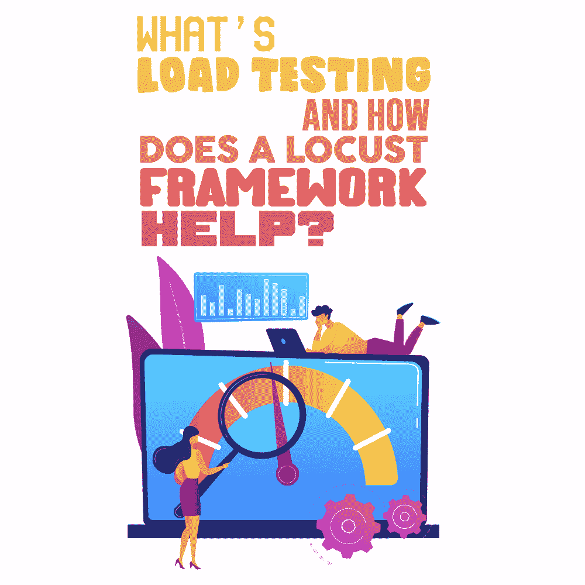

# 什么是负载测试，蝗虫框架有什么帮助？

> 原文：<https://simpleprogrammer.com/load-testing-locust-framework/>

There are many tools leveraged for [software testing](https://www.amazon.com/Software-Testing-Strategy-MICHAEL-PASONO/dp/B08HT5667C/ref=sr_1_3?dchild=1&keywords=QA+testing&qid=1600315814&refinements=p_n_publication_date%3A1250227011&rnid=1250225011&s=books&sr=1-3), [QA testing](https://simpleprogrammer.com/different-roles-of-qa-and-testing/), and performance testing on an existing server. You would think that with all these tools at your disposal, these forms of testing would be easy to manage. However, benchmark testing to ascertain a server's performance under different load conditions can be challenging.

这通常是由于笨拙的界面、无法复制真实场景(对于每秒请求数、吞吐量、平均请求时间和 499 个请求这样的准确指标)以及有效的监控来快速查看您在哪里遇到瓶颈。

这就是蝗虫发挥作用的地方。

Locust 是一个分布式的、用户友好的性能测试工具，用于负载测试应用程序、网站和其他系统。它使负载测试更容易访问和使用，从而大大提高您的生产力和节省您的时间。

在我们讨论 Locust 以及它如何帮助您之前，让我们首先定义什么是负载测试，并检查它在性能测试中的作用。

## 负载测试已定义

根据 Intersog 的说法，负载测试是一个非功能性的应用程序测试过程，帮助 IT 团队测试服务器处理不同负载条件的能力。这个性能或压力测试的子集有助于创建模拟真实使用的系统的人工使用。

最常见的情况是，负载测试使用虚拟机进行，并按需实例化。这些虚拟机建立在云服务器上，因为它们具有成本效益，并且在压力测试结束后更容易终止。这种方法使测试人员能够在各种负载测试场景中模拟用户需求。

## 负载测试工具的示例

有各种各样的负载测试工具(免费的和付费的)常用于网站负载测试。其中比较领先的有:

*   阿帕奇 JMeter
*   Artillery.io
*   装载机队
*   负载冲击
*   loadminja
*   工具
*   蝗虫
*   Httperf
*   理性性能测试器

拥有配置工具的知识和技术实力的 IT 团队可以选择利用免费工具。那些没有必要技能的人和那些不想麻烦实例化和终止服务器的人使用付费工具。

一些典型的[负载测试场景](https://www.softwaretestinghelp.com/sample-test-cases-testing-web-desktop-applications/)如下:

*   检查峰值负载条件下 CPU 和内存的性能。
*   检查客户端和服务器之间的网络延迟问题。
*   检查软件设计问题。
*   对应用程序进行负载测试。
*   对应用程序进行压力测试。
*   测试网页是否在可接受的时间范围内加载。
*   测试数据库查询的执行时间。
*   在各种负载条件下测试响应时间。
*   慢速连接时的网页加载时间。

这里的目标是确保网站或应用程序运行时的稳定性和无缝运行。因此，IT 团队需要强大的负载测试工具来消除系统中潜在的瓶颈。一个这样的工具是蝗虫。

## 蝗虫定义

蝗虫是一个负载测试工具，既可脚本化又可扩展。所有的测试场景都用[纯 Python](https://simpleprogrammer.com/resources-python-programmers/) 编码，不需要使用特定领域语言或复杂的用户界面(ui)。

因为它易于使用，并且您可以利用 [gevent](http://www.gevent.org/) 快速运行分布在多台机器上的性能测试。此外，请求库——包括它的文档——被用作调试测试的提示。

然而，像生活中的任何事情一样，也有一些缺点。这里的主要缺点是，您必须手动进行捕获和重放。Intersog 还表示，虽然复制和粘贴示例的能力使 Locust 高度用户友好，但当需要部署高级测试技术时，它可能会有所欠缺。

## 为什么是蝗虫？

根据蝗虫网站的说法，它的名字来源于这种昆虫，因为它的群集行为被该工具模仿。蝗虫使用的一些术语，如攻击、孵化和群集，都是从大自然中获得灵感和借鉴的。

每个模拟用户就像一只蝗虫，对网站和应用程序施加巨大的压力。然后在基于 web 的用户界面上实时监控这一行为。

群体中的每只蝗虫都运行自己的进程(或称 [greenlet](https://greenlet.readthedocs.io/en/latest/) )，你可以开发高度表达的 Python 场景，而不会因为回调而损害你的代码。这意味着这个工具是完全基于事件的，使得从单个系统支持成千上万的用户成为可能。其他一些负载测试工具有所欠缺，因为它们不支持回调，并且只利用 gevent 中的轻量级流程。

## 用蝗虫有什么利弊？

使用 Locust 进行[负载测试的主要优势如下:](https://www.blazemeter.com/blog/jmeter-vs-locust-which-one-should-you-choose)

*   所有测试都用纯 Python 编写。
*   不需要大量资源。
*   易于设置。
*   很快。
*   非常方便用户。
*   开源。
*   测试任何场景。

以下是使用 Locust 进行负载测试的主要缺点:

*   要求对 HTTP 协议有深入的理解。
*   缺乏上升能力。
*   没有捕获和重放。
*   仅使用线性负荷模型。
*   你不需要成为一个程序员来使用蝗虫。

要确定 Locust 是否是适合您的负载测试工具，您必须确定是否利大于弊。例如，如果你对 HTTP 协议的了解有限，你可能会有一个陡峭的学习曲线。然而，如果你没有购买付费工具的预算，Locust 可能是你最好的选择。

## 蝗虫框架有什么帮助？

In short, Locust makes performance testing easy. You can simply code test scenarios with Python and run the test without working with a clunky UI. By switching from callbacks to coroutines, you can ensure that your code looks and behaves like normal blocking Python code.

蝗虫有一个基于网络的用户界面，可以很容易地跨平台扩展。您可以利用它来跨几台机器上传分布式性能测试，这些机器被设置来模拟数百万并发用户。这使得从事性能测试变得毫不费力。

HTML+JS UI 还实时显示相关的测试细节和结果。虽然它是基于 web 的，但是您可以利用 Locust 来测试任何系统。

说到性能测试，Locust 仍然是一个相对较新的基于 Python 的测试框架。事实上，Python 是这个框架的主要标志，因为您可以用纯 Python 编写性能脚本。

由于 Locust 广泛的基于事件的实现，测试框架也是高度可扩展的，更不用说它的“作为代码测试”特性了。结果，这个工具的受欢迎程度呈指数级增长，现在比 [Apache JMeter(用纯 Java 编写)](https://www.amazon.com/Master-Apache-JMeter-Testing-performance-ebook/dp/B07VLHT1ZY/ref=sr_1_3?dchild=1&keywords=performance+testing&qid=1600315193&s=books&sr=1-3)更受欢迎。

但是，你也可以使用蝗虫中的 JMeter 这样的测试工具来从事 HTTP 和 FTP 协议的性能测试。此外，如果您的代码库是 Python，则 Locust 会转变成一个通用的解决方案，从您现有的代码库中提取数据、域逻辑或模型。但是，如果您不使用 Python，仍然可以集成 Locust 来测试企业系统的性能。

## 蝗虫是免费的，使负载测试更容易

总之，当在不同的负载条件下测试企业服务器的性能时，开源负载测试工具 Locust 提供了。然而，在承诺之前考虑它的缺点是很重要的。

它是一个工具，使应用程序、网站和其他系统的负载测试更容易访问，并且很容易跨平台扩展。此外，如果您已经是一名 Python 程序员，这可能是一件轻而易举的事情。

鉴于 Python 是一种非常流行的编程语言，入门门槛很低，而 Locust 是一种开源测试工具，胜算对它有利。