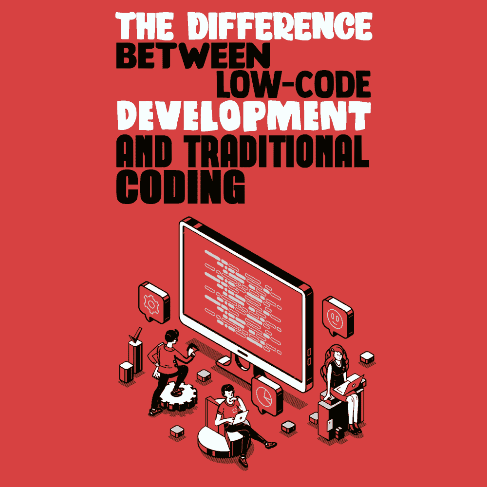
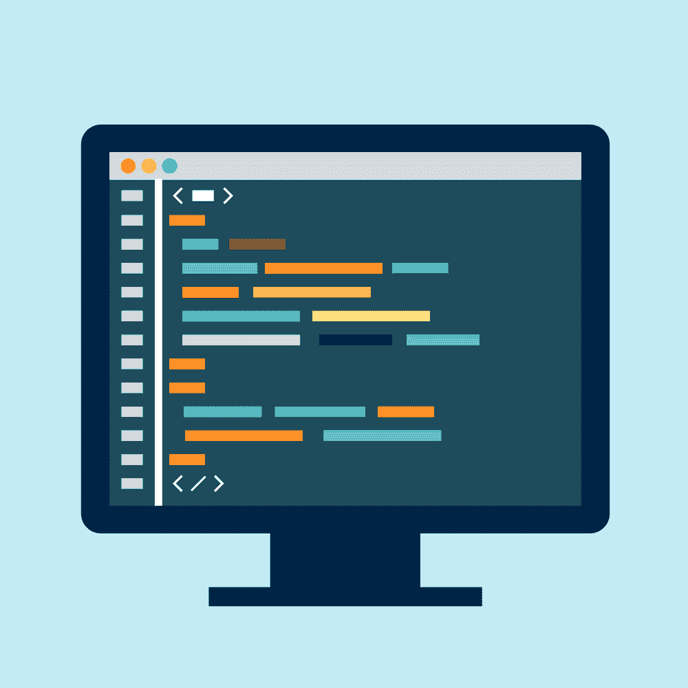

# 低代码开发和传统编码的区别

> 原文：<https://simpleprogrammer.com/low-code-development-traditional-coding/>

There are numerous ways to develop software, but we could broadly divide them into two categories: traditional coding and low-code development.

传统的编码是一个手工过程，这意味着一个人创建程序。但是没有人来编写逻辑，您必须手工制定或编码规则。我们有输入数据，拥有所需编程技能的人编写了一个程序，该程序使用这些数据并在计算机上运行以产生所需的输出。

另一方面，低代码意味着一个人构建应用程序不需要[编程技能](https://simpleprogrammer.com/programmers-convince-boss-upskilling/)，并且结果很快。开发人员需要精通编写代码和执行应用程序，与低代码开发相比，这确实需要更多的时间。

一些传统的编码平台具有内置的低代码能力，使得非技术用户和技术用户都可以访问它们。然而，作为构建业务应用程序的一部分，低代码平台可能需要创建新代码的能力。

低代码平台不仅关注应用程序的开发部分，还关注后者生命周期的所有阶段。

如果你对编程感兴趣，你可能已经读过关于低代码开发的内容。如果是这样，你可能想知道像程序员一样思考到底意味着什么。尤其是，我们该如何着手？

## 什么是低代码，如何使用？

让我们从低代码概念开始。低代码开发是开发人员快速设计应用程序的一种方式，只需要最少的手动编程。使用低代码平台类似于 IDE(集成开发环境),因为它包含许多补充开发人员工作方式和所需工具的功能。

然而，它不仅仅是一个传统的 IDE。简而言之，低级代码是对现有代码的可视化开发，以创建应用程序，就像是由一个“外行人”开发一样，其中每个块都有自己的代码，不需要接触。

由于它可以完全取代一个完整应用程序的传统手动编程方法，因此有经验的开发人员可以更加智能和快速地工作，而不必处理重复的编程。相反，他们可以专注于创建这 10%的应用程序，使其与其他应用程序不同，并为客户增加价值。

另一种方法是编写数千行复杂的代码和语法(然后调试它们)。通过避免这种情况并可视化地创建应用程序，您可以更快地开发应用程序，并充分利用您的开发团队。

## 低代码编程的优势

我们将从四个方面总结使用[低代码](https://www.amazon/dp/B084V6BV3W/makithecompsi-20)开发方法编程的主要好处:

*   开发速度:使用低代码，您可以同时为多个平台创建应用程序，并在几周甚至几天内向相关人员展示最少的可行产品。
*   资源优化:如果你在一个大项目上工作，使用低代码，你就不再需要依赖于具有高度技术性编程主题的专业知识的开发人员，这意味着事情完成得更快，成本更低。有了低代码，你投入 80%的时间去了解客户的需求，分析每个公司的需求。用很少的代码编写另外 20%的程序。
*   低风险和高投资回报:通过低代码开发技术，其安全流程是健壮的，并且数据集成和跨平台支持已经作为标准内置，并且可以很容易地定制。它涉及的风险更小，并允许有更多的时间专注于客户的业务。
*   快速部署:启动和部署应用程序的日子可能是一段紧张的经历。对于低代码平台，部署前崩溃测试可确保应用程序按预期运行。如果有任何意想不到的行为，您可以通过几次点击回滚更改。

每个企业现在都有可能将自己的特性整合到其软件产品中，因此很明显，管理软件包意义上的所谓经典方法不再适应其需求的变化。

## 什么是传统编码？

[传统编程](https://www.amazon/dp/B082Y6FY6H/makithecompsi-20)是一种使用程序开发方法的技术，旨在提高程序的质量、清晰度和开发时间，使其更容易理解。

这种编程技术的主要特征是它由代码段组成，这些代码段可以由多达几页的指令组成。每个数据段必须只有一个数据入口点和一个数据出口点。这将使他们从开始到结束顺序阅读，而不会失去连续性。

## 基于 C++编程的传统编码编程优势

Because structured programming is made up of well-defined segments, programs are simpler, faster, and easier to understand. Moreover, they can be read sequentially and can be corrected or modified after completion.

它是一个简单的语言内核，具有重要的附加功能，例如由库提供的数学和文件管理功能。它也是一种非常灵活的语言，允许多种风格的编程。最广泛使用的一种是结构化的“不走极端”(允许某些中断许可)。

传统编程有一个帮助防止无意义操作的类型系统，它使用一种预处理语言，C 预处理器，用于定义宏和包含多个源代码文件等任务。

它通过使用指针提供对低级内存的访问，在联合的帮助下帮助处理处理器的中断，并提供一组精简的关键字。

传统编码也使得更容易和更快速地编写代码成为可能，从而提高了程序员的效率。

对定制业务应用程序的需求急剧增加。近年来，向企业和个人提供的在线服务数量激增。

## C 或低代码的比较

所谓的低代码平台是一种开发平台，允许快速实现和部署复杂的业务应用程序，同时尽可能地限制开发工作。它允许为新的平台快速编写新的编译器，将程序真正做的事情保持在程序员的直接控制之下，并允许为每个平台实现最自然的解决方案。

这就是为什么 C 语言通常比其他语言更有效。通常，只有仔细的汇编语言编程才能产生更快的代码，从而完全控制机器，尽管 C 编译器的进步和现代微处理器日益增加的复杂性已经逐渐缩小了这种差异。

在某些情况下，一个不存在的特征可以被近似。

例如，C ++的最初实现由一个将 C ++源代码翻译成 C 的预处理器组成。大多数面向对象的函数都包含一个特殊的指针，通常称为“this”，它指的是它所属的对象—函数。通过将该指针作为函数参数传递，可以在 c 中执行该功能。

有了低代码平台，开发人员和 power builders 可以构建这些现成的应用程序。或者，他们可以从头开始，使用高级处理建模、后端脚本和开放 API 来与第三方服务集成，并提供真正个性化的可视化界面。

更注重技术的业务用户和开发人员可以使用低代码平台来创建业务级应用程序，包括强大的安全性、合规性、审计和许可功能。该平台支持快速应用交付，只需最少的手动编码和快速设置。

低代码的使用允许你不用编码就能创建应用程序。这意味着平台会根据要定义的配置和设置自动对应用进行编码。

## 两全其美

低代码平台是两个世界的交汇点。它结合了特定开发的灵活性和软件包的健壮性。

从这个意义上说，它提供了在正确的位置添加正确的代码行所需的所有工具，这将覆盖默认行为。此外，它通常对世界开放，可以与外部库或现有的 web 服务集成。

一个[低代码](https://www.creatio.com/page/low-code)平台将开发人员和业务用户聚集在一起，快速、迭代、协作地共同构建应用程序。事实上，应用程序可以根据业务需求快速实现、部署和修改，而所有这些都不需要特定的底层知识。