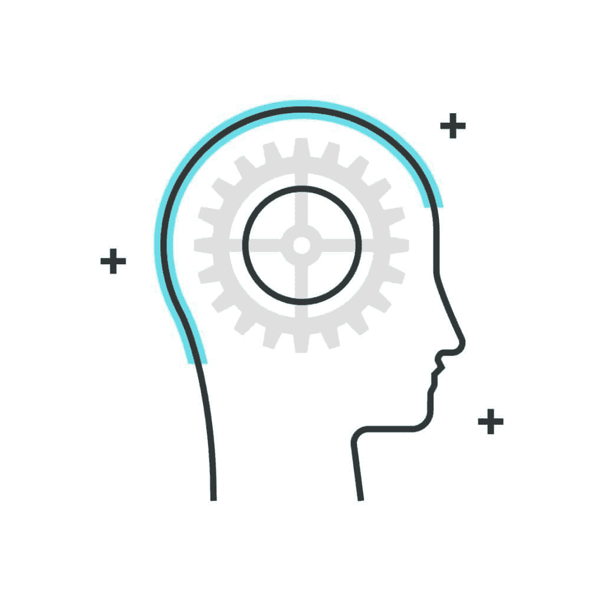
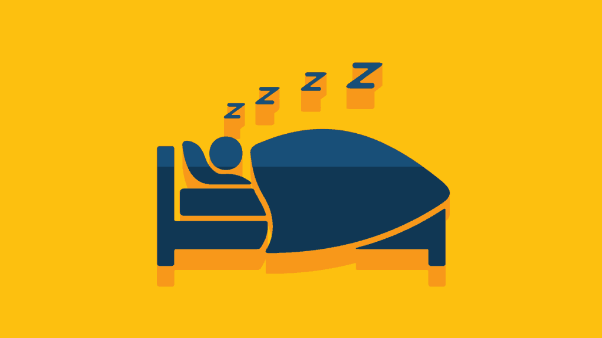

# 清醒梦——提高睡眠时的工作效率

> 原文：<https://simpleprogrammer.com/lucid-dreaming-increase-productivity/>

睡觉是一种解脱。辛苦工作一天后，你终于有机会放松了。我们都同意，良好的睡眠是身体健康的关键，根据研究，缺乏睡眠会增加患糖尿病等疾病的几率，并对我们的记忆力产生不良影响。

尽管如此，有时你会觉得有些有效率，而睡觉只是打断了你的流动。

但是你能想象出一个折中的办法吗，通过允许你在梦中完成某些事情，让你变得更有效率，同时仍然得到休息(T2)？我的意思是，你无论如何都要睡觉，为什么不试着拥抱它呢？

这个解决方案叫做[清醒梦](http://www.medicinenet.com/script/main/art.asp?articlekey=156169)。

术语“清醒梦”指的是做梦的人完全意识到他们不在现实世界的经历。很多时候，他们能够**做他们能够想象的任何事情**，与“正常”的梦相反，我们可以把“正常”的梦描述为我们无法控制的电影。

## 为什么一个程序员应该关心学习清醒梦？

清醒梦**能在几个方面让你受益**。特别是对程序员来说，以极大地提高你的生活和工作质量的方式**“进入”你思维的新领域**是有价值的。以下是我最喜欢的一些好处:

### 1.抵消你反复做的噩梦

许多人，包括程序员，都遭受着**反复出现的噩梦**。对于大多数患者来说，[清醒梦可能是解决这个问题的好办法。](https://www.psychologytoday.com/blog/dream-factory/201504/confront-your-nightmares-lucid-dreaming) 

记住我们做梦是有原因的。梦想就像邮递员，他会不停地敲你的门，给你一个包裹，直到你最终收到它。如果他们失败了，他们要么把它交给你的邻居，要么稍后回来。梦同样会困扰我们，直到我们得到信息。

最常见的噩梦之一就是**被人追**。因为包括我在内的大多数人都把每天的梦当成电影来体验，我们对此几乎无法控制，所以很容易继续向前跑，而不会遇到真正的问题。

如果你能转过身来看看谁在追你，会怎么样？谁知道呢，它可能是一只狗，一只猫，一个人，或者一个幻想的生物。通过这样做，你有很好的机会阻止一个重复出现的噩梦，因为你正在消除它的根源，在许多情况下，这是你刚刚设法克服的**恐惧**。

### 2.对抗焦虑

据我所见，大多数程序员都是内向的人。坐在我们的办公桌前，在编辑器中键入一些没有人能理解的字符是我们喜欢做的事情。

定期自信地与人交谈可能不是我们的强项。在大多数情况下，这不是我们练习太多的东西。如果你问我，这种恐惧来自于**害怕对话的后果:**“如果 x 和 y 发生反应，z 开始发挥作用，只是因为我说了这件特定的事情，我该怎么办？”或者来自**不知道谈些什么。**

除了阅读《如何赢得朋友&影响他人》，在清醒梦中练习日常对话怎么样？我的意思是，如果你完全错了或者不知道你可以谈论什么，会发生什么？

对你不喜欢的人大喊大叫或者整天穿着你最喜欢的狂欢节服装怎么样？

使用清醒梦来尝试这样的活动可以让你的潜意识以外向的方式表达自己，从而增强你的自信。

正如本文所解释的，我们的潜意识不知道梦和现实的区别，所以我们可以用清醒梦来重新编程我们的恐惧。

### 3.玩得开心

暂时把所有的生产力收益放在一边，让我们不要忘记清醒梦是有趣的这个事实！你难道不想靠自己的蒸汽在空中飞来飞去，用四只手编程，或者和约翰聊天吗？(我想我刚刚为我的下一个清醒梦想出了一个主意……)

可能性是无限的。想想你想做的任何事情，我向你保证，一旦你控制了你的梦想，它就有可能实现。我甚至读到一个家伙设法喝了一杯冷热饮料……显然，在这些经历中，现实的**扭曲**可能并且将会发生。就我个人而言，我成功地在清醒梦中飞行，但出于某种原因，我无法让它在现实世界中工作…

上面的例子是人们想要学习清醒梦的一些最常见的原因。我相信你能找到更多，甚至想出你自己的。

希望，当我发现它的时候，你和我一样受到启发和好奇。你甚至可能会问自己如何真正学会它。

就像生活中许多困难的事情一样，清醒梦是你可以学习的，但这需要时间。尽管一项研究表明，75%的参与者能够在练习的前九周做一个清醒梦，但你不会在短时间内掌握它。和你想学的几乎任何东西一样，它需要练习和奉献。而且**学习过程中的一致性**很重要。但是根据我的经验，我可以告诉你，回报是巨大的。

## 如何利用清醒梦让自己更有效率？

T2】

### 1.找到解决棘手问题的方法

作为程序员，我们不停地使用我们的分析思维。试图为给定的问题找到合适的解决方案有时会是一个相当大的挑战。当你试图找出是什么触发了一个异常时，不得不去睡觉，这种感觉并不好。或者更糟，如果你不能想出一个合适的算法。你知道清醒梦可以帮助你解决这些问题吗？

当我们做清醒梦时，我们的头脑比平时更加活跃。你的潜意识知道你在睡觉时对一个棘手的错误感到不舒服。它试图**找出一个解决方案**。清醒梦可以帮助你引导你的思维走向正确的方向，因为你可以控制自己的思想，因此可以在你选择的任何超现实、创造性的环境中思考可能的解决方案。

### 2.练习模式

程序员应该做运动来平衡我们从长时间坐着所面临的问题。慢跑、游泳或足球是一些例子。比方说，你喜欢在空闲时间打网球，但你无法获得完美的挥杆效果。问题是，你的大脑知道它是如何工作的，但你的潜意识不知道。

但是它需要。因为当我们在进行反应性运动时，我们的潜意识通常会为我们处理动作。你可以把它看作是“编程”我们自己去做我们想做的事情。

好消息是[你可以**在梦中编程你的大脑**](https://hbr.org/2012/04/practicing-in-dreams-can-improve-your-performance) **。这只是在你下一次清醒梦体验中练习的问题。练习部分本身与你在现实世界中所做的练习没有什么不同。这样做，你也应该在你的现实生活中体验到改善。**

### 3.寻求项目灵感

我们的头脑是有创造力的。我们都知道。但是，包括我在内的许多程序员发现很难为项目想出好主意。似乎我们在现实世界中有太多的约束，而这个星球上的一切都已经被别人创造出来了。

幸运的是，你的梦想可以像你希望的那样富有创造性。想象你自己在一个幻想的世界里，看看你能想到什么。因此，你的思维活动会增加，你可能会发现自己在思考创造性的未来项目。

看看这些人们在梦中想出主意的例子。

## 怎么才能学会呢？

下面描述的步骤是学习清醒梦所需的基本概述。你应该同时遵循所有这些方法，以达到最佳效果。

### 1.创建一个梦想日记

做了一个清醒的梦，但第二天醒来时却不记得它，这并不是你真正想要的——这是你应该写一篇 [**梦日记**](http://www.amazon.com/exec/obidos/ASIN/159030957X/makithecompsi-20) 的主要原因。此外，这可能会让你的清醒梦感觉更强烈，因为你正在训练你的大脑记住梦中的所有细节。

每天早上，你一醒来，就抓起一个笔记本或你最喜欢的写作应用程序，写下日期，写下一小段或一些笔记，记录下你能从梦中想起的一切。你回忆的细节越多越好。就在你睡觉之前，**阅读你早上做的笔记**。因为我一直在做这个，我发现自己比以前记得更多的梦，这正是我们想要通过这个练习完成的。

### 2.接受现实检查

这一步是训练你的批判性思维，问自己“我现在是真的在现实世界中还是只是在梦里？”

最常见的方法是进行所谓的现实检查。现实检查的想法是在现实世界中做足够长的时间，这样你的大脑就会自动在梦中开始做。例如，你可以数左手的手指，看向别处一秒钟，然后再数。然后问问你自己，在现实世界中你是否有可能有 X 根手指。最常见的是，你会用“是”来回答。

现实检查的关键是让他们成为一种习惯。你必须在日常生活中足够频繁地重复它们，这样你的大脑就会自动地继续在你的梦中进行现实核查。如果你不记得做这些事情，我建议你用一个计时器，在一天中以最适合你的时间间隔做这些事情。他们在现实世界中不会让你吃惊，但在梦里会。如果你养成习惯，在梦中自动数手指，你可能会发现自己只有四根手指，甚至六根。

从那时起，你的意识意识到你不在现实世界中，你的梦变得清晰了。例如，如果你一直在数你的手指作为现实检查，看向别处，然后再数一次，很可能一旦你的身体开始在你的梦里自动进行这样的检查，就会比以前多一个手指。这正是让你有意识和警觉的原因。

还有其他的现实检查，比如看时钟，或者用手指捂住鼻子试着呼吸。你应该能在网上找到更多。

### 3.关心话题

从我的经验来看，我对清醒梦这个话题越感兴趣，我做的梦就越多，因此我做清醒梦的机会就越大。

通过在论坛或书中阅读来处理这个话题，甚至仅仅是思考，都会告诉你这个话题对你来说很重要。

### 4.相信它是有效的

如果你认为这一切都是胡言乱语，无论如何都不会起作用，你唯一想做的事情就是向世界证明它不会起作用，那么你很可能已经实现了你的目标。

就像几乎任何你想学的东西一样，带着正确的态度去学习是看到结果的关键。

这基本上是学习清醒梦的标准方法，但每个人都是独特的个体。对一个人来说，可能需要一个月，对另一个人来说，可能只需要一周，下一个人可能永远不会有清醒的梦，尽管尝试了一年多。

举个例子，下面是一个增加你经历清醒梦的机会的实用程序:

*   在一天中安排 10 次现实检查
*   阅读一些博客或论坛上关于这个话题的文章
*   带着良好的心态去睡觉，并且相信它会起作用
*   在你的梦日记中写下你能从梦中记起的一切

我建议多阅读学习过程本身。以下是这样做的一些来源:

http://www . world-of-lucid-dreaming . com/how-to-have your ' s first-lucid-dream . html

[http://www.world-of-lucid-dreaming.com/](http://www.world-of-lucid-dreaming.com/)

虽然学习清醒梦所需的时间因人而异，但我可以说的是，如果他们长期遵循上述步骤，我没有听到任何人抱怨没有清醒梦。

## 危险吗？

论坛上有很多人告诉你，如果你在清醒梦中死去，在现实世界中也有可能死去。

有一个问题要问你:你有没有经历过这样一个梦:你刚刚**坠入**无尽的深渊——你有没有发现自己没有从中醒来？清醒梦就像普通的梦一样，只是你意识到自己在做梦。

对清醒梦的科学测试已经进行了很多年，没有任何案例显示出任何真正的危险迹象，无论是心理上的还是生理上的。你可以在这里阅读更多关于清醒梦的主要问题。

另一方面，研究人员已经能够发现许多好处，如 **[提高意识](https://jonbarron.org/happiness-mental-health/new-lucid-dreaming-research)，更有信心，[更好的心理健康，](http://doctormurray.com/create-lucid-dreams-for-a-better-life/)，以及人们在一天中更清醒**。

如果你发现自己有不好的心理问题，例如，深度抑郁或精神分裂症，去看医生，告诉他们你学习清醒梦的计划。

记住，安全第一。

## 最后的话

感谢你阅读这篇关于清醒梦的介绍。如果你发现自己对这个话题感兴趣，我建议你上网去了解更多。以下是本文的一些最终要点和提示:

*   每个人都有学习清醒梦的能力
*   清醒梦可以在你生活的几个方面给你带来好处——由你来选择对你最有益的梦
*   清醒梦很有趣，但它也能帮助你提高效率
*   如果你想学习它，你必须每天坚持练习
*   花费的时间长短不一
*   为了让自己保持动力，想象一下这会给你的生活带来什么

有许多网站致力于不同的经验和技术。记住，你用这些信息做的一切都是你的责任。记住在论坛上听取别人的建议时要小心。

顺便说一句:我建议远离那些承诺让你在一天内做一个清醒梦的技术，因为它们通常要求你在半夜醒来，然后再次入睡，最终可能会让你感到疲劳。

祝你愉快。:)