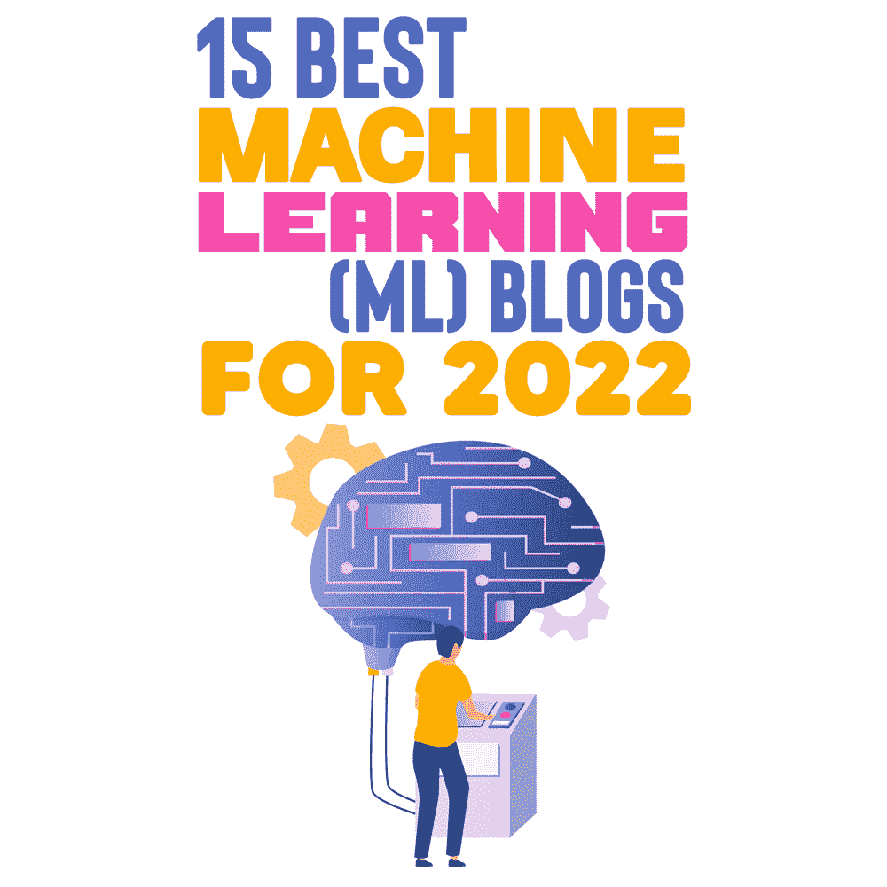

# 2022 年 15 个最佳机器学习(ML)博客

> 原文：<https://simpleprogrammer.com/machine-learning-blogs-2022/>

The concept of [machine learning (ML)](https://simpleprogrammer.com/category/machine-learning/) isn’t new. Yet big data has revitalized the subject, and more companies are using ML models to scale their operations, equip their workforce with better and faster tools, uncover hidden insights, and challenge assumptions that are underlying the analysis.

随着人工智能(AI)和机器学习(ML) [在所有业务线和工作角色中获得牵引力](https://simpleprogrammer.com/2022-technology-programming-trends/)，企业正在享受使用技术帮助企业成功的相关主题的好处。

人工智能和机器学习需要被理解和信任，才能对组织产生颠覆性的影响。没有信任…

从在这些领域拥有丰富知识的组织和个人那里咨询 ML 博客的读者可以更好地了解他们，获得紧迫问题的答案，并与其他有成功使用这些工具经验的人联系。

对所有的资源进行分类会让人不知所措。这里有一些网站和博客，当我想了解更多关于机器学习和人工智能的知识时，我会访问它们。

1.  **[走向数据科学](https://towardsdatascience.com/)**

媒体上最大的数据科学出版物是《走向数据科学》。描述为一个数据驱动的社区，讨论人工智能、数据科学、数据可视化、深度学习、机器学习、NLP、计算机视觉、相关新闻、机器人、自动驾驶汽车、编程、技术等等！

1.  **人工智能(open ai)**

OpenAI 项目是由行业专家创建的，他们希望让每个人都可以使用人工智能。这项工作由埃隆·马斯克和萨姆·奥尔特曼领导，他们是一个名为 OpenAI 的非营利研究组织的联合主席，并得到了包括亚马逊网络服务、微软和印孚瑟斯在内的公司的赞助，这些公司正在努力使人工智能变得更容易获得。

在这篇文章中，贡献者谈论他们促进和推进人工智能技术的长期研究努力。任何对人工智能感兴趣的人都应该去看看。

1.  **[机器学习很好玩](https://www.machinelearningisfun.com/)**

这个博客很好地介绍了机器学习。通过使用交互式教程和实际例子，有效地解释了 ML 的原则，使人们更容易看到它们如何应用于许多企业和行业。

Adam Geitgey 曾是一名软件开发人员，在机器学习实施方面为组织提供咨询。软件的未来是嵌入在机器学习中的，所以他通过提供指南和技术来帮助软件开发人员发展坚实的 it 工作知识。

1.  **[机器学习掌握](https://machinelearningmastery.com/)**

机器学习大师博客是为人工智能和机器学习的新开发者准备的。Jason 拥有人工智能相关领域的多个学位，例如…

他曾经作为一名业余爱好者学习如何编程，现在想分享在他的职业生涯中帮助过他的工具。

他的博客以及他的电子邮件课程和时事通讯对所有专业水平的人都是开放的。

1.  **[BAIR 的博客](https://bair.berkeley.edu/blog/)**

BAIR 的博客分享了加州大学伯克利分校人工智能系人工智能工作的研究成果和重要信息。从自然语言处理到机器人学，研究生和教职员工都为网站内容做出了贡献。

1.  **[FastML](http://fastml.com/)**

FastML 使用有趣、易读的帖子为您带来机器学习的最新进展。Zygmunt Zaj*c 运营着这个网站，它是一个必不可少的机器学习平台，涵盖了过度拟合、指针网络和聊天机器人等主题。

如果你发现自己对似乎需要数学博士才能完全理解的 ML 论文感到沮丧，我建议你把这个博客收藏起来。

1.  **[AI 趋势](https://www.aitrends.com/)**

围绕人工智能的最新技术和商业新闻通过这个媒体渠道呈现。使用人工智能和机器学习有助于高管们掌握最新趋势。

商业领袖接受采访，思想领袖的作品出现在《人工智能趋势》以及关于人工智能商业的文章中。

1.  **[【苹果机器学习杂志】](https://machinelearning.apple.com/)**

苹果的一些机器学习努力可以从语音识别、预测和自动纠正的发展中看出，正如 Siri 所观察到的那样。

苹果还将 ML 纳入了他们最新的 iPhone，每秒钟执行数万亿次操作，所以它就像你手中的 ML。

苹果的机器学习杂志提供了机器学习如何塑造苹果多样化技术的观点。此外，工程师们还介绍了他们的工作如何影响机器学习的变革。

1.  **[AI at Google](https://ai.google/)**

谷歌参与机器学习研究的事实并不令人惊讶，因为他们首先向世界介绍了机器学习。

为了让谷歌技术有效工作，机器学习和人工智能发挥了关键作用——从重新定义网络搜索的搜索算法到改变我们导航方式的谷歌地图，再到改变汽车行业的无人驾驶汽车。

在谷歌帖子的整个人工智能中，谷歌讨论了其发表的研究以及其技术如何被其他公司用来推进他们自己的人工智能。

1.  **[机器学习博客，ML@CMU，卡耐基梅隆大学](https://blog.ml.cmu.edu/)T3】**

ML@CMU 提供了一个媒介，研究人员可以通过它向卡耐基梅隆大学的专业人士和普通观众传达研究成果、机器学习的观点和其他更新。

该博客以卡内基梅隆大学本科生、研究生和博士后学生的帖子为特色

1.  **[亚马逊科学博客](https://www.amazon.science/blog)**

你可以在亚马逊科学的神奇科学博客上按研究领域进行筛选。亚马逊科学博客涵盖的研究领域包括云和系统、计算机视觉、对话式人工智能、自然语言处理、机器学习、机器人、搜索和信息检索以及安全、隐私和滥用预防。

1.  **[蒸馏](https://distill.pub/)**

机器学习是蒸馏文章的重点。一篇来自《蒸馏》的文章因其出色的交流和对理解他人的承诺而与众不同。

来自蒸馏的文章可能会使用互动媒体，但并不总是如此。Distill 经常要花 100 多个小时来发表一篇文章。

1.  **[数据科学道场](https://datasciencedojo.com/)**

An education startup called Data Science Dojo helps professionals analyze data in actionable ways. Several articles about machine learning are available on their machine learning blog.

此外，其他资源也是可用的，包括数据科学、人工智能、分析、现实技能和编程。

1.  **[海王星。艾](https://neptune.ai/)T3】**

在海王星上的众多教程中。AI 的机器学习博客是关于机器学习建模、超参数优化、模型评估、数据探索、生成模型、机器学习工具等等的博客。

AI 有一个框架，允许你跟踪你的 Jupyter 笔记本的版本，管理你的实验，并与你的团队的工作流程轻松集成。

1.  **[近学](https://nearlearn.com/)**

因为我和 Near Learn 一起工作，所以我会推荐他们。我可能有偏见。班加罗尔领先的软件课程培训机构 NearLearn 提供机器学习、区块链、Python、React Native、React JS、数据科学、人工智能和深度学习方面的培训。凭借我们充满活力的团队，我们为软件开发人员开发了最新的课程，使他们成为行业专家。