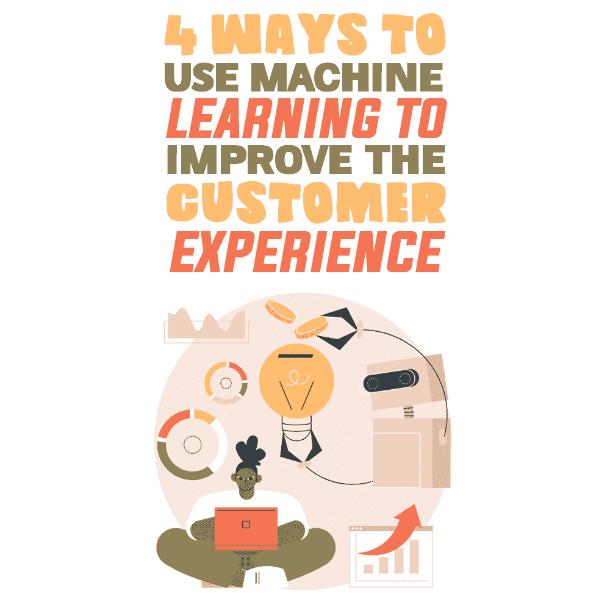

# 使用机器学习改善客户体验的 4 种方法

> 原文:[https://simple programmer . com/机器学习-客户体验/](https://simpleprogrammer.com/machine-learning-customer-experience/)

These days, programmers find themselves working on projects that intersect with machine learning (ML) and artificial intelligence (AI) technology all the time.

软件开发人员将其作为质量保证过程的一部分进行部署。Web 开发人员构建 web 应用程序，这些应用程序[通过现在可用的许多云提供商 API 与 ML 服务](https://hub.packtpub.com/a-machine-learning-roadmap-for-web-developers/)连接。机器学习甚至正在进入移动应用程序开发，一次一个新功能。

然而，一些程序员倾向于短视地看待 ML 如何帮助他们的工作。尽管他们将 ML 技术视为新功能的驱动力或完成工作的额外帮手，但他们没有看到 ML 如何通过改善客户体验来帮助他们构建更好的产品。

利用率的缺乏是一个相当大的问题。要证明这一点，只需看看最近对商业专业人士的调查就知道了，调查显示，近一半的人现在将改善他们企业的客户体验视为头等大事。

这意味着那些努力学习各种应用 ML 来改善客户体验的程序员将处于一个很好的位置来利用这种商业趋势。

毫无疑问，当代 ML 可以成为程序员最大的客户体验资产。他们所要做的就是学会如何以最有效的方式使用它。为了有所帮助，这里有一个程序员可以使用机器学习来改善他们创造的产品的客户体验的四种方法的指南。

## 提供 24 小时自助服务支持

当今世界上最常见的 ML 应用之一是在客户服务领域。事实上，这很常见，我们大多数人每天都会以这样或那样的方式遇到它。它[为集成语音应答(IVR)](http://www.smartcustomerservice.com/Columns/Vendor-Views/Building-a-More-Intelligent-IVR-Through-Machine-Learning-130467.aspx) 系统、现场聊天机器人和大量自助支持系统的现代迭代提供动力。

事实上，有很好的理由说明如此多的公司以这种方式使用 ML 技术。这是顾客想要的。根据哈佛商业评论，[的报道，81%的客户宁愿自己解决问题](https://hbr.org/2017/01/kick-ass-customer-service)也不愿与现场支持人员交谈。任何有经验的软件开发人员都会同意，当这么多客户要求某样东西时，满足他们是个好主意。

使用 ML 提供客户支持对程序员也有好处。支持 ML 的客户支持系统提供了大量的数据，有助于识别乍看之下可能不明显的产品弱点。这是通知您的开发周期并领先于客户需求的绝佳方式——即使客户并不明确他们想从您这里得到什么。

## 分析客户反馈

程序员用来衡量客户满意度的一个关键机制是直接的用户反馈。尽管如此，即使是一个相当成功的产品也可能产生如此大量的反馈，以至于几乎不可能将其提取为有用的信息。

这就是 ML 发挥作用的地方。

通过训练 ML 模型在大量用户反馈中寻找特定类型的数据，有可能挖掘出真正的见解。其中一个关键的 ML 方法是使用[情感分析](https://getthematic.com/insights/sentiment-analysis)来寻找用户在使用产品时可能遇到的不太明显的痛点。

从软件开发的角度来看，这特别有用，因为普通用户经常缺乏技术知识和词汇来识别他们遇到的问题。然而，如果你能把负面情绪与你产品的某个特定部分联系起来，你至少有了一个切入点。

如今，甚至可以将情感分析与自然语言处理技术结合起来，为客户支持电话创建一个分析 T2 工作流程。这意味着你可以使用这项技术，甚至不需要用户完成调查或提供具体的反馈。

这一点很重要，考虑到用户在使用产品时遇到困难并不总是会花时间提供正式的反馈——他们会简单地寻求帮助，如果得不到帮助就会停止使用你的产品。

## 实现产品个性化

In the age of always-on, always-connected technology, programmers are frequently locked into a continuous development cycle to keep their products relevant. Proper use of ML can somewhat alleviate that. By building ML-supported personalization into their products, programmers can keep them relevant and responsive to users without the need for a fast-paced refresh cycle.

在某种程度上，这种方法是巧妙手法和谨慎设计的结合。这就是像网飞和亚马逊这样的大公司如何提供似乎一直在变化的客户体验，即使他们以有规律的步伐更新他们的平台。他们利用大量的用户数据，使用 ML 实时分析用户想要的东西，然后给他们。

这样，双方都赢了:用户在任何时候都获得了相关的体验，而开发者获得了喘息的空间，对他们的产品做出有用的改变，而不是仅仅为了保持外观而工作。

## 提高用户保留率

开发一个软件(或一个网站或应用程序)[不是一夜之间发生的](https://simpleprogrammer.com/speed-up-app-development/)。这需要时间、努力和资源。这意味着任何开发项目成功的一个关键衡量标准是它在发布后如何满足其受众并留住他们。这使得[发布后的客户保持](https://simpleprogrammer.com/customer-retention-post-launch/)成为程序员和他们所服务的企业的一项关键任务。

这是 ML 可以产生重大影响的另一个领域。通过创建预测模型来[衡量和分析用户流失](https://towardsdatascience.com/how-machine-learning-can-help-with-customer-retention-6b5bf654e822)，有可能在用户流失问题损害产品的投资回报率之前解决它们。从开发人员的角度来看，这是在产品发布后识别弱点并采取行动解决它们的另一种方式。

这对于从事软件即服务(SaaS)产品的开发人员来说尤其重要。因为 SaaS 不像传统软件那样有更换周期，所以成功几乎完全由用户保持率来衡量。在一个持续开发和特性进化是必然的环境中，有太多的活动部件不能碰运气。

幸运的是，ML 建模提供了开发人员需要的正确类型的帮助，以发现即将出现的问题，并在它们导致用户流失之前处理它们。

## ML 技术可能是改善客户体验的关键

在这一点上，指出 ML 技术不会有任何发展是显而易见的。随着它的不断改进，它将为程序员提供他们现在甚至无法想象的工具和能力。但这也是探索它已经拥有的众多用途的更多理由——并为即将到来的事情做好准备。

因为已经有这么多开发良好的 ML 用例来改善客户体验，所以这是今天的程序员的完美起点。这样，他们可以使他们创造的每一个产品更有用、更实用、更有价值。这样做将有助于保持他们的客户和他们产品的用户满意。

这反过来又使它们在当前的商业环境中更受客户欢迎。随着客户体验成为当今许多企业的中心舞台，一个能够满足客户需求的程序员将会得到更多、更频繁的工作。最终，这是每个程序员梦寐以求的体验。