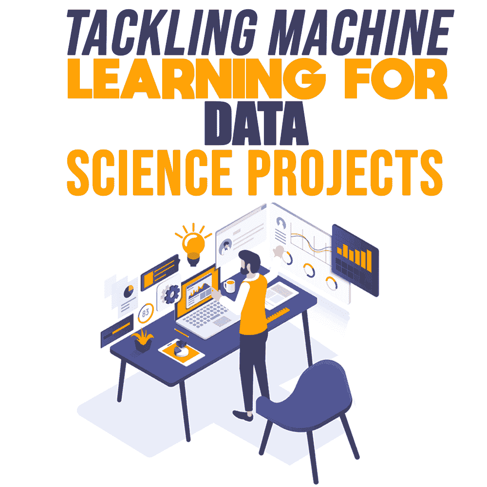

# 为数据科学项目解决机器学习问题

> 原文：<https://simpleprogrammer.com/machine-learning-data-science/>

Organizations around the world have to deal with massive loads of data every day to run their businesses successfully. These vast amounts of data are called “big data.” Dealing with [big data](https://simpleprogrammer.com/agile-approach-in-it/) efficiently by manual means is a huge, time-consuming task.That's where the importance of machine learning comes into play. [Machine learning](https://simpleprogrammer.com/machine-learning-without-mooc-book/) turns raw and unrefined data into processed data with the help of machines, providing valuable insights that make it much easier to deal with.

创建和执行这类[数据科学](https://simpleprogrammer.com/beginners-guide-data-science/)项目可能会很麻烦，即使有机器学习的帮助。但是在我们进入机器学习的细节之前，首先了解数据科学项目实际上是什么是很重要的。

## 什么是数据科学项目？

数据科学项目涉及一个组织良好的流程，该流程使用有价值的数据来解决业务实施过程中出现的各种问题。

大多数组织花时间积极执行数据科学项目，以便在需要时主动使用数据。这些数据科学项目的一些预期结果可能包括:

*   收入预测
*   提高内部运营效率
*   通过营销策略接触更广泛的受众
*   预测银行和其他金融服务

在您的组织内实施数据科学项目时，需要遵循某些系统化的方法。它可以是管理层面的，也可以是个人层面的。下一个要考虑的问题是什么时候开始。

## 何时开始数据科学项目？

我们在上面看到了实施数据科学项目背后的一些可能的动机。但是这里我们将主要关注两种情况。它们如下:

**在管理层**，当组织的高层官员开始实施数据科学项目时，公司可能会面临特定的运营问题，这促使管理层利用数据洞察力来解决问题。

大多数公司都会有大数据分析师或数据科学家来处理这些问题。这些专业人士在处理大数据方面经验丰富，能够为组织的高层官员提供相关的见解。

**在个人层面**，数据科学项目还可以帮助个人或员工解决他们面临的具体问题。有时，会有这样的情况，普通员工可能不得不在某项任务上投入更多的时间。

数据洞察将帮助他们高效地完成特定任务。该组织将提供对数据仓库和分析工具的访问。

## 机器学习和数据科学项目之间的关系

数据科学建立在三个重要的基础之上:

*   数学(特别是统计学)
*   计算机科学
*   商业头脑和领域知识

机器学习属于[人工智能](https://simpleprogrammer.com/learn-artificial-intelligence/)的子类。这是一个完全自动化的过程，由机器分析可用的数据，并根据特定的问题做出绝对的预测。

这是通过使用数学和计算机科学的科目来实现的。显而易见，机器学习和数据科学密切相关！

## 数据科学项目的工作流程

如果你计划进行一个数据科学项目，你必须回答一些特定的问题。让我们一个一个来看看。

### 您试图解决的业务问题是什么？

在开始数据科学项目之前，清楚地了解您想要修复的问题非常重要。确保您获得的数据洞察力将解决问题。对自己想要的解决方案有一个恰当的理解。数据专家将能够帮助您实现这一理解。

例如，假设一家零售店的管理层需要开发一个模型，该模型可以预测其分店在新位置的成功率。数据科学家的职责是收集当地居民的消费行为和模式的相关信息。

这些数据洞察将使公司能够预测他们可以从该特定位置预期的业务营业额。此外，这些数据也将作为未来业务流程的来源。

### 你有解决问题的所有数据吗？

最好用一个例子来解释这个细节。让我们考虑一下我们前面看到的零售店的情况。

在本例中，您应该了解如下内容:

*   存储位置
*   税收
*   商店的总面积(平方英尺)
*   客户的大致数量
*   每个地点的员工人数

所有这些数据都已经在你的数据库里了。但是，有时您将不得不利用外部数据源，如该地区的人口统计、人口和天气状况，以获得更准确的信息。

### 如何对它们进行相应的整理和排列？

整理原始数据非常重要。使用 ETL 过程将原始数据转换成经过处理的格式。它代表使用各种工具进行提取、转换和加载。

**提取**是从各种来源中选择数据；而**转换**指的是将数据组织起来，避免重复信息，从而将它们规范化。最后， **load** 表示将处理后的数据上传到数据分析工具。

## 用于机器学习的算法

机器学习算法可以细分为两个部分:

*   无人监督:这种方法没有任何特定的目标要实现。
*   受监督的:受监督的方法有一个特定的目标要实现，并且目标与数据进行比较。

让我们仔细看看他们两个。

### 无监督机器学习方法

The unsupervised machine learning algorithm can be again subdivided into the following:

*   **集群**–集群的意思是“群体”在这种方法中，数据科学家将一组相似的观察结果联系在一起。这是探索性数据分析的另一种形式。
*   **降维**–有时，在分析大型数据集时，人们会注意到涉及到彼此相关的变量。所以那些多余的变量必须被剔除。降维使我们能够达到那个结果。这种算法最好的例子就是主成分分析(PCA)。

正如无监督机器学习算法一样，有监督机器学习算法也细分为某些类型，如下所述。

### 监督机器学习方法

有监督的机器学习算法可以再次分类为以下几种:

*   **回归**–回归算法找出因变量和一个或多个自变量之间的关系。产生的输出也将是一个数值。
*   **分类**–分类算法有助于对属于特定部门的特定观察进行分类。输出是两个或多个类别。有时它可能是一个“是”或“不是”
*   **分类概率估计**–有时，有些情况下需要的不仅仅是标准的二进制分类。d 类概率估计是独立的，其中输出值在 0 和 1 之间变化。

确保你对所有类型的机器学习算法都有透彻的了解，这样你才能提取出最好的。

## 数据科学是一门艺术

如上所述，数据科学是一门需要数学和计算机科学技能的艺术。

数据结构和算法是计算机编程的必要基础。数据结构是一种以有组织的格式存储数据并将其用于未来目的的方式。该算法是一个循序渐进的过程，使我们能够达到所需的输出。

因此，为数据科学项目开发算法的数据科学家将需要用一组新的变量和数据行来完善或改变模型。此外，对机器学习的透彻理解是必要的。

处理大数据显然是一项令人厌倦的任务，但如果处理得当与[机器学习](http://www.amazon.com/exec/obidos/ASIN/199957950X/makithecompsi-20)的整合，绝对是值得的。你可以创造奇迹！