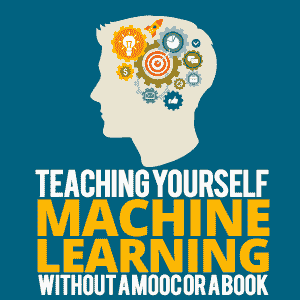
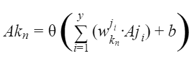

# 在没有 MOOC 或书本的情况下自学机器学习

> 原文:[https://simple programmer . com/machine-learning-without-mooc-book/](https://simpleprogrammer.com/machine-learning-without-mooc-book/)

Over the past few months, I taught myself machine learning. I did this without a MOOC (massive open online course), like Coursera or edX, and without a book. I used only the magic of a few YouTube videos, several blog posts, GitHub, and hands-on experimentation.

这是一次有益的经历，尽管现在回想起来，有些事情本可以做得更好。在这里我给那些选择走这条路的人分享一些建议，以及一些他们应该预料到会遇到的事情。我也会帮你决定这条路是否适合你。

的确，ML(机器学习)的世界是非常强大和复杂的，但是像大多数计算机科学领域一样，总是有适合初学者的空间。

人们很容易认为 ML 太复杂而无法自学——毕竟，它*是*一种人工智能。但事实远非如此。完成这一切需要一点勇气，但这绝对是可行的。我们开始吧！

## 机器学习到底是什么？

如果你只看它被用来创造什么，机器学习可能看起来很神秘。尽管它非常有用，但 ML 背后的基本概念很简单。

机器学习包括训练计算机识别模式并从中获取意义。我们应用了许多不同的技术来做到这一点，但最终，魔力来自于蛮力:计算机只是查看成千上万的数据样本，并随着时间的推移对其理解进行小的调整。如果有足够的时间，它对世界的理解可以变得足够准确，变得有用。

ML 实际上只是数学和蛮力。

## 因选择而瘫痪

ML 的世界与编程的世界没有什么不同。它们都相当于布满深洞的田地。进入一个洞穴，你可以继续越来越深。

如果你想进入另一个洞穴，你必须离开当前的洞穴，在新的洞穴重新开始。当然，你在旧洞穴中学到的一些东西可能在新洞穴中有用，但是在这个新洞穴中也有如此多的东西！

在“普通”编程中，这些洞穴是游戏开发、移动开发、前端 web 开发和服务器端开发等领域。在机器学习中，这些洞穴是像强化学习、回归、计算机视觉、无监督学习等 ML 分支。

如果你像我一样，这种大量的选择可能会令人麻痹，因为每个领域都有很大的深度和潜力。学习需要时间，时间是宝贵的。你如何选择把宝贵的时间投入到哪一个？

当然，这真的取决于你。就像你对编程陋居的选择一样，你对 ML 陋居的选择也是个人的。看看他们和他们的应用，并作出你的选择。

但是如果你想稳妥起见，我建议你选择一个适合你当前领域的 ML 领域。例如，强化学习在游戏中有用，计算机视觉在移动应用程序和云服务中有用，回归在以数据为中心的领域中有用。

无论你的选择是什么，我建议你不要花太多时间去决定学什么，而不是真正去学。如果听起来很有趣，那就试试吧。如果你不喜欢你现在的 ML 领域，你可以随时离开——无论如何，在你离开的时候，你会学到一些潜在有用的东西。

这里确实存在选择瘫痪的危险。它可以一直存在——即使你选择了一个领域，你现在也必须选择在这个领域内做什么。

当然，在你选择之前想一想，但是最终，只是选择一些东西并学习。

## 学习过程

The process that I used for teaching myself machine learning was actually dead simple. I started with a few YouTube videos (I recommend [3Blue1Brown’s series](https://www.youtube.com/playlist?list=PLZHQObOWTQDNU6R1_67000Dx_ZCJB-3pi) on neural networks, an important introductory ML concept) to get the underlying concepts down. ML seemed doable and fun, so I looked into the different types of machine learning.

环顾四周之后，强化学习引起了我的注意。这有几个原因，其中一些可能对你有帮助:

1.  **用途**:正如我之前提到的，ML 领域的应用可能是影响你选择的一个很大的因素。我是一名游戏开发人员，所以强化学习对我来说绝对是有趣和令人兴奋的。

2.  在一个理想的世界里，你可以使用的工具不应该决定你选择什么样的 ML 道路。但是，唉，他们有。机器学习其他领域的很多框架对我没有吸引力。我试图找到一个框架，它有一个相对较大且活跃的社区，看起来对用户和初学者友好，并使用我熟悉的语言(这个限制是我特有的，但学习另一种语言也不是一个坏主意)。在做出选择的时候，研究一下可用的框架和工具——它们将是你将来要花几个小时来使用的。

做出选择后，我继续通过他们的 GitHub 文档学习如何使用 Unity 的机器学习模块，并开始寻找我可以尝试和试验的东西。

你应该知道的一点是，许多机器学习框架都有很棒的教程。如果你有一些背景信息，它们肯定足以让你的脚离开地面，进入一些有意义的实验。如果你偶尔用谷歌搜索来补充这些教程，搜索你不完全理解的东西，你应该完全没问题。

一些框架也有大量的样本代码来帮助你打破僵局。大多数好的框架都应该有这些——它们真的很有帮助，也能教会你一些有趣的东西。

我用完全相同的过程自学了计算机视觉的深度学习(训练计算机识别图像)。这个过程是努力和自我驱动的，但它肯定是有效的。然而，像任何过程一样，它也有缺点。

## 三个主要问题

### 1.数学

坦率地说，ML 背后的数学可能是可怕的。机器学习涉及许多高级概率、微积分和其他黑暗的数学巫术。如果你没有这方面的数学知识，博客帖子和讨论板上出现的许多数学知识看起来就像完全的胡言乱语。

这可能非常令人生畏，因为即使当你在寻找一个看似简单的问题的答案时，你也可能会找到带有令人困惑的数学术语的答案。对于没有接受过概率和微积分本科教育的人来说，这尤其令人困惑。

重要的是不要让这吓倒你。这有两个原因:

首先，大部分数学是完全不必要的。ML 资源作者使用数学解释的任何事情也可以用简单的英语解释，他们提供的许多数学解释只是为了证明已经提到或将要提到的事情。

当然，一些网站和帖子希望你理解数学，因此不会用外行的术语解释它，但大量其他资源只是将数学作为一种补充。考虑到你有足够的毅力去寻找足够的资源，并且意识到仅仅粗略地看一下数学，对正在发生的事情只有最模糊的概念是可以的，你应该是相对不错的。

其次，有些数学看起来比实际更复杂，因为数学有看起来很难的趋势。让我们看一个 ML 的小例子:

花点时间看看这个公式。您可能不完全理解这一点，但您可以看到有一个乘积的求和、另一个不相关值的相加，以及一个对结果输出进行运算的函数。

现在，让我一步一步地向你揭示这个等式的实际意义:

*   在 ML 中，神经网络是包含节点层的数据结构。让我们考虑两个连续的层:层 *j* 和层 *k* 。
*   这两层都有 *y* 个节点，每个节点都由 LLPL 捐赠，其中 *LL* 代表该节点所在层的字母， *PL* 代表其在该层的位置。
*   层 *k* 中的每个节点将想要知道前一层 *j* 中所有节点的值(由 *A* 表示)。
*   当它检索每个节点的值时，它将把它乘以一个叫做*权重*的东西，用 *w* 表示。
*   它将把所有这些乘积相加，然后在最后加上一个称为 a *偏差*(用 *b* 表示)的数字。
*   然后，最后，它将使用一个函数(用θ()表示)将这个求和的结果限制在一个指定的范围内，并存储它。

看到了吗？这看起来很难理解，但是如果你有正确的背景信息，并且你在某个地方看到过，这就说得通了。还有其他的方程式从这里推导出来，如果你理解了这个，其他的也就简单明了了。

随着你了解的越多，你的背景信息一般会增加，多几个方程就开始有意义了。

关键是，在你彻底抛弃它之前，你应该花时间试着理解一些数学知识——有些是可以理解的。

### 2.悬崖

ML has what I call a cliff learning curve. The beginning is easy to understand and follow, but once you decide to dig a little deeper, all manner of things suddenly have significance, such as hyperparameters, learning rates, and regularization. All these things must be learned and require their own time to understand and master.

你可能会发现自己在使用 ML 中的一些东西，你并不完全理解，因为你不想花时间去完全理解它们。这完全没问题——有时理解某些事情只是额外的收获。

悬崖不仅存在于学习过程中，也存在于你在互联网上找到的资源中。当你试图了解更多并找到更深层次问题的答案时，你会发现你找到的帖子的复杂性突然增加，这并不罕见。老实说，这可能很难缓解，但也不是太大的挑战。

当然，在 Quora 或 Medium 等网站上寻找更多帖子，并使用 Reddit 和 Data Science Stack Exchange 等网站肯定会有所帮助。但你也可以从尝试联系其他数据科学家中受益。一些 ML 社区使用像 Gitter 这样的地方进行交流。不要害羞！他们真的很有帮助。

应该注意的是，这些跳跃通常是存在的，因为在某些时候，ML 社区希望你已经参加了关于该主题的正式课程或 MOOC，或者已经阅读了 ML 书籍。但是这篇文章是关于学习 ML *而不是*那些，所以我们必须设法解决。

### 3.阅读

这只是个小问题，真的。作为一名自学成才的程序员，有一点是你经常发现自己不必读很多书。您可能偶尔会阅读一些详细的文档或帖子，但是很多知识都是从视频、论坛、堆栈溢出页面以及包含不言自明的代码片段的简短教程中获得的。因此，一种阅读懒惰会随着时间的推移而发展。

ML 不是这样的。ML 可能需要相当多的阅读和耐心——它不像其他东西，你可以快速地谷歌一些东西，获得信息的要点，并简单地推断其余的方式。如果你像我一样，经常懒得去读很多书来理解一些东西，准备好摆脱这种懒惰吧。阅读。

顺便提一下，考虑一下在你选择的人工智能领域中偶尔阅读一些研究论文(比如 arXiv.org 的论文)。会出现一些有趣的事情。

## 好处:基于项目的学习

尽管自学机器学习有其挑战性，但它有两大好处:探索的自由(这几乎总是很有趣)和基于项目的学习。

我真的相信基于项目的学习是学习编程的最好方法之一。它给你一个理论和街头知识的完美结合，让你在这个过程中创造美好的东西。我学习 ML 的方法多少依赖于它。有一个项目能让你清楚地关注你需要学习的东西。

互联网是一个深海，如果你简单地潜入其中，你很容易迷失方向，不知所措，不知所措。如果你有一个项目，过滤掉这么多的噪音会立刻变得更容易，因为你更清楚自己需要什么，不需要什么。

你的项目也是鼓励的源泉。当事情出错时，你可以向前看，想象你正在努力做什么，你可以获得新的能量。当你完成这些介绍性项目时，你将有一个很好的 ML 基础来决定下一步做什么或者放弃它去做别的事情。

## 这不是替代品

在我结束之前，我想提一件相当重要的事情:**如果你想认真学习机器学习，请不要单独使用这种方法。**

ML 与其他一些计算机科学领域非常不同。如果你不读一本书或者参加一门正式的课程，你将很难在一个职业环境中取得足够的成就。当然，这种类型的自学有一些好处，但是超过一定限度后，它提供的好处就不再值得你为之付出努力了。

如果你只是想测试 ML 的水域，或者只是想了解一个特定项目的 ML，继续下去，只使用这种方法。否则，结合一本书或 MOOC 进行这种类型的自学，或者单独使用这种方法一段时间，然后过渡到更重的内容。

## 一场冒险在等着你

Machine learning was indeed an adventure for me, especially because I chose to create my own path. Whatever path you choose, you should try machine learning for yourself.

请记住:

*   避免被 ML 中的选项麻痹。如果你发现你不喜欢你目前的领域，你可以选择另一个领域。在选择过程中考虑应用程序和可用的工具。
*   不要被数学吓倒。没有很多也可以，有些看起来比实际上要难。
*   准备好面对悬崖难度曲线——但是记住框架本身提供了很好的教程和样本代码。
*   不要害怕读书。
*   心中有项目的自学。项目是惊人的——它们给你关注和鼓励。
*   如果你想非常认真地对待 ML，最终读一本关于 ML 的书，参加 MOOC，或者两者兼而有之。

机器学习有巨大的潜力。它既有广度又有深度，几乎可以容纳任何类型的程序员。作为开发者和创造者，我们永远不应该停止学习和实验。机器学习是一个让你保持这种哲学的机会，你可能会发现一些你在未来很多年都会用到的东西。