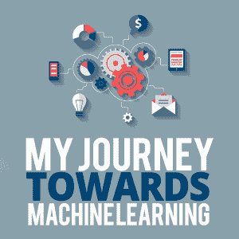

# 我的机器学习之旅

> 原文：<https://simpleprogrammer.com/machine-learning/>

Telling the computer what to do is fun, but have you ever wondered how you can simply tell the computer one thing and it extends to another thing? I mean allowing the computer to make future executions without having to wait for exclusive commands from the programmer. Oh yeah, allowing the computer to indirectly make inference without waiting for input from the programmer.

作为一名过去三年的软件开发人员，我总是直接给计算机下达指令，但后来我开始问，我们是否可以给计算机更少的指令，获得更多的输出。几个月前，我开始了这条思路，它把我带到了机器学习领域，在这个领域，你基本上可以教计算机学习。

这不仅仅是简单地教计算机学习；它是关于设置计算机作为知识海绵，以便它积累任何信息。关于机器学习的资源在互联网上比比皆是，但根据我自己的经验，我想对基本思想和最重要的事情进行一些阐述。

## 什么是机器学习？

当你刚开始上学时，你通过第一次被介绍给他们，过一会儿，通过回答关于他们的问题来学习。你基本上是从数据中学习的。

也许你还记得第一次试图识别一种动物或字母表中的一个字母时，你错过了它？你花了一次或多次尝试来完全学会，从那以后，你变成了一个字母或动物标识符。

机器学习也是如此。

[机器学习](http://shop.oreilly.com/product/9780596529321.do)是教计算机从数据中学习。它基本上包括让计算机接触数据，并允许计算机根据数据做出决策和建议。电脑接触一些字母或一些动物，过一会儿，电脑被要求识别它们。

本质上，机器学习建立了一个系统，只要计算机接触到更多的数据，软件就会在其生命的所有日子里学习。学习就是能够从以前的信息中推断出新的信息。

用于教授计算机的示例被称为**训练集**。每个例子被称为**训练实例**。简单地把信息储存在你的记忆中而不从中做出推断，这不被认为是学习。

## 机器学习和普通的计算机程序有什么区别？

计算机程序通常是一步一步说明计算机应该如何运行的指令。人类确定确切的步骤，并将这些步骤交给计算机执行。因此，除了程序员所写的以外，计算机不会做出新的推断。

然而，机器学习涉及到给计算机执行任务所需的基本规则，然后让它自己继续学习。机器学习程序的操作并不总是由人来控制。

由于这种能力，垃圾邮件过滤，机器学习程序不需要等待人类告诉它如何分类它收到的每一封电子邮件；它只是从接触到的数据中学习。如果数据发生变化，计算机能够理解这种变化并自动适应这种变化。

## 机器学习适用于哪些领域？

机器学习适用于基于数据执行任务的领域。例如，它可以应用于法律，因为律师必须根据数据办案。它可以应用于医学，因为医生必须根据病人的数据来开药。所以从本质上来说，机器学习可以应用于任何产生数据的领域，以及经验基于访问更多数据的领域。

对于软件开发来说，机器学习倾向于理解程序员如何编写代码，以便程序员可以编写更少更好的代码。在我们的软件运行的基础设施领域，机器学习可以帮助提高对基础设施何时有太多负载要处理的理解，并可以指示如何改进。此外，像设计这样的领域也可以得到很大的改善。

## 机器学习系统的类型

机器学习可以根据不同的范例进行分类。有些是:

1.  人工监督
2.  数据采集速率
3.  一般化方法

### 人工监督

在这种范式下，机器学习可以分为四类:

****

**监督学习**:在教孩子们字母表的时候，一位老师展示字母并说出它的名字。老师给了这封信，然后**给它贴上标签**。由于教师监督学习的进行，这种学习被称为监督学习。

在机器学习中，传递给计算机的数据包含所需的解决方案。所需的解决方案称为**标签。**标签在学习过程中充当老师。

监督学习可以分为**分类**和**回归。**在分类中，系统学习**将**数据分类为一类或另一类，而在回归中，系统学习**为某个输入产生一个数字**。

无监督学习:当没有老师来指导和监督你的学习时，这被称为无监督学习。所以在机器学习中，这意味着提供给计算机的数据没有被标记。通常，计算机会自己找到模式。一些类型的无监督学习包括聚类、降维(特征提取)、异常检测和关联规则学习。

*   **聚类**——根据机器学习程序检测到的某些模式，将未标记的数据分组到相似的组中。

*   **降维**–减少训练示例中使用的特征数量，或者简单地将相关特征分组为较小的数量。这通常是将训练样本传递给其他机器学习算法之前的必要步骤。

*   **关联规则学习**——挖掘大量数据，发现属性之间有趣的关系。

*   **异常检测**–检测数据中的异常或异常值。

**半监督学习:**这只是简单地结合了监督和非监督学习。意味着传递给计算机的一些数据是有标签的，而另一些数据是没有标签的。通常，未标记数据比标记数据多。

**强化学习:**还记得你是什么时候开始学习玩某个游戏的吗？你学到的东西是应该避免的，这样你才不会结束你的游戏。你学到了延长寿命的东西，并逃离了试图伤害你的东西。强化学习也是一样的。

学习环境包含一个**代理**，它找到要执行的正确动作，并根据任务得到**奖励或惩罚**。它只是寻求在每一点上采取什么样的最佳行动路线(被称为**政策**)。所以在游戏类比中，玩家就是**代理**，避免被杀的招数或步骤被称为**策略**。

### 数据采集速率

要学习，你需要数据，你获取和消耗数据的速率是机器学习的分类范畴之一。在这一类别下，有批量(一次)和在线(增量)学习。

**批量或一次性学习:**用所有可用数据对系统进行单批训练。如果有新数据可用，新旧数据将合并成一批，系统将从头开始再次训练。因此，这种方法需要大量的时间和资源，并且是离线完成的，因此被称为**离线学习。**培训结束后，系统再次上线部署使用。

**在线或增量学习:**系统不断从新数据中学习，而不是像批量学习那样从单个批量中学习。在这种情况下，系统会不断学习，而不必停下来重新训练。它不断学习。这些数据是单独输入的，也可以分组或分批输入。

### 一般化方法

在泛化范式下，机器学习可以分为基于实例的学习和基于模型的学习。

**基于实例:**通过比较新数据和已经存储在内存中的数据来完成学习。

**基于模型:**我们可以决定基于存储的训练样本建立一个模型，而不是从这些样本中学习。从模型中，我们可以做出预测。这叫做作出一个**推论。**

## 现在就是开始的时候:今天就整合机器学习

机器学习都是关于数据和模式的，如果你看看软件开发是关于什么的，你会发现这是一回事。软件开发人员开始考虑如何将机器学习集成到他们的日常活动中是很重要的。对于设计师来说，机器学习可以帮助你更好地理解用户如何与你的设计进行交互，以及如何改进它。

对于软件开发者来说，机器学习帮助你构建智能系统。机器学习使得软件开发更像是构建一台智能机器，而不是一台仅仅期待用户一直输入的机器。本质上，机器学习是关于制造智能系统，而不仅仅是垃圾输入，垃圾输出的系统。

现在是每个软件开发人员了解机器学习的美妙之处以及如何将其应用于日常任务的时候了。