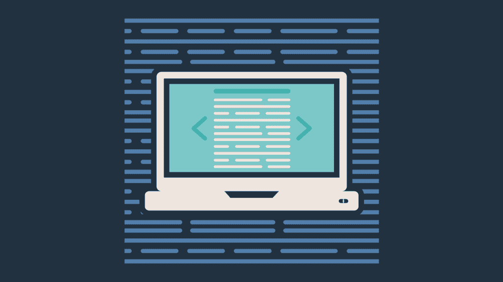

# 软件开发人员维护代码指南

> 原文：<https://simpleprogrammer.com/maintaining-code/>

当你第一次考虑成为一名软件开发人员时，你可能会梦想创造令人兴奋的新功能，尝试新技术，并编写一些非常酷和有趣的代码。

你可能不会想到的是，你正在开发一个已经用了 10 年、由某个很久以前离开公司的人编写的劣质应用程序，修复他留下的 bug。

事实是，在你的软件开发生涯中，你花在维护代码上的时间要比你写新代码的时间多得多。

生活就是这样。这只是其中之一。

然而，这一事实并不意味着您将只致力于维护几十年前编写的旧 VB6 应用程序。

事实上，很可能你要维护的大量代码都是你自己的。

所以，如果你学了两件事，这可能是个好主意。

首先，你需要知道**如何正确维护代码**,以便它不会随着时间变得越来越差，直到最后崩溃。

第二，你需要学习如何**写出易于维护的好代码**，这样以后不得不维护你代码的开发人员就不会跟踪你，到你家，在你睡觉的时候杀了你。

在这一章中，我们将讨论为什么学习如何维护代码和编写可维护的代码是如此重要，我会给你一些关于如何做这两件事的实用建议。

听起来不错吧？

## 你职业生涯的大部分时间将花在维护代码上

我已经提到了这一点，但它值得再次提及，因为它是如此真实。

以这样或那样的形式，你将会维护代码。

新的软件一直在被创造，但是每个新的软件应用程序都被期望有某种生命周期，希望比它被创造的时间更长。

这意味着旧软件总会比新软件多。(除非我们有高得离谱的新软件涌入，而一堆旧软件同时消亡，但这不太可能发生。)

旧的软件需要不断地改进和维护。

客户会发现需要修复的错误。

需要添加新功能，或者需要修改现有功能。

生产软件就像一个活着的、会呼吸的有机体，总是在成长、变化或者慢慢死去。

我为什么要告诉你这些？

难道我只想让你的希望碰壁吗？

不，我希望你对自己作为软件开发人员的职业生涯有一个现实的期望。

通常，热切、善意的招聘经理会描绘一幅美好的工作画面，告诉你你将使用最新的技术从头开始设计和编码一个全新的系统。

虽然您的一些工作可能会这样做，但通常情况下，大部分工作——不管听起来有多好——都涉及到维护现有的系统。

再说一遍，这就是生活的方式。

这是不是意味着你永远找不到一份可以完全从头开始编写新系统的工作？

不，它肯定会发生，但不要总是期待它。

即使您这样做了，也要预计到在某个时间点，您或其他人将不得不维护该代码。

仅此而已。

## 伟大的开发者写出可维护的代码

现在你已经正确地设定了你的期望，我将试着激励你去写“你能写的最好的可维护代码”，因为天哪，这真是一件了不起的事情。

在我多年的软件开发工作和与软件开发人员一起工作的过程中，我发现了一个无可争议的事实，那就是伟大的开发人员写的是高度可维护的代码。

事实上，我会说我评判一个程序员的唯一标准是他们的代码的可维护性。

这可能看起来很傻。

你可能会认为我只是为了在这一章表明我的观点而编造的。

但我告诉你，这是真的。原因如下。

优秀的开发人员知道，他们编写的任何代码的大部分生命周期都将花费在维护阶段。

伟大的开发人员知道**他们写的最有价值的代码是持续很长时间的[代码，并且不需要废弃和重写。](https://simpleprogrammer.com/2010/04/17/when-doing-the-right-thing-is-wrong/)**

伟大的开发人员不是尽可能地聪明、快速或高效，而是为了可维护性而优化。

他们编写好的、干净的代码，容易理解、修改和维护。

他们**创造松散耦合的灵活设计**,因此如果系统中的一件事发生变化，它不会影响系统的其他组件。

他们格外小心，以确保他们所做的事情都是有据可查的，并且尽可能不言自明。

他们已经花了足够多的时间去观察别人的代码——或者他们自己的代码——并试图维护它们，他们知道他们能写的最好的代码是最易维护的代码。

## 童子军规则

擅长维护代码的一个秘密是童子军规则。

这个规则源自美国童子军，他们强调露营的一个简单规则:

“让露营地比你发现时更干净。”

这是一个适用于你生活中多个领域的很好的规则，但它在软件开发中尤其有用。

让代码比你发现的更好。

真的就这么简单。

当你在处理一些代码时，也许是修复一个 bug 或者添加一个新的特性，试着让代码处于比你发现它时稍微好一点的状态。

这可能意味着编写一个额外的单元测试，使代码对下一个开发人员来说更健壮一些，因为下一个开发人员必须对代码进行修改。

这可能意味着重命名代码中的一些变量，使意思更加清楚。

这可能意味着将一些功能组合到一个方法或过程中，以减少代码中的冗余或使其更容易理解。

它甚至可能涉及重构一大块代码来实现一个更干净、更简单的设计。

只要你遵循这个规则，**代码就会随着时间逐渐变好**——或者至少熵率会严重下降。

这个基本规则是维护现有代码库的最简单的秘密。

## 可读性是最重要的

**[影响代码可维护性的最重要因素之一是其可读性](https://simpleprogrammer.com/2013/04/14/what-makes-code-readable-not-what-you-think/)。**

代码的可读性越强，维护代码就越容易。

代码越晦涩难懂，维护起来就越困难。

就这么简单明了。

太多的开发人员试图编写简洁而巧妙的代码。

虽然简洁可能是有价值的，但简洁和聪明绝对是导致灾难的原因。

为什么？

因为**代码是[读的比写的多](https://www.youtube.com/watch?v=RLxHNRY6-bU)** 。

每当程序员试图理解通过你的代码的一些工作流，以便他们可以依次添加新的功能，修改现有的功能，或者解决一个错误时，他们将需要理解你的代码在做什么。

他们越容易理解，就越容易对系统做出正确的改变，花费的时间也就越少。

如果代码晦涩难懂，那么每当另一个开发人员——甚至是你自己——不得不检查并试图理解代码时，就会花费额外的时间。

也很可能有人会误解代码，然后在更改代码或使用该代码的系统的另一部分时出错，从而进一步降低系统的性能。

事实是，**可读的代码更容易维护。**

因此，当编写需要维护的代码时，可读性高于一切。

## 重构代码使之更好

我们已经讨论了童子军规则，但是让我们更深入地探讨一下“让代码更好”是什么意思

如何让代码变得更好？

关于重构的主题可以写一整本书——已经有好几本了——但是在这一节，我将向你介绍一些基础知识，你可以自己练习和学习。

重构本质上是改进现有代码的设计。

对我来说，重构意味着在不改变其功能的情况下，让现有代码更具可读性。

“不改变它的功能”这一部分非常重要，因为如果你也改变了功能，你不能留下比你发现的更好的代码。

您可能会引入错误并使代码变得更糟。

并不是说在改进代码的时候不能改变功能，但这不是重构的重点。

重构的目的是获取一些现有的代码，并使其变得更好。

更好可能——实际上，总是应该——意味着更易读和更易维护。

然而，这也意味着您通过消除一些重复或以不同的方式组织代码，减少了代码的总行数。

这可能意味着您已经改进了整体架构，使其更加灵活和健壮，以应对进一步的变化。

有很多方法可以重构代码，但是重构的重要原则是不改变功能，而是让代码变得更好。

重构和单元测试是携手并进的，因为如果你没有办法测试代码，就很难知道你没有改变它的功能。

在进行重构之前，进行一些单元测试是一个好主意，尤其是当它是一个重要的变更时。

也有一些现代的重构工具可以帮助你，并且可以保证重构不会改变代码的功能。

大多数现代 ide 都内置了这些工具。

把它想象成在不改变它们的意义的情况下重新排列一个数学方程式。

你总是可以确定 4x = 8 和 2x = 4 或者 x = 2 是一样的。

你不需要证明。

## 自动化是必不可少的

维护软件真的很难，你必须手动构建和手动运行测试来确保没有任何问题。

你越快做出改变和测试改变，你的安全网就越好，这将保护你不在现有的代码库中添加新的错误。

这就是为什么自动化对于提高软件项目的可维护性是必不可少的。

拥有一个自动化的构建，一个持续的集成系统，和自动化的测试使得修改代码变得非常简单，并且很快发现你是否破坏了任何东西。

这种快速的反馈周期让开发人员对他们的更改更有信心，也让他们可以重构代码，毫无顾虑地做得更好。

## 如果你写评论，写好的

我不太喜欢用代码写注释。

是的，我知道这是异端。

但是**我宁愿写清楚的、表达性的代码，它是自我解释的，而不是写只有在通读注释**时才能理解的晦涩的代码——顺便说一句，注释有希望和代码一起被维护。

我更希望看到你写出干净、可读的代码，而不是在代码中添加一堆注释，这些注释通常会过时。

但是，如果你真的写了评论，确保它们是真的好。

确保评论清楚地解释了一些不明显且需要解释的东西。

神秘的注释有时和神秘的代码一样糟糕，甚至更糟，因为你至少可以弄清楚神秘的代码是做什么的。你真的不知道一个隐晦的评论可能意味着什么。

除了代码中的注释，**也要让你的提交消息尽可能的清晰和有帮助**。

清晰的消息也有助于代码库的可维护性，因为提交消息给我们的历史不仅仅是代码随时间发生了什么，还有为什么。

当试图理解一些不明显的代码或变化时，尤其是当它涉及到修复一个棘手的 bug 时，为什么可能是至关重要的。

## 学习编写可维护代码的资源

维护代码很棘手。

它涉及到相当多的技能，从编写干净的代码，到重构，到设计，甚至是基础设施问题，比如开发运维以及自动化。

我已经决定将一些有价值的资源列入**列表，这些资源可以帮助你更好地编写可维护的代码和维护你没有编写的现有代码。**

罗伯特·马丁**[*干净的代码*——我已经提到过这本书几次了，但它是关于编写干净、可读代码的最好的书之一，它还包括了关于可维护性的设计和重构的大量信息。](http://amzn.to/2c2E0F1)**

史蒂夫·麦康奈尔的 **[*代码全集*](http://amzn.to/2ch6jgD)–**再说一遍，我已经提到过这本书几次了，但这是另一本关于编写好的、可维护的代码的好书。你会发现这本书深入到编写好的、可读的代码的一些底层的、结构性的细节。读一下。

结合起来，*干净的代码*和*代码完成*会给你一个坚实的基础，让你理解什么是好的、干净的、可读的代码，以及如何编写和组织你的代码，所以我强烈推荐阅读这两本书。

**[*有效地使用遗留代码*作者迈克尔·费格斯](http://amzn.to/2cmhvKl)**——这是一本关于维护现有代码的经典书籍。它深入到遗留系统的本质，以及如何处理别人写的代码。每个软件开发人员都应该阅读这本书，因为每个软件开发人员都可能花费大部分时间处理遗留代码。

马丁·福勒**[*重构*——所有软件开发人员都应该阅读的另一本经典书籍。这本书讲述了在不改变代码功能的情况下重构代码的所有主要重构方法。](http://amzn.to/2c2FgYt)**

嗯，这是它的要点。

记住童子军的规则，你会做得很好的。

哦，还有，不要担心:在你的软件开发生涯中，你会得到大量维护代码的实践。

祝你好运。

* * *

