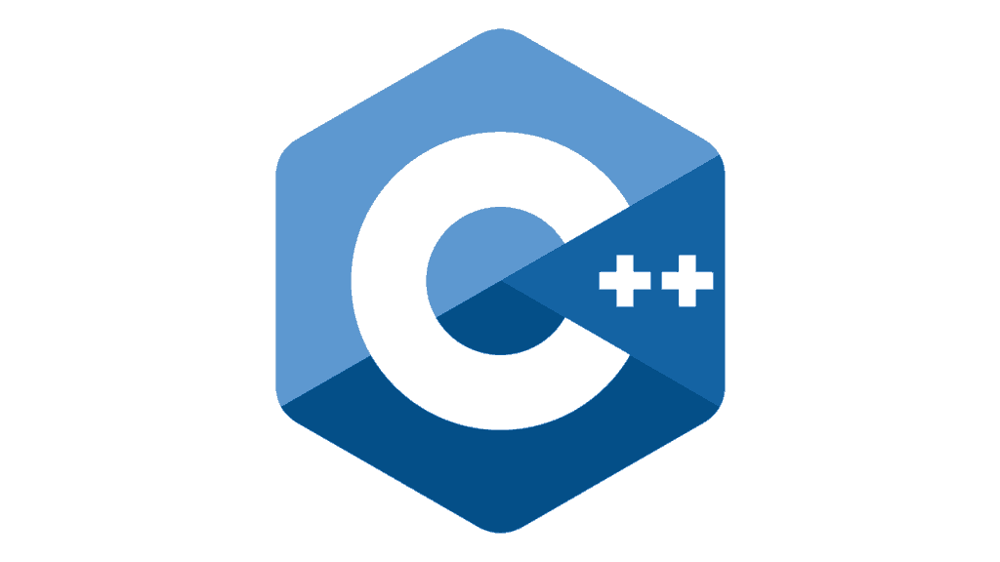
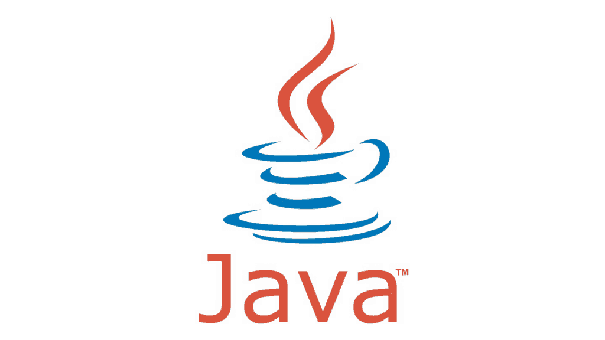
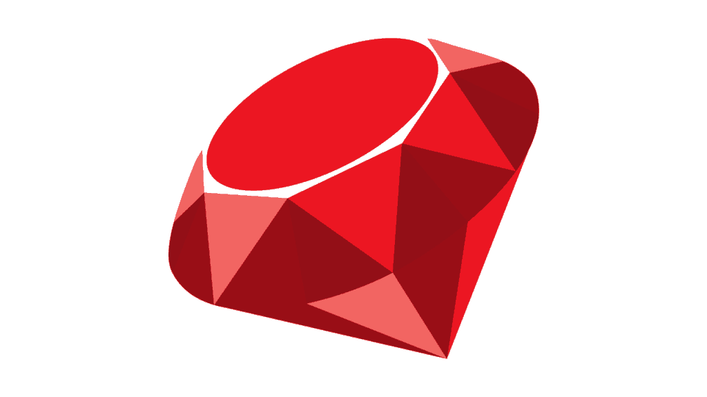
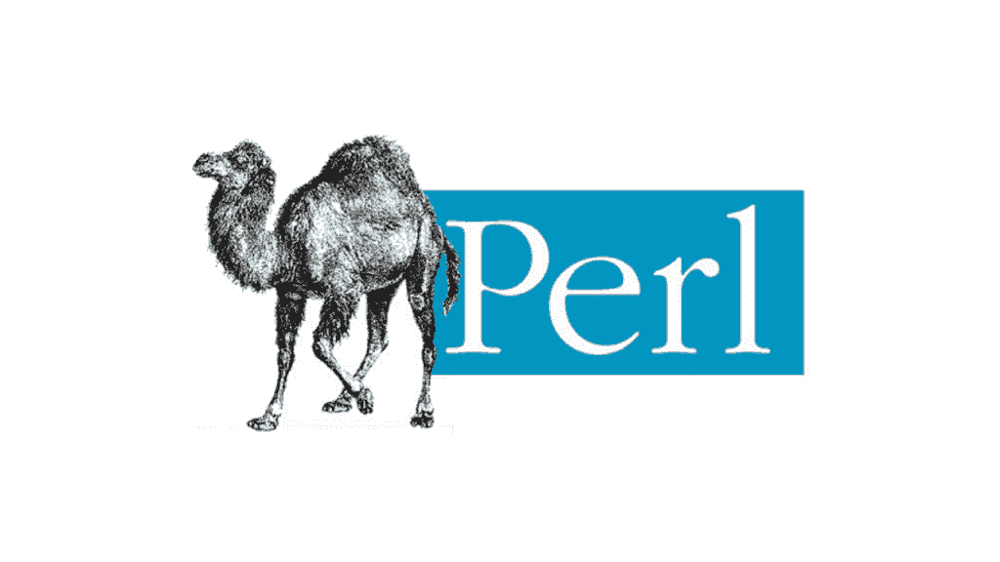

# 2016 年主要编程语言

> 原文：<https://simpleprogrammer.com/major-programming-languages-of-2016/>

通常，新开发人员认为了解大量编程语言很重要，但事实并非如此。

[虽然我不认为成为现有的每一种语言的专家是重要的](https://simpleprogrammer.com/2015/09/25/do-you-need-to-know-more-than-one-language/)，**，但我认为了解主要的编程语言及其差异是非常有用的**，这样你就可以很好地知道使用什么工具来完成这项工作。

在这一章中，我将向你展示我认为你可能会遇到并且应该熟悉的主要编程语言。

我知道很多人不同意我的观点，但是我对编程语言的看法来自于我使用它们的经验。

我相信，即使你不完全同意我对编程语言的选择和我对它们的描述，你也会发现大多数有经验的开发人员至少会同意我在这里所说的 75%的内容。

在软件开发世界中——你可能已经知道了——75%的信心是相当高的。

此外，你会注意到没有像 COBOL、Ada、Fortran 等编程语言。因为，尽管有些人可能会认为它们是主要的编程语言，但你并不经常看到它们，所以我认为它们不值得在这里讨论。

如果你想要一个完整的编程语言列表，请在维基百科上查看这个。

## [C](http://amzn.to/2aAP9Ml)

c 语言最初是由丹尼斯·里奇在 1969 年到 1973 年间在贝尔实验室创造的，是目前使用的较老的编程语言之一。尽管年代久远，但它仍然很受欢迎，可以说是全球使用最多的编程语言。

当今许多其他主要的编程语言都源于 c。

事实上，如果你学习用 C 编程，你可能会发现学习其他语言更容易，比如 C++、C#、Java、JavaScript 等等。

C 语言有点复杂，因为它非常强大。它是非常低级的，允许开发人员直接访问计算机上的内存，并操纵计算机的许多低级部件。

你会发现 C 在很多操作系统、低级硬件、嵌入式系统，甚至很多老游戏中都有使用。

c 通常被认为是系统的编程语言。

## [C++](http://amzn.to/2aZoEjm)

C++是经常与 C 混合在一起的编程语言。这主要是因为许多 C++程序员没有掌握 C++中面向对象的概念，并编写了具有一些 C++功能的所谓 C 代码。

如果您在用 C++编写的遗留系统上工作，您可能会看到大量这种类型的代码。

**C++在技术上是 C** 的超集，也就是说 C 程序要用 C++编译器编译(虽然也有少数例外)。

C++是由贝尔实验室的比雅尼·斯特劳斯特鲁普创建的，用于扩展 C 语言，以便提供一些来自 Simula 的有用功能，增加面向对象、类、虚函数和许多其他功能。

今天，C++仍然被广泛使用——尤其是在游戏开发中——并且它还在继续更新，现在被称为“现代 C++”

然而，C++是一种非常复杂的语言。因为它的复杂程度，我不建议初学者从它开始。

这是非常强大的，但正如他们所说，也很容易吹掉你的脚。

## [C#](http://amzn.to/2aUsGYM)

C#一直是我最喜欢的编程语言之一，因为它表达能力强，而且易于使用。

我觉得 C#是一种设计优雅的语言，即使在今天，它似乎也在快速成长和发展。

C#最初是由微软作为。NET 运行时。

它是由安德斯·海尔斯伯格创建的，他高度参与了 Delphi 和 Turbo Pascal 的创建。

C#一开始非常非常接近 Java。事实上，它已经被称为 Java 的副本，这一点我真的无法反驳。

事实上，我第一次这么快学会 C#是因为我了解 Java，在我的脑海里，它基本上是一样的东西，只有一些小的区别。

然而，最近，C#和 Java 已经有了很大的分歧——尽管，我还是要说，如果你懂这两种语言中的一种，你就有 90%的机会去了解另一种。

C#是一种面向对象的语言，可以被描述为类似于 C++，但更简单，现在有许多功能特性。

## [Java](http://amzn.to/2b1qf5i)

Java 与 C#极其相似，但它更古老，所以从技术上来说 C#与 Java 极其相似。

它是由太阳微系统公司的詹姆斯·高斯林在 1995 年创造的，作为一种只写一次，随处运行的语言。这个想法是 Java 可以在虚拟机上运行，而虚拟机可以在任何计算平台上运行，因此 Java 程序可以很容易地跨平台。

Java 是面向对象的，很大程度上基于 C 和 C++，但是和 C#一样，它也非常简化，不允许直接内存操作和其他可能给你带来麻烦的低级构造。

今天，Java 归甲骨文所有，并且仍在继续成长和繁荣——尽管它现在由一个委员会管理，该委员会的成员倾向于减缓发展。

## [Python](http://amzn.to/2aAOY3I)

Python 是我希望有一天能够深入研究的语言之一。

这是一种极其优雅和简单的语言，其核心设计之一就是可读性。

Python 是由 Van Rossum 在 1989 年创建的，他被 Python 社区称为“仁慈的终身独裁者”。

Python 可以用面向对象、过程化甚至函数化的方式编写，它是一种解释型语言，意味着它不是编译型的。

与 C++、Java 和 C#相比，Python 代码通常更简洁，因为可以用更少的代码行表达更多的内容。

Python 现在非常受欢迎，而且越来越受欢迎——据我所知。

它是谷歌使用的主要编程语言之一，也是一种很好的初学者语言。

## [红宝石](http://amzn.to/2b1qKMq)

这是一种非常有趣的语言。

Ruby 实际上是由松本幸宏“Matz”在 1993 年左右在日本创作的。(我很荣幸马茨是我的*软技能*书的[日文翻译的评论员。](https://www.amazon.co.jp/SOFT-SKILLS-%E3%82%BD%E3%83%95%E3%83%88%E3%82%A6%E3%82%A7%E3%82%A2%E9%96%8B%E7%99%BA%E8%80%85%E3%81%AE%E4%BA%BA%E7%94%9F%E3%83%9E%E3%83%8B%E3%83%A5%E3%82%A2%E3%83%AB-%E3%82%B8%E3%83%A7%E3%83%B3%E3%83%BB%E3%82%BD%E3%83%B3%E3%83%A1%E3%82%BA/dp/4822251551?ie=UTF8&SubscriptionId=0V4JT1H35KWYMF0SKQR2&camp=2025&creative=165953&creativeASIN=4822251551&linkCode=xm2&tag=novelrank-22))

想法是创建一种面向对象的脚本语言。

然而，Ruby 直到几年后才真正开始腾飞并成为一种流行的编程语言。

Ruby 成功的一大催化剂是 David Heinemeier Hansson(又名 DHH)在 2003 年创建的 Ruby on Rails (RoR)。

从那以后，Ruby 的受欢迎程度有升有降，但是今天它仍然是一种非常受欢迎的编程语言，因为用它来编程非常容易和有趣。事实上，这是 Matz 语言的主要设计目标之一。

你会发现许多编码训练营把 Ruby 作为主要的编程语言来教授，因为它是一门非常好的初学者语言。

## [JavaScript](http://amzn.to/2aUtSvj)

下面是另一种有趣的似乎不想死的编程语言。

JavaScript 最初是由 Brendan Eich 在 1995 年创建的，仅用了 10 天就开发完成了！

可以想象，这导致了一种有很多问题的语言。JavaScript 看起来很像 C#、Java 或 C++，但它的行为却大不相同。

JavaScript 最初是作为一种简单的 web 脚本语言使用的，但是，我相信你已经发现，它已经成为 web 的主要语言——甚至更多。

较新版本的 JavaScript，或者更准确地说是 ECMAScript，已经修复了该语言的许多缺陷，使其更适合大规模开发。

几乎今天的每个 web 开发人员都必须至少对语言有一些了解，因为它被广泛使用。

## [Perl](http://amzn.to/2aZq0La)

尽管不如以前流行，Perl 仍然是一种广泛使用的语言，尤其是在 Unix 脚本领域。

事实上，Perl 最初是由拉里·沃尔在 1987 年作为 Unix 的脚本语言创建的。

由于它的灵活性和解析字符串的能力，它在 web 的早期非常流行，这使得它非常适合 CGI 脚本。(如果你不知道那是什么，不要担心，但认为自己很幸运。)

我一直有点讨厌 Perl，因为我发现它是一种难看的语言，极难阅读。

但是，尽管我对这种语言心存疑虑，我不得不承认它被称为“脚本语言的瑞士军队链锯”是准确的。

Perl 非常灵活，非常强大——两天后，我无法理解我或其他人用它写的任何东西。

## [PHP](http://amzn.to/2b1qVHy)

这是一种人们又爱又恨的语言——包括我自己。

PHP 不是一门非常优雅的语言。事实上，在我看来，它有点“肮脏”，但它几乎为今天的大多数网络提供了动力。

脸书最初是用 PHP 编写的。曾经流行的博客软件 WordPress 仍然是用 PHP 编写的。

有一个非常受欢迎的网站的庞大列表，这些网站至少是以 PHP 起家的，其中许多网站仍然在使用它。

它最初是由拉斯马斯·勒德尔夫在 1994 年创建的，实际上直到 2014 年才在没有任何书面规范的情况下发展起来。(是的，你没看错。)

PHP 从未打算成为一种编程语言。它只是一套帮助构建简单网页的动态工具，但一旦泄露了秘密，就不可能再放回去。

尽管 PHP 有很多缺点，但是它很容易学习和使用，尽管它有很多黑暗的地方会让人迷失。

这不是我最喜欢的语言，但是许多初学者开始修改现有的 PHP 代码来“切齿”

## [目标-C](http://amzn.to/2as3c0X)

这是另一种语言，它在几年内从默默无闻变成了主流。

Objective-C 最初是由 Brad Cox 和 Tom Love 在 20 世纪 80 年代初创建的。想法是将 SmallTalk 的面向对象功能添加到 c 语言中。

Objective-C 被广泛遗忘——几乎被淘汰——除了苹果捡起它并决定在它的 Mac OS X 操作系统中使用它。

尽管如此，它并没有变得广泛流行，因为只有 Mac 开发者真正使用这种语言，直到苹果推出 iPhone 和 iOS，吸引了数百万新程序员与这种语言的奇怪语法斗争。

我就是其中之一，因为我必须学习 Objective-C 来将我的第一个 Android 应用移植到 iOS 上。

我不得不说，我不太喜欢这门语言。

**它的学习曲线**非常高，即使做最简单的事情也相当啰嗦。

幸运的是，今天的 iOS 开发人员不需要学习 Objective-C，可以使用稍微友好一些的语言 Swift。

## 雨燕

这种编程语言是苹果新推出的 iOS 旗舰语言。

我承认，在写这一章的时候，我自己还没有使用过 Swift 尽管如果我重新开始 iOS 开发，我肯定会使用这种语言。

Swift 被特意设计为与苹果的 Cocoa 和 Cocoa Touch 框架(用于 iOS 和 OS X 开发的框架)协同工作。

它还被设计成可以轻松地与大量现有的 Objective-C 代码集成。

**Swift 支持 Objective-C 的许多流行特性，这些特性使 Objective-C 变得如此动态和灵活，同时也更加简单和简洁。**

如果你今天要做 iOS 开发，跳过 Objective-C 直接去 Swift 可能是个不错的主意。

## [出发](http://amzn.to/2azFhMU)

Go 是一种相对较新的编程语言，由 Google 开发。

我真的很喜欢围棋，因为它简洁而强大。

我创建了一个围棋课程，你可以在 Pluralsight 上找到。)

Go 是由 Robert Griesemer、Rob Pike 和 Ken Thompson 在 2007 年创建的，它与 C 非常相似，但有一些很大的补充和简化。

不像 C，Go 有垃圾回收，所以不用管理内存。它还具有一些内置于语言中的并发编程特性，这使得它具有极高的性能，并使并发成为该语言的一流特性。

当你开始编写它的时候，你可以通过语法的简洁程度来判断它是一门真正设计良好的语言。

像 C 一样，Go 是主要的系统编程语言，但是它正在扩展到更多的领域，包括网络。

## [二郎](http://amzn.to/2aZqVv1)

Erlang 是一种功能性的、非常有趣的编程语言，被设计成分布式和并发的。它还支持代码的热交换，你可以在不停止的情况下改变应用程序中的代码。

它最初是由爱立信的乔·阿姆斯特朗、罗伯特·维尔丁和迈克·威廉姆斯在 1986 年创建的，但在 1998 年被开源。

这种语言最初是为了帮助改进电话应用程序的开发而创建的——因此出现了热插拔，因为您并不希望大多数电话应用程序宕机。

Erlang 很容易被认为是当今最健壮的编程语言(和编程环境)。

## 哈斯克尔

这种编程语言本质上是非常学术性的。

Haskel 是一种纯粹的函数式编程语言，最初是作为 1987 年存在的一些函数式语言的开放标准而设计的。这个想法是将现有的函数式语言合并成一个注释，一个可以用于函数式语言设计研究的注释。

信不信由你，Haskel 1.0 是由一个委员会在 1990 年设计的。

近年来，哈斯克尔变得越来越受欢迎，而且不仅仅是在学术界。

由于 **Haskel 是一种纯函数式语言**和强静态类型系统，它可能是一种难以使用和学习的编程语言，但它也非常强大，并且产生高度可预测的代码，没有副作用。

## 过分渲染细节

我想再次强调一些关于主要编程语言列表的事情。

很明显，这是一个时间敏感的和高度偏见的问题，所以如果你最喜欢的编程语言或新的热门语言没有在这里列出，可能是因为这些原因。

我还掩饰了编程语言的细节，因为我不希望我们陷入试图定义静态语言和动态语言以及面向对象或过程语言和函数语言的困境。

事实上，在今天的编程环境中，许多语言并没有明确地归入静态或动态或面向对象和函数的旧类别，因为许多语言包含了多种类别的特性。

相反，你所需要的只是对现有的主要编程语言有一个概念，以及对每一种语言的简要介绍，这样，如果你感兴趣，你就可以自己探索你最感兴趣的语言。

* * *

