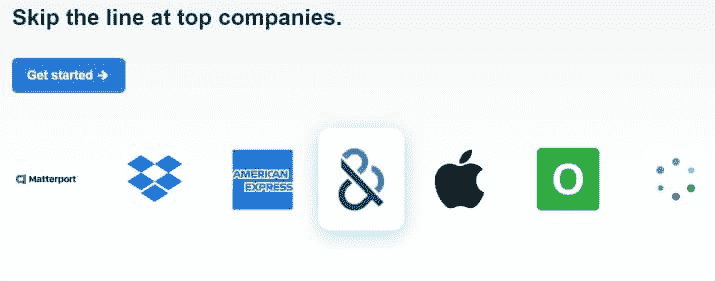

# 游戏开发者赚钱的 5 种最佳方式

> 原文：<https://simpleprogrammer.com/make-money-as-a-game-developer/>

你是不是非常喜欢制作游戏，以至于想以此为职业？T3】

随着今天视频游戏的流行，游戏开发中有很多赚钱的机会——所以让我们来谈谈制作游戏赚钱的 5 种主要方式。

你可以选择在一个大工作室，一个小工作室追求你的职业生涯，或者甚至作为一个独立的游戏开发者跟随你的方式。

[//www.youtube.com/embed/bFHSwSC9c3U?not_used=1](//www.youtube.com/embed/bFHSwSC9c3U?not_used=1)

无论你选择什么职业，请记住:

**找到一个利基。**

学习你需要学习的东西，会见你需要会见的人，尽一切努力在游戏开发的特定领域取得成功。

如果你一直在这些不同的道路之间跳跃，你将很难在其中任何一条道路上变得伟大。

## 游戏开发者赚钱的 5 种方法

要成为一名成功的游戏开发者，我最大的建议是选择其中一条职业道路，集中你所有的精力和努力，尽你所能变得更好。

让我们开始吧。

### 1.在游戏开发工作室找份工作

现在，在这里你有几个不同的选择。

当然，你可以选择大一点的工作室，小一点的工作室，或者任何介于两者之间的工作室。对于一个更大的工作室来说，这些地方就像 Bethesda，Rockstar，Electronic Arts，通常这些创作游戏的团队会有成百上千的人。

要想在这些公司中找到一份工作，最好专攻游戏开发的某个特定领域。

我认识一个专门做装配的人，在你把 3D 模型交给动画部门之前，你要做一个 3D 模型的骨架，这样他们就可以制作角色的动画了。

因为他是这方面的专家，并且在短时间内非常擅长，所以他能够在一家大型游戏开发公司找到工作。

**去哪里找工作**

我们为寻找工作的软件开发人员推广的一个平台是 [Triplebyte](https://simpleprogrammer.com/triplebyte-home) 。

他们还发布了寻找游戏开发人员的招聘信息:

**三字节如何工作**

1.  [注册你的免费三字节账户](https://simpleprogrammer.com/triplebyte-signup)
2.  点击“求职”
3.  在技术堆栈下拉菜单中选择“C++”
4.  Strg+F 并在页面上搜索“游戏”

**获得‘In’**

进入这些大型游戏开发公司的另一个方法是结识合适的人。因此，确保你参加大型游戏开发行业活动以及不同游戏开发者的小型本地聚会。

你永远不知道，你可能遇到的那个人最终可能会给你在某个地方找到一份工作。

**小工作室的事情**

另一方面，你可以去一个较小的游戏开发工作室，这些较小的工作室通常只有五六个人，甚至大约 10 到 15 个人。因为工作室要小得多，所以你需要更广泛、更全面的技能。

*你需要从头到尾了解创建一个游戏的整个流程*你真的需要了解所有不同的团队是如何互动的，因为你将与一群做着一堆不同事情的不同的人互动。

再说一次，聚会对于遇到合适的人在一个较小的游戏开发工作室找到工作是非常重要的。

现在，如果你所在的地区没有很多游戏开发工作室，那么在这样的公司找到一份工作会很困难。

### 2.成为一名自由游戏开发者

对于一些远程工作来说，一个很好的选择是开始做自由职业者和签约游戏开发。

所以你当然可以在像 Upwork 或 Fiverr 这样的网站上找到这些小工作。然而，如果你没有大量的游戏开发经验，可能很难脱颖而出。

你或许可以做的一个方法是**在 YouTube 或 Twitter** 上联系一些较小的游戏开发者，问问看你能否为他们做一些无偿的游戏开发工作。虽然你一开始不会赚到钱，但你可以建立自己的投资组合，开始向人们展示你的作品，然后人们会开始为你的作品付费。

### 3.销售工具和资产

作为游戏开发者的第三种赚钱方式是在 Unity Asset Store 上出售工具和资产。Unity 资产商店是游戏开发者的好去处，你可以买到各种资产和工具。他们有 3D 模型，2D 背景，所有你开发游戏需要的东西。

如果你是一名创业型程序员，你可以制作工具在 Unity 资产商店出售。这些工具可以与你正在开发的任何游戏引擎集成，它们可以让最终用户的游戏开发变得更加容易。如果使用你的特定工具可以节省很多时间，人们会愿意花很多钱。

同样，如果您想在 Unity Asset Store 中脱颖而出，拥有满足特定需求或解决特定问题的产品非常重要。

在 Unity 资产商店上赚一大笔钱当然是可能的。当你要向资产商店提交一些东西时，Unity 基本上告诉你不要害怕给你的资产或工具定价过高，因为如果它能解决他们的特定问题，人们会愿意支付那么高的价格。

### 4.成为一名教师

游戏开发者赚钱的第四个方法是教游戏开发。因此，当然有像 Udemy 和 Unity Learn 这样的网站，你可以在那里制作小课程或类似的东西来教授开发，或者你甚至可以在游戏开发大学或一些当地辅导学校找到一份家教或教师的工作。

或者你甚至可以**在游戏开发的特定领域进行一对一的咨询**，帮助他们进行编程，或者帮助他们进行艺术指导或营销。

但是要成为一名好老师，你可能需要在游戏开发方面有相当的经验。

### 5.做一个独立的游戏开发者

作为游戏开发者，第五个也是最后一个赚钱的方法当然是去独立。

所以现在最重要的是，每个人都想成为一名独立的视频游戏开发者。我的意思是，这真的是一份梦寐以求的工作，你可以为自己工作，你可以做一些你感兴趣的事情，你可能会因此赚很多钱。

我会说，对于没有太多游戏开发经验的人来说，这将是最难真正成功的一个。

但是我并不打算阻止你这样做，因为有很多人开始自己制作游戏，最终取得了巨大的成功。

让我们来看看作为一个独立的游戏开发者，你可以用你的游戏赚钱的一些方法。

**以固定价格出售你的独立游戏**

独立游戏开发商最常见的策略是制作一款游戏，并以固定价格出售。所以你可能会以 7，99，9，99，12，99 的价格出售。

有人买了你的游戏，他们支付固定的价格，他们可以在剩下的时间里使用这个游戏。当你以固定价格出售你的游戏时，你有一定的灵活性，所以你可以把你的游戏放在市场上，以半价出售，这样就可以多卖一些。

你也可以做 DLC，这是可下载的内容，所以这是你可以为你的游戏制作的额外内容。所以也许你会增加一些关卡或者一些装饰性的物品，比如不同的玩家皮肤或者类似的东西。

**免费游戏:应用内购买**

独立游戏开发者的另一个伟大的盈利策略是制作一款免费游戏。

免费游戏在移动平台上很常见，但你也能在游戏机或 PC 上看到。他们实际上赚钱的方式是通过应用内购买或广告。对于应用内购买，这与可下载内容非常相似，所以你可以出售像玩家皮肤这样的装饰性物品，或者你甚至可以出售游戏的额外关卡。

**如何在你的游戏中投放广告赚钱**

**订阅模式**

另一种赚钱的方式是通过订阅模式。这对于一个初学者来说是相当困难的，因为你基本上需要让一些人注册你的游戏，他们会每月支付费用。

我之所以说这很难，尤其是对初学者来说，是因为你需要不停地推销你的游戏。你需要给每个人一个回来的理由，每个月多花 5 美元或者你有的任何东西来购买订阅。

**赞助**

作为一个独立游戏开发者，最后一个主要的赚钱方式是通过赞助。如果你没有太多的观众，赞助就很难实现。根据交易情况，他们可能会以固定价格或可变价格支付给你，这取决于有多少人玩你的游戏。

## 包扎

这是游戏开发者赚钱的五大途径。