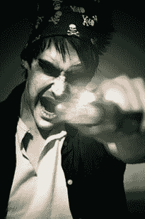

# Scrum Masters:什么是好的？

> 原文：<https://simpleprogrammer.com/makes-good-scrum-master/>

是的，没错。我今天在写一篇关于 Scrum 和 Scrum Masters 的博文。

不，我没有失去理智。

我刚刚意识到，在我写的所有关于敏捷和 Scrum 的文章中，我从来没有谈论过如何成为一名优秀的 Scrum 大师。

我曾经是一名 Scrum Master，也和 Scrum Master 一起在一个团队中工作过，从这两次经历中，我可以告诉你，在 Scrum 或敏捷团队中，对于这个特殊的角色有很多困惑。

甚至连 ScrumMaster 这个名字都让人困惑，是 Scrum Master 还是 Scrum Master——你可以说，我更喜欢后者。

所以，让我们来谈谈为什么 Scrum 大师存在于 Scrum 团队中，以及他们实际上应该做什么。

## Scrum Masters！它们有什么用？

不幸的是，在某些团队中，这根本不算什么。

但是，事情不一定是那样的。一个 Scrum 大师实际上在一个正常运作的 Scrum 团队中扮演着非常重要的角色。(他们每天早上带来油炸圈饼或百吉饼，这样团队就可以完成实际工作。)

好吧，关于最后一部分我只是开玩笑，但事实上它离真相并不远。让我解释一下。

Scrum 大师真的应该是为团队扫清道路的人，这样他们就可以尽可能接近全速运行。Scrum Master 有点像赛车手的维修站工作人员。

没有一个 Scrum 大师，一个 Scrum 团队会被任何开发项目中不可避免出现的障碍拖慢。处理这些障碍需要时间，而且会分散团队的注意力，所以团队的整体节奏会变慢，除非开发过程之外的某个人把巨石移开。

所以，实际上，Scrum Master 最重要的工作是清除阻碍 Scrum 团队处理积压工作和完成工作的障碍。

这和管理项目不是一回事，因为 Scrum 大师并不决定事情应该如何以及何时完成。相反，Scrum Master 是团队的一部分，团队作为一个整体负责管理项目。

Scrum Master 也是 Scrum 过程的主人——因此得名。这是一个艰难的处境，但却是许多团队忽视的一个非常重要的角色。Scrum 的规则对于一个成功的 Scrum 团队非常重要。我开始放弃 Scrum 作为一个过程的原因之一是因为很难让任何人真正执行这些规则。

这是 Scrum 大师的工作；他拿着一根大棍子，当人们走出队伍时，他就用棍子打他们的头。他不这么做，是因为他是一个权力欲极强的恶霸。不，相反，他这样做是因为他知道团队要产生最好的工作并且不浪费时间争论过程的唯一方法是如果他们都遵循从一开始就同意的过程。

Scrum 不仅仅是一种开发软件或组织团队的方法，它还是一个清晰定义将会发生什么、何时发生以及谁将做什么的过程。

## Scrum Master 是团队中最重要的角色之一

根据我之前的描述，看起来 Scrum 大师的角色对团队的整体表现并不重要，但事实远非如此。

实际上，**团队的速度受 Scrum Master 的影响比团队的任何其他成员都大**——除了那个懒惰的开发人员，他总是破坏构建，并且经常在会议上睡着。

尽管 Scrum Master 对团队的管理没有直接的控制权，但是 Scrum Master 清除障碍和实施 Scrum 框架的能力直接影响到团队获得成功的能力！@#完成。

一个糟糕的 Scrum 大师会让团队陷入困境，让外界的影响分散团队的注意力。

一个糟糕的 Scrum 大师要么太胆小，要么不够关心迫使团队遵守 Scrum 的规则，导致整个排的人向他们选择的任何方向逃窜，步枪向四面八方乱射。

我喜欢把 Scrum Master 想象成一个向导，带领团队穿越崎岖的地形，向他们展示如何在旅途中从树叶中取水。当然，团队可以在没有向导的情况下设法在丛林中开辟出一条路，但这将花费他们更多的时间，而且他们更有可能被狮子吃掉。

## 那么，Scrum Masters 实际上应该怎么做呢？

答案是无论需要做什么。

你知道那些黑帮电影吧，一些黑帮老大有一个他们称之为“清洁工”的家伙那个陷入困境并能藏起尸体，贿赂警察，或者让某人消失的家伙？如果暴徒在跟踪 Scrum，那个人就是 Scrum 大师。

Scrum Master 应该是团队的一部分，但不是团队的一部分。**Scrum Master 应该积极地参加站立会议，试图找出障碍——**尤其是那些团队成员没有提到的，但是存在于问题表面之下的障碍。

[**Scrum Master 应该确保所有的 Scrum 会议和流程顺利进行**](https://simpleprogrammer.com/2011/07/17/making-scrum-meetings-effective/) 。他应该确保站立姿势被用于正确的目的。他应该鼓励团队对彼此负责，他自己也应该让团队对他们承诺交付的东西负责。

Scrum Master 应该是让事情发生的人。他应该认识合适的谈话对象，并且知道如何把事情做好。团队应该关注工作，Scrum 大师应该关注政治。如果团队在处理政治问题，Scrum 大师就失败了。

最重要的是，Scrum 大师应该愿意把一切都放在线上——为团队承担损失。尽管 Scrum Master 不能控制团队，也不能指挥他们，但他们是他的团队，也是他一个人的团队。一个好的 Scrum 大师不怕为团队的行为和表现负全责，如果必要的话，他会挡在子弹的路上，并在胸口开一枪。

*喜欢这个帖子？* [*注册我的每周电子邮件，我会确保像这样的帖子每周一次直接发送到你的收件箱。*](https://simpleprogrammer.com/email) *还有，你会得到很多我只和我的电子邮件订阅者分享的内容。*