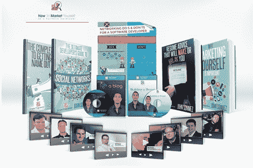
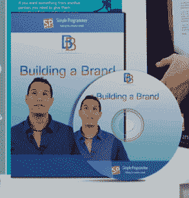
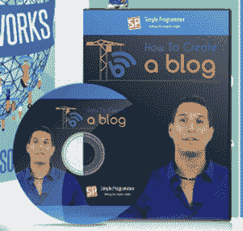
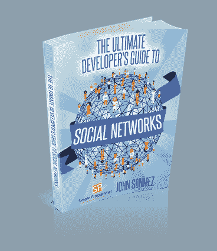
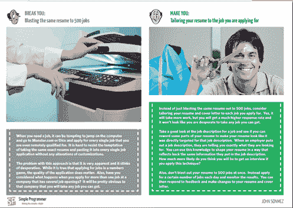
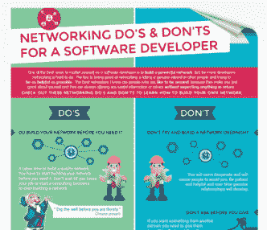
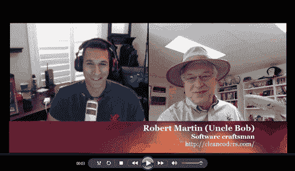

# 我的《如何作为软件开发人员推销自己》课程已经准备好了！

> 原文：<https://simpleprogrammer.com/market-software-developer-course-almost-ready/>

如果你是我博客的常客，你可能知道在过去的几个月里，我一直在做一个非常大的项目。

我收到许多来自开发人员的电子邮件，他们想知道如何通过找到一份新工作、创办一家咨询公司，甚至只是加薪来促进他们的职业发展。

我试图通过电子邮件和 Skype 电话尽可能多地帮助这些开发人员，但是我的能力有限，这种交流方式不容易扩展。

我一直在想如何解决这个问题

## 然后，我有了一个想法…

如果我组织一个完整的项目，教开发人员我认为促进他们职业发展所需的最重要的技能——推销自己，会怎么样？

我指的不是那种给营销带来坏名声的劣质营销。我的意思是真实的，脚踏实地的，我想帮助别人，通过帮助他们，我会为自己建立一个声誉，营销。

我发现，在我的职业生涯中，这种营销方式——为他人提供价值——是我做过的最有影响力的一件事，它增加了我的收入，为我打开了各种各样的机会。

这就是这个想法的由来。我的关于各种技术的 Pluralsight 课程非常受欢迎，但我觉得我能提供的最大价值——**比任何技术课程**都更有价值——是向开发人员展示如何走出去，在社区中树立自己的名声。

## 这是我创造的

我不想只是创建一个普通的视频教程。我觉得结合视频、书籍、采访和更多的内容，本课程的内容会更好。

我希望购买该软件包的开发者感觉他们物有所值。如果我有一台时间机器，可以回到过去，我想确保我没有遗漏任何我会给年轻自己的建议。

一开始，我写了这门课程的旗舰书籍《为什么营销自己很重要》我觉得这本书是这个项目的一个很好的起点，让读者了解营销自己的确切价值以及它需要什么。

这本书旨在介绍在该计划的其他部分中更详细介绍的概念，并让读者更熟悉这些概念，以便他们理解每一部分的内容。

接下来，我制作了**“建立品牌”**视频课程。本课程的目标是谈论建立品牌的重要性，并向观众展示如何建立品牌。我想涵盖的不仅仅是对什么是品牌的表面理解，而是真正深入到是什么造就了一个伟大的个人品牌，以及拥有一个伟大的个人品牌可以带来的价值。

我希望这门课的结构像你在和我进行一次真正的对话。所以，我用全高清视频拍摄了大部分课程，我对着摄像机说话。在本课程中，我将带您从了解品牌构成要素的基础一直到创建您自己的品牌，并回答我在代码营和会议上谈论这个主题时收到的与个人品牌相关的最常见问题。

由于拥有一个博客是我推荐的策略的核心部分，我创建了一个完整的循序渐进的课程，向你展示如何从头开始建立一个博客，并给你我多年来学到的使你的博客成功的工具和建议。

在本课程中，我将介绍建立博客的所有选择，包括免费托管、共享托管和使用成熟的虚拟私人服务器。但是，我不想只谈论建立博客，所以我采取了额外的步骤，实际上向你展示如何使用每个可能的选项来创建一个博客。

在课程的最后，我会告诉你我用来建立这个博客的所有技巧和诀窍，这个博客每个月会有超过 100，000 的访问者——平均每天大约 3，000。

我觉得学会有效地使用社交网络是一项非常重要的技能，可以让你的名字出现在那里，传播你创造的内容。所以，我写了另一本书，名为**“社交网络终极开发者指南”**

在这本书里，我列出了在社交网络上获得牵引力的总体策略。我谈论的概念包括建立观众群和与人沟通。我介绍了我在每个主要社交网络上的策略。我还列出了我用来有效管理社交网络的所有工具，而不是每周花几个小时来维持我在社交网络中的存在。

我觉得大多数开发人员非常缺乏的一个领域是创建一份好的简历。于是，我决定以:做这个，不做那个的形式写一篇**“会成就你或毁掉你的简历建议”**。我把这些年来从招聘人员和招聘经理那里得到的最好的简历建议，以及我自己用来获得好工作和谈判更高薪水的建议都包括在内。

接下来，是让你的名字出名的大话题。我决定写**“让你的名字出名的完全指南”**来详细讨论这个话题。在这本书里，我谈到了你可以使用的所有不同的媒介来让你的名字和品牌在人们可以看到的地方出现。

我从谈论如何让人们访问你的博客开始。然后，我给你一些在杂志或其他博客上发表文章的建议。我涵盖了写你自己的书，或者自助出版，或者让传统出版商出版。我甚至谈到了我用来创建视频教程和截屏或拍摄高质量 YouTube 视频的所有技巧和诀窍。我还会谈到开发人员播客或创建自己的播客的话题——这并不难。最后，我给你一些实用的建议，无论是通过演讲还是通过开源，都可以进入社区。这本书包含了大量的信息。

我真的很想让这个包裹有价值，所以我没有就此打住。我创建了一个网络禁忌列表，并雇佣了一个图形设计师来创建一个漂亮的信息图。我真的很高兴这件事是如何出来的。在这张信息图中，我揭示了多年来我从无数书籍、文章和简单的试错中学到的所有网络秘密。

最后，我联系了我能想到的最著名的软件开发人员。我能够让鲍伯·马丁、杰夫·阿特伍德、乔恩·斯基特、罗布·科内瑞和其他一些开发者让我采访他们。我觉得光是这些采访就值这个课程的价格——马克·弗里德曼甚至同意我的观点。

> 在[@ JSON mez](https://twitter.com/jsonmez)[http://t.co/KtkzXAlDYk](http://t.co/KtkzXAlDYk)的新课程中，光是他对[@ unclebomartin](https://twitter.com/unclebobmartin)的采访就值入场费了。
> 
> —马克·弗里德曼(@马克·弗里德曼)[2014 年 3 月 9 日](https://twitter.com/MarkFreedman/statuses/442793356088082432)

在这些采访中，我深入挖掘是什么让这些著名的软件开发人员如此成功。他们分享了很多我在别处听不到的秘密。我认为你会发现一个特别有价值的采访是我对皮纳尔·戴夫的采访。Pinal 是 SQLAuthority 的创建者，这是一个非常成功的博客，每月有超过 180 万的浏览量。没错 180 万！他第一次分享了他的成功秘诀。

当我得到关于内容的反馈时，我也会用更多的采访和其他内容更新这个包。我想让这个包尽可能有活力。

## 它什么时候上线？

所以，你可能想知道这门课什么时候开始。好吧，如果你预订了这个包，你已经得到了我将要发布的大部分内容。

但是，如果你没有预订，你可以在 3 月 27 日得到完整的包装。如果你是我的电子邮件列表的订户，你会在发布当天在你的电子邮件中得到一个不错的大折扣代码。

如果您尚未注册，请点击此处注册，以确保您获得折扣代码，并在完整套餐上线时得到通知。

## 伙计，我累了吗

我不得不说，我已经被这个包裹搞得筋疲力尽了。我从来没有在这么短的时间内在一个项目上投入了这么多的精力。我花了无数个小时熬夜研究这个包的一些部分。但是，我认为这一切都是值得的，因为我对事情的发展非常满意。我 100%相信这门课程将帮助开发人员学习推销自己和促进职业发展所需的技能。