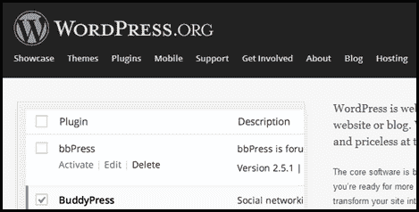
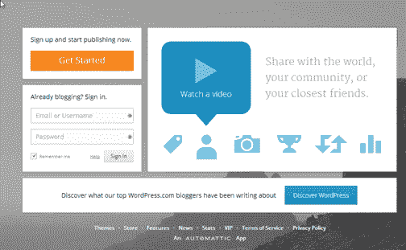
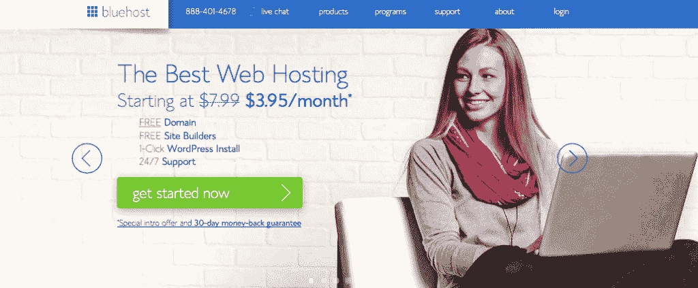
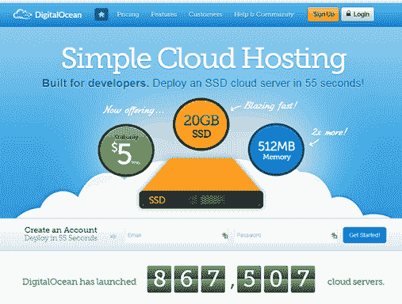

# 营销自己:如何创建博客

> 原文：<https://simpleprogrammer.com/marketing-create-blog/>

## 如何创建博客:入门

许多开发人员在创建网站时遇到的最大障碍之一就是入门。我会试着让开始变得尽可能容易，但不会掩盖一些重要的细节，这些细节可能会在你成长的过程中伤害你。

在生活中，我明白了在以最好的方式做事和以足够简单的方式做事之间，总是需要达到一种平衡。

所以，我将向你介绍几个如何开始创建博客的选项，你可以根据自己的情况选择走哪条路。

## 博客软件

我们首先要谈的是博客软件。你应该为你的博客使用什么样的软件？

有很多选择，包括写你自己的定制博客，但是我认为对大多数开发者来说最好的选择是使用 WordPress。

我不是轻率地这么说，我意识到在开发者社区中，WordPress 可能看起来不是最好的选择，但是让我们仔细分析一下。

当你创建博客时，大多数时候你的目标不是展示你在创建博客或使用博客软件方面有多擅长，而是你的目标是传播你的信息，控制你的形象，并在网络上为你自己建立一个家。T3】

在商业中，我们会说你的博客软件不是你的核心竞争力，相反，你放在博客上的内容才是你的核心竞争力。

许多开发人员试图通过创建自己的博客或使用不太受欢迎的博客软件解决方案开始，他们最终浪费了大量的时间摆弄或创建软件，而不是写博客。

我选择 WordPress，因为它是最受欢迎和使用最广泛的博客软件，这意味着它得到了很好的支持，有大量的插件，而且运行良好。

你可以在几分钟内安装一个新的 WordPress，甚至从一个空的服务器上，你可以找到任何你能想到的插件。

当然，我来自. NET 和 C#背景，WordPress 是 PHP，但我不能否认使用和定制 WordPress 是多么容易。

当然，你可以使用另一个流行的软件或者从头开始写你自己的博客，但是如果你想快速启动并运行，我建议你现在只使用 WordPress，一旦你对你正在做的事情有了更好的想法，你可以以后再切换。

## 买你的东西

你的第一个目标真的应该是创造出属于你，只属于你自己的东西。

如果你花大量的时间为博客制作内容，而其他人最终控制了这些内容，你就冒了相当大的风险。

就像你不会在别人的土地上建房子一样，你也不应该在别人的领地上建博客。

所以，你要做的第一件事就是买下你的土地。你需要一个属于你自己的域名。

几个免费的博客平台会很乐意为你托管你的博客，并给你一个他们域名内的地址。尽管这是免费的，也是最便宜的入门方式，但你需要对未来看得更远一点，并意识到花 1.99 美元或其他任何价格购买一年的域名是值得的。

无论你做什么，不要把这件事搞砸了，因为你会后悔的。其他一切都可以在以后改变，但移动域名并试图保持你的搜索排名和所有内容不变，是你不想要的痛苦。

通过使用 GoDaddy 这样的服务，你可以很便宜地注册一个域名。我通常使用 GoDaddy 最初注册我的域名，即使我以后可能会移动注册。

## 选择托管方法

只要你有自己的领域，这里的选择就不会像你刚开始创业时那么重要，但考虑你的选择还是不错的。

有三个主要选项可供选择来托管你的新博客。

#### 完全免费托管

这个选项是最便宜的，它可以让你不用管理任何软件或操作系统就能创建一个博客，但是它的缺点是让你对你的博客控制最少。

我用 WordPress.com 的这个选项开始了我的博客，但是你也可以使用收费服务，比如谷歌的 Blogger，或者其他免费的博客托管公司。

我最初是从这个选项开始的，因为我不想在我不知道自己是否会坚持的事情上进行大的投资。但是，我后来开始后悔这个决定，因为对我的博客缺乏控制。

有了这个选项，你基本上只需注册一个新博客，就可以立即开始发帖。托管公司只给你创建和编辑文章的权限和一些管理功能，但是你不能使用你自己安装的 WordPress 或其他博客软件所提供的更高级的选项。

这看起来没什么大不了的，但是如果你最终想在你的网站上放广告，卖东西，或者定制你的主题，你可能会很快后悔这个决定。

如果你选择了这个选项，确保你支付了这些服务提供的可选费用，允许你为你的博客使用你自己的自定义域名。不要犯跳过这个的错误。相信我，你以后不会想换域名的。

#### 共享主机

使用此选项，您通常会使用与其他博客或网站共享的 web 服务器上的一些空间，但您控制着该空间的大部分。

共享主机公司通常会有一些选项来为你预装或自动安装 WordPress 或其他博客平台，并让你访问该博客软件，就像它安装在你自己的机器上一样。

您通常通过使用控制面板应用程序来访问您的“服务器”,该应用程序为您提供了添加和删除某些软件应用程序的选项，可以直接访问您的数据库和文件，还可以执行其他管理任务，而这些任务是免费托管平台无法完成的。

有一次我离开了 WordPress.com 的免费主机，因为我想能够完全控制我的主题并给我的博客添加插件，(这是免费主机做不到的)，[我转向了 Bluehost.com](http://www.bluehost.com/track/simpleprogrammer)，WordPress 最受欢迎的共享主机平台之一。我可以很容易地将所有东西从 WordPress 迁移到我在 [Bluehost](http://www.bluehost.com/track/simpleprogrammer) 上安装的 WordPress 上，而我的读者甚至从来没有意识到这一点。

**这实际上是我向刚开始**的人推荐的选择，但我稍后会解释为什么。

共享主机的最大好处是它让你几乎可以完全控制你的博客。你唯一无法控制的是用来处理 web 请求的 web 服务器和运行你的博客软件的实际操作系统。**这意味着你可以安装插件，添加自定义主题，添加你自己的 HTML 代码和 JavaScript，或者任何你想添加到你的博客上的东西。**

这个选择的另一个好处是它也很便宜。价格会因功能不同而有所不同，但刚开始时，你可以预计每月支付大约[6-10 美元的全托管安装费用。](http://www.bluehost.com/track/simpleprogrammer)(在我看来，与免费托管相比，非常值得。)

我很快就放弃了共享主机，因为当我从免费主机转向共享主机时，我的博客已经有点太大了。最后，我的流量比共享主机能轻松处理的要多一点，我想尝试第三个选项，接下来我会告诉你。

我本可以继续使用共享主机，但是我的博客因为在黑客新闻上流行的文章而变得越来越频繁，以至于我决定自己尝试优化。

#### 虚拟专用服务器或 VPS

这将我们带到第三类托管选项，VPS 或虚拟专用服务器托管。

VPS 虚拟主机听起来很像。VPS 基本上是云中的虚拟化专用服务器。大多数 VPS 托管解决方案会让你能够创建自己的运行 Linux 的虚拟服务器，并按照你的意愿进行配置。你基本上已经拿到了车钥匙，你已经上路了。

这当然对刚开始的人来说有点吓人，但是如果你知道你在做什么，或者你愿意学习(有时是艰难的学习)，这可能是最划算和最有效的选择。但是，你肯定会给自己惹上麻烦——我知道我有过。

权力越大，责任越大！

该博客目前由一家名为 [DigitalOcean](https://www.digitalocean.com/?refcode=e701a0a76767) 的 VPS 提供商托管，但也有其他几种 VPS 解决方案。我发现[数字海洋](https://www.digitalocean.com/?refcode=e701a0a76767)是价格最好的选择，它似乎也有一个非常简单的界面来创建新的虚拟服务器。我实际上通过[数字海洋](https://www.digitalocean.com/?refcode=e701a0a76767)为我的不同博客和网站运行几个 VP，我只为我使用的东西付费，因为[数字海洋](https://www.digitalocean.com/?refcode=e701a0a76767)根据你为你的服务器使用什么样的硬件配置按小时计费。

所以，就像我说的，副总裁的最大好处是你拥有几乎所有事情的最终控制权。您只需获得一台 Linux 服务器和 root 密码，就可以独立完成任务了。

但是，这也是 VPS 的一大缺点。你必须对 Linux 有足够的了解，并且安装你的博客软件，这样你才能启动并运行，并且你必须能够解决你自己的问题。

对我来说，这是值得的，因为我的博客获得了相当多的流量，所以我的优化真的很重要，但对于刚刚起步的人来说，我真的不会推荐 VPS，除非你觉得你已经超越了共享主机。

## 我的建议:共享主机

如果你刚刚开始写博客，我真的建议你和像 Bluehost 这样的公司共享主机。

免费托管很好，真的很容易，而且你不能击败价格，但它的代价是不能真正控制你的博客。我在博客上很快就感受到了这种痛苦，但我没有足够的知识来知道该怎么办，也不知道我还有什么其他选择。

免费托管确实限制了你能做的事情，减少了使用 WordPress 这样的博客的价值。WordPress 有大量的免费插件，允许你给你的博客添加许多不同的功能，真正定制它的外观，以及与其他软件系统集成。例如，我用 WordPress 插件和我的[起床并编写播客](http://getupandcode.com)来自动发布我的播客到 iTunes，当我发布一篇新播客的博文时。

免费托管也往往会让你看不到你的博客到底发生了什么。当我第一次从 WordPress 用一个真正的 WordPress 安装程序迁移到共享主机时，我有点不知所措，因为我必须尝试并弄清楚如何在我的新共享主机安装程序上添加与我的免费主机相同的功能。我真的希望当时我刚刚开始与共享主机。

另一件要考虑的事情是，当你的博客增长时，你可能最终会想要摆脱免费托管，特别是如果你想以某种方式赚钱，即使迁移是可能的，这也不是最容易的事情，而且有点伤脑筋。我非常担心将我的博客转移到共享主机上会出错——那是我一生中不太愉快的时光。

在光谱的另一端，是 VPS，这真的不是我建议开始的东西，因为当你的博客很小时，你不会看到任何真正的好处，但你会继承相当多的头痛。我仍然希望看到你使用 VPS 而不是免费托管，但是如果你使用 VPS，只要知道你正在进入什么。

因此，综合考虑所有因素，我的建议肯定是共享主机。你可以以很低的价格开始，得到很好的支持，并且有能力做你想做的事情。

Bluehost 是我推荐的共享主机提供商，因为它的价格非常合理，客户服务非常好，而且我觉得安装非常简单。我注册了一个账户，点击一个按钮就可以安装 WordPress。(看起来 Bluehost 现在实际上也有 VPS 产品，但我还没有试过。)

## 更多细节

希望这个由两部分组成的系列已经帮助你认识到为什么拥有一个博客对提升你自己和促进你的职业发展如此重要，并且给你足够的信息开始创建你自己的博客。

我只是在这里谈论了一些基本的东西，但是我会在未来发布更多关于营销自己和创建博客的内容。 **[确保你注册了我的时事通讯](https://simpleprogrammer.com/email)，这样你就不会错过任何这类帖子，当我发布[一些我正在开发的产品时，我可以让你知道，这些产品涵盖了更多关于营销你自己和创建博客](https://simpleprogrammer.com/howtomarketyourself)的内容，我在这里不适合。**

一定要让我知道你的想法。如果你用这些关于如何创建博客的信息来创建你自己的博客，请给我发一个链接或者在下面留言。