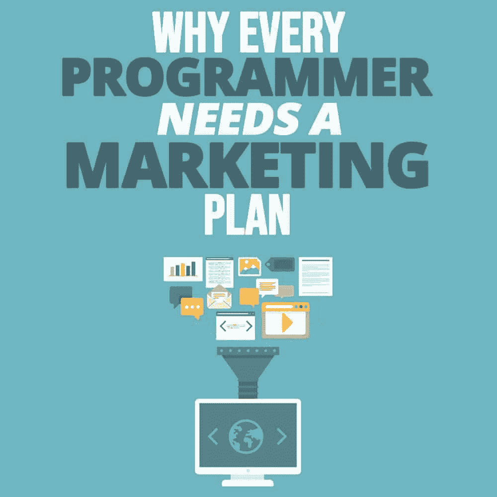

# 为什么每个程序员都需要营销计划

> 原文：<https://simpleprogrammer.com/marketing-plan-programmers/>

<figure class="alignright is-resized">

</figure>

如果你是一名熟练的计算机程序员，试图在职业上有所突破，你需要超越自己职业的界限。虽然你有知识和专业技能，但你需要学会如何展示它们，并让潜在客户相信你是他们项目的合适人选。

简而言之，你需要制定一个营销计划，以便[保持竞争力](https://simpleprogrammer.com/programming-career-competitive-market/)。

根据劳工统计局的数据，从 2016 年到 2026 年，美国计算机程序员的就业率预计将下降 7%。这意味着只有最多才多艺和最灵活的编码专业人员才能得到他们喜欢的项目，并获得他们希望的收入。

但是，作为一名计算机程序员，你该如何制定营销计划呢？你知道如何实施你的计划吗？

也许你到目前为止还没有想好营销计划，或者可能会觉得很难。但不要担心；比你想象的容易！在这篇文章中，我将与你分享所有你需要知道的保持竞争力的重要细节。

## 你需要营销活动的 4 个理由

在我们深入探讨具体的营销问题之前，我们首先需要解释为什么计算机程序员需要营销计划。我们可以举出几十个原因，但这里有四个活动是绝对突出的。我们去看看。

*   **展示作品集**——你的工作经历可能很长，很杰出，但如果你不告诉全世界，也不会有什么影响。一个简单的展示产品组合的网站将极大地提高你的在线发现能力，并让你接触到潜在客户的全新世界。除此之外，你会证明你不怕展示你的产品，完全透明。

*   建立专业声誉–展示你的编程技能是一回事，但营销也能帮助你获得正面的声誉。杰克·加德纳是 T2 Essay Have T3 公司的人力资源经理，他说你可以多走一步，利用博客等促销活动来建立职业声誉:“这给你机会帮助人们解决实际问题。这是成为真正的摇滚明星程序员的捷径。”

*   **超越竞争对手**——这是一个非常简单但非常符合逻辑的理由来创造和实现一个营销计划。只要问自己一个问题:有多少计算机程序员和营销打交道？你可能不会想到太多的名字，所以把它看作是超越竞争对手的机会，并在编程太阳中找到你的特殊位置。

*   **拓展你的人际网络**——当你继续制定营销策略时，你会接触到各种各样的人和组织。这将扩大你的职业关系网，甚至可能带来新的商业项目。

**因此，多赚！**—[赚钱](https://simpleprogrammer.com/making-money-as-a-developer/)是创建营销计划的最后一个理由，也可能是最重要的。一名计算机程序员的平均工资几乎是每年[6.2 万美元](https://www.payscale.com/research/US/Job=Computer_Programmer/Salary)，但是在你确立自己为行业思想领袖的情况下，你可以大幅提高工资。

## 启动营销计划的 7 个技巧

现在你知道为什么你需要一个营销计划，但是你知道如何实施它吗？这是一项严肃的活动，需要相当多的时间和工作，所以有必要从基础做起。

我们选择了程序员在发起营销活动时应该采取的七个关键步骤。系好安全带，因为我们将分别讨论每一个问题。

### 想办法

<figure class="alignright is-resized">

</figure>

你要做的第一件事就是分析当前的形势，确定下一步的行动。首先要为你的目标群体选择正确的沟通渠道。我建议从个人网站开始，然后转向社交媒体账户、电子邮件简讯和客座博文。

做程序员的好处就是不用每天发布新内容。一周刷新两到三次你的社交账户就够了，而你的网站一周一个条目就好了。

从长远来看，保持你的活动的一致性是至关重要的，这就是为什么你应该使用诸如[谷歌日历](https://calendar.google.com/)这样的日程安排工具。它会帮助你保持在正确的轨道上，并提醒你及时发布新帖。

### 创建网站

对于计算机程序员来说，这应该不是什么大问题。当潜在客户想要评估你的职业可信度时，网站是他们访问的第一个地方。因此，设计一个用户友好的网站，清楚地展示你的技能、工作经历和产品组合是很重要的。

同时，你要推出博客，从[定制作文](https://www.essayontime.com/services/essay.html)开始。这是展示你的知识和专长的最简单的方式，所以确保你写的是关于你所在领域的高质量文章。

请记住不要使用编程术语，因为您的目标受众主要是不懂编程的商务人士。因此，你应该使用简单可行的语言，同时尝试建立独特的写作风格。

当然，搜索引擎优化是必须的，所以要尽最大努力为每个主题找到合适的关键词。如果你不能独自处理，我们建议咨询[写作专家](https://www.college-paper.org/)或使用[谷歌关键词规划器](https://ads.google.com/home/tools/keyword-planner/)。

### 利用社交媒体

社交网络每天吸引数十亿用户，所以你绝对要利用这个营销渠道。然而，这并不意味着你必须在每一个在线平台上创建账户。

相反，专注于你的观众真正感兴趣的两三个网络就足够了。对于编程专业人士来说，这通常意味着在 LinkedIn、Twitter 和脸书上激活。

使用这些帐户来推广网站内容，但不要害怕发布有趣或娱乐性的故事来打破僵局，让观众参与进来。毕竟，社交网络非常适合与目标群体建立关系。

你应该做的另一件事是利用付费广告。像脸书广告这样的平台对于那些想要瞄准特定受众群体的计算机程序员来说是完美的，所以可以随意使用它们，直接接触潜在雇主。

### 使用电子邮件营销

电子邮件是迄今为止最古老的数字营销渠道，但它仍在不断增长，并在全球范围内变得越来越有影响力。用户每天发送近 1050 亿封邮件，预计 2020 年前该数字将达到[2460 亿](https://www.wordstream.com/blog/ws/2017/06/29/email-marketing-statistics)。

电子邮件被广泛认为是商业交流的主要工具，这就是为什么我们敦促你利用它并向你的订户发送简讯。

这并不需要花费你太多的时间，因为你所需要做的就是每月或每 15 天发送一次简讯。这足以让观众对你的作品保持兴趣，并提醒他们你仍然充满活力。

### 在 Quora 上激活

另一个抓住目标受众注意力的方法是在 Quora 上激活，写下与你的工作领域相关的精彩回答。Quora 是最受欢迎的问答网站之一，它邀请用户发布问题并与同行分享知识。最佳答案获得了最高数量的正面评价，并从众多其他解释中脱颖而出。

现在，真正的问题是这个网站如何帮助你接触到目标受众。机制很简单:你只需要回答与编程和你所拥有的技能直接相关的问题。

目标是写出惊人的答案，在其他用户中排名靠前。在你的答案中，你可以添加一两个指向你的网站的反向链接，但前提是内容与你写的答案完全一致。这样，你就给了 Quora 用户访问你的网站并了解你的产品组合的机会。

### 客座博客

<figure class="alignright is-resized">

</figure>

这个技巧和前一个技巧是齐头并进的，但是它可以让你比 Quora 获得更多的曝光率。如果你能找到几个博客和你的网站讨论或多或少相同的话题，那么你不妨给他们发一个客座博文请求，让他们为你的博客写一篇文章。

就像 Quora answers 一样，你也将利用这个机会插入指向你的网站的 URL，并为你的个人页面带来一波全新的流量。根据马克·雅各布森(Mark Jacobsen)在 [Essay Review](https://www.bestessaytips.com/review_essay.php) 的内容创作者，这是一个伟大的促进机制，对于那些创造出优秀内容但仍在努力创造足够网站访问量的程序员来说。

### 分析竞争对手

我们清单上的最后一条建议是分析竞争对手，看看他们在营销方面做了什么。这能给你很多灵感，尤其是当你注意到你最大的竞争对手比你做得更好的时候。

另一方面，竞争对手分析也会帮助你识别他们营销策略中的痛点。你可以利用这些见解来完善你自己的营销计划，用完全独特的促销策略赢得客户。

## 营销计划帮助你保持竞争力

计算机程序员是一种特殊的专业人员，拥有一套非常特殊的技能。在一个一切都围绕着数字产品和在线活动的世界里，精通编码变得更加有价值。

然而，市场仍然竞争激烈，你需要投入大量的时间和工作进行自我宣传。这就是为什么计算机程序员需要一个营销计划，一个在现实环境中完全有效的计划。

你准备好开展自己的营销活动了吗？在下面的评论中分享你的想法，如果你需要更多的解释，请随时提问——我很乐意帮助你！