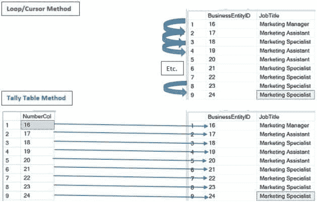

# 阻碍您掌握 SQL 的一个因素

> 原文：<https://simpleprogrammer.com/mastering-sql/>

软件开发现在很受欢迎，至少在接下来的几年里会如此。平均薪酬很有竞争力，进入门槛很少。

数据库编程和开发是软件开发的重要组成部分。大多数开发人员需要访问大型数据库，而 SQL 是数据库编程语言——这解释了为什么 [SQL 是当今十大最流行的编程语言之一](https://www.inc.com/larry-kim/10-most-popular-programming-languages-today.html)。

如果软件开发，尤其是 SQL 开发，是一个如此欣欣向荣的领域，有如此多的机会，那么为什么还有这么多的开发人员没有掌握 SQL 呢？

许多编写 SQL 的开发人员没有掌握它的唯一原因是**他们没有掌握基本的基础知识。**

[https://www.youtube.com/embed/kZxFq7VBhXI](https://www.youtube.com/embed/kZxFq7VBhXI)

More specifically, **they do not adequately understand the theory behind the language**. You can’t claim to master SQL if you don’t first have a firm grasp of its foundation.

由于对软件开发人员的需求不断增加，许多开发人员面临一个共同的问题，通常被称为“雇主期望开发人员必须成为所有方面的专家”这种期望，加上对开发人员的高需求，创造了开发人员必须尽快了解大量信息的环境。因此，如果他们不能很快理解一个概念的价值，他们就会跳过它或者投入很少的时间去学习它。

SQL 语法、实际数据、关系数据库管理系统(RDBMSs)以及如何有效地使用辅助的第三方工具(即 Redgate、ApexSQL、SentryOne 等软件产品)。)都被视为 SQL 开发人员实用而重要的技能。在这些领域变得更有竞争力的方法已经在行业中被广泛讨论。

另一方面，这个理论很少被提及，花费大量的时间和精力在它上面也很少被认为是实用的。

我的一个亲身经历强调了为什么理论知识如此重要:

一位养狗人曾经告诉我，在 20 世纪 90 年代末，在迪士尼发布动画电视剧《101 只斑点狗》之前，经验丰富的养狗人通常是这种狗的唯一供应商。电影上映后，对斑点狗的需求飙升，许多人因此成为养狗人。

不幸的是，饲养者和他们的顾客都陷入了购买和出售斑点狗的“炒作”中，而没有真正关心饲养和照顾这些狗的过程。当人们出于错误的原因去做一些事情时(比如繁殖和养狗以快速获利)，通常情况下，过程和最终结果的质量都会受到严重影响。正是因为这个原因，美国斑点狗的基因和行为已经下降。

数据库架构师、开发人员和管理员可能与养狗者没有太多的共同之处，但是如果没有系统的、注重质量的思维模式，从事这些职业将会导致严重的问题。对于 SQL，所有开发人员都应该知道的理论是关系模型。Itzik Ben-Gan 和 C.J. Date 指出，这一概念是 SQL 的重要基础，但它也是一个看似困难的概念，许多数据库专业人员缺乏足够的知识。[【1】](#footnotes)

此时，您可能想知道为什么对关系模型理解不足是一个问题，以及您是否需要关注它。

如果您使用 SQL，您需要理解关系模型。考虑到性能在 SQL 开发的各个方面的重要性，理解这一理论将允许您利用小的性能机会，并避免大而昂贵的问题。

我将向您介绍关系模型的主要组件。通过简明地介绍这些理论概念，解释其实际含义，并提供例子，我想你会发现学习它是非常值得的时间投资。

## SQL 的理论基础

编程背后的理论概念很重要，尤其是对于 SQL，因为它是最自然地与数学兼容的编程语言。

关系模型建立在谓词逻辑和集合论的结合上。因此，理解关系模型需要首先理解数学和逻辑中的相关理论和框架。

出于本文的目的，我们将把我们对谓词逻辑和集合论的讨论限制在它与关系模型的关系上。

此外，与我们的讨论相关的所有概念都被修改过多次，所以我建议将最新的定义与原始定义进行比较，以便理解它们的核心要素，并针对批评为自己辩护。例如，集合论有一个相反的论点，它出现在几乎每个关于这个主题的深入讨论中，叫做“罗素悖论”[【2】](#footnotes)

### 谓词逻辑

先说谓词逻辑。**谓词逻辑**可能是关系模型中最直观的部分，至少在基本层面上是如此。史蒂夫·卡斯恰如其分地将谓词逻辑描述为:“一个用于表示和操作真或假的表达式的数学框架:事实或虚假。”该框架的一些关键组件包括命题、谓词和逻辑运算符。这些术语可以定义如下:

1)命题是真或假的陈述。

2)谓词是包含一个或多个变量的命题(例如，表达式 a < 5 is a predicate that contains the proposition *a*

3)四个最基本的逻辑运算符，否定(~)，合取(∧)，析取(∨)，conditional(⊃ or →)用来组合命题。

这里，与 SQL 类似的东西存在于语言的控制流元素中。然而，SQL 中的控制流逻辑并不是关系模型中更难掌握的部分。正如我们将在后面看到的，大部分的困惑都与集合论有关。[【3】](#footnotes)

### 集合论

也许你认为谓词逻辑对你来说是天生的。在您的 SQL 开发生涯中，您可能经常听到“set”这个术语，以至于您可能认为您已经知道它的意思了。例如，查询返回“结果集”，而不是“记录列表”(至少，在关系型使用 SQL 时不是这样)。

如果这些假设描述了你目前的想法，那么你要做好准备，因为这并不像你想象的那么简单。

集合论更难有两个原因。与谓词逻辑不同，将集合论问题翻译成英语更加困难。如果您不同意，那么计算您必须排除的控制流错误的数量，并与查询的错误数量进行比较。也可能是这样，我们自然地从个体的角度而不是群体的角度来思考问题。无论原因是什么，我都谦恭地建议你更有条理地研究集合论。

**集合论**是:“[…被称为*集合*的确定集合的数学理论，这些集合的对象被称为集合的*成员*或*元素*。“成员”和“关系”这两个概念是集合论的基本要素。关系是集合的数学表示，成员关系描述了集合元素的关系。](https://plato.stanford.edu/entries/set-theory/)

集合是其他集合的成员，没有顺序，并且不允许空值。集合成员表示为 *x* ∋ *y* ，翻译过来就是“ *x* 是 *y* 的成员。”

其中一个集合称为“空集”，是没有成员的集合。(由于空集在数学上只有一种表示方式，所以指代空集时用冠词“the”比用“a”更正确。)

请注意，空集演示了集合理论中谓词的使用，这在我们处理无限集合或太大而无法列出所有值的集合时非常重要。集合论的其余部分将更有意义，因为它是通过关系模型的上下文来解释的。

与其他编程语言相比，集合论更容易应用于 SQL，因为它的结果集可以在没有相应的执行计划的情况下描述；换句话说，语言的声明性比命令性语言更有利于数学理论的应用。

### 关系模型

定义关系模型需要定义数据模型，数据模型“是数据结构、数据操作符等的抽象自包含逻辑定义，它们共同构成了用户与之交互的抽象机器。”[【5】](#footnotes)关系模型最初是由 Edgar F. Codd 于 1969 年在其研究报告《存储在大型数据库中的关系的可导性、冗余性和一致性》中定义的。因为我发现他的修订版“[大型共享数据库的数据关系模型](https://www.seas.upenn.edu/~zives/03f/cis550/codd.pdf)”非常有帮助，所以我将引用两句话来总结报告的大部分内容。

我们可以将**关系模型**定义为:“基于 n 元关系的模型，数据库关系的范式，通用数据子语言的概念……对关系的某些操作(除了逻辑推理)进行讨论，并应用于用户模型中的冗余和一致性问题。”[【第六期】](#footnotes)

这里有很多东西需要打开。C.J. Date 在“SQL 和关系理论”中讨论了 *n 元*关系的概念，以澄清常见的误解，即符合关系模型的数据库不限于二维。

“范式”概念的引入可能是你非常熟悉的一个概念(虽然，不是在正式的意义上)。Codd 引入了标准 1-NF、2-NF 和 3-NF 之外的几个范式(即，分别是第一、第二和第三范式)，但是对于我们的目的来说，请注意它们是关系模型的关键部分。Itzik Ben-Gan 对规范化的定义足以满足我们的目的:“规范化是一个正式的数学过程，以保证每个实体都由一个单一的关系来表示。”[【7】](#footnotes)

最后一句包含了对 SQL 的更多直接引用，以及关系模型旨在解决的两类问题。当然，Codd 所说的“通用数据子语言的概念”指的是 SQL。“关系上的操作”这一表述指的是我们所说的集合运算符(并集、交集、截距等。)今天。从纯粹的实用主义角度来看，“冗余和一致性的问题”这句话的含义相当重要；处理空值和重复问题可以追溯到关系模型的定义。

即使在您完全理解关系模型之前，您仍然可以从与重复和空值相关的思想中受益。理论上，这意味着不惜一切代价避免它们；否则，您不是在处理集合，因此无法从数学上保证任何事情。在实践中，这种避免并不总是可能的，我们将在后面讨论更多。

让我们讨论如何应用关系模型成为更好的 SQL 开发人员。

## 关系模型的实际应用

三值逻辑、参照完整性、集合论以及物理模型和逻辑模型之间的故意分离经常令人困惑，值得更多的关注。这些主题也是关系模型被误用或误解的一些最常见的领域，这使它们成为向您展示理解关系模型的实际好处的一个好机会。

三值逻辑是一种改进的谓词逻辑，增加了“未知”真值。Codd 有意将三值逻辑引入关系模型，因为他认为这是必要的违反；这是 C.J. Date 和 Codd 意见不一致的一个关键点。

从实用的角度来看，应该如何决定如何处理空值？这取决于很多因素。报告函数(例如，T-SQL 中的“分组集”)可以使用空值作为一种聚合标记，但是空值也可以指示各种错误。

确保始终使用 COALESCE，并为“CASE”语句中的“ELSE”子句指定一个条件，以避免将表示错误的空值与聚合中预期的空值类型混淆。换句话说，无论空值出现在哪里，都要对其进行寻址，这样您就可以准确地知道它们的含义。同样，C.J. Date 的优秀著作《SQL 和关系理论》更详细地讨论了这个概念，并提供了更多的建议。

然而，对我来说，区分关系模型中的术语“性能”和与物理模型相关的性能是很重要的。我提到的所有作者都描述了澄清这一点的重要性，但是为什么呢？

物理模型或物理实现和相关联的对象(例如，索引)不是数据模型的一部分。虽然理解索引如何工作对 SQL 开发人员来说很重要，但雇主认为有价值的内存的物理管理和数据库的物理实现的所有方面都不适用于关系模型。

本质上，如果您作为数据库架构师和 SQL 开发人员(即数据库开发人员和程序员)来优化逻辑模型，那么您可以最大限度地减少数据库管理员调整物理模型以提高性能的需要。

实现关系模型有很高的性能成本，这就是为什么它不常用在数据仓库或数据集市中。然而，在联机事务处理(OLTP)环境中，引用完整性比性能更重要，这一价值应该通过利用关系模型反映在逻辑模型中。因此，尽可能在任何环境中以关系方式编写 SQL 查询，但是要记住，数据库设计在数据库仓库中更受限制，因为性能比引用完整性甚至规范化更重要。

引用完整性是符合关系模型的数据库的主要优点之一，但是也有一些小的性能优势。回到“无重复”的要求，一般的想法是重复的数据不能准确地代表现实。如果您的目标是在数据库设计中使用数学理论尽可能准确地表示现实，那么您就不必担心在以后的开发中遇到同样多的问题。事实上，这种思想既适用于重复，也适用于前面关于空值的讨论。

例如，如果您能够显著减少指定“DISTINCT”的次数，您能想象查询运行的速度会有多快吗？虽然完全消除重复(在许多情况下)是不现实的，但至少可以在每个表上定义一个主键以确保唯一性。与重复问题类似，您可以通过在所有表的所有列上指定“NOT NULL”来选择另一种关系解决方案。通过减少空值的数量，可以极大地简化优化器执行的工作。

## 基于集合的思维

如果你知道一种面向对象的编程语言，那么你可能对循环非常熟悉。我大胆地猜测，你可以在睡觉的时候写循环——甚至嵌套循环也是小菜一碟。

当我学习 Visual Basic for Applications (VBA)时，我很快就掌握了 For-Each 循环的概念；不管出于什么原因，学习语法很容易。如果您想对一列中的所有记录做些什么，那么只需找到第一条记录、最后一条记录，设置一个增量间隔，然后就大功告成了。

像 VBA 一样，许多开发人员可能认为 SQL 很容易掌握。虽然这些开发人员认为 SQL 是一种“容易”学习的语言，但很少有人意识到为什么它也是一种很难掌握的语言。

解释前者相当简单:它被设计成与英语非常相似。正如我前面提到的，它是声明性的，而不是命令性的。例如，句子“获取今天浏览过我的网站的所有潜在客户的电子邮件地址”可以表示以下查询:

对于本例，让“ProspectEmail”代表用户通过创建网站帐户输入的电子邮件地址。如果该数据库以文件夹和文件柜中的一系列纸张的形式存在，那么该语句可以表示一个人物理地打开一个抽屉，找到标有“LoginInformation”的文件夹，并翻阅文件夹前面的条目(我们可以假设最近的文件放在那里)。

这个例子应该证明 Select 语句的书写顺序(即它们的语法)非常接近我们在英语中构建句子的顺序。

如果与英语相似是 SQL 是一种相对容易学习的编程语言的一个主要原因，那么“精通”它为什么如此困难呢？

还记得我关于 For-Each 循环如何工作的随意解释吗？我忽略了一个细节:为了让循环正确运行，表中引用记录的*顺序*很重要。

DISTINCT 运算符要求优化器对记录进行排序。与 DISTINCT 一样，循环要求优化器对记录进行排序，这违反了集合的定义。与我们之前讨论 DISTINCT 不同，在 DISTINCT 中，通过主键的引用完整性强制，可以在表定义级别强制实现唯一性，从而最大限度地减少 DISTINCT 的使用，而对于循环，没有类似的解决方案。

在进入解决方案之前，值得探究一下开发人员如何以及为什么会陷入过度使用循环的陷阱。

关系模型要求理解集合论和谓词逻辑。每当您想出一个循环作为问题的答案时(在 SQL 上下文中)，这通常意味着您在考虑查询中的单个记录。从这个角度来看，一次一行地遍历一列中的所有记录是非常自然的。

不幸的是，当您开始处理更大的数据集时，您会很快意识到为什么这不是一个可伸缩的方法，并且您需要找到一个更好的替代方法，因为性能下降会越来越痛苦。

借用 Itzik Ben-Gan 的一句话，“基于集合的思维”是最终决定你是否理解 SQL 的理论基础(即关系模型，尤其是集合论)的特征。从集合的角度考虑意味着您通过可视化您想要处理的整个数据集合(或集合)来编写 SQL，并在编写 SQL 时考虑到整个集合。

一般来说，如果您正在使用循环，那么这意味着您正在考虑集合中的单个对象，并试图在记录级编写 SQL。这种观点(没有双关语)根本不是 SQL 的设计目的。

为了用一个更清晰的例子来说明我的意思，让我们来谈谈计数表，以及一旦你达到了某种基于集合的思维水平，你如何有效地使用它们。

## 计数表的力量

让我们回到我在 LoginInformation 表中最初假设的潜在客户电子邮件示例。想象一个人从存储器中取出记录，并将该图像与优化器处理循环的方式联系起来。

现在可视化你的整个数据集；这是您想要更新的潜在客户电子邮件地址列表，因为所有这些潜在客户都属于一家正在更改名称的公司，这需要在电子邮件地址中得到反映。

与其考虑手动修改表中的每条记录，不如将这些记录视为一个集合。首先，创建一个所谓的[计数表](http://www.sqlservercentral.com/articles/T-SQL/62867/)，它是一个简单的数字表。然后用 select 语句替换游标，通过它传递一个参数，并包含一个替换计数器变量的 where 子句。[这篇文章](https://dwaincsql.com/2014/03/27/tally-tables-in-t-sql/)详细介绍了创建和使用计数表的不同方法。

可视化游标或循环解决方案与计数表解决方案之间的区别的一个有用的方法是考虑优化器在一般级别上做什么。

DML 语句(插入、更新、选择等)的可视化表示。)

对于此图，我使用了 Microsoft SQL Server 2014 Express Edition 中的 AdventureWorks2014 示例数据库，并编写了一个查询来选择所有包含“marketing”的职位及其对应的 BusinessEntityID。为了澄清关于图像的一点:“计数表方法”部分中的箭头并不表示优化器同时读取所有这些记录。它认为 BusinessEntityID 是一个集合或集合，而不是要迭代的单个对象。

优化器优化循环或游标解决方案的能力是有限的，因为它最终必须根据您指定的迭代次数和位置迭代所有代码。

在一篇关于 SQL Server Central 的优秀文章中，Jeff Moden 解释了为什么计数表更优越，尤其是在性能方面:

计数表方法在持续时间、CPU 时间和行数方面胜出。它在阅读中失败，这让一些人感到困扰，但它不应该。计数表方法如此有效的部分原因是因为计数表的一部分被缓存，这些是从内存中的“逻辑读取”。如果你觉得这些差别很小，那就乘以一万或者一百万，看看差别有多大。如果你想要性能，停止使用循环，开始使用计数表。

因此，符合关系的 SQL 对*逻辑*处理的积极影响使优化器能够改进*物理*处理，这是任何计数表解决方案优于游标解决方案的情况。

## 结论

SQL 理论基础的复杂性，尤其是在关系模型和集合论中，在没有任何明显好处的情况下，似乎特别难以学习。通过详细浏览关系模型，并讨论谓词逻辑和集合论如何支持这个概念，您可以更好地理解 SQL 的这个关键基础。

然而，更广泛的教训是，牺牲我们的教育质量来追求技术潮流的领先是适得其反的。巨大的行业压力使得抄近路、只学你需要知道的东西变得很有吸引力。

然而，当谈到学习理论时，我认为重新考虑你在技术教育方面的时间投资决策是明智的。一旦你考虑到它的长期影响，理解实践背后的理论将提供比成本更大的收益——特别是对于 SQL 开发人员。

* * *

### 脚注

[1] I very deliberately chose to describe the relational model as “foundational” and “deceptively difficult” because it is both the most widely used model for databases and perhaps the most misunderstood database concept. See C.J. Date’s “SQL and Relational Theory” for more details – especially Appendix F.

[2] Akihiro Kanamori. “Logic and Paradox.” *Set Theory From Cantor to Cohen*. Department of Mathematics, Boston University. 16-18, Print.

[3] Ben-Gan, Itzik. “Set Theory and Predicate Logic.” *Inside Microsoft SQL Server 2008: T-SQL Querying.* Ed. Steve Kass, Ed. Ken Jones, Ed. Sally Stickney. United States of America, 2014\. 65-68, Print.

[4] Ben-Gan, Itzik. “Set Theory and Predicate Logic.” *Inside Microsoft SQL Server 2008: T-SQL Querying.* Ed. Steve Kass, Ed. Ken Jones, Ed. Sally Stickney. United States of America, 2014\. 44, Print.

[5] Date, C.J. “Setting the Scene.” *SQL and Relational Theory: How to Write Accurate SQL Code.* California, United States of America, 2015\. 15, Print.

[6] Codd, Edgar F. *A Relational Model of Data for Large Shared Data Banks*. Ed. P. Baxendale. I.B.M. Research Laboratory, San Jose, California, 1970\. 1, Web.

[7] Ben-Gan, Itzik. “Background to T-SQL Querying and Programming.” *Microsoft SQL Server 2012 T-SQL Fundamentals*. Ed. Kristen Borg, Ed. Russell Jones, Ed. Kathy Krause. United States of America, 2012\. 7-8, Print.

[8] Ben-Gan, Itzik. “Background to T-SQL Querying and Programming.” *Microsoft SQL Server 2012 T-SQL Fundamentals*. Ed. Kristen Borg, Ed. Russell Jones, Ed. Kathy Krause. United States of America, 2012\. 2, Print.