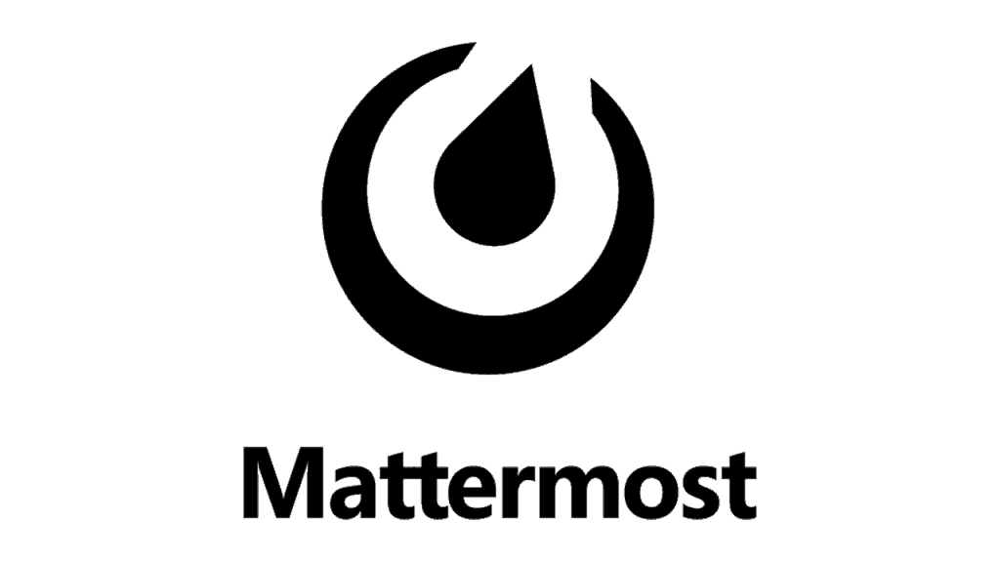
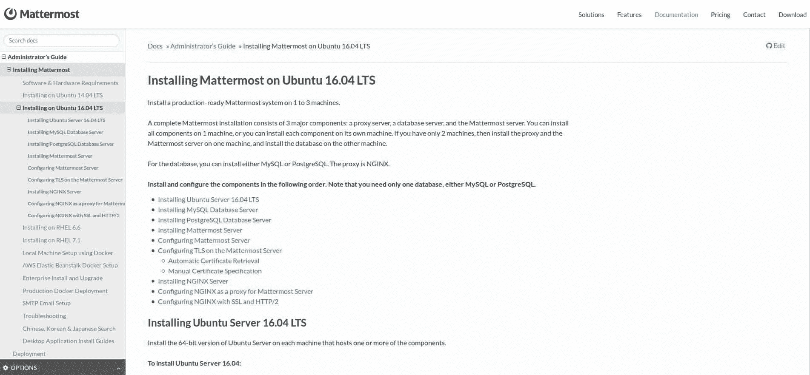
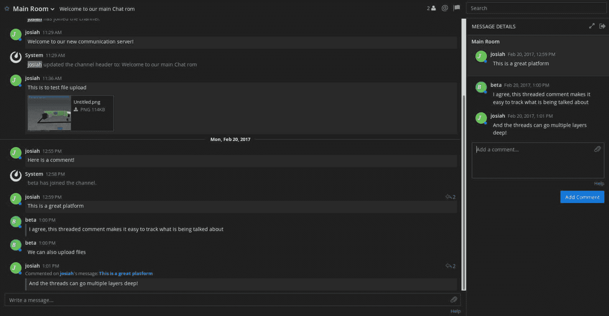
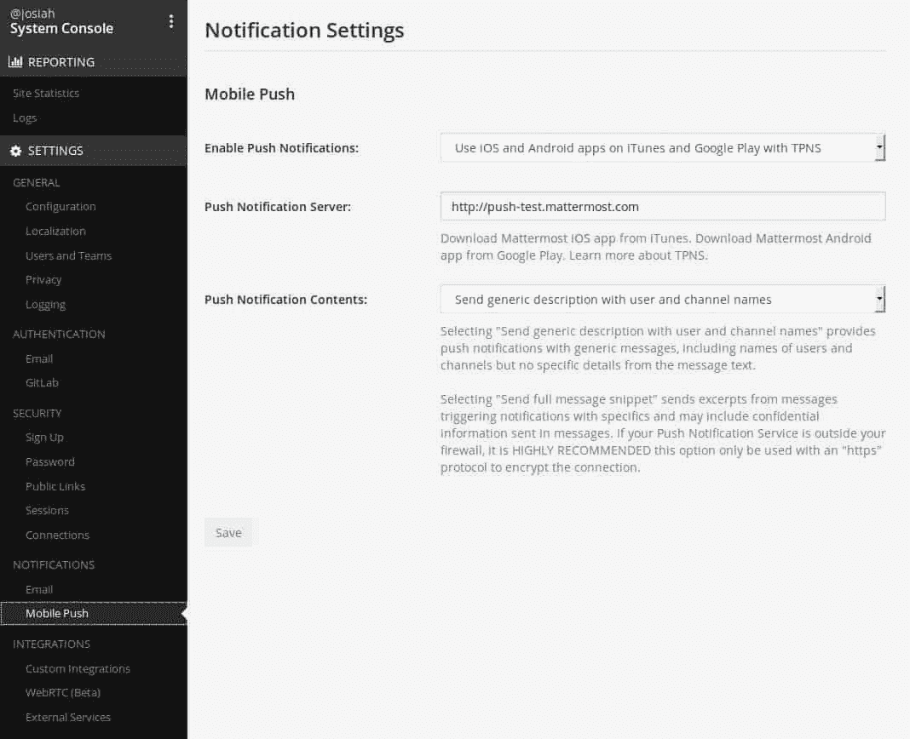

# Mattermost 软件评论

> 原文：<https://simpleprogrammer.com/mattermost-software-review/>

[团队沟通](http://www.amazon.com/exec/obidos/ASIN/1541148363/makithecompsi-20)很重要。没有良好的沟通，项目将永远无法实现其全部潜力。每天，我们都会看到越来越多的远程工作和团队分布在广阔的地理区域。传统的电子邮件不能满足大多数现代软件开发团队的需求。

这就是为什么近年来，新的基于聊天的平台已经成为团队沟通的流行解决方案。

Mattermost 是一个开源解决方案，旨在为其他软件即服务(SaaS)平台提供替代方案。

在寻找 [Slack 替代品](http://www.amazon.com/exec/obidos/ASIN/B01B40NCZY/makithecompsi-20)的时候偶然发现了这个软件。我的意图是为我和几个同事正在进行的一个无预算项目建立一个类似 Slack 的交流平台。

在谷歌上搜索了一番后，我决定试试 Mattermost，看看它是否适合我们的项目。

每天，我们都会看到越来越多的远程工作和团队分布在广阔的地理区域。

作为软件开发人员，了解我们良好沟通的选择是很重要的。

有时候，一个不太知名的产品可能比更知名的工具更能满足我们的需求。

## 关于 Mattermost

Mattermost 既是公司的名称，也是它提供的软件解决方案。他们提供了一个类似 Slack 的聊天软件，是为团队交流而设计的。它提供了一个免费的开源版本，以及两个具有高级功能的企业版。

这篇评论将集中在我测试过的开源版本上，不过我也会讨论开源版本和企业版本之间的特性差异。

有两个企业版:E10 和 E20。在撰写本文时，E10 目前的价格是每个用户每年 20 美元。该网站不提供 E20 版本的价格。界面是用 React 写的，后端是用 Go 写的。

在这里，我们将分析这两个版本及其特性，以便不同规模和不同项目的程序员和开发人员团队能够找到最适合他们需求的解决方案。

### 重要说明

虽然[开源](https://simpleprogrammer.com/2016/03/14/why-contribute-to-open-source/)并不总是正确的解决方案，但有时它比其专有的同类产品更有优势。选择正确的产品对于任何项目的成功都是非常重要的，在实现之前，应该始终权衡选择开源替代方案的利弊。

要记住的重要一点是，不能解决你的问题的免费产品不是解决方案。

## 装置

我设置这个的服务器实际上是一个小型的基于 Ubuntu(Mint，确切地说)的桌面，我用它作为测试服务器/家庭影院电脑。它运行 64 位英特尔双核处理器，内存约为 4g。

在开始安装过程之前，我假设我将处理一个基于 PHP 的程序，该程序将被提取到我的 Apache web 目录中，并通过 web 浏览器安装。

我惊讶地发现，它实际上是一个在指定端口上运行的可执行文件。我喜欢这个设计，因为它允许 Apache 为我当前的项目服务，而不会弄乱我的 PHP 配置。

Mattermost 公司提供了一个非常有用的安装指南，对于那些具有中等命令行经验的人来说，这个过程相对简单。他们还有一个可以部署的 docker 映像。

这些指令首先让用户安装 postgres 数据库软件，然后在其中为 Mattermost 信息创建一个数据库。完成这些并配置 postgresql 监听您的互联网协议(IP)地址后，就该下载并配置 Mattermost 软件本身了。

这包括编辑配置文件，使 Mattermost 能够访问您最初设置的数据库。您还可以更改它将工作的端口，如果您的网络管理员出于安全原因阻止了某些端口，这将非常有用。

## 连接

一旦 Mattermost 启动并运行，有几种不同的方法可以使用它。您可以通过浏览器访问它，方法是在地址栏中输入您的服务器地址和端口号，这会将您带到 web 界面。我还下载并测试了 Linux 桌面和 Android 手机客户端。

Linux 桌面客户端基本上是在桌面应用程序窗口中打开的 web 界面。它似乎没有提供任何额外的功能，缺乏实用性。然而，Android 应用程序将网站扩展到了合适的移动设计，并允许我接收关于消息的推送通知。

Mac 和 Windows 桌面客户端也是可用的，虽然我没有测试它们。我确实注意到他们的设计简洁易用。可以创建多个团队，每个团队都有多个聊天室。

具有适当权限的用户可以随意创建或重命名文件室。找到合适的菜单和选项非常简单明了。

任何有聊天程序经验的用户都会发现 Mattermost 与标准聊天界面没有太大的不同。

每个用户可以将 21 种颜色主题应用到界面上，它甚至允许您为代码片段设置语法高亮规则。它还允许你上传自定义表情符号(因为这是你的团队多年来一直在等待的聊天程序)。

## 特征

Mattermost 允许群聊和一对一的消息传递。你也可以通过聊天栏发送文件。大小限制可以由系统管理员设置。一旦个人将文件发送到聊天室，该团队的任何成员都可以在未来的任何时间下载该文件。

它还有一个名为线索聊天的功能，让用户能够直接评论另一个用户的聊天声明。如果你回复了之前的评论，它会在底部插入一个警告链接，打开一个侧边窗口，显示对该评论的所有回复。

当您想对之前对话中说过的话做出回应，而不解释您指的是哪一句话时，此功能非常有用。

它提供了将聊天语句或评论标记为不适合管理员查看的功能。

虽然我没有花时间来设置它，Mattermost 也可以配置成发送电子邮件，这可以用于电子邮件通知和密码恢复。

它支持多种语言，并有一个实验性的视频聊天功能，我没有机会测试。

### 更高的安全性和控制力

我最喜欢 Mattermost 的一个特点是它是自托管的。这意味着，如果互联网关闭，但您的本地网络仍在运行，它仍然可以被办公室的人使用。

此功能还将更大的控制和安全责任交给了本地管理员。与其依赖第三方的网络安全，不如依靠自己的网络安全。

如果您可以访问推送服务，Mattermost 也可以配置为向您的移动用户发送推送通知。如果你没有，你可以使用他们的服务，但是它不提供任何加密，所以除了演示之外不推荐使用它。

说到加密，Mattermost 的开源版本确实允许加密，前提是你有 TLS 证书可以使用。因为它是开源的，所以可以添加新的特性来满足贵公司的需求。

## 管理

该软件具有强大的管理面板。它允许您控制基本的事情，如团队成员和安全设置，同时还让您控制更高级的功能，如电子邮件配置和推送通知。

您可以控制谁在您的服务器上创建帐户，方法是限制允许的电子邮件域或随机生成一个允许在有限时间内注册的链接。您可以限制每个团队的最大人数，也可以控制一对一的消息传递。

该软件具有广泛的日志功能。值得注意的是，Mattermost 默认永久存储所有聊天信息。即使当用户更改或删除他们在房间中的帖子时，数据库也会保存和记录发布的所有内容。

这个特性对于维护团队内部的责任很有用。您可以控制会话长度以及密码重置 salts。我鼓励和支持给用户(和管理员)更多控制权的软件。

Mattermost 的管理面板允许管理员对系统的用户管理和技术方面进行精确的控制。

## 灵活性

因为这个项目是开源的，任何人都可以下载源代码，并以任何方式定制它。这使得 Mattermost 非常灵活，因为它可以定制以满足您的项目需求。

然而，从源代码开始进行修改可能是困难和耗时的，这个问题就是下一个特性如此伟大的原因。

### 与定制编程软件的接口

Mattermost 最吸引人的一个方面(从开发人员的角度来看)是应用编程接口(API)，它允许人们通过自己的定制编程与软件进行交互。这可以用来制作你自己的移动应用程序或桌面客户端。您还可以创建脚本来自动化几乎任何事情。

API 使用基本的超文本传输协议(HTTP)请求来完成动作。您可以使用任何支持 HTTP 帖子的语言登录、创建帖子、删除帖子、更新帖子和进行管理更改。

Mattermost 为他们的 API 提供了大量的文档，并提供了几乎所有特性的示例。

这有助于让 Mattermost 脱颖而出，因为糟糕的文档是开源社区经常出现的问题。

## 企业版

E10 企业版中只提供了七个附加功能，但它们很有用。

其中一些更值得注意的功能包括使用 Active Directory 凭据登录的能力、通过 Mattermosts 推送服务器的加密推送通知、多因素身份验证和第二天业务支持。

E20 版本还提供了更多高级功能，例如专家将帮助您达到合规标准。顾名思义，这些附加功能在具有特定需求的大规模部署环境中非常有用。

大多数中小型企业和团队会发现开源版本满足了他们的所有需求。

## 判决

Mattermost 的优质设计和灵活性给我留下了深刻的印象。

然而，初始安装比我喜欢的要复杂得多，应该只由具有中等 Linux 和网络经验的人来尝试。

Mattermost 成为优秀解决方案的主要使用案例有两种:

*   首先是你是否愿意花时间而不是金钱在你的聊天解决方案上。虽然它不花钱，但与其他软件即服务(SaaS)解决方案相比，它需要更多的时间来设置和管理。如果你想要一个私人聊天室给你的朋友，或者是一个资金短缺而时间充裕的项目，那么你会发现 Mattermost 是一个不错的选择。

*   Mattermost 对于那些渴望或需要一个[私有](https://simpleprogrammer.com/2013/04/22/privacy-is-dead-time-to-prepare-for-the-future/)、可定制、自托管的解决方案的人来说也很突出。因为它是自托管的，所以您可以采取任何必要的措施来确保您的隐私。

这第二个特性对于那些必须满足健康保险便携性和责任法案(HIPAA)定义的遵从标准的人来说很重要。HIPAA 对任何处理医疗数据的公司都有广泛的规定。

还有一些政府机构将从自托管选项中受益匪浅，因为它们也有特定的安全需求，而第三方提供商并不总能满足这些需求。

即使互联网中断，您也可以在本地网络上访问它。

如果您需要大量定制或自动化您的聊天解决方案，那么可用的源代码和 API 将使这成为可能。然而，对于大多数其他用例来说，Slack 的快速设置、易于管理和完善的移动应用将弥补其月费。

Mattermost 源代码可从[这里](https://github.com/mattermost/platform)获得。编译后的二进制文件可以直接从 [Mattermost](https://about.mattermost.com/download/) 下载。