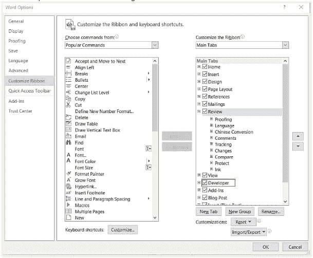
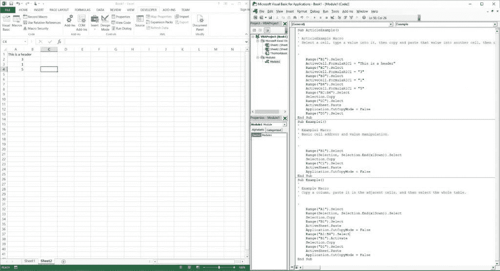
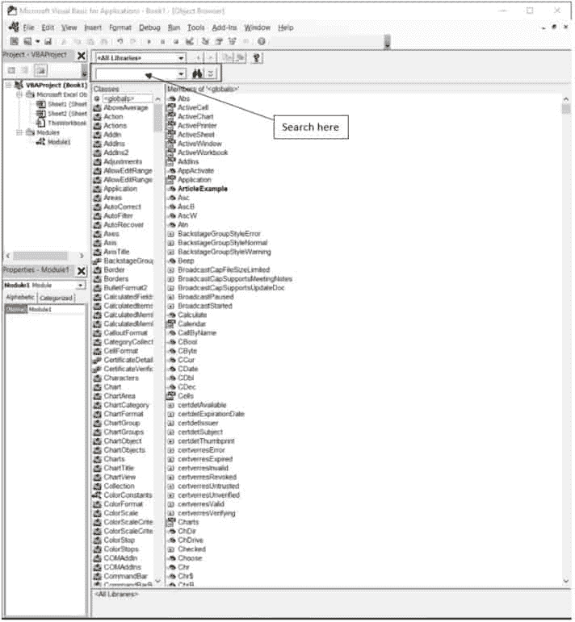
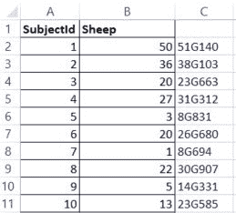
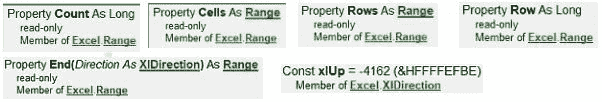
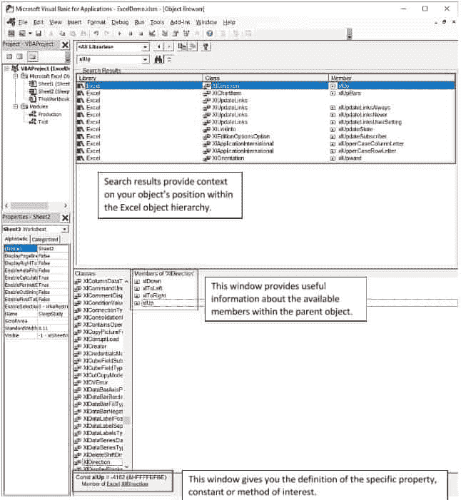

# 利用 VBA 最大限度提高您的效率

> 原文：<https://simpleprogrammer.com/maximizing-efficiency-vba/>

无论您是通过 Outlook 发送电子邮件，在 Word 中记录您的工作，在 Excel 中整理一些表格和图表，还是使用 PowerPoint 创建演示文稿，有一个通用技能可以让您在这些应用程序中做几乎任何事情时都更有效率:学习 Visual Basic for Applications (VBA)。

VBA 是一种编程语言，主要用于允许用户在 Microsoft Office (MS Office)产品中自动执行重复性任务。

“但是亚历克斯，”你说，“学习 VBA 听起来像是一件很大的工作。我怎么知道会不会有回报？”

考虑到快速的技术创新、日益增长的自动化趋势以及对理解大数据的日益增长的需求，难道您不愿意将时间花在工作中更复杂和更重要的部分，而不是输入数据条目或格式化一些 word 文档吗？

如果你知道如何自动化你自己的工作，你认为自动化会是一个额外的收获，而不是对你的威胁吗？你不觉得你的时间花在分析复杂而重要的商业问题上比花在无脑的忙碌工作上更好吗？

如果你对这些问题中的任何一个大声回答“是”，那么 VBA 正是你想要的。如果没有，那么现在就停止阅读，重新格式化该表，并第一千次输入相同的 V 查找。

闯入编程世界有点像开始在健身房锻炼；一开始会很累很沮丧，可能需要一段时间才能看到你满意的结果。

虽然我不能帮助你锻炼，但我已经学会了 VBA(艰难的方式)，我在这里分享我学到的东西，这样你就不必经历我不得不经历的挫折。

学习任何编程语言都会耗费大量的时间和金钱，这取决于你如何对待它。对于大多数初学者来说，VBA 是最好的语言，因为就时间和金钱而言，它提供了学习编程语言最有效的方法之一。

**我们将讨论**利用自学方法学习 VBA 的一个具体策略。

通过 VBA，我发现了对编程的兴趣，并意识到通过学习一些其他编程概念，我可以在工作中变得更加有效。你不需要成为一个成熟的软件开发人员来学习和欣赏 VBA 的使用。

把 VBA 想成金融:“如果我学一点金融，那么我需要成为一名金融顾问吗？”不，但这些知识肯定会对你以后的职业生涯有所帮助。VBA 也是如此。

然而，如果你真的想成为一名开发人员，尤其是如果入门是一项艰巨的任务，那么 VBA 可能是一个完美的切入点。无论你是一个普通的 Excel 用户，初级程序员，还是有经验的程序员，学习 VBA 都有好处。

## 怀疑？

学习 VBA 值得花时间投资吗？首先，它可以让你提高 99%的工作效率，这些工作可以在 Excel 和其他微软办公软件中完成。

例如，让我们看看鲍勃。他是一名业务分析师，大部分时间都花在数据输入、制作数据透视表、V-lookup 以及使用简单的公式管理客户的财务数据上。Bob 真的很喜欢这份工作，但有时他会因为需要花在数据输入上的时间而感到沮丧。他通过 FTP 从客户的 RDBMS 获得一个文本文件中的相同报告，然后 Bob 在 Excel 中打开它，必须重新组织数据，然后在开始分析之前重命名一些列。

VBA 会让鲍勃的生活更轻松，因为他可以自动完成这些任务，只需点击一个按钮。鲍勃肯定会说学习 VBA 是值得的。

无论您是创建函数并将其分配给热键，还是完全自动化将原始数据转换为带计算的格式化表格的过程，VBA 程序员都有大量的机会来节省大量的时间和金钱。

当我开始使用 VBA 时，我的工作变得有趣多了，回报也成倍增加，我也成为了一名更有价值的员工。

例如，随着我的数据和业务知识的增长，我能够在我当前的角色甚至在其他部门找到业务问题的解决方案。

VBA 是一个绝佳的机会，你可以接受任何非编程的工作，并把它变成一份工作，同时通过立即运用你的编程技能给你的老板和团队留下深刻印象。对于有经验的程序员来说，这是一个额外的工具，可能是解决某些问题的最快方法，并允许您真正最大限度地提高您所接触的任何 MS Office 产品的投资回报。

如果您已经掌握了至少一种编程语言的高级知识，并且有兴趣了解如何定制 MS Office 产品，或者有兴趣教别人如何开始编程，那么您将从本文中的信息中受益匪浅。

如果你是初学者，你可能会想:为什么不直接跳到我想学的编程语言呢？"

我对此的回答既简单又重要:通过首先学习 VBA，您可以*立即*看到您的代码在做什么，并观察它操纵您已经熟悉的对象(假设您以前使用过 Excel)。

最后，对于所有微软的批评者和那些出于任何原因认为专注于 Excel 不是一个好主意的人，请考虑以下情况:**大约[81%的企业使用 Excel](http://www.excel4business.com/resources/research-into-excel-use.php)** ，这意味着 Excel 不会很快消失。[你在这篇文章中学到的任何东西都可以帮助你在其中一家企业找到工作](https://www.youtube.com/watch?v=wZ8mtt3kYjA)，因为运用这些技能会让你在更短的时间内完成更多的工作，这让你成为一名有价值的团队成员。

或者，如果您使用 Microsoft Outlook、PowerPoint、Word、Access 和 Visio，那么您可以应用此处的大多数概念，这些概念并不特定于 Excel 对象层次结构。你使用这些应用程序越多，你就越有可能找到使用 VBA 解决实际问题的方法。考虑您当前的角色、业务需求和 Microsoft Office 产品功能。

现在问自己一个任何 VBA 开发者都应该问自己的最重要的问题:“我在做什么重复性的工作？”

## 要求和准备

在开始编写 VBA 之前，您可能应该考虑一下需求，并习惯于理解是什么使得问题与 VBA 兼容。

假设您已经知道如何进行 V 查找，并且知道如何嵌套“IF”函数。你的老板让你分析一份 CSV 格式的临时报告。他希望您核对数据，看看有多少来自客户端的记录与更新后的工作表中的记录相匹配。

您知道如何通过 Excel 手动完成这项工作，但是分析和协调是时间敏感的，您需要快速得到答案。您使用的是 Excel 2010 和 2013(这很好，因为 VBA 与 2010 年后的 MS Office 配合得最好)，并且您知道客户每天使用报告工具直接从他们的数据库中提取数据。

所有这些关于这个问题的细节表明，你的任务就是我所说的“VBA 友好型”换句话说，用 VBA 编写代码可以解决流程中涉及的大部分步骤，如果不是全部的话，原因如下:

1.  流程“存在”于 Excel 中(即所有手动任务都在 Excel 中执行或可以在 Excel 中执行)
2.  您了解如何使用 Excel 中的现有功能(例如，V-Lookup 函数)来执行任务
3.  该过程不需要跨域 [2](#footnotes)
4.  您可以访问所有必需的工作表和文本文件 [3](#footnotes)

提前知道优先级通常是个好主意。这是一个需要快速完成并可能在以后进行微调的项目，还是考虑尽可能多的潜在错误更重要？

因为您是唯一的用户，并且您了解手动过程，所以增量自动化它没有风险。因此，您可以构建代码来反映手动步骤的时间顺序，并在有时间时对它们进行处理。在编写了主要的代码块并对其进行测试之前，没有必要完全自动化这个过程并加入表单和错误处理。

如果您与其他用户打交道，那么最好向他们询问包含其工作簿的文件路径、他们更新工作簿的频率以及决定更新的因素(例如，外部客户端更改报表中的列数)。

你还必须清楚变化；如果您硬编码任何值，那么让用户知道，如果他们在您不知情的情况下做出影响您硬编码的值的更改，您的宏将无法正常运行。

最需要关注的一个最重要的话题是:“流程的哪些部分应该保持一致？”请务必在时间表中记录影响流程的任何因素。一周中的某些日子或时间会影响流程吗？假期呢？你不希望因为一个用户在假期后的第二天添加了一个额外的专栏而被追捕，这个假期搞砸了一个糟糕的计划工作，该工作现在正在失败。

## VBA 解决方案选项

在清楚地定义了问题是什么并理解了它的背景之后，你需要决定你想要创建什么类型的 VBA 解决方案。VBA 语言可以存储和编译为两种类型的代码之一:函数或子程序。

函数本质上是一个代码块，在理想情况下，它通过接受参数并返回结果来解决一个非常具体的问题。把它想象成一种创造你自己的“总和”或“VLOOKUP”的方式例如，Excel 自带的所有现成的系统函数说明了理想函数应该做什么以及如何使用它们。

在决定是否创建自己的函数时，考虑缩小希望它接受的参数类型，并将其与现有函数进行比较。然而，对于本文的大部分内容，我们感兴趣的是 Sub 过程。

Sub 过程基本上是由一行或多行代码组成的代码块。您可以编写一个包含单行代码的 Sub 过程——事实上，我鼓励您这样做来测试代码(这对我很有用)。

一般来说，你会发现函数和子程序的主要区别在于子程序更加灵活和复杂，而函数应该服务于一个非常具体的目的。

Sub 过程是本文的重点，也是您在 VBA 可能会用到的大部分内容。宏是一种存储和执行子程序的方法，更广泛地说，宏是一种将输入参数映射到输出参数的方法，通常用于自动化工作。

Sub 过程是我们将在 VBA 使用的格式，用来编写 Excel 应用程序可以理解的宏。你可以记录宏，就像我们马上要做的那样，看着宏记录器在你眼前编写 VBA 代码。

现在您已经有了一些基本的上下文信息，让我们实际开始吧！

## 录制您的第一个宏

1.  **Enable your Developer tab** by navigating to **Options – Customize Ribbon**. In this particular example, I am using MS Word, as indicated in the upper-left corner. (All MS Office applications have the same style of window, though.) Then check the “Developer” check box in the lower-right corner of the new window:

    

2.  按“Alt + F11”调出 VB 编辑器窗口。
3.  Drag this window to your second monitor. If you do not have a second monitor, split your screen in half so that you can see the open Worksheet on one side and the VB Editor on the other, like this:

    

4.  单击“记录宏”按钮，给它一个名称，然后在 VB 编辑器的对象资源管理器浏览器中找到工作簿名称，并确保“Module1”已被选中并打开。
5.  复制和粘贴，在单元格中键入值，然后在打开的工作表上输入公式和批注。当您执行这些任务时，您可以实时看到代码出现在 VB 编辑器中！这是向您介绍一些基本的面向对象编程(OOP)概念的最简单的方法之一。

您可以随意使用宏记录器一段时间，手动执行所有典型的 Excel 任务，这样您就可以了解它如何将您的操作编写和解释为 VBA。

请记住，记录器编写 VBA 的方式有几个缺陷，当你查找更有经验的 VBA 程序员编写的代码时，你会发现这些缺陷。更具体地说，我认为您在学习宏记录器编写的代码时应该考虑几个要点。

1.  **避免使用“选择”方法和“选择”属性。**当你记录动作时，很难避免在没有选择对象的情况下了解它们。在 VBA 中，使用 select 方法会增加所引用对象的数量，从而导致性能下降。你的代码也因为混杂了不必要的对象而变得难以阅读。
2.  它经常求助于硬编码的答案，所以你可能不明白如何将单元格中的值向右移动 2，但它会告诉你如何将值从“A3”移动到“C3”一种解决方法是使用“相对引用”按钮(位于左上角“开发人员”选项卡上“记录宏”按钮的下方)。不幸的是，相对引用通常用不同于更常见的范围的符号来表示。我将要演示的 Cells(#，#)方法。这种“不同的符号”被称为“R1-C1”风格引用，在下面的参考资料中有更详细的介绍。我建议学习它们是如何工作的，但要在理解本文中的其他基本概念之后。

尽管有这些限制，它仍然是一个非常有用的起点，因为它引入了相关的对象和方法。宏记录器足以让你从基础开始。

我实际上是用 Word 中的宏记录器编写了我的第一个宏，然后在阅读了它之后删除了一些不必要的代码行。如果对我有用，那对你也有用。

## 额外资源

在您熟悉 VBA 电码的过程中，以下是补充您所学内容的最佳资源:

1.  进入 https://msdn.microsoft.com/en-us/library/office/ MSDN 网站[并导航至 VBA 版块，或者搜索你感兴趣的关键词。](https://msdn.microsoft.com/en-us/library/office/)
2.  约翰·沃肯巴赫的书《VBA Excel 2013 Power 编程》它对我来说是早期的一个重要的辅助资源，并且保持着它的价值。
3.  在 VB 编辑器窗口中，按 F2 并在此搜索您的对象或方法(参考下面的对象浏览器截图)。
4.  访问[https://stackoverflow.com/](https://stackoverflow.com/)——这里有许多有用的帖子，可以解决常见和实际的 VBA 问题。

在我们编写宏之前，您应该知道对象浏览器是什么样子的，所以它在这里(在 Excel 中):

## VBA 宏示例

这里有一个简单的例子，使用 Excel 2013，通过允许您应用这些概念，应该可以帮助您开始。我会先给你问题，然后在最后给你答案。

问题是这样的:在一项睡眠研究中，你有 10 个受试者，他们有一个相应的 ID 和一个 1 到 50 之间的数字，表示一个受试者数的“羊”的数量。出于存档的目的，您希望创建一个新的键，将 ID 链接到这个特定的羊数。将记录编号(为了简单起见，在本例中恰好是 SubjectId)、Sheep 编号、大写字母“G”以及一个随机的三位数组合到 Sheep 列的右侧。

例如，如果记录中统计的羊的数量是 24，那么将 24、大写字母“G”和一个随机的 3 位数连接起来，就像这样:24G132。然后用不同的颜色突出显示新代码 [4 。](#footnotes)

下面是一个示例表(在空白工作簿中手动创建，最好在“A”和“B”列中创建):

好了，知道答案了吗？好吧，这是我的答案:

由于这里发生了很多事情，我将分解它来说明几点:

以下是输出:

注意:上面的“LoopThroughColumn”子过程不是我的第一个工作答案。

这是我的第一个答案(注意，我添加了后缀“_test”，这是一个很好的习惯，可以将您正在处理的答案与您不想冒险破坏的最后一段代码分开):

而且输出和我最后的答案一模一样。让我们浏览一下“_test”版本(如上),以便您理解发生了什么:

1.  首先，在一个简短的注释部分描述代码实际上做了什么，如果需要的话，在下一行(第 2-3 行)使用一个空格后跟一个下划线来继续注释。
2.  然后出于性能原因关闭屏幕更新。复制第 4 行的精确代码。当您处理更大的工作簿和更复杂的代码时，这是一个非常常见和重要的步骤。
3.  声明您认为现在需要的变量，但是在需要时可以随意更改它们(第 6-8 行)。
4.  然后建立宏的作用域——告诉它您希望它在哪个工作表和工作簿上运行(第 10 行)。
5.  创建一个变量来引用我们感兴趣的单个标题(参见第 12 行)。是的，为了简单起见，我对这个例子进行了硬编码。
6.  在任何涉及对表 [5 的列中的单元格执行任何操作的循环表达式之前，编写如第 14 行所示的“FinalRow”公式。](#footnotes)

## 使用对象浏览器

我发现对象资源管理器在这些场景中非常方便，所以我将通过在其中查找这些术语来解释它。下面是我们需要查看的对象资源管理器中所有术语和属性的列表:

在这一点上，我应该快速解释一下 VBA 中对象层次的最高层次，以便将您正在使用的这些对象与相关的理论概念联系起来。

Application 对象是 Excel 类库(以及大多数(如果不是全部的话)其他 Microsoft Office 应用程序库中的最高对象。“Workbooks”是对象的集合，充当 Application 对象的只读属性。

在“Workbooks”集合中存在“Worksheets”集合，该集合具有“Range”属性，该属性具有“Cells”属性。属性可以是方法，也可以是对象。通常，方法是对属性或对象执行的操作。将属性和对象视为名词，将方法视为动词。你现在需要知道的大部分内容都会涉及到这些对象。

## 参考范围

下面是在工作表上完全限定对单元格“A1”的引用的样子:

但这是出于教育目的；如果你想更快地引用单元格“A1 ”,可以这样做:

或者，试试这个:

请记住，只有在该语句之前激活的区域包含带有地址的单元格时，这种引用样式才有效。我以前不得不在自己的宏中排除由于不正确限定 Excel 对象而导致的错误，让我告诉你，这一点也不好玩。

当有疑问时，最好从过于具体开始，因为您总是可以删除对象并在以后进行测试。更多信息请参考微软网站上这篇写得很好的文章[“理解对象、属性和方法”](https://msdn.microsoft.com/en-us/library/office/aa211958(v=office.11).aspx)。

## 计数方法

Count 方法是对 Rows 属性调用的。请注意，单元格和行都是 Excel 应用程序中 Range 类的成员。然后将行数用作单元格地址的行参数，第二个值通常是硬编码的值(除非您有理由将其设为动态的)，因为在大多数用例中，表中列的位置将保持不变。

您选择的数字是右边的列数。然后，使用“xlUp”参数对结果单元格地址调用“End”方法，这基本上将焦点放在我们正在处理的范围中的最后一个单元格上。因为我们只对行的值感兴趣。Rows 属性，允许我们将结果赋给一个整数值。这个解释中值得注意的一点是使用了“xlUp ”,它是一个常量，也是“Excel”的成员。XlDirection”系列。

现在，请记住，知道一些常量集合是非常有用的，这就是一个例子。

顺便提一下，我想强调理解对象资源管理器是多么重要，所以让我们看一个基于上面例子的例子。以下是“xlUp”所有结果的屏幕截图:

## For-Each 循环

接下来，在第 16-23 行，我们有 For-Each 循环。这正是您所期望的:指定一个对循环中的迭代次数进行计数的变量，定义它的起始值，定义它的结束值，提供关于您想要处理什么对象以及想要对它们做什么的指令，然后用计数变量结束循环。

让我们来看一下如何使用循环以及每次迭代都发生了什么，因为您会想要理解这些有用的对象和方法。

“Offset”方法非常有价值，因为它是一种允许您选择相对于现有或以前定义的区域或单元格的其他单元格和区域的方法。在我们的例子中，我将包含“Sheep”标题的单元格分配给一个名为“header”的变量，该变量的数据类型为 Range。

接下来，我提供了获取单元格的 Value 属性的指令，该单元格的行号等于计数器变量加 1，再向右一列，并将其设置为等于计数器加 1，再加上位于“Header”单元格下一行的单元格中的值，再加上计数器的值。

然后，我将“Header”单元格正下方的单元格的 colorindex 属性值更改为 35，这表示深蓝色(线条)。最后，我将大写字母“G”和一个随机生成的 100 到 999 之间的三位数字符串连接到循环的第一部分(第 20-21 行)中计算的值。

## 示例:版本控制的好处

一旦您编写了成功运行并按您的要求运行的代码，那么保存它并开始开发新版本进行优化通常是个好主意。使用 With/End With 结构将“_test”版本与我的修订版进行比较(没有“_test”的版本)。观察下面的代码是如何体现格言“化繁为简”的代码行越少，需要查找和读取的对象和方法就越少，工作量就越少，在某些情况下，甚至简化了控制流逻辑。下面是代码:

四个主要区别如下:

1.  取代码最长的重复引用，放入变量中。在这种情况下，包含我们的答案的单元格(在“Sheep”列右侧的一个)可能存储在一个变量中，因为它被频繁使用。
2.  每当必须对一个对象使用多个方法时，请使用 With/End With 构造。因为我改变了颜色和值，所以这里的差别看起来很小。在更大、更复杂的 Sub 过程中，可读性有相当大的差异——宏记录器使用它们，所以这是您应该习惯使用的另一种结构
3.  将修改 value 属性的两个步骤合并到循环中。它更容易阅读，并且减少了要阅读的代码行。我现在执行简单的计算，并将字符串连接到它的末尾。当您像我一样使用“Variant”数据类型时，Excel 允许在整数和字符串(以及其他)数据类型之间进行隐式转换，从而使这一操作变得简单。
4.  在循环中设置“NewId”值。如果您在循环之后设置该值，那么您的宏将会失败，因为在第一次调用它之前，您没有实例化或定义“NewId”的实例。如果在循环之前设置该值，则宏将运行，但只为新列中的第一个单元格提供新值，因为计数器的值为零，并且在循环开始之前不会改变。

## 提高你的生产力极限，和 VBA 一起成为办公室英雄

VBA 是一种编程语言，商业专业人士、入门级程序员和有经验的程序员都可以使用它来提升他们的职业生涯，特别是通过减少他们花在执行重复任务上的时间。

此外，通过学习 VBA，您会发现自己将所有 MS Office 产品中的所有任务都视为潜在的 VBA 项目，这可能会为您和您的公司节省大量的时间和金钱。

当考虑到过多的免费资源和语言的简单性(例如，相对于 Python 或 C#)时，当您关注应用编程知识来帮助您当前的工作时，它也应该是一个很好的选择。

现在你可以为那些浪费时间重复同样无聊任务的临时 MS Office 用户感到遗憾了！

* * *

### 脚注

1.  出于保持简洁的目的，客户的特别 csv 报告和您的工作表之间的数据分析和协调将被称为“过程”
2.  换句话说，在此过程中，您不必登录到另一台机器来了解数据点之间的关系。如果您的系统或网络管理员有足够的带宽，那么在更新您的代码以解决计划的密码更新和更改所有相关用户的权限级别时，请随时与他合作。或者，您可以通过在过程中编写特定于每个域的宏来完全避免这个问题。如果这些选项中的任何一个对你都不可用，那么 VBA 可能不是这个问题的最佳解决方案。
3.  TXT 或 CSV 文件可以转换成 Excel 工作簿(XLS 文件)
4.  如果你想知道为什么我包括了颜色编码的要求，把它看作是学习更多对象的一个简单的方法。
5.  “FinalRow”公式是我在另一本优秀的 VBA 著作中找到的，[“VBA 和宏:微软 Excel 2013”](https://www.amazon.com/Excel-2013-Macros-MrExcel-Library/dp/0789748614)第 82 页，作者是比尔·杰伦和特雷西·西尔斯塔德。这是我在 VBA 用过的最重要的公式之一，因为它允许你动态地找到表格或范围的大小。稍后你会更加欣赏这一点，但现在先感受一下。通过使用“选择”方法将其分解，思考它是如何工作的。实际上，我可以通过帮助您使用对象资源管理器来打破这一界限，从而一举两得。