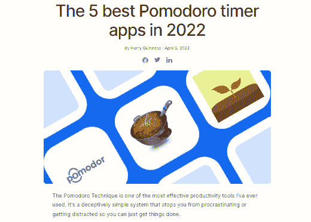
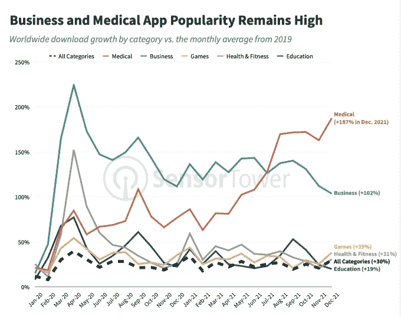
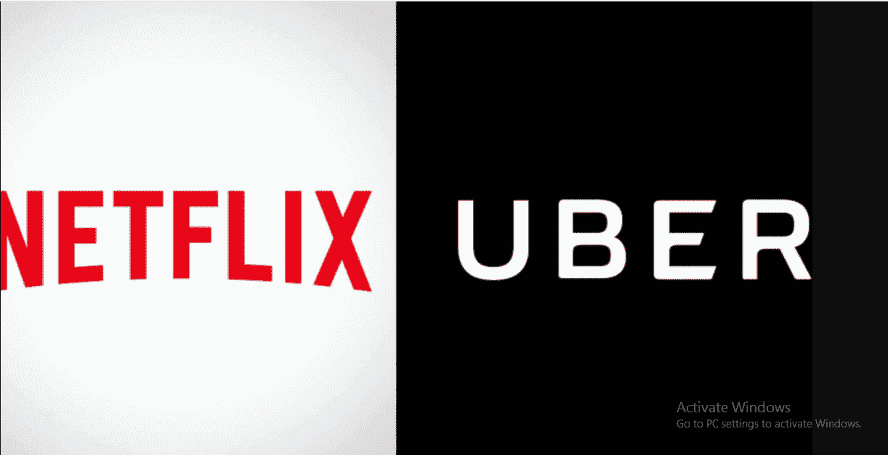
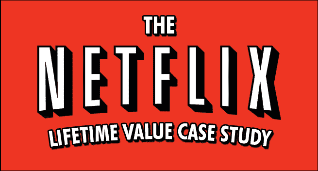
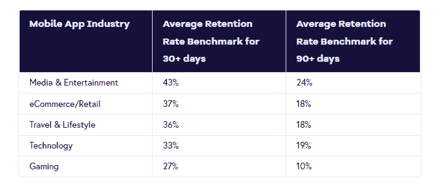
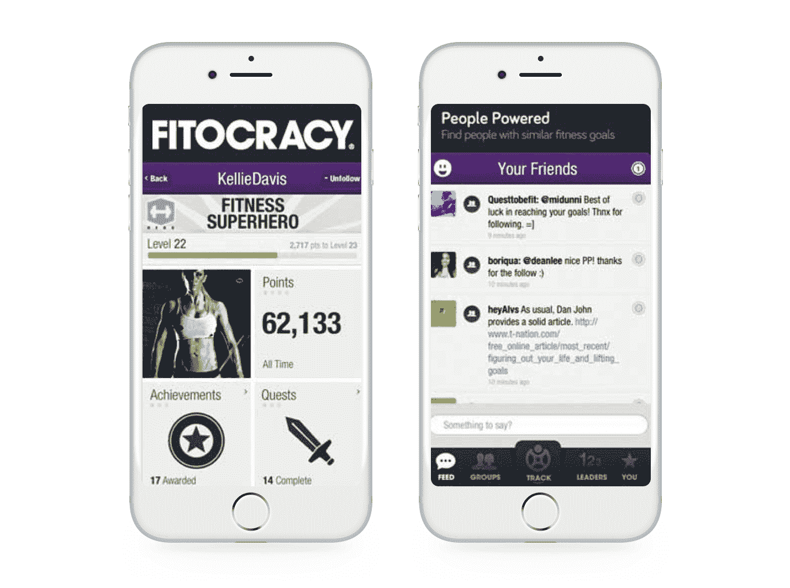

# 衡量移动应用用户参与度的 7 个关键指标

> 原文：<https://simpleprogrammer.com/measure-user-engagement-in-mobile-apps/>

现在，你的移动应用已经启动并运行了一段时间。恭喜你！你现在已经为第二个重要步骤做好了准备:确保你投入到应用程序开发和发布的所有工作都产生了你想要的收入。

移动应用性能指标是衡量应用功能的最有效方式。它们可以帮助您确定阻碍用户体验的问题，以及需要从技术角度进行的改进。

点击、评分或应用下载数量可能无法为您提供足够的数据来有效衡量您的移动应用参与度指标。考虑应用程序的目的、目标和您设定的结果，以确定检查应用程序成功的指标。

以下是帮助您跟踪移动应用参与度和性能的七大指标。

## 1.用户总数

此指标衡量自[应用启动](https://simpleprogrammer.com/social-media-guide-to-launching-mobile-app/)以来，您的应用的累计下载和安装次数。跟踪有多少人经常使用你的应用程序对于衡量你的移动用户获取量至关重要。但是，不能保证因为个人下载并安装了你的应用程序，他们就会使用它。

AppsFlyer 的一项研究发现，28%的应用在前 30 天被卸载。前七天尤其重要，因为 70%的卸载都发生在这段时间内。如果你想让用户把你的应用安装在他们的设备上，你有七天时间让他们相信你的应用提供了价值:

来源: [AppsFlyer](https://www.appsflyer.com/wp-content/uploads/2018/05/3-1024x554.png)

在跟踪用户总数时，您应该检查两件事:

*   下载量:特定时间段内的新下载量；例如，每天、每周或每月。增加下载量的一个方法是发送[封销售邮件](https://hunter.io/blog/sales-email/)。
*   下载归属:你的新用户来自哪里？

了解下载次数有助于评估营销活动的效果。如果你知道你的新用户来自哪里，你也可以确定你应该把你的营销努力放在哪里，以确保新用户的增长。

## 2.活跃用户

这些指标显示了经常使用该应用程序的人数，而不是仅下载该应用程序的人数。它们让你对你的应用程序的增长及其可用性有一个清晰的基线了解。

假设你的活跃用户(日活跃用户、周活跃用户、月活跃用户)一直处于上升轨迹。在这种情况下，这是你的应用健康的标志，因此也是盈利的标志。app 上的活跃用户数应该高于新用户数。这是可取的，因为它表明你的应用程序上有经常性用户。

使用活跃用户指标，您还可以确定营销活动的有效性或无效性。例如，在推送通知活动之后活动用户数量的突然增加可能表明这是有效的。

此外，设法找出你的客户在你的应用上最活跃的日子，因为这是你可以追加销售更高级的计划、提供折扣和独家交易，或者请他们鼓励他们的朋友也下载你的应用的时候。

您还应该查看每个活跃用户的更深入的数据，以开发以转化为重点的活动。这种深入的数据可以是他们的人口统计数据和应用内支出等。

[来源](https://zapier.com/blog/best-pomodoro-apps/)

活跃用户指标还可以帮助您确定其他重要指标，如生命周期价值和保留率。稍后我们将更详细地研究这些指标。

除了推送通知，如果你注意到你的活跃用户指标下降，你可以使用客座博文在其他权威网站上宣传用户可以在你的应用上做什么。

你可以让一个[高质量的客座博文服务](https://authority.builders/guest-posts)来写一篇列表博文，就像上图所示的那样。

## 3.平均会话长度

会话长度是用户打开和关闭应用程序之间的时间段。换句话说，就是 app 上第一次用户活动和最后一次用户活动之间的时间。

要计算您的平均会话时间，将单个会话时间相加，然后除以同一时间段内的总会话时间。

总体而言，根据 [Statista](https://www.statista.com/statistics/243779/total-minutes-spent-on-average-app-by-category/) 的数据，从 2019 年到 2021 年，全球每个用户的平均应用会话长度有所增加。这种增长很可能是由疫情推动的。由于大多数用户呆在家里或在混合工作环境中，应用程序开发人员还不得不转向允许用户远程处理业务的应用程序，如医疗、银行、购物和分类广告:

来源: [TechCrunch](https://techcrunch.com/2022/01/10/how-the-mobile-app-ecosystem-adapted-to-the-covid-19-pandemic-in-2021/)

然而，这些数字不一定是好的或坏的。

虽然当用户在他们的应用上花了很长时间时，应用开发者通常会很高兴，但在某些情况下，他们不会。这是因为有时用户花费大量时间使用应用程序表明应用程序中存在需要解决的问题。因此，你衡量平均会议时长的方式取决于你所在的行业。

例如，网飞受益于让用户花更多时间在他们的移动应用上。它向开发者表明推荐符合用户的偏好。然而，如果用户在优步应用上花了很长时间，就会有负面影响。这意味着用户花费了比必要时间更长的时间来寻找搭车。

来源: [Reporteindigo](https://images.reporteindigo.com/wp-content/uploads/2019/03/impuestos_a_netflix.png_1834093470.png)

您可以通过将所有会话的总持续时间(以秒为单位)除以同一时间段内的会话总数来计算这一应用参与度指标。您也可以通过查看您的移动应用程序分析来找到这些数据。

## 4.会话间隔

会话间隔是指客户使用您的应用程序的两次连续会话之间的时间间隔。说明了你的 app 的“粘性”。获得关于你的应用程序体验是否需要改进的即时反馈是至关重要的。

一般来说，会话间隔越短越好。可以这样想:如果你在使用该应用程序几分钟后就拿起手机在该应用程序上观看 YouTube 视频，这意味着你喜欢使用该应用程序，并且无法将手从它身上移开。

所以，你需要[创建一个应用程序](https://simpleprogrammer.com/mobile-app-development-process-guide-2022/)，这样用户在记住你的应用程序并返回之前会花费更少的时间。了解哪些功能会让用户记住你的应用并形成习惯，将有助于确定你需要关注的应用的关键部分，因为它们会推动用户参与。

使用[提醒邮件](https://respona.com/blog/reminder-email/)让用户回到你的应用。如果你太忙而无法自己创建电子邮件，那就找一家提供优质电子邮件服务的公司来代替你。

会话间隔是应用程序开发人员和营销人员要考虑的客户参与度的关键绩效指标。

## 5.终身价值

终身价值是移动业务增长的核心指标。它衡量用户在使用特定应用程序时总共花费了多少钱。它帮助应用程序开发者和企业主了解他们的盈利情况。

换句话说，终身价值是一个重要的衡量指标，因为它指的是在用户停止使用你的应用之前，你从他们那里获得的总收入。要计算终身价值，您需要:

*   **通过将特定时期的应用总收入除以同一时期的应用购买次数，确定您的平均购买价值**。
*   **通过将特定时间段内的购买次数除以同一时间段内进行购买的唯一用户数，获得平均购买频率**。
*   **用平均购买频次率乘以平均购买价值计算用户价值**。
*   **计算用户寿命**通过获得用户进行应用内购买或总体使用你的应用的平均年数。
*   将平均用户寿命乘以用户值**得到寿命值**。

生命周期价值是一个重要的衡量指标，因为它将帮助你估计你的应用程序未来能赚多少钱，以及你应该愿意投资多少钱。

让我们以网飞为例。据估计，网飞的平均订阅时间为 25 个月。网飞计算出每个用户的终身价值为 291.25 美元。

来源:尼尔·帕特尔

如果你现在注册网飞，你将支付平均每月 11.65 美元的订阅费。12 个月后，你将花费 139.80 美元。

如果你是网飞，你会愿意一次性花 150 美元在一个客户身上进行营销活动吗？我希望你回答是，这就是原因。一个客户在 25 个月内每年花费 139.80 美元，比你一次性花费 150 美元为该客户进行营销活动的收益更高。换句话说，网飞仍然会赚钱，只是短期内不会。

如上所述，终身价值有助于你对应用营销策略做出正确的决定。如果每个用户的用户获取成本高于他们的终身价值，你肯定应该考虑做出改变，因为你只是在赔钱。

## 6.保留率

留存率是指在给定的时间内，通常是 30 天，继续使用你的应用程序的人的百分比。它与用户流失率相反，用户流失率是指停止使用该应用程序的用户的百分比。

要计算应用的留存率，用应用的月用户数除以应用的月安装数。

粘性和留存结合在一起，可以帮助你评估用户对你的应用程序“上瘾”的程度。留住客户的成本低于获得新客户的成本。因此，从商业角度来看，更好的做法是专注于留住而不是获取应用用户。

来源:[壁虎](https://www.geckoboard.com/best-practice/kpi-examples/retention-rate/#:~:text=Industry%20Benchmarks,is%2032%25%20to%2066%25.)

留住一个新的 app 用户并不是一件容易的事情。根据 [Geckoboard](https://www.geckoboard.com/best-practice/kpi-examples/retention-rate/#:~:text=Industry%20Benchmarks,is%2032%25%20to%2066%25.) 的说法，虽然每个行业的数值不同(见上表)，但 app 一般 30 天后留存率为 42%，90 天留存率为 25%。Geckoboard 建议，90 天后保持率达到 25%或更高才算成功。

好消息是，有几种方法可以提高你的保持率。以下是一些建议:

*   **优化你的应用程序的入职流程**。
*   **个性化**用户体验。
*   **实现推送通知**提醒用户你的应用存在。
*   向参与用户提供额外津贴。
*   利用**应用内消息**。
*   不断地**开发、更新和优化**你的应用。
*   使用**游戏化**。

例如，作为游戏化战略的一部分，健身应用 Fitocracy 会在用户完成“任务”和“成就”时奖励他们徽章和积分。它还让用户与那些有相似健身目标的人竞争，让一切看起来像一场比赛。这有助于保持应用程序用户实现目标的动力，并从长远角度推动用户参与应用程序。

来源: [Clevertap](https://d35fo82fjcw0y8.cloudfront.net/2018/06/06013805/Incontent_Fitocracy.png)

如果你没有足够的资源，你不必立刻实施所有这些策略。使用试错法来决定哪种策略最适合你。

## 7.退出率

退出率告诉你人们在访问任意数量的屏幕后离开你的应用的位置。它不同于跳出率，跳出率是指放弃你的应用程序而不参与你的内容的用户数量。

退出率的计算方法是，将访问某个屏幕的总次数除以离开该特定屏幕的总次数。

退出率指标会给你一个最少转换屏幕的概念。本质上，它告诉你什么需要在应用程序中修复。一个屏幕的高退出率可能表明用户没有从中获得价值，或者它不符合他们的期望。

你可以使用营销自动化软件告诉你更多关于每个屏幕的出口总数。要知道用户离开的具体原因，你可以利用可用性测试。

## 是时候让数据滚动了

启动你的移动应用只是实现你的商业目标的第一步。你仍然需要监控应用参与度指标，看看你的应用做得怎么样。

我们已经讨论了应用参与度指标，这些指标将帮助您评估移动应用的性能。检查下载和安装的总次数将有助于您制定策略来吸引当前用户。看看你的活跃用户，了解有多少下载者经常使用你的应用。最后，看看你的终身价值，看看你的客户创造了多少收入。

会话长度和会话间隔将让你一瞥你的观众一旦上了应用程序有多投入。调查您的用户保留率和退出率，以确定应用程序的性能。

根据这些移动应用指标对你的应用进行必要的更改，你的应用用户参与度将会提高。随着时间的推移，你的应用将会走向成功。