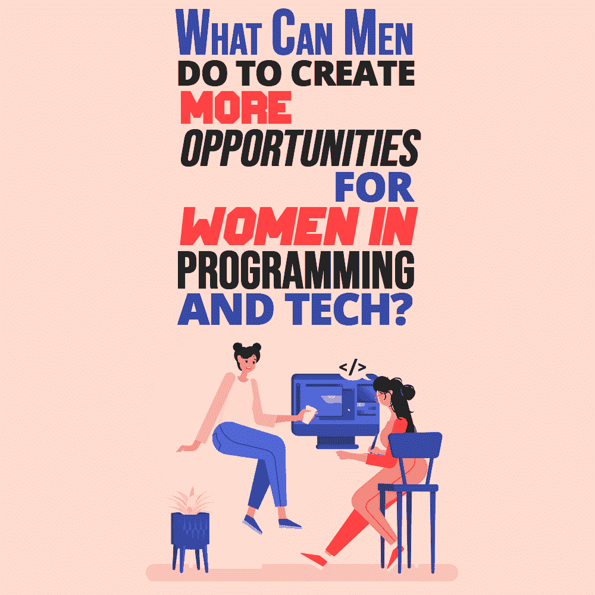

# 男性可以做些什么来为女性在编程和技术领域创造更多的机会？

> 原文：<https://simpleprogrammer.com/men-for-women-in-programming/>

Jobs in the tech industry are in high demand. Businesses are taking advantage of big data analytics and other technologies to increase efficiency and profits. Even companies in other industries are hiring programmers and analysts so they can grow and become more successful.

由于这种高需求，工资也很高。许多职位都需要专业培训，随着学生们发现在科技行业工作的好处，计算机科学课程越来越受欢迎。然而，在计算机科学研究领域，一个主要的性别差距仍然存在——[这个差距可能一百年都无法弥合](https://www.nytimes.com/2019/06/21/technology/gender-gap-tech-computer-science.html)。

几十年来，计算机科学领域的女性面临着一场艰苦的战斗。不管她们的抱负和才能如何，许多女性都被排挤到一边，让位于她们的男同事。尽管业内人士的意识比以往任何时候都强，但这种玻璃天花板一直持续到今天。

尽管有些女性克服重重困难，成功地为自己开拓了一片天地，但她们不应该仅仅因为性别而不得不面对额外的挑战或在晋升上被忽略。男性需要在支持女性同事方面发挥积极作用，帮助她们克服过去的挑战，在编程和技术领域找到更多机会。

以下是科技行业的男性如何成为好的盟友，并在编程中为女性创造机会。

## 计算机科学项目和性别差距

最大的问题不一定是让女性对科技工作感兴趣——许多人对编程和其他专注于科技的职业感兴趣。此外，新的以 STEM 为重点的学校课程开始让更多的女孩对计算机科学职业感兴趣。缺乏兴趣是一个相对较小的问题，随着女孩们被鼓励追求自己的激情，这个问题一直在变得越来越好。

让女性留在这个行业是一个更大的障碍，因为她们每天都面临着性别歧视。许多女性面临着不被男同事重视、性骚扰、工作得不到应有的荣誉等问题。随着时间的推移，这种待遇会让大多数女性疲惫不堪，并可能导致她们离开这个行业，即使她们热爱自己工作的技术方面。

当女性被挤出这个行业时，它强化了让这个问题持续存在的有毒文化，同时也加大了男性和女性之间的总体薪酬差距。在这个行业中，女性仍然被视为不如男性，尽管这在客观上是不真实的。但是这个问题到底有多严重，我们能做些什么呢？

## 技术不平等的后果

很少有女性在计算机科学行业担任领导职务，薪酬差距仍然大得令人无法接受。从整体来看，只有 16%的高层职位和 10%的高管职位由女性担任。这种权力失衡带来了切实的后果，并阻碍了有意义的变革。

领导机会很重要。虽然全国只有 18%的计算机科学毕业生是女性，但至少有一所由女性领导的大学, [Harvey Mudd 在计算机科学、物理和工程领域的女性比例已经达到了 50%](https://www.inc.com/kimberly-weisul/how-harvey-mudd-college-achieved-gender-parity-computer-science-engineering-physics.html) ,这表明女性领导可以成为变革的强大推动力。

数据科学是一个蓬勃发展的领域，越来越多的组织利用他们的数据来提高业务成功。不幸的是，很少有妇女有机会在这一领域取得成功。由于只有 20%的数据科学家职位由女性担任，很明显在数据科学界存在巨大的性别差距。很少有妇女在这一领域担任领导职务，薪酬差距仍然很大。

撇开平等不谈，这种多样性的缺乏可能会带来其他后果。虽然数据本身是完全客观和真实的，但对它的解读绝对不是。只让白人男性提问和分析数据不会允许太多的创新，实际上可能会使差异变得更糟，因为算法经常会写入科学家自己的偏见。

## 男人需要了解什么是性别差异

许多女性都是杰出的程序员——事实上，世界上第一个程序员不是别人，正是拜伦的女儿阿达·洛芙莱斯。没有任何事实依据阻止女性在计算机科学领域茁壮成长，借口也越来越站不住脚。

对于科技行业的男人来说，最容易做的事情就是背离真相。很容易相信，只要你没有直接骚扰或打击你的女同事，你就是“好人之一”但遗憾的是，没那么容易。

男性需要开始变得积极主动，研究性别差距。他们需要扮演一个积极的角色，而不是被动的角色，来改变围绕科技行业女性的 T2 叙事。更多地了解性别差异和[寻找业内女性撰写的内容](http://www.codingwoman.com/blogs-by-women-in-tech/)可以给男性提供他们需要的工具:

*   适当的时候大声说出来。
*   倡导组织政策变革。
*   理解她们的女同事在经历什么。
*   学习帮助女性在科技领域发展的策略。

早就该解决性别差距了。行业中的“破碎的横档”阻止了大多数女性被雇佣，这使得创造更多机会变得更加重要。该行业的男性不能只顾自己的事业，继续忽视女性在计算机科学领域面临的挑战。

## 男性如何帮助提高科技行业和计算机科学项目中的性别多样性

The good news is that there are [lots of ways for men to help](https://www.b2bmarketing.net/en/resources/articles/17-ways-improve-gender-diversity-and-equality-tech-industry-2019) break down barriers and create more opportunities for women in tech, especially those in leadership positions. This is a multifaceted issue that will require concentrated effort over time.

男人应该从审视自己的偏见开始。许多人没有意识到，他们长期持有的错误信念和刻板印象可能会导致他们低估自己的女同事，或者不把她们当回事。检查自己的偏见是一个持续的过程，对减少不平等至关重要。

在科技行业，男性也可以通过指导、倡导同事的想法以及解决可能影响女性员工流动的有害的工作场所文化问题来提供帮助。通常，男性不会注意到这些问题的发生，因为它们不会直接影响他们的工作或生活，他们也不会去寻找这些问题。

积极倾听是一个好的开始。在会议中，男性可以帮助倾听女性同事的想法，并帮助推动他们，而不是抓住一切机会推进自己的议程。此外，开诚布公地提供帮助和回答问题是获得指导的一个好方法，可以帮助这个行业的新女性。例如，当欢迎一位新的女同事时，你应该让她知道如果她需要帮助，你很乐意回答任何问题或澄清一些事情，但不要侵入她的工作空间向她展示“这是怎么做的”

男性还需要愿意公开反对工作场所中有问题的行为和政策。如果男性能够开始评估不同情况下影响女性工作的潜在挑战，他们很快就会发现无数创造更多机会的方法，并永远改变科技行业的面貌。

## 找到成为盟友的方法是我们的责任

女性没有改变行业的责任。几十年来，他们一直在为科技领域的平等待遇而斗争，并为该领域做出了巨大贡献。现在，男人需要站出来，承认他们是问题的一部分。

这不是羞愧的时刻，而是谦卑的时刻。如果人们把自我放在一边，想办法成为盟友，我们将会更快地在科技领域实现真正的平等。女性应该得到的不仅仅是一个席位——她们应该平等地坐在一起，并因为她们在行业内令人难以置信的工作而得到认可。