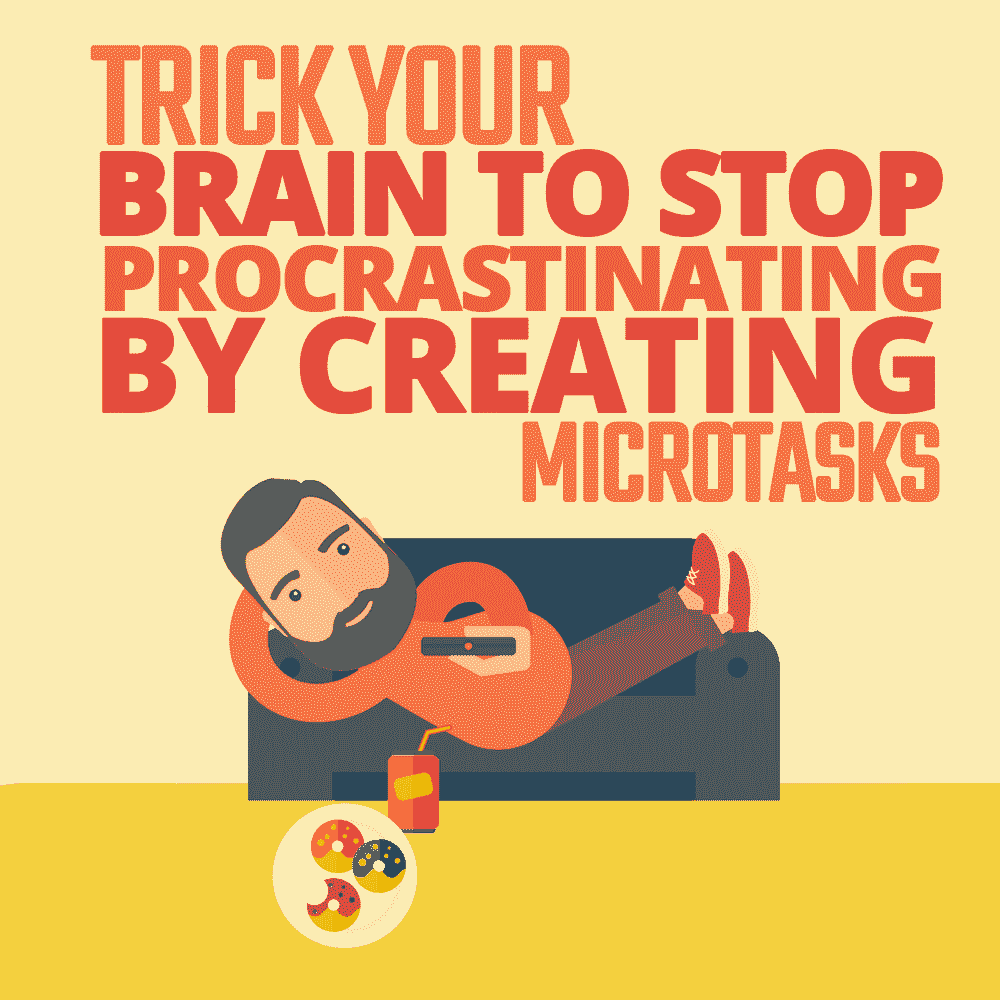

# 通过创建微任务来欺骗你的大脑停止拖延

> 原文：<https://simpleprogrammer.com/microtasks-productivity/>

Every programmer I know, myself included, has suffered from procrastination. It is, indeed, a major problem that plagues the profession.

有时候拖延的欲望会在最令人惊讶的情况下出现。可能编程就是你一直想做的事情。或者你可能正在做一个非常令人兴奋的项目，当你离开电脑时，你无法停止思考这个项目。尽管如此，当需要完成一些实际的编程工作时，你还是会情不自禁地浏览网页或者做一些普通的管理工作。

当这些情况发生时，你可能会开始认为编程已经对你失去了吸引力。你甚至会认为你一开始就选择了错误的职业。

这可能是真的；然而，也不一定是这样。有一个主要的原因可以解释为什么你可能会拖延，即使你正在从事你真正热爱的活动——你面前的任务的规模和复杂性。

当任何给定的任务，尤其是需要脑力的任务，看起来太大或太复杂时，你的身体开始尽一切可能让你逃避工作。这有一个很好的生物学原因。

虽然大脑只占身体质量的 1/50，但它可以使用身体可用能量的 20%。因此，我们身体内部的生理过程试图通过试图引导大脑远离要求过高的任务来尽可能多地保存能量。

这就类似于为什么[增肥那么容易，瘦下来](https://www.menshealth.com.sg/weight-loss-nutrition/one-simple-reason-keep-gaining-weight-after-losing-diet-rebound-advice/)那么难。我们的身体在食物匮乏的环境中进化，因此保存资源和创造储备仍然是我们潜意识行为的一些最基本的驱动因素。

然而，有一个相当简单的方法，你可以欺骗你的大脑，让它认为一项任务非常简单，而不管它的实际复杂性。把任务分成许多微任务，一次只关注其中一项。

## 什么是微任务？

你可能听过下面这个表达:

“你怎么吃大象？一次一口。”

这完美地总结了微任务的思想。

这个概念并不新鲜。许多生产力大师都提出了通过将一个大项目分成几个小项目来避免拖延的想法。它甚至被《简单程序员》的提到过[。然而，有些情况下，这种想法还不够深入。](https://simpleprogrammer.com/beat-laziness/)

例如，如果你想成为一名没有任何编程经验的全栈开发人员，你可能会被告知，你应该先学习前端，不要接触任何其他技术，直到你在这方面获得足够的能力。但是，任何前端专家都会告诉你，学习前端本身就是一项艰巨的任务。很有可能你仍然会拖延，甚至完全放弃努力。

这就是微任务概念的由来。在上面的例子中，将学习整个堆栈的项目分成几个更小的项目无疑是正确的第一步。然而，在此之后，这些更小的项目中的每一个都可以被拆分成大量的小原子活动。

例如，当你的更大目标是内化一套特定的编程技能时，你的第一个任务可能是花几分钟时间尝试为过程的第一部分提出一个具体的学习结果。

所以，让我们假设你已经意识到学习 HTML、CSS 和 JavaScript 是不实际的。因此，在一个简短的头脑风暴会议后，你可能会决定最好的前进方式是选择任何特定的网页，并尝试复制其布局。

在此之后，您可能会列出一个任务列表，如下所示:

*   创建一个带有标题文本的基本网页。
*   了解如何托管它，以便可以在浏览器中打开它。
*   对标题应用字体样式和颜色。
*   在标题下面加一张图。
*   确保图片正确对齐。
*   在顶部插入导航栏。
*   使导航栏上的项目可点击。
*   添加侧面板。
*   向主面板添加文本。
*   确保文本的样式和对齐方式正确。
*   应用背景样式。

如你所见，这些任务看起来都很小。

作为一个有经验的软件开发人员，你可能会意识到其中一些任务可能很复杂，但是作为一个初学者，你可能不知道。

诀窍是将活动分成从纯主观角度看似乎很小的任务。从客观的角度来看，它们不一定很小。记住，我们是在试图欺骗我们的大脑。

然而，将项目分成小任务是不够的。你需要把你的全部注意力放在清单上的每一项任务上。

手头的任务需要多长时间并不重要。你需要做的就是完成那一项任务。当你这么做的时候，在你对现实的主观看法中不应该存在其他任何东西。然后，如果你想要，你可以休息一下。

In this situation, it won’t seem like a big deal to your subconscious mind. No matter how mundane and unpleasant the task is, it’s just a small activity that you can easily get out of the way.

尽管你仍然会有拖延的冲动，但与目标模糊的大任务相比，这种冲动会弱得多。在任何有价值的活动中，最难的部分是开始。但是如果你面前的目标很小并且定义明确，那么开始就很容易。

这类似于各种关于简单程序员的文章中提到的[番茄工作法](https://simpleprogrammer.com/some-questions-about-the-pomodoro-technique/)。然而，你不是用时间来限制你的工作活动，而是用工作的原子单位来限制它。

许多开发者更喜欢微任务而不是番茄工作法。举例来说，当我把任何给定的任务留在未完成状态时，我会努力转换。

## 行动计划的示例

我在自己的职业生涯中一直使用这个原则，发现非常有效。这里有一个例子:

我的一个项目要求我开发一个跨平台的应用程序，可以在 Windows 和 Linux 操作系统上播放音频。我只能使用。NET Core，因为这是我的团队的核心能力领域。

因为我以前没有 Linux 经验，也不知道。NET Core 来播放音频，我脑海中的那个小小的声音开始告诉我，这个任务在现实的时间框架内是无法完成的。

然而，我选择无视那个小小的声音，决定拿出一个行动计划。这是我最后得到的结果:

*   编译可以在上播放音频的第三方库列表。NET 核心以跨平台的方式。
*   对于每个库，评估它对于当前项目的适用性(这将被视为每个库的单独任务)。
*   如果没有找到合适的库，编译一个新的任务列表。

所以，这让我开始，并足以让我忙上一段时间。

不幸的是，虽然我找到了一些音频库。NET 核心，但没有一个适合满足这一要求。它们要么以高价获得，要么依赖于必须预先编译的特定于操作系统和 CPU 的组件。因此，我需要想出一个新的活动列表。

我以这个结尾:

*   寻找另一种免费的跨平台技术，它具有内置的音频播放功能或可靠的第三方库。
*   调查这项技术如何与集成。网芯。
*   在我自己的应用程序中实现逻辑。
*   在 Windows 上测试应用程序。
*   在 Linux 上测试应用程序。

这一次，我发现 NPM 图书馆的 play-audio 可以在 Node.js 中实现音频播放。我还发现 Node.js 代码可以通过一个名为 NodeServices 的库与. NET 核心应用程序进行交互。

我随后想到的解决方案相对容易实现，并且满足了所有要求。对于那些想知道更多的人，我在我的博客上写了关于它的[。](https://mobiletechtracker.co.uk/geekhub/geekhub-article.php?pagename=how-to-play-sound-on-.net-core)

## 进入状态

一旦你开始了这项艰巨的任务，保持动力就相对容易了。

如果你设法连续完成几个相关的任务，你甚至可以进入最高效的精神状态——心流状态。

这就是你不再需要考虑微任务的地方。你会如此专注于你的工作，以至于你根本不会去想拖延症。从一个任务到下一个任务的过渡会自然发生。

通常，心流状态发生在至少 [15 分钟不间断的、专注的工作](https://positivepsychologyprogram.com/mihaly-csikszentmihalyi-father-of-flow/)之后。这不仅是富有成效的，而且是非常愉快的。

这是你应该永远记住的事情。虽然当你允许自己在一项任务完成后休息一会儿时，微任务仍然是克服拖延症的有效方法，但如果你马上开始下一项任务，进入心流状态的机会将会最大化。

毕竟，微任务只是达到目的的手段，消除拖延才是目标。微任务只有在你试图走神的时候才有用。

一旦你让自己进入没有拖延时间的精神状态，你就可以完全忘记微任务，只关注流程。

## 拖延会消耗精神

虽然拖延拖延了你工作的预期结果，但它也在另一个重要方面对你的生产力产生了负面影响。它会耗尽你宝贵的精神能量，从而进一步降低你的表现。

当我们有拖延的冲动时，我们倾向于与之斗争。这消耗了一些本可以用来解决我们正在处理的实际问题的能量。

但是拖延症让你感到精神枯竭还有另外一个原因。当我们在几个不相关的任务之间转移我们的注意力时，我们参与了上下文切换。而上下文切换[是一个耗能的过程](https://simpleprogrammer.com/context-switching/)。

最有效地利用你的意识是专注于一项活动，让你的注意力自然地在其中流动。因此，注意拖延是如何消耗脑力的，会增加应用微任务概念的效率。提醒自己这一点将有助于你一次完成最大数量的微任务，因为任务之间的停顿类似于拖延，尽管有计划地休息仍然比抑制拖延的冲动好得多。

正如我已经提到的，你可以允许自己在任何给定的任务完成后休息一下，但是只要你清单上的下一个任务与你刚刚完成的任务相关，继续下去会更好。

On the other hand, if you feel a strong urge to stop after any given task, you should just allow yourself to do so. Yes, you may lose some mental energy to context switching, but you won’t have to lose even more energy trying to fight the urge to have a rest.

## 成为你生产力的主人

让自己保持专注是一种技能。而且，就像其他技能一样，通过练习它会变得更好。

微任务允许你完成一个原子单位的工作，同时只让你在有限的时间内保持专注。所以，不管你的专注能力是好是坏，微任务都会帮助你。

然而，即使你可以在任何任务完成后无罪恶感地休息一下，当你继续完成任务列表，直到你停止努力抵抗拖延的冲动时，这种技术的最有益的用途才会出现。

最终，尤其是在你熟悉心流的状态并经历几次之后，你将能够更长时间地保持不间断的专注。

这就是你成为生产力大师的方法。一次一个小任务。