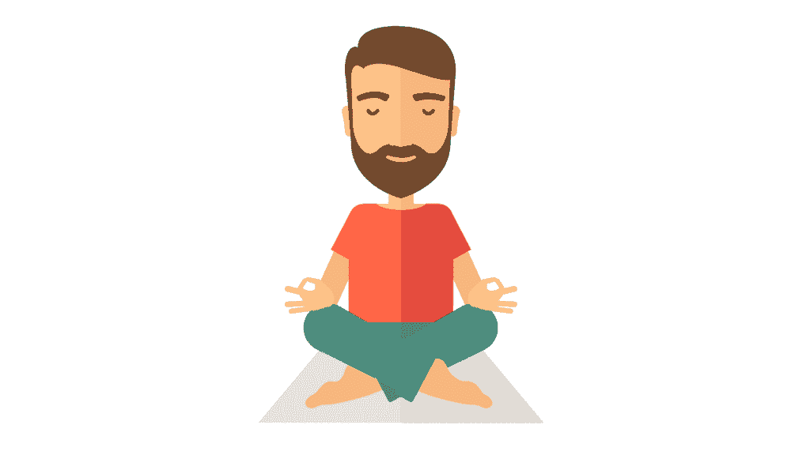
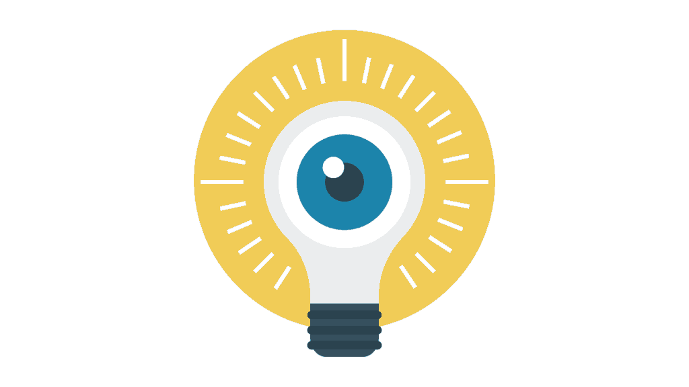
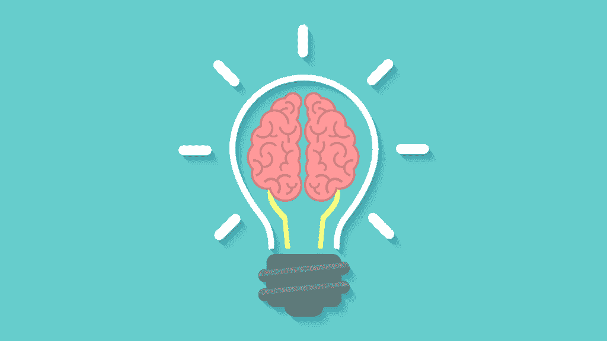

# 程序员的思维训练

> 原文：<https://simpleprogrammer.com/mind-training-programmers/>

职场内外都有大量关于健康和健身的信息。但我看到了在训练程序员的思维以获得更大的专注度和生产力方面的不足。

锻炼身体肯定很重要，不要误会。然而，训练思维对于生产力和过上你想要的生活来说是至关重要的，但是在程序员和整个社会中却没有得到足够的重视。

为什么思维训练很重要？因为就像李小龙在*龙争虎斗*里说的，“没有对手。”有多种解释，但这一种最适用于我们:

完成任何努力，比如减肥，完成马拉松，建立一个成功的副业，或者在武术比赛中击败你的对手，都需要你始终如一地遵循一套计划、方法、训练或策略。“相信过程”，对吧？

你面前的障碍，像减掉 50 磅脂肪，完成马拉松，建立一个企业，成为一个更有生产力的程序员，都是测试你如何成功地创建和坚持一个战胜它们的过程。它们最终是帮助你成长的工具。

未能遵循您的流程的最常见原因是什么？你自己。你的紧张、怀疑、怀疑、消极、懒惰、急躁和注意力不集中。例如，无数人无法长期坚持他们的饮食，因为他们某一天不想锻炼，而某一天像滚雪球一样变成一周、一个月等等。

这让你的头脑成为你最值得信赖的盟友和最大的敌人。

有效的思维训练是通过冥想和视频游戏来完成的，信不信由你。如果做得正确，冥想可以防止分心，给你内在的肯定，一种胜利和胜利的感觉，让你变得富有成效。电子游戏可以帮助你更快地思考，更集中注意力，提高多任务处理能力，并增强精神纪律性。

## 沉思

冥想是一种精神训练的形式，旨在帮助你更好地控制和理解你的思想。有了它，你将能够更有效地专注于任务，克服消极情绪，避免懒惰和拖延。

这是有效冥想的秘密。你必须把它视为对自己施加控制和支配。每一次冥想本质上都是一场与你思想的战斗。

现在，试着什么都不要想。很有可能，这是困难的。

似乎总是有想法在你脑海中闪过。你可能经常会有负面情绪，比如压力、焦虑和愤怒。你可能会一直感到疲劳。我们的思维通常是混乱的，尤其是在我们这个高速、即时满足的社会。

当有人在路上拦住你时，你可能会感到极度愤怒。你知道这样生气是没有用的，但是你控制不了自己。或者当你和陌生人说话时，你可能会感到焦虑，甚至惊恐发作。

你冥想的目标是让这混乱的思绪安静下来。你不应该放松，但你也不应该紧张。你必须找到并保持那种平静和精力充沛的矛盾状态。这种平衡是你最有创造力、生产力和效率的地方。

各种形式的生产力取决于你集中注意力的能力。像番茄工作法(约翰自己提倡的东西)、听音乐、保持环境整洁等等。都是帮助你集中注意力的技巧。

冥想有助于提高工作效率，因为它通常包括在一段时间内屏蔽掉一些想法。定期冥想会提高你屏蔽不想要的想法和分心的技能，这将提高你专注于任务的能力。

如果你认为冥想是一场与你的头脑的战斗，你的头脑既是你最值得信赖的盟友也是最大的敌人，那么每次你不能集中注意力都是一场与你的头脑的战斗，你输了。

你也感觉到了。当你因为沉迷于社交媒体而无法调试代码时，你会感到失落。当你知道你的代码可能有缺陷，会把事情搞砸的时候，你会感到挫败。

但是，当你能够集中精力并富有成效时，当你经过数小时的不懈努力最终调试代码时，当你经过十几次修改和大量讨价还价最终让你的微调代码通过质量保证(QA)测试时，你会感觉到这一点。你会感受到那种胜利的感觉。

冥想可以帮助你集中注意力，这样你会更有效率，更能创造那种胜利的感觉。

### 冥想循序渐进指南

我从夜间冥想中体验到了更大的好处，所以我更喜欢在睡觉前冥想。

包括我在内的许多人开始冥想时会犯困，所以睡前冥想比早上开始一天的生活更有益。尝试一周的夜间冥想，如果它对你没有任何作用，就在醒来后切换到早上。

让你的环境尽可能安静。脑海中汹涌的思想雷雨已经让人分心，不想再火上浇油。必要时使用耳塞。

坐在最舒服的位置。你可以坐在传统的交叉双腿的位置上，但这不是必须的。

首先，吸气并绷紧你的整个身心五秒钟。呼气。再重复两次。

接下来，放松身心，从腿部开始。吸气，呼气，放松双腿。同时，想象一个紧握的拳头变得放松并张开。用你的腹部、胸部、背部、手臂、脖子、脸，最后是你的大脑做同样的事情。

从高度紧张的状态开始，逐渐放松你的身体，让你的大脑更容易放松。尽可能长时间保持这种身体和精神的静止状态。如果有任何想法进入你的脑海，强迫自己回到这种静止状态。如果你开始感到困倦，强迫自己保持清醒。从腿部开始重复放松过程，需要多少次就重复多少次。

我建议每周五到七个晚上坚持这样做 10 到 20 分钟。

但是如果冥想不适合你，那就要考虑别的事情了。如果你像我和许多软件开发人员一样，你已经对此感到兴奋了。

## 电子游戏

常识告诉我们玩电子游戏对你有害，对吗？它们占用了社交和交友的时间，消磨了你的注意力，伤害了你的眼睛，让你沉迷于激浪和红牛，还破坏了你的身体健康。

信不信由你，*阅读* [相当于几十年前的电子游戏](https://www.ebscohost.com/novelist/novelist-special/on-the-dangers-of-reading)。普遍的看法是，以娱乐为目的的阅读对你有害。它没有教会你任何有用的东西，也没有训练你的头脑。书籍让你头脑中产生复杂的故事和幻想，这些故事和幻想会降低你感知和面对现实的能力，还会分散你工作的注意力。

现在，读书被认为是一种很好的精神习惯，因为它需要持续的注意力。老师和家长积极鼓励孩子读书。

电子游戏已经取代了书籍。人们妖魔化他们，指责他们造成了孩子和年轻人的所有问题和痛苦。现在，有科学证据表明电子游戏的好处，它们正被考虑用于各种训练和康复目的。

就像阅读一样，玩电子游戏是训练你思维的有效方式。精神上的好处包括更快的反应速度，提高的注意力和多任务处理能力，以及更强的精神纪律性——所有这些都对生产力有益。

### 更快的反应速度

想象一下使命召唤。在很大程度上，反应速度更快的玩家会比其他玩家更引人注目，更有可能获胜。

像《使命召唤》这样的射击游戏，像《街霸》这样的格斗游戏，像《星际争霸》这样的即时战略游戏，都需要很快的反应速度。定期集中精力玩这类游戏会提高反应速度，就像定期集中精力举重会增加你的体力一样。

开车时，更快的反应速度可能是侥幸避免碰撞和晚间新闻头条的区别。你有没有差点掉东西，却设法及时接住的经历？想象一下能够一直这样做。

你想富有成效吗？更快的反应速度是整体思维过程更快的标志。这意味着你的大脑工作得更快更有效率。

作为一名程序员，你会花大量的时间去思考。思考代码中的错误。思考如何构建代码。一个更快、更有效的思考过程会让你做得更好。

### 提高注意力和多任务处理能力

没有确凿的证据表明电子游戏会破坏你的注意力持续时间。可能是快节奏的视频游戏对注意力有困难的孩子更有吸引力；相关性不一定意味着因果关系。

此外，多伦多大学的一项研究显示，玩第一人称射击游戏可以显著增加视觉注意力，减少注意力分散。

第一人称射击游戏玩家也表现出更强的多任务处理能力，这是有道理的。你不断受到混乱、不断变化的环境的轰炸，这要求你能够突然切换到不同的任务，并跟踪多种行动、人和运动。

你会问，这对生产力有什么用？

大多数生产方法，如番茄工作法建议专注于一项任务。这是由于人类的局限性:有效的多任务处理大多是一个神话。套用孙子的话，试图完成一切的人将一事无成。

但是如果你能有效地同时处理多项任务，你会从中获得巨大的收益。以开会为例。作为一个程序员，会议通常是时间和生产力的破坏者。但是，放弃太多也是不好的做法。在 Scrum 风格的软件开发方法中，你确实需要去开会。

生产力解决方案？多任务处理。带上你的笔记本电脑，在会议期间做你的工作。如果有人试图找你麻烦，就说你想自己做会议记录。凭借你娴熟的多任务处理技能，你将能够集中精力开会并完成工作。一石二鸟！

### 心理训练

第一人称射击游戏本质上是模拟生死枪战。是的，这只是一个游戏。但在潜意识里，你的大脑并不总是能区分这两者。除了自我，在《使命召唤》中反复被 pwn 的纯粹火山爆发式愤怒通常是一种自然的战斗或逃跑本能。

电子游戏最大的好处是，它让你安全地沉浸在这些紧张、有压力的情境中，因此你可以在没有任何死亡或受伤风险的情况下训练你的思维。你可以发展更高水平的精神纪律、自我控制和压力管理。作为一名程序员，这种实践将延续到你生活的其他方面。

压力会发生。作为一名程序员，你将不得不与你相处不好的人一起工作。你的一些同事会把他们的自我束缚在他们的工作上，每当你或其他人试图对他们错误的、没有注释的、混乱的代码提出建设性的批评时，他们就会变得好斗。QA 测试人员会破坏你的代码，让你一遍又一遍地修改它，有时是为了正当的理由，有时只是为了大便和傻笑。

这些事情都会发生，你不一定能控制。但是，你可以控制自己在这些情况下的反应。你知道，从逻辑和理性的角度来看，与 QA 测试人员开始争论是没有意义的。你只会激怒他们，下次他们会更难共事。但是，你可能无法帮助自己。

学习如何处理压力有助于你在这种情况下保持冷静、冷静和富有成效的态度。

### 奖励:改善视力

这与思维训练无关，但这是我想包含的电子游戏的一个深刻的好处。研究表明玩射击游戏会提高视力。对视力的好处是如此之大，射击游戏正被考虑用于视力受损者的康复。

这是有道理的。像《使命召唤》这样的第一人称射击游戏要求你能够快速发现敌方玩家，本质上就是在屏幕上移动图形。由于关卡的灰色背景和玩家角色外表的通常暗淡的颜色，你的眼睛必须在上面工作。作为一名程序员，你大部分时间都坐在电脑屏幕前，这可能会损害你的眼睛。视频游戏改善的视力可以有效地弥补这种视力下降。

## 最大化视频游戏好处的程序员指南

从电子游戏中获益[很棘手](http://www.amazon.com/exec/obidos/ASIN/007733O8I/makithecompsi-20)。你需要带着正确的心态，选择正确的游戏类型。否则，你会浪费时间，忽视生活中其他重要的方面，给自己带来净损失，总的来说，只会搬起石头砸自己的脚。

主要坚持第一人称和第三人称射击游戏。在思维训练方面，它们给你带来了最好的回报:更快的反应速度，更好的注意力/多任务处理，精神训练和更好的视力。格斗游戏是一个可靠的选择。

第一，不要为了享受或自我而玩电子游戏。你的目标是训练你的头脑。享受是一个意想不到的结果。自负是很多游戏玩家在激烈的比赛中表现出火山般愤怒的原因之一。

每当你的自我愤怒超过你的时候，停下来玩一个小时，到外面散散步，清醒一下头脑。

第二，专注多人。你在单人游戏中面对的 AI 敌人永远比不上其他真实玩家的适应性和不可预测性。在重玩几次关卡后，你会知道敌人会在何时何地出现，以及他们会如何对你做出反应。每个真正的玩家，从新手到经验丰富的职业玩家，都会面临不同的挑战。

与其在屏幕前无意识地流口水，不如以赢得每一场比赛为目标。在以团队为基础的比赛中，努力保持你的团队最高的杀戮/死亡比率。

至于频率，我建议每周进行两到三次每次 30 到 60 分钟的训练，以及一次长达几个小时的马拉松训练。最好的玩耍时间是在周末晚上或者第二天你没有紧迫任务的时候。晚上通常是最多玩家玩多人游戏的时候。在长时间的训练中，每一到两个小时休息 10 分钟，让你的眼睛和手得到休息。

任何一种锻炼，无论是对身体还是精神，都需要强度和一致性，但也不应该占用你生活中其他重要领域太多的时间。从这个基线频率开始，然后您可以根据个人喜好调整时间和频率。

你的大脑通常能够比你的身体处理更多的事情，所以你会从一场漫长的马拉松游戏中受益更多，而不是真正的物理马拉松。

## 最后的话

在我看来，你的身体是一辆车，你的思想是司机。你可以有一辆加满油的兰博基尼，引擎还能跑不到 100 英里，但是一个 16 岁的孩子生平第一次开车，用不了多少。另一方面，杰森·伯恩在一场汽车追逐中成功地使用了迷你车。

冥想是一种有用的、被低估的控制你思想的工具。这不需要花费很多时间，但它为生产力和你生活的方方面面提供了巨大的好处。

与流行的观点相反，如果选择了正确的游戏，并以正确的心态进行，视频游戏可以成为思维训练的一个很好的工具。

现在去接受训练吧！