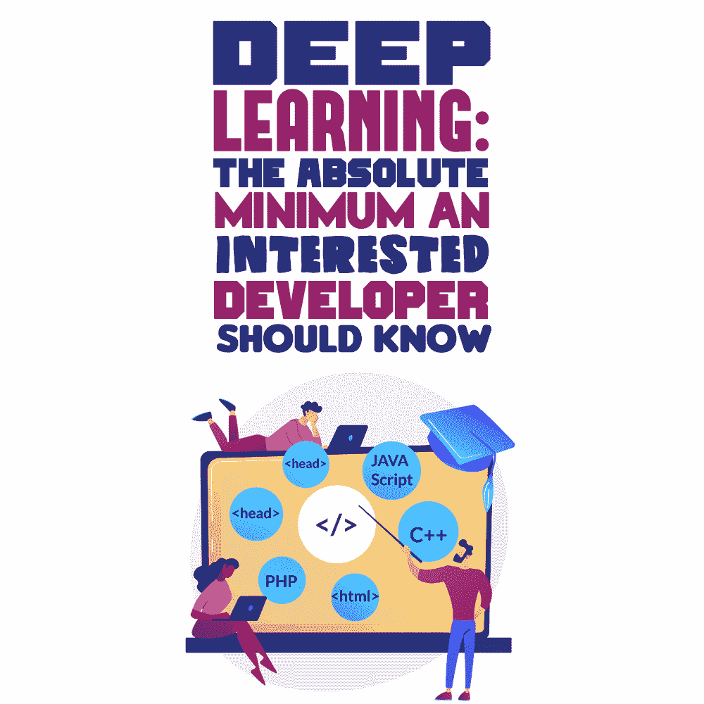

# 深度学习:感兴趣的开发者应该知道的最基本的东西

> 原文：<https://simpleprogrammer.com/minimum-guide-deep-learning/>

If you are a developer and have been reading articles and posts on deep learning, you must be intrigued by how the industry is progressing.

对于那些没有听说过的人，深度学习是一种[机器学习](https://simpleprogrammer.com/machine-learning-modern-web-developer/) (ML)技术，它教会系统执行人类自然完成的任务。这是免提扬声器、电视、平板电脑和智能手机中语音控制选项背后的关键技术，也是开发无人驾驶汽车的关键。

对于一个寻求转换领域或利基的开发者来说，深度学习带来了很多机会。但是，要想在行业内出人头地，如何入门还是一个很大的问题。

在这篇文章中，你将了解深度学习的快速发展，为什么教授深度学习的传统方法对你不起作用，以及作为一名感兴趣的开发人员，你如何真正开始

# 深度学习是如何在如此短的时间内取得令人印象深刻的成果的？

这个问题最简短的答案是“准确性”。[深度学习](https://builtin.com/artificial-intelligence/deep-learning-applications)在更高水平上执行识别准确性，帮助消费电子产品满足用户期望。对于无人驾驶汽车等安全关键用例来说，准确性至关重要。

随着技术的不断进步，深度学习已经发展到在对图像中的对象进行分类等任务中超越人类的程度。

这是它成为开发人员热门话题的原因。但是，它的应用相当困难，因为它不包括你的标准编码。它也包括数据。所以，你将在大量的标签数据和强大的计算能力之间徘徊。

深度学习应用正在改变我们执行某些任务的方式——从自动驾驶到医疗设备、航空航天和研究等等。

# 传统回答“深度学习如何入门？”

大多数寻求探索深度学习利基的开发人员半途而废，因为它从定义开始，并过渡到算法和数学描述的概念，这只会增加复杂性。

虽然数学描述、算法的概念和定义简洁、清晰，而且通常直截了当，但它们是枯燥无味的，并且需要先决的数学背景来解析和解释。

这就是为什么你只能在大学里作为研究生级别的科目学习机器学习及其阶段的主要原因。是因为题目只要求你把基本原理搞清楚。也就是说，要作为一名开发人员开始深度学习的职业生涯，建议您很好地理解:

*   结石
*   多元统计
*   线性代数
*   可能性
*   统计数字

当你探索奇异的算法时，情况可能会变得更糟，因为它们的深度学习方法是普遍的。

YouTube 视频和在线课程遵循大学教授深度学习的方法。因为它与数据科学有关，所以你有更好的机会在像 [SDSclub](https://sdsclub.com/) 这样的平台上找到你需要的东西。它可以帮助你学习更多关于深度学习编码的知识。这是一个独特的社区，旨在为技术爱好者提供支持。

传统的学习方法不会给开发人员带来好处，因为它们很严格。假设你是一名开发人员，已经从各处学习了语言，现在正在学习开发独立的应用程序。

你把这件事告诉了你的老师，他们建议你在成为程序员之前应该先完成计算机科学的学位。你开始上大学，接触离散数学、微积分和深奥的代数。您意识到您正在使用过时的编程语言。慢慢地，你对开发计算机应用程序的热情动摇了。

也许你到了另一边，但意识到你没有学到任何关于现代编码和软件开发实践、工具、语言和其他可以用来成为实践机器学习的开发人员的东西。

那么这意味着什么呢？想要探索深度学习的初露头角的开发人员会被要求花费数年、数十万美元来学习更高的学位和数学吗？

嗯，答案是**不**。

# 什么是更好的方法？

将有很多代码要编写。因此，更好的方法是了解不断变化的行业需求，并相应地塑造自己。

根据在线代码库 [GitHub](https://github.blog/2019-01-24-the-state-of-the-octoverse-machine-learning/) 的数据，大约有 10 种非常流行的编程语言用于机器和深度学习。它们包括:

*   计算机编程语言
*   C++
*   Java Script 语言
*   爪哇
*   C#
*   朱莉娅
*   稀有
*   壳
*   以打字打的文件
*   斯卡拉

Some of the names included in this list might surprise you, but they are changing the course of how deep learning is implemented in real-life things.

这并不是说你应该掌握所有的语言。[如果你懂 Python](https://www.amazon.com/dp/1617294438/makithecompsi-20) ，你可以继续开发你的 Python 代码编程技能。如果你尝试多学一门与 Python 齐头并进的语言，那就更好了。

一旦你知道了正确的编程语言和工具，你就可以轻松地用深度学习代码和算法解决问题。但是，您需要为可重复的结果形成一个系统的过程，例如:

*   这个过程对于特定的工具、流行的算法和编程语言来说是不变的。工具很快就会过时，但是你使用的[过程必须是适应性的](https://www.amazon.com/dp/0262035618/makithecompsi-20)。
*   致力于开发确保“积极”结果的流程。
*   你选择的过程必须是“一步一步”的，这样你和与你一起工作的整个团队才知道下一步是什么。你的团队不想完全依赖你的代码。不知道下一步是什么是项目杀手。
*   你需要一个过程，允许你从一个问题规格中看到它，并从端到端地指导你。

# 开始之前先学习基础知识

深度学习现在都是炒作。

作为一名开发人员，探索涉及机器的编程和编码的全新世界一定很有诱惑力。

但是，在你开始之前，重要的是你要弄清楚你的基础知识，特别是数学，因为编程和编程语言的知识不是它需要的唯一东西。