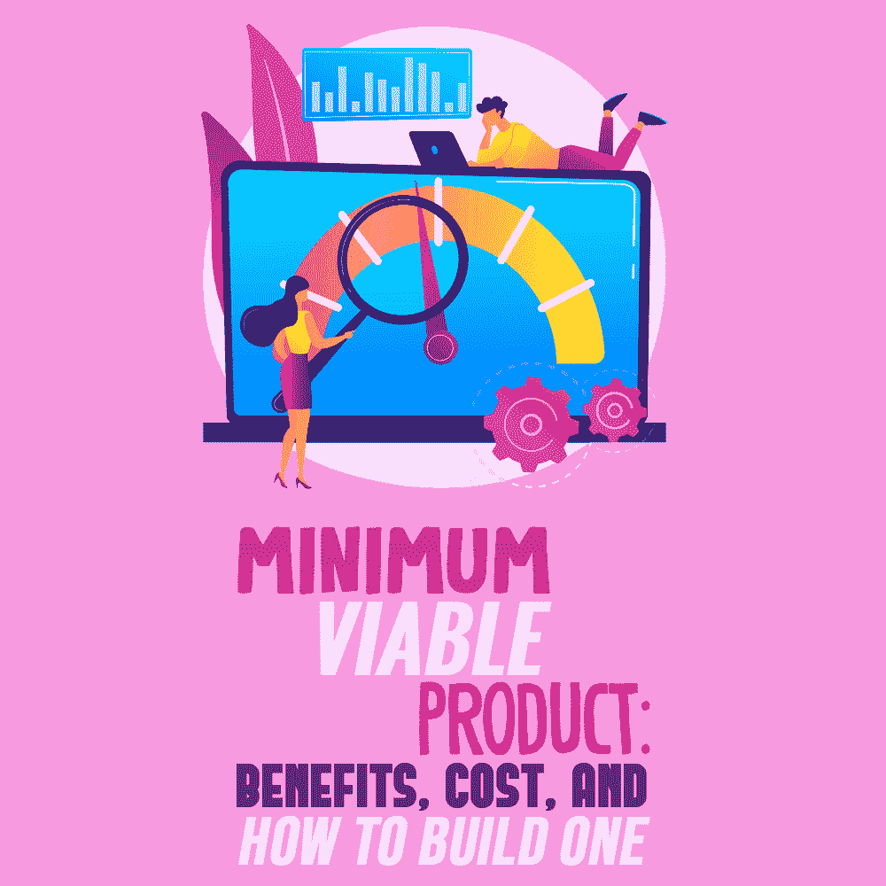
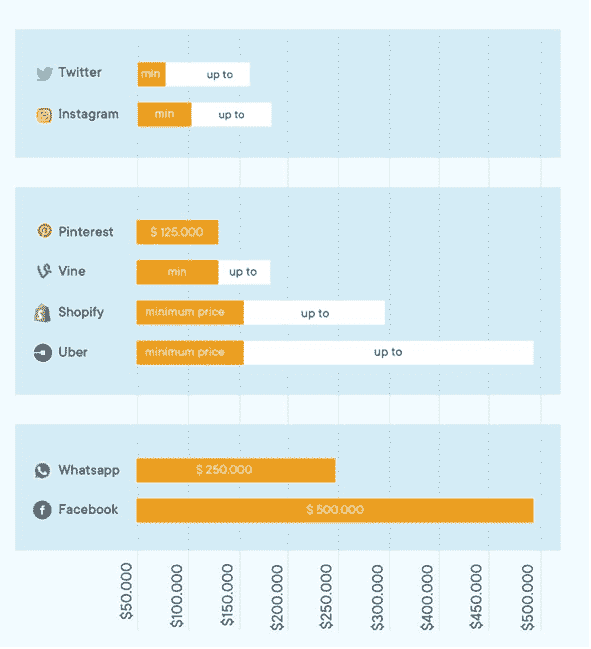

# 最小可行产品:利益，成本，以及如何建立一个

> 原文：<https://simpleprogrammer.com/minimum-viable-product/>

A [minimum viable product or MVP](https://www.linkedin.com/pulse/what-does-mvp-mean-why-do-you-need-addevice/?trackingId=JXi7DsayJdidLX%2B6lXTpAg%3D%3D) is a concept to denote testing of a product with minimum resources spent. The testable product includes enough features to attract early adopters, and the aim is to collect feedback from these customers in order to improve the final product.

[MVP 开发](https://addevice.io/blog/what-is-a-mvp-development/)包括以下步骤:

*   生产产品的基本版本。
*   将产品投放市场。
*   从早期采用者那里收集信息。
*   根据反馈改进产品。
*   推出建议改进的新版本。

总的来说，推出一个 MVP 比不经过初始测试就扩大规模风险更小，成本更低。这种方法有很多好处，比如更好地理解客户需求和最小风险的开发。你甚至可以[在不发布产品的情况下销售你的应用创意](https://simpleprogrammer.com/sell-an-app-idea-9-steps/)。

此时你可能会想，MVP 不是浪费资源吗？研究表明，事实并非如此。据 [Go-Globe](https://www.go-globe.com/startups/) 报道，超过一半的创业公司因过早规模化而失败。这难道不可怕吗？[失败的发生](https://simpleprogrammer.com/why-apps-fail/)部分是因为开发者在发布他们的最终产品之前没有做好基础工作。

所以，不管你愿不愿意，在你发布最终产品之前，你都需要做市场调查。这就是 MVP 派上用场的地方。

你如何在 2022 年打造一个最低可行的产品？在这篇文章中，你将得到这个问题的答案，并清楚地看到该做什么。你对“造一个 MVP 要花多少钱”的好奇心也会得到满足，那就去看看为什么要造，怎么造吧。

构建一个最小可行的产品需要**市场调查**、**来自早期用户的反馈**，以及**在创建最终产品时的适应能力**。让我们深入了解一下这个过程是如何工作的。

## 建立 MVP 的主要好处

正如我们所看到的，任何开发 MVP 的投资，无论是时间还是金钱，都是绝对值得的。让我们更详细地看看它的多重好处。

### 清晰的目标

你需要对你的产品或服务的基本功能有一个清晰的认识。要清楚地了解自己真正想做什么，需要大量的研究和团队合作。

制作一份清单，并与团队成员分享。你需要仔细检查每一个项目，并试图以更少的成本和更高的效率为市场带来新的发言权。在你清楚了基本的功能之后，你就可以开发原型了。

### 更好地了解客户需求

对你来说，还有什么比了解你的客户需求更有益的呢(在这方面帮助你的一个很好的资源是 *[精益产品行动手册](https://www.amazon.com/dp/1118960874/makithecompsi-20)* )？在开发的早期阶段，有什么能比客户的反馈给你带来更多的利润呢？

理解你的客户需求是任何开发过程的核心。在你建立了一个原型并在市场上发布之后，你就可以收集有价值的反馈了。确保为后面的分析过程打开反馈渠道。

### 快速断路

因为你关注的是关键的功能，而不是所有的特性，所以发布会更快。这使您可以专注于主要功能，并了解它们在现实世界中是如何工作的。

### 成本或风险最小的开发

没有初始测试就扩大规模是许多创业公司失败的原因。他们只是花了太多的钱，不知道它是否会工作。对于小规模的开发和发布，公司不会冒高成本或时间的风险。他们做任何事都把风险降到最低。

### 改进的最终产品

MVP 允许你从早期采用者那里收集有价值的反馈。该信息随后被彻底分析，目的是加强优点和消除缺点。反馈加分析是 MVP 的核心。最终产品经过真实世界的测试，并适应客户的需求。

## 你如何创造一个 MVP？

以下是创建 MVP 需要采取的六个步骤。

### 1.研究这个想法

You have a great idea but it needs to be put under the scrutiny of market research. According to [CBI reports](https://www.cbinsights.com/research/startup-failure-reasons-top/#:~:text=%E2%80%9CStartups%20fail%20when%20they%20are,serve%20with%20a%20scalable%20solution.), the failure of around 42% of startups accounted for no market need for the product.

那么，如何做研究呢？首先，你可以研究竞争对手的类似经历:

*   他们做对了什么？
*   他们做错了什么？
*   为什么有的成功，有的不成功？

这些都是你需要回答的问题。互联网是做市场分析的宝贵资源，但你也可能想做个别研究，如调查。是的，这是要花钱的，但是你不能因为忽略一些可能不太明显的事情而拿整个生意冒险。

### 2.定义市场需求

你需要回答这些问题:

*   为什么客户会想要我的产品？
*   它给现有品牌增加了什么价值？
*   我的产品有什么不同，对潜在客户意味着什么？
*   我在解决什么问题？

一旦你明确了这些问题，你就会对自己的产品或服务有更清晰的认识。

### 3.定义必备功能

你的应用或产品可能有很多功能，但在这个阶段，你只需要优先考虑必备的功能。为什么？仅仅是因为你不想仅仅在 MVP 开发上花费大量的金钱和时间。此外，如果市场对基本功能有需求，一些好看的功能只会给你的产品增添味道。

### 4.构建和发布

你需要一个合格的团队来构建你的原型，即使是在 MVP 阶段。在 MVP 阶段发布的产品应该满足高质量产品的所有要求，例如，客户想要和需要的产品。

找到一个不会让你失望的有经验的团队也不容易。还需要研究分析。一种方法是考虑关于软件开发机构的评论，你可以在评级机构上找到，比如 GoodFirms。另一个选择是在 LinkedIn 上搜索。

### 5.收集反馈

MVP 的主要目标是收集早期采用者的反馈。确保反馈渠道畅通。例如，您可能会从社交媒体、朋友或联系客户获取反馈。如果你选择后者，你需要和那些使用你产品的人保持联系。一种方法是留下你的联系方式并寻求反馈。

或者，您可以在销售点收集早期用户的联系信息，表示您想做一个产品满意度调查。以下是您在调查过程中可能想问的一些问题:

*   我们的产品符合你的期望吗？如果没有，为什么？
*   有什么让你担心的吗？
*   在您第一次开始使用我们的产品后，发生了什么变化？
*   你对性价比满意吗？
*   我们能做些什么来让你使用我们的产品？
*   你会向你的朋友推荐我们的产品吗？
*   我们的产品是否帮助您解决了您想要解决的特定问题？如果是，如何实现？如果没有，为什么？

### 6.分析反馈

现在你已经有了关于你的产品或服务的所有信息，是时候分析它了。每一个意见都很重要，因为你得到的评论将决定你生意的成败。确保仔细考虑你的每一个想法，并努力在你的预算和顾客的需求之间找到最佳平衡点。

在分析过程中，您可以考虑定性和定量数据。虽然定量数据给了你一个很好的暗示，告诉你你的产品在数字上有多成功，但回答“如何”、“为什么”和“何时”这些问题的是定性数据因此，给你的客户一个机会解释他们的意思，并确保手头有足够的定性数据。

## 一个 MVP 要多少钱？

现在我们来看核心问题。你的预算当然不是无限的，你想花的越少越好。然而，约束可能会导致整个企业的失败。所以，找一个有资质的团队外包你的 app 或者产品原型。

好吧，那么，让我们来看看数字。老实说，“打造一个 MVP 要花多少钱”这个问题没有单一的答案然而，如果你想对金钱有一个大致的概念，这里有一些要考虑的。

如果你雇佣一个自由职业者，你可能最终要支付 5000 到 15000 美元。

例如，在东欧，外包给一个开发团队的平均成本可能是每小时 30 美元。如果你雇佣了四个人，你最终将支付每小时 120 美元。最终的总数当然取决于你的产品的复杂程度。外包给一个开发团队可能要花费 15，000 到 30，000 美元。

以下是不同地区的平均时薪列表:

*   北美——100 美元至 180 美元
*   南美——30-50 美元
*   西欧——110-200 美元
*   东欧——25-50 美元
*   非洲——20-40 美元
*   澳大利亚——100 美元至 180 美元
*   亚洲——15-40 美元

然而，这些是我们找到的最便宜的选择。

看看下面的图表，你会明白今天已经成为巨型企业的公司，像脸书或优步，仅仅在开发 MVP 上就投入了大量资金。

[来源](https://www.nimbleappgenie.com/blogs/wp-content/uploads/2019/12/cost-MVP.png)

想想脸书今天赚了几十亿美元。难怪他们在 MVP 上投资了 50 万来测试他们的想法。这个数字仅仅说明了在产品开发上投资是值得的。如果不是 50 万，那么至少总业务成本的 10%应该用于创意测试。

## 现在你已经准备好打造一个伟大的 MVP 了

MVP 的好处是深远的。难怪这么多成功的公司在 MVP 开发上投入了大量资金。你将对自己想要做的事情有一个清晰的愿景，并将对客户需求有更好的理解。

与此同时，产品的发布将会更快，开发的成本和风险将会最小。最后，你将能够带着一个改进的产品进入市场，比在 MVP 阶段发布的产品更好。

但是正如你所看到的，一个 MVP 不仅仅是构建原型。在产品发布前后需要进行大量的研究，当然不仅仅是建立一个原型并进行验证。

现在你已经准备好建立一个 MVP 了！如果你觉得这篇文章有帮助，考虑分享它来帮助其他人找到和阅读它。