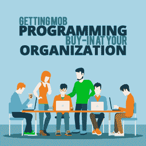

# 在您的组织中获得 Mob 编程的认可

> 原文：<https://simpleprogrammer.com/mob-programming/>

**

*这首曲子是内特·维克森和托里·鲍威尔合作创作的。*

项目管理研究所的 2017 年[行业脉搏](https://www.pmi.org/-/media/pmi/documents/public/pdf/learning/thought-leadership/pulse/pulse-of-the-profession-2017.pdf)调查报告称，71%的组织现在使用[敏捷方法](https://www.cio.com/article/3156998/agile-development/agile-project-management-a-beginners-guide.html)来完成项目。敏捷方法中包括 mob 编程，[被敏捷联盟](https://www.agilealliance.org/glossary/mob-programming/)定义为“一种软件开发方法，在这种方法中，整个团队在同一时间、同一空间、同一台计算机上做同一件事情。”想象一下，一个工作站的多名工程师在一个项目上协同工作。

虽然许多组织已经采用 mob 编程作为他们开发技能集的核心部分，但并不是所有的开发组织都接受。

对于许多开发应用程序来说，Mob 编程是最好的方法。Mob 项目在发布时会产生一个更完整的项目，有更少的 bug。通过一次专注于一个项目，团队可以更有效地完成项目，并且这些项目的质量更高，需要的修改更少。

然而，为了成功地实现 mob 编程，你需要得到组织中两个重要群体的认可——执行团队和程序员本身。

通过遵循下面的策略，您可以从上到下获得组织对 mob 编程的认可，并开始使用这种敏捷开发方法为组织内外的客户提供优秀的成品。

## 获得领导的认同

早在 2000 年，开发人员在项目中合作解决问题的好处就已经根据个人的表现进行了评估。一项经常被引用的北卡罗来纳大学和犹他大学的联合研究表明，结对的程序员解决问题的成功率提高了 15 %,而且他们的解决方案代码行更少。

然而，对于高层领导来说，这可能不是一个令人印象深刻的数据。为了节省成本，难道不应该至少提高 100%的效率吗？

事实是，短期内如此小的效率提升可能并不令人信服。这是一场漫长的游戏，你需要让领导层看到多个项目跨越数月甚至数年的可能性。

如果您能让领导层同意对 mob 编程进行 6 到 12 个月的试用，那么您的组织将会看到以下一些好处:

*   **完全盘点的项目:**随着团队在更少的项目上更彻底、更快速地工作，项目不太可能被放弃或遗忘，更多的项目被完全完成。对每一个项目的更多关注意味着项目在发布给世界时会更加完整。
*   **项目周转时间更短:**项目完成的速度比单个开发人员工作的速度更快。随着对每个项目的关注越来越多，障碍就越来越容易被克服，问题的解决方案也能很快被集思广益。
*   **实时项目中的问题更少:**随着越来越多的人审查每一行代码，项目被完全清点，进入生产环境的 bug 就越少。当单个开发人员在项目中工作时，人们通常会理解，当一个平台处于活动状态时，会有一些 bug 需要修复。通过 mob 编程，您可以消除大量这种必要的重复工作。
*   **更快的程序员入职:**入职 mob 编程环境更有效，因为你可以将新的开发人员直接放入已经在为一个项目工作的 mob 中，并让他们立即做出贡献，而不必转移资源来培训和管理组织中新程序员的早期项目。

随着时间的推移，mob 编程不仅提高了成功项目的完成效率，还提高了新团队成员的整合效率。你可能不会马上看到投资回报，但随着时间的推移，它会很明显。

更好的结果，更快的速度，更少的废弃项目——这是任何一个高层领导都可以做到的。

## 获得程序员、开发人员和工程师的认可

Getting buy-in from senior leadership is one thing. Getting buy-in from the people who will actually be doing the mob programming is something else entirely.

许多工程师、开发人员和程序员习惯于[独自工作](https://simpleprogrammer.com/importance-community-cant-alone/)——戴上耳机，与外界隔绝，一坐就是几个小时。在团队环境中，成功的主要原因是团队合作，你如何让习惯于独自工作的人成为积极的参与者？

根据我们的经验，在将 mob 编程整合到 Clearlink 的组织中时，我们经历了许多 mob 编程的迭代，并不是每个人都适合 mob 编程——但是一旦他们参与进来，比你想象的要多得多。

这是为什么呢？信不信由你，工程师喜欢和他们的同事交往，他们只是一直没有机会这样做。一旦他们意识到协作时产生的参与度和代码质量，工作满意度就会提高，学习会增加，团队凝聚力也会增强。Mob 编程也是一种精英管理，最佳创意胜出，mob 中的每个人都有平等的发言权——从团队中最资深的开发人员到新来的开发人员。

每个 mob 包含两个角色:*司机*和*导航员*。司机坐在电脑前输入代码，导航员告诉司机输入什么。这些角色在人群中以固定的 8 到 15 分钟的间隔进行转换，给每个人平等的驾驶和导航机会。

每个人都积极地参与到这个过程中，想法被快速地分享和实施。因为每个人都有机会导航，初级程序员通过坚持自己的想法来获得自信。

我们建议在项目结束时或每个工作周结束时，表彰 mob 团队成员对他们所参与项目的贡献。此外，允许程序员分享他们学到的知识和遇到的困难。在几个项目和几个这样的认可和回顾会议之后，你的团队成员将会舒服地一起工作，并且完全融入到 mob 编程的思维模式中。

## 进行跳跃

将开发工作从个人编程风格转变为群体编程风格可能是一个巨大的飞跃——这可能会导致一些磕磕绊绊。但是一旦你得到了领导的认可，并能让一些程序员加入进来，你就会看到它是如何让你的组织受益的。

我们已经为您提供了一些导航，所以准备好开车吧。