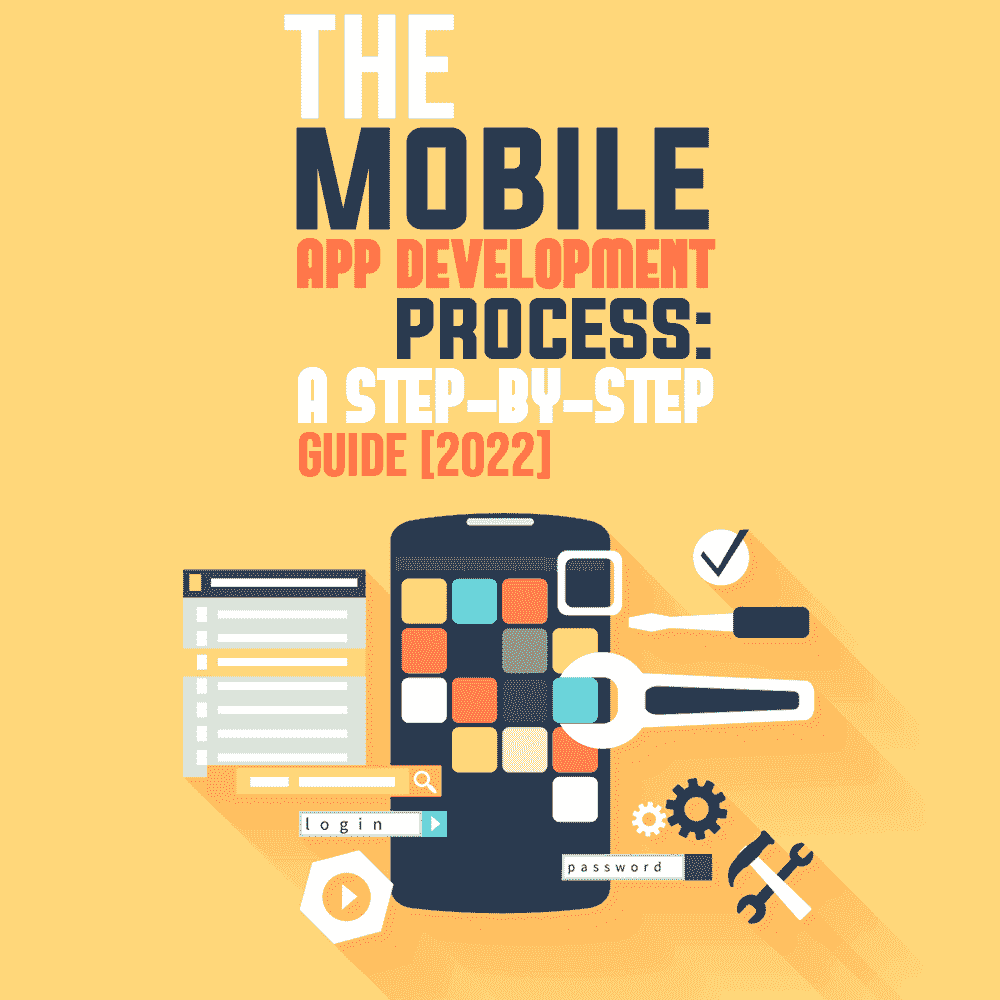

# 移动应用程序开发流程:分步指南[2022]

> 原文:[https://simple programmer . com/mobile-app-development-process-guide-2022/](https://simpleprogrammer.com/mobile-app-development-process-guide-2022/)

Mobile app development has become the most sought-after skill in software development. [According to research](https://datareportal.com/reports/digital-2022-global-overview-report), there will be more than 5 billion unique mobile users by the start of 2022, and the average number of app users is increasing by 7-8% every year. Moreover, considering the increasing smartphone penetration and better connectivity, mobile app developers have a huge scope to create world-class apps that would rake in millions of dollars.

移动应用程序开发流程始于整体战略。该战略包括商业模式、数据需求、用户需求和移动应用产品背后的总体思路。清楚地了解你的终端用户想要什么样的移动应用程序，对于创造适销对路的产品至关重要。

另一个步骤类似于商业计划阶段，在这个阶段，你需要在着手一个给定的项目之前考虑各种因素。这些因素包括市场规模、竞争、定价模式、专利许可条款等。当你头脑中有了这些细节，是时候开始研究移动应用行业的各种趋势了。

移动应用程序开发是一个可以分成几个步骤的过程。这些包括研究市场、设计、原型、编码、测试和部署。如果你想为你的企业或想法开发一个应用程序，了解跨平台移动应用程序的开发过程是必不可少的。

这篇博客分享了所有七个基本移动应用程序开发步骤/过程的深入知识，每个初创公司或企业在开发应用程序时都应该知道。

1.  [第一步:研究市场](#Step1)
2.  [第二步:定义您的业务模式和最终用户体验(UX)](#Step2)
3.  [第三步:开发原型](#Step3)
4.  [第四步:设计你的手机应用程序 UI/UX](#Step4)
5.  [第五步:组建你的移动应用开发团队](#Step5)
6.  [第六步:测试和提炼](#Step6)
7.  [步骤 7:启动您的移动应用程序](#Step7)

让我们开始第一步。

## 第一步:研究市场

创建成功应用的第一步是研究应用统计数据和使用模式。

据统计，到 2023 年，移动应用程序预计将产生约 9350 亿美元[n](https://buildfire.com/app-statistics/#:~:text=Mobile%20apps%20are%20expected%20to,app%2050%2B%20times%20per%20day)[的收入。一个好主意是找出最成功的应用程序，并找出它们成功的原因。](https://buildfire.com/app-statistics/#:~:text=Mobile%20apps%20are%20expected%20to,app%2050%2B%20times%20per%20day)

App Store 上有大约 196 万个应用程序，Play Store 上有大约 287 万个应用程序。这可以帮助你理解当前的趋势并做出相应的调整。它还让您可以根据自己的选择或目标受众要求的必备功能来调整应用程序设计。

调查产品的所有方面，例如可用性、灵活性、性能、可支持性、生存能力和可伸缩性，在整个开发过程中使用这些因素作为决策的指导原则。

了解你的目标受众想要什么是至关重要的，因为这可以帮助你在竞争环境中保持相关性。

## 第二步:定义你的商业模式和最终用户体验(UX)

商业模式是任何应用程序开发项目的基础。您的业务模型可能涉及工具、库或插件的任意组合。因此，确保准确理解为什么你想在市场上开发一个 Android 或 iOS 应用程序。

总的来说，在决定如何通过应用赚钱之前，你应该考虑几个因素。其中包括成本因素和你想通过在市场上开发和分发一个应用程序而获得的利润。

一个成功的仅通过应用内购买赚钱的应用程序将与一个通过广告创收的社交网络应用程序有不同的商业模式。一旦你决定了你的商业模式，确保你的移动应用满足所有的性能和设计需求是至关重要的。

在做出任何最终决定之前，你可能有必要与潜在用户或测试人员一起测试你的想法。用户测试也在此阶段完成，以确保开发人员满足功能和 UX 需求。从长远来看，一个经过良好测试的产品可以节省开发时间，并保护您免于代价高昂的错误。

### UX 设计技巧

*   通过提供[响应式设计](https://simpleprogrammer.com/responsive-design-waste-time/)，保持应用程序设计简单。
*   在设计应用程序时，要牢记目标受众及其需求。
*   尝试使用视觉上不同的元素。
*   最后，在整个应用程序中保持设计流程的一致性。

## 第三步:开发原型

This phase focuses on the real-world look and feel of the app. It starts with creating mockups that are used for designing wireframes. After detailed sketches are created, the wireframes are converted into prototypes for user testing.

在这一步中，线框图就像蓝图一样，你可以定义你的应用对最终用户的外观。从导航按钮到内容、颜色和页面布局的一切都在这些图形中定义。该过程是设计和开发团队之间的连续循环，其中一个团队将原型或草图传递给另一个团队，以便根据他们的意见和建议进行反馈或更改。

这是重要的一步，因为它有助于定义应用程序的整体外观。确保线框是全面的，不要留下任何模糊的空间。

### 开发原型的技巧:

*   首先:你需要创建一个高质量、没有问题的应用程序。
*   确定了创建应用的目的后，你需要讨论不同的产品需求。接下来，创建一个你想在应用程序中使用的功能列表，让它独立出来。
*   完成特性后，现在是时候创建主屏幕的草图了。
*   然后将这些草图转换成线框，稍后可以转换成原型。
*   最后，你需要将线框转换成一个完美的工作设计。现在你的原型已经准备好了，你可以和客户分享了。

## 第四步:设计你的移动应用 UI/UX

在这一步中，您将新创建的线框转换为具有可视元素的高保真原型。

你可以选择[设计自己的安卓手机应用](https://www.amazon.com/dp/B01D5VAL1I/makithecompsi-20)或者雇佣专业人士来设计一个界面，从中你可以选择那些你想在最终产品中实现的功能。

Web 和移动应用程序设计已经成为一个需要大量知识和技能的专业领域。例如，用 Adobe Illustrator 或 Sketch 勾勒线框是将应用程序的想法转化为高保真原型的最快技术之一。

## 第五步:建立你的移动应用开发团队

应用程序的开发团队必须由技术熟练的人员组成，并且在设计、编码和测试软件应用程序方面拥有所需的专业知识和经验。在整个移动应用程序开发过程中，团队内部的沟通是必不可少的，因为这是一个多任务的过程，涉及来自不同背景的多个个人。

当你有一个强大的移动应用程序开发团队时，你可以轻松地了解他们使用的所有新技术和工具，这将帮助你快速实现应用程序的任何更新或改进。

## 第六步:测试和提炼

移动应用程序的开发可以分为两个不同的阶段:初始开发和发布后阶段。

定制[移动应用开发](https://simpleprogrammer.com/mobile-app-development-knowledge-useful/)是一个持续的过程，开发者在这个过程中添加新功能，改进现有版本的移动应用，修复 bug，并在不同平台上测试更新版本。通过不断测试新的更新和提高应用程序的性能，您可以提高客户保留率和参与度。

随着你对应用程序的每一次增量更新，测试你的应用程序，看看它是否符合预期是至关重要的。我建议您创建一组预定义的测试，以确保您的应用程序按预期工作。在测试期间，确保遵循您的移动应用程序开发团队的代码，并测试他们的工作是否有任何错误。

## 步骤 7:启动您的移动应用程序

在应用程序通过测试阶段后，就可以公开发布了。发布过程可以分为发布前测试、发布处理、发布后测试和展示。在每个阶段，您都可以了解用户对新版移动应用的反应。在发布后阶段，您可以考虑针对不同的市场或地理区域发布不同版本的移动应用。

今天，不缺乏工具或平台来帮助您开发、测试和启动您的 Android 和 iOS 应用程序。有像 Android Studio 和 XCode 这样的开源平台，分别用于 Android 和 iOS 开发。

谷歌还提供 Android Studio，这是一个基于云的集成开发环境(IDE ),用于 Android 应用开发。它支持 Java 和 Kotlin 语言，您可以将它与 Google 提供的各种服务结合使用，比如 Firebase Test Lab 使用真实设备执行自动化测试。

或者，您也可以使用 HTML5、JavaScript、CSS3 和 LESS 或 SaaS 进行混合应用程序开发，而无需下载额外的软件或编写本机代码。

### 如何在 Android Play 商店上启动应用程序

1.  首先，通过支付一次性费用创建一个开发者账户。
2.  然后将该帐户与商家帐户相链接。
3.  将应用程序上传到 Play store。
4.  给应用程序一个简短的描述，并添加产品细节和图形资源。
5.  之后，提到分类和隐私政策。
6.  上传 APK，然后设置定价和分销。
7.  给该应用程序评分
8.  最后，发布一个版本来启动应用程序。

### 如何在苹果应用商店上启动应用程序

1.  和安卓应用商店一样，你需要通过支付年费来注册苹果开发者计划。
2.  然后，创建一个 iTunes Connect 帐户。
3.  确保您的应用程序已准备好分发。
4.  上传 app，等待终审。
5.  审核应用程序后，它会自动更新到应用程序商店。

## 什么时候应该选择有经验的移动应用开发公司？

With the world moving at an unbelievable pace, your app development process must be efficient and streamlined. The more time you spend developing your mobile applications, the better they will be. If you want to use your time wisely without compromising on quality or user experience, you might consider hiring an experienced top Android and iOS app development company for your business.

使用专业人员可以让你利用他们丰富的专业知识和技术实力来构建高质量且经济高效的应用程序。我知道我所概述的过程是可行的，因为我的公司用它来为各种业务设计应用程序。如果你没有时间把设计做好，最好雇个人和你一起工作。

## 你所需要的只是正确的移动应用程序开发流程

移动应用正在改变我们工作和娱乐的方式，而且这种改变的速度比我们许多人预期的都要快。今天，把一个移动应用开发项目放在某人的腿上有点像把画笔交给穴居人。移动开发迫切需要一种工具，让它能够为大众所用。

借助基于复杂框架的强大工具，多平台移动应用开发解决方案可以帮助您将想法变为现实，而无需成为编程语言专家。

随着移动应用市场以天文数字的速度增长，不可否认，移动应用已经成为我们生活中不可或缺的一部分。智能手机应用程序在最终用户中很流行，因为它们在设计时考虑了简单性。你可以找到满足不同需求的各种应用程序，无论是跟踪血压的医疗应用程序还是从酒店订购食物的按需送餐应用程序。

如今,“应用程序”一词已经变得如此常见，甚至传统企业也加入了这一潮流，而且不缺乏可用于增加销售额的应用程序。最轻微的失误都会导致这些企业失去客户和金钱。这就是为什么每个公司都应该专注于开发能够提供最佳用户体验的移动应用程序；易于导航，设计良好，没有错误；等待时间最短；并且没有 bug。