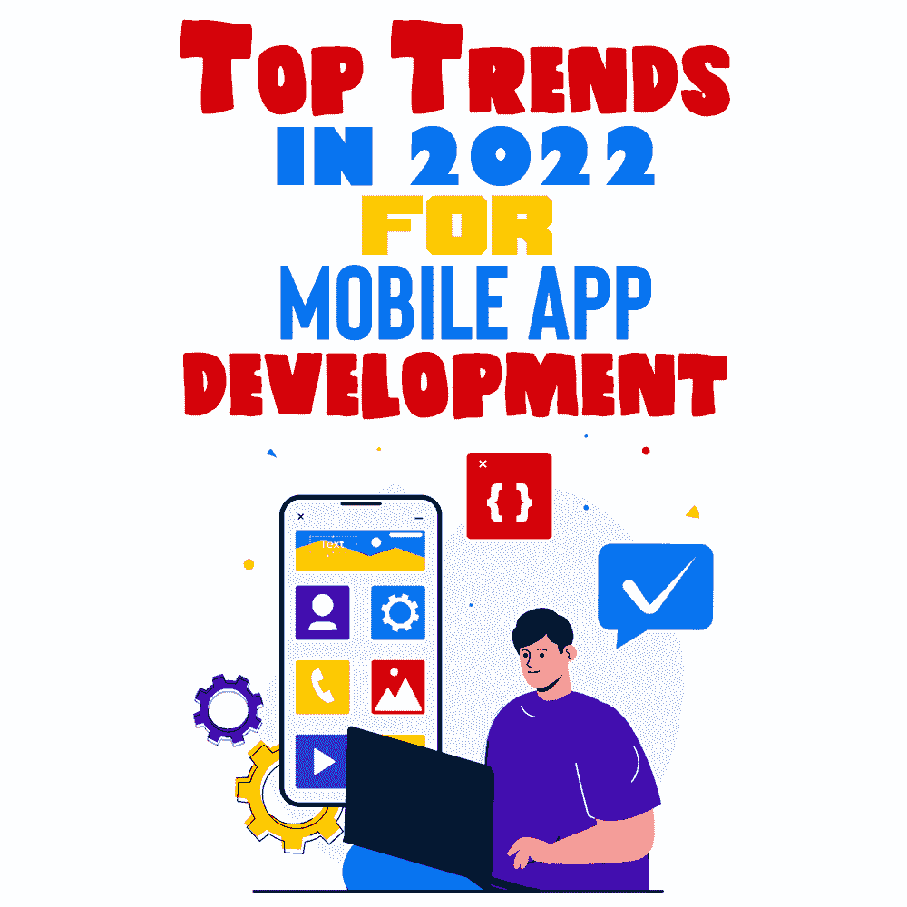

# 2022 年移动应用开发的主要趋势

> 原文:[https://simple programmer . com/mobile-app-development-trends-2022/](https://simpleprogrammer.com/mobile-app-development-trends-2022/)

With over 2.87 million apps for Android and 1.96 million apps for iOS on the Apple Store, mobile apps already dominate the digital world. The speed of smartphone penetration worldwide and mobile-first technologies are starting to prevail over stationary devices, which means businesses will soon choose mobile apps as a primary means for users to reach out. New technologies’ evolution makes mobile apps even more comfortable, breaking the limits of possibilities.

最新统计显示，全球智能手机用户超过 63 亿(目前世界人口略超过 79 亿)。你的朋友、家人或同事中可能没有一个人没有智能手机。我们都依赖智能手机，每天查看 160 多次，88%的移动时间花在应用上。

至于未来带来什么？以下是一些当前的移动应用统计数据:

*   预计到 2023 年，移动应用将产生 9350 亿美元的收入。2020 年仅为 1110 亿美元。
*   70%的数字媒体来自移动应用。
*   每月有 100，000 个 Android 应用程序在市场上发布。
*   50%的移动使用时间花在社交媒体上。
*   78%的用户更喜欢手机 app 购物。

今年，我们将看到领先技术的变化和发展，这些技术已经存在了一段时间，但将在 2022 年深入人心。以下 20 大移动应用开发趋势将揭示未来的技术，并帮助我们弄清楚会发生什么。

## 前 20 大趋势 MobileApp 开发技术

俗话说，未来就是现在，当前的移动技术趋势也是如此。无论你是移动应用程序开发者、营销人员还是用户，下面的列表肯定会让你感兴趣，帮助你描绘出移动应用程序在不久的将来的前景。

### 1.5G 成为主流

5G 是最令人期待和突破性的技术之一——自 2020 年以来就已经存在，尽管我们仍在等待它的全球渗透和可用性。这项技术带来的速度、准确性和效率最终将加速其他技术的发展。

市场上已经有 6.6 亿支持 5G 的设备，为用户提供了使用 100 倍速度连接的无限选择。5G 还会给我们带来什么？

*   延迟从 50 毫秒减少到 1 毫秒
*   改进的视频流
*   增强现实(AR)和虚拟现实(VR)的整合更加顺畅
*   超高速数据传输
*   快速移动支付
*   改进的 GPS 性能
*   智慧城市和物联网(IoT)的新机遇

### 2.物联网和云

不断增长的物联网网络继续发展，技术越智能，设备的渗透就越深入。智能家居、智能汽车、智能城市不再是创新；它们是我们日常生活的一部分。到今年年底，物联网市场将达到 2640 亿美元。该行业的最新消息是“回声”设备和谷歌家庭语音控制器，可以完全控制你的设备。

2022 年，物联网技术将有以下更新:

*   增强网络安全
*   物联网在医疗保健行业的进展
*   通过机器实现业务流程自动化
*   可持续性支持

云计算的发展和扩展将显著提高物联网的生产力和网络支持。今年，企业将采用具有更大灵活性和私有云选项的多云和混合云环境。无服务器计算也将越来越受欢迎，消除后端故障的风险。

### 3.人工智能和机器学习

我们已经生活在一个由人工智能驱动的世界，每天都有前所未有的人工智能和基于人工智能的创新出现。预计 CAGR 为 39.4%，从 2022 年到 2030 年，全球人工智能产业将达到 207.6 亿美元，为数字社区提供基础解决方案。预期的未来趋势如下:

*   具有面部识别功能的视频分析
*   改进自动化网络安全
*   艾在元宇宙扮演的重要角色
*   自然语言处理
*   高度自动化减少人力
*   量子人工智能—精确的数据分析和模式预测

### 4.移动商务

在疫情，电子商务和移动商务飞速发展，提供足不出户的购物自由。2022 年，该技术将继续发展，将移动商务推向前沿。它将更快、更安全、更智能。还能期待什么？

*   智能聊天机器人，方便客户联系
*   无需注册，一键订购
*   语音搜索和语音购物
*   购物时的 AR 和 VR 体验

### 5.即时应用和渐进式网络应用(PWAs)

移动应用市场的创新是无需下载即可测试的即时应用。下载一个应用程序，经过测试，然后因为没有达到预期而删除它，这是很常见的。现在一切都更简化了。用户可以通过网络链接测试和使用这款应用，而无需安装。

PWAs 因在任何设备上都可以访问和可靠而得到增强，是移动应用开发的下一个主要趋势，很快将取代原生应用和网页。

### 6.可穿戴应用集成

如果不是已经统治，可穿戴设备可能会很快接管世界。到 2022 年底，可穿戴设备的总数将达到 9.29 亿，包括所有类型的手表和追踪器。移动应用程序应该创建与可穿戴设备兼容的解决方案，以提供无缝的数字体验来跟上步伐。

即将推出的新可穿戴设备和趋势包括:

*   谷歌像素手表
*   磨损 3.0 推出
*   智能戒指健身追踪
*   智能眼镜可以在视频中记录事件
*   智能手表中的葡萄糖跟踪
*   Meta 智能手表
*   跟踪酒精的可穿戴设备

### 7.信标技术

自 2013 年开始使用以来，beacon 技术已经变得越来越突出，对企业越来越重要。基于位置的技术的未来将更加集中在物流和运输行业。新的蓝牙低能耗信标将用于资产跟踪甚至人员跟踪，例如医院中的病人监控。

### 8.增强现实/虚拟现实

Virtual showrooms, e-commerce stores, and virtual try-on solutions rapidly gain popularity across mobile apps, making the user experience more realistic, thus driving higher conversion rates. We will have some new features with extended reality (XR) this year, a catch-all term for AR and VR:

*   交互式用户手册
*   下一代购物体验的虚拟现实
*   元宇宙的 XR 界面——由我们的身体控制的自然无触摸界面
*   电子学习中的 XR，学习者被传送到一个模拟真实训练场景的多感官学习环境中

### 9.可折叠手机应用

2022 年，市场上将出现超过 5000 万台新的可折叠设备，推动与可折叠设备兼容的应用程序的发展。视频流服务和游戏将获得更好的体验。

移动应用程序开发将专注于为扩展和压缩屏幕创建产品，以获得更好的用户体验。

### 10.交付应用

在封锁期间，送货服务和应用程序让我们的生活更加舒适。2022 年，安全的支付系统、精确的位置、客户支持等将使食品、杂货和其他配送服务变得更快、更可靠。其他点播应用(美容、医疗保健、打车服务等。)也将继续增长，并在市场中显示出成功的变化。

### 11.娱乐和游戏

今年，游戏和娱乐应用将成为全球下载量最高的应用。截至 2021 年底，用户已经在手机游戏上花费了 1200 亿美元。据统计，在 App Store 上，每四个非游戏应用中就有一个游戏应用。今年，我们希望看到以下变化:

*   更具包容性的移动游戏
*   借助 5G 提升游戏体验
*   移动游戏的更多观赏性
*   元宇宙有 NTFs 和“玩即赚”机会

### 12.超级应用

听起来很酷，但超级应用确实意味着特定类别的移动应用。企业正在从单一用途的应用转向超级应用，即多用途的一站式解决方案。从亚洲市场开始，超级应用在其他市场也慢慢流行起来。例如，脸书可以被称为超级应用，因为它只是一个社交媒体平台，现在是一个市场。

### 13.点对点(P2P)应用和移动钱包

当考虑网上支付时，我无法想象有多少人不喜欢这个选项，也不愿意有一天放弃现金支付。2019 年，移动钱包完成了价值 61 亿美元的交易。预计到 2025 年，这一数字将增长 74%。

在 2022 年，移动钱包集成将成为移动优先的优先选择。所有的银行都已经有了手机银行和手机钱包。他们中的一些人仍然有一个可怜的 UX，但他们仍然给网上支付自由和功能。

预计移动应用开发领域的一个趋势是点对点(双方之间的资金转移)移动应用。根据 eMarketer 的数据，到 2023 年，预计将有 6122.3 亿美元用于 P2P 移动交易。

P2P 是企业和消费者支付和收款的救命稻草和双赢解决方案。今年，我们可以期待 P2P 支付的以下趋势:

*   社交媒体平台中的内置支付
*   内置支付功能的移动操作系统
*   加密货币钱包

### 14.区块链

这项技术已经走过了漫长的道路，现在被应用于不同的领域和行业，收入很快超过 200 亿美元，并保持稳定增长。[区块链](https://www.amazon.com/dp/1736544101/makithecompsi-20)将用于移动应用开发中的去中心化应用和钱包，以跟踪和转换加密货币。区块链即服务(BaaS)将提供安全的工具和软件来维持支付、防止欺诈和处理选举。

### 15.预测分析

为了处理大数据和提取洞察力，移动应用程序应该得到强大工具的支持，即[预测分析](https://www.amazon.com/dp/0262044692/makithecompsi-20)，它可以学习用户行为并根据客户偏好生成结果。

例如，网飞使用预测分析，根据用户的习惯或历史推荐电视节目和电影。今年，预测分析将覆盖更多细分市场(零售、银行和金融服务；健康保险；制造业；等等。)并提升用户体验。它也可以在移动开发过程中用于收集数据和发现潜在问题。

### 16.移动学习

从全球疫情开始，电子学习已经成为最受欢迎的选择，在全球范围内扩大和吸引更多的学习者。移动学习已经占据了电子学习的 67%,是一种更加舒适和实用的移动学习选择。2022 年，移动学习将获得一些新功能:

*   排行榜和奖励的游戏化
*   个性化——围绕特定需求为个人量身定制计划
*   AR 和 VR
*   采用[人工智能技术的自适应学习](https://addevice.io/blog/how-to-build-an-ai-app/)

### 17.面向移动应用的 3D 图形

移动用户界面和 UX 将会有一些奇妙的功能以及复古和现代元素的结合。作为 2022 年移动用户界面/UX 趋势的总结，最受欢迎的功能将是 3D 图形和实时效果元素。然而今年，3D 图形将更具功能性而非装饰性。比如将 3D 元素完美融入店铺，更真实全面的展示产品。

### 18.卓越的应用安全性

随着智能手机的深入渗透和成千上万处理敏感数据的应用程序的开发，移动安全问题变得更加重要。针对移动设备的恶意软件攻击增加了 54%。涉及移动设备的欺诈占总欺诈的 60%以上。全球社区需要超级安全工具和选项来保护。2022 年移动安全趋势将为我们带来更多保护:

*   更高安全性的生物识别访问控制
*   更清晰的视频安全成像
*   移动操作系统中更新的安全和匿名级别

### 19.聊天机器人

Digital technologies are getting more user-friendly and customer-focused, so customer services are a priority regardless of business type. To save on human resources and deliver higher productivity, both web and mobile platforms are now integrating AI-based chatbots that are faster and smarter. [Chatbots](https://simpleprogrammer.com/how-to-build-a-chatbot/) have proven to be a top-notch solution to increase conversion rates, not even being part of digital marketing efforts.

### 20.跨平台和全渠道方法

牢记用户体验，企业努力在所有可能的接触点上提供无缝体验。普通消费者可能会使用多达六种不同的设备，这意味着企业应该考虑至少四种设备，以便客户可以获得类似的体验。响应式网络应用和跨平台移动应用完美地应对了这一挑战，统一了用户体验。

## 移动应用的未来

移动应用将继续利用新技术和工具改变商业环境和用户体验。移动应用已经成为我们最好的朋友，舒适的在线支付、游戏和通信让我们依赖于它们的功能。

到 2022 年底，将会有一些变化和市场增长，包括 metaverses，虚拟现实和智能机器人，以及我们从未见过的完全革命性的，令人兴奋的技术。但我们可以绝对肯定的是，世界永远不会是原来的样子。