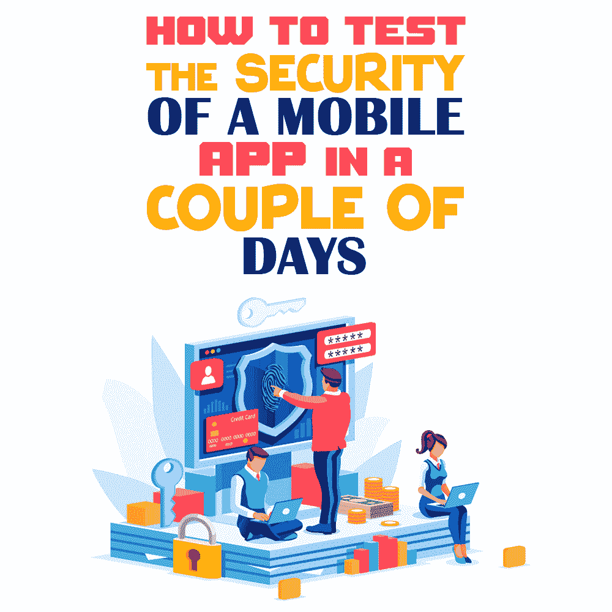

# 如何在几天内测试手机应用的安全性

> 原文：<https://simpleprogrammer.com/mobile-app-security/>

Many companies create their own mobile applications to simplify work, allow users to get acquainted with goods and services, or facilitate financial transactions.

不幸的是，这类应用程序的流行意味着它们经常成为黑客的目标，这些黑客的目标是用户的个人数据和银行账户。因此，需要进行测试来维护安全。

彻底的测试在金钱和时间上都是昂贵的。对于许多小公司来说，这样的成本可能令人望而却步。但是这并不意味着唯一的选择就是根本不测试。

在这篇文章中，我将向你展示如何快速有效地测试移动应用的安全性。这样，您可以在预算和时间限制内最大限度地提高效率。

## 如何制定移动应用测试策略

在测试[移动应用](https://www.amazon.com/dp/1785883372/makithecompsi-20)的安全性之前，要做的第一件事是设计一个测试策略。这很重要，因为它将决定你在测试过程中的优先次序。一般来说，在制定策略时，您应该考虑以下几个方面:

*   **自然。**如果使用 app 进行交易，一定要仔细检查安全性。除此之外，还必须测试功能。对于教育、物流和社会应用，不需要密集的安全检查。

*   **所需时间。**估计有多少时间可以验证。如果还不够，就要分清轻重缓急，选择主要方面。

*   **努力。检查应用程序的安全性总是比检查功能和其他属性花费更多的时间和精力，因此有必要为它选择最有知识的专家。**

*   **知识。**重要的是要考虑到学习代码、工具和 web 服务的显而易见的简单性和对高水平知识的需求。

在您确定了您的策略之后，下一步是考虑您的测试环境。

## 移动应用和测试环境的类型

超过一半的互联网用户使用移动设备访问网络，这解释了移动应用程序的流行。一般来说，我们可以将移动应用分为三种类型:

*   **移动。**它们类似于标准的网络应用程序，使用智能手机的浏览器打开。
*   **本土的。**这些是为一个操作系统规定的，不能在其他操作系统上运行。
*   **混血儿。**他们结合了网络和[本地应用的特点](https://www.amazon.com/dp/1838643311/makithecompsi-20)。它们看起来像一个应用程序格式的网站。

每一款手机应用都有很多优点和缺点。例如，web 应用程序不支持独立的功能，不像原生功能，但后者的开发成本会高出一个数量级。此外，如下图所示，在你应该使用什么工具进行测试方面，应用程序的类型可能很重要。

由于设备有多种形状和形式，测试时需要考虑许多相关因素:

*   屏幕分辨率
*   打开或关闭 [GPS](https://en.wikipedia.org/wiki/Global_Positioning_System)
*   屏幕方向(横向、纵向)
*   设备制造商
*   操作系统版本

检查时，这些因素都很重要，因此最好在多个设备上同时进行。

一般来说，最好在真实设备上测试，选择市场上最流行的型号，使用不同的操作系统和分辨率变化。

然而，大量的高端智能手机可能会使这种选择在成本方面不切实际或令人望而却步。因此，您还需要考虑使用仿真器或模拟器，它们是允许您模拟设备功能的工具。

模拟器完全取代了手机，但是你不能修改其中的程序。你只能发射它。模拟器最适合用于*移动*类型的应用程序。

另一方面，**模拟器**让你建立一个类似于[操作系统](https://simpleprogrammer.com/react-native-vs-android-ios-development/)的环境，但它并不复制硬件。模拟器是*本地*应用的理想选择，但是不提供广泛的分析。

除了在仿真器和模拟器之间进行选择之外，您还需要选择是手动还是自动执行测试。

事实是，手工测试在今天几乎从未被使用过。错误的可能性、过程的缓慢以及大量的验证使得该方法不太受欢迎。自动测试可以快速处理任务并显示出很高的效率。一个额外的好处是，定期使用更便宜，因为脚本可以重用。

而且，还可以使用云测试来进一步简化测试过程。基于云的工具很容易获得，提供了同时在多个设备上运行的能力，在经济上是有利的，并且允许定制和验证。主要缺点是依赖网络连接。

## 移动应用测试阶段

一般来说，测试移动应用程序包括五个阶段:

1.  **准备阶段。**确定检查的类型，选择工具，收集有关应用程序的信息，以及组织敏感数据。
2.  **数据收集。**分析应用程序及其各部分的结构以及周围的上下文。
3.  **应用地图模拟。**这是通过自动和机械扫描完成的。有必要强调所有的漏洞、信息的入口和出口点以及它们的存储规则。所有漏洞都按优先排除顺序排在最后。
4.  **剥削。**测试人员尝试依次部署所有收集到的漏洞。这对于理解它们是否有效是必要的。
5.  **报告。**所有的漏洞都被取出，分类，列表收集。

测试方式有三种:[白色](https://en.wikipedia.org/wiki/White-box_testing)、[灰色](https://en.wikipedia.org/wiki/Gray_box_testing)、[黑色](https://en.wikipedia.org/wiki/Black-box_testing)箱子。它们在第三方验证过程中使用，以增加应用程序的安全性，并且在提供的信息量方面有所不同。

## 移动应用测试挑战

当测试时——尤其是当测试有时间和预算限制时——您可以将精力集中在某些问题上，对它们进行优先排序。测试时要注意的主要问题如下:

**威胁分析。**注意用户信息泄露到黑客手中可能存在的风险:

*   从商店下载应用程序时，系统会要求您提供 Google 帐户或 Apple ID 信息。
*   在保存登录信息的应用程序中。
*   在公开用户数据的应用程序中。
*   从 web 服务发送或接收数据时(所有服务调用都必须加密)。

**漏洞分析。你需要彻底检查你的应用程序的漏洞，并找到有效的方法来应对它们。**

来自黑客的安全威胁。不幸的是，没有 100%抵御黑客攻击的保护。为了尽可能避免它们，试着不要像开发人员那样思考，而要像攻击者那样思考，以便发现漏洞。如果你是一名黑客，你会首先攻击你的应用程序的哪个部分？

**寻根和黑客威胁。**某些人为操作可能会导致黑客攻击/寻根，从而导致验证过程中难以重现的错误。这些后果的例子包括:

*   安装附加的应用程序扩展。
*   黑客代码可能很危险。
*   这种设备没有经过开发人员的测试，所以它们的行为经常不可预测。
*   银行应用程序可以停用根手机的功能。

在比较 Android 和 iOS 安全测试的问题时，值得注意的是，后者拥有更先进、更不易受攻击的系统，以至于 Android 上每 100 个被黑客攻击的应用程序，iOS 上只有一个。关于安全测试的完整说明可以在 studocu.com 或类似的为学生提供教育材料的机构找到。

## 安全可以通过策略来实现

[手机 app](https://simpleprogrammer.com/programming-languages-mobile-app-development/)

安全测试是一个复杂的过程，需要很多知识。为了能够在几天内进行快速而有效的检查，考虑策略、根据所有标准正确评估您的应用并选择最佳工具非常重要。

在你设计好策略之后，设置你的测试环境，探索操作系统、工具和硬件的细节，这取决于你正在处理的移动应用的类型。尽可能在真实设备上测试；否则，根据需要使用模拟器和仿真器。

总的来说，使用你熟悉的工具。您还可以尝试使用基于云的工具来简化测试。记住使用日志、截图和视频屏幕记录保存检查结果，并在完成后检查测试质量。

要记住的另一个方面是，应用程序是由人而不是机器使用的，所以要根据用户的需求和愿望进行测试和调整。为了帮助实现这一点，还可以要求用户对所做工作的质量进行评级。

最终，**像黑客一样思考**并预先评估最易受攻击的地方——这将是维护用户应用数据安全的最佳策略。