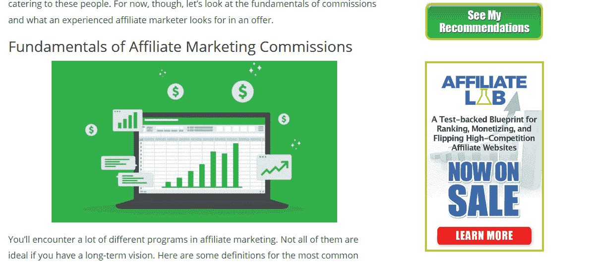
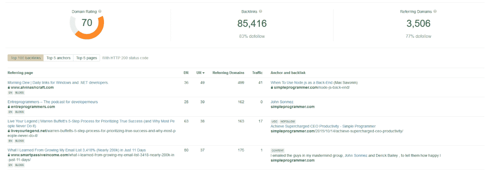

# 如何通过联盟营销将你的编程博客货币化

> 原文:[https://simple programmer . com/moneye-programmine-blog-affiliate-marketing/](https://simpleprogrammer.com/monetize-programming-blog-affiliate-marketing/)

If you’re passionate about programming, you may well have considered starting a programming blog. Blogging can be a great way to share your interests and expertise, establish your professional credibility, and connect with others in your industry.

但是你知道你也可以通过写博客赚钱吗？

或者你已经经营了一个编程博客，但是你还没有把它赚钱。如果是这样，你就错过了一个潜在的有利可图的收入来源。联盟营销是将博客内容货币化的最有效方式之一。即使你对博客不感兴趣，如果你是一个为客户建立网站的程序员，你可能会发现这些信息很有用。

在这篇文章中，你将学习联盟营销以及如何开始使用它来赚钱一个[编程博客](https://simpleprogrammer.com/blogging-tips-for-programmers/)，无论是你自己的还是客户的。

## 什么是联盟营销？

联盟营销是一种收入共享。您，即代销商，使用唯一的代码或推荐链接为另一个企业，即商家推销产品或服务。当有人使用你的链接进行购买时，你可以按约定的百分比获得佣金。代销商佣金的范围是 2%-50%，取决于报价。

我教联盟营销的原因是:因为它有效。我不是一个夸大收入或承诺你能在六个月内辞掉日常工作的人。然而，我可以告诉你的是[2017 年的一项研究表明](https://www.viglink.com/blog/2017/05/15/state-affiliate-marketing-survey/)9%的代销商每年的收入超过 5 万美元，而 65%的代销商年收入的 5%至 20%来自代销商营销。

此外，几乎没有启动成本，尤其是如果你已经有了一个有流量的博客或网站。你应该永远不必支付加入联盟计划，你不必购买任何产品或服务。

联盟营销的另一个好处是，它可以让你赚取被动收入。只要你的链接保持活跃，只要有人点击并购买，你就能赚钱。

然而，管理你的期望是很重要的。联盟营销不是一个快速致富的计划。这需要时间和努力来增加你的代销商收入。如果你已经有一个拥有大量读者的博客，你可能会更快看到结果。但如果你是从零开始，可能需要几个月才能看到可观的回报。

联盟营销的性质也意味着没有收入保证。直到有人使用你的链接从商家那里购买产品，你才得到报酬。你的收入可能会逐月波动，有时原因完全在你的控制之外。

由于新冠肺炎危机及其对销售的影响，一些代销商的收入在最近几个月有所下降——由于失业和经济衰退的威胁，许多消费者都在关注他们的支出。

由于亚马逊联盟计划(Amazon Associates program)佣金的变化，其他联盟营销商的佣金也有所下降(亚马逊大幅削减了许多计划的佣金，并在 2020 年 4 月完全停止了一些计划)。

幸运的是，新冠肺炎对科技和软件行业转型的宏观影响相对较小。

如果有一个信息，我想让你带走，这是:你把你的营销策略越多，你会得到更多。让我们看看怎么做。

## 如何选择合适的加盟计划和推广产品

既然你在经营一个编程博客，你会想把重点放在推广与这个领域相关的产品和服务上。

这可能包括物理产品，如计算机和相关硬件，信息产品，如编程课程和 T2 书籍，以及服务，如虚拟主机和虚拟专用网。信息产品和服务的佣金率往往高于实物产品。托管和虚拟专用网服务是联盟营销者在 T4 最赚钱的领域之一。

推销产品时，不要害怕打破常规。你可以为那些整天坐在办公桌前的程序员写一些健康的办公习惯，并利用这个机会推广符合人体工程学的办公椅或家用健身器材。

### 我如何找到要加入的网络？

You can join as many affiliate networks or programs as you like, but there is no point in joining more offers than you realistically have the capacity to promote. I suggest starting with no more than two or three. You can always scale your efforts at a later date.

加入会员计划有两种主要方式:直接通过商家，或通过会员网络，如 ClickBank、Rakuten 或 ShareASale。

新的联盟营销者通常会通过联盟网络开始。ShareASale 和 T2 Impact 对科技博客来说是很好的联盟网络，提供物理计算产品和 IT 服务。[如果你想推广在线课程等信息产品，乐天](https://signup.linkshare.com/publishers/registration/landing?)是个不错的选择。

如果一个商家有自己的代销商项目，你通常会在网站上的“代销商”标签中找到详细信息。你需要通过表格或电子邮件申请。对于较大的联盟网络，你可以通过网络自己的网站在线申请。

### 探索您的关键字和搜索词

读者使用什么搜索词来找到你的博客？深入研究你的谷歌搜索控制台分析，看看哪些关键词给你的博客带来了最多的流量。将你的代销商内容集中在这些术语上，将会给你关键的洞察力，让你知道哪些代销商营销优惠最有可能转化。

例如，如果你发现很多人通过搜索词“学习用 Python 编程”找到你的博客，你可以为想学习这种编程语言的人推销信息产品。

## 如何创建内容策略

你的内容质量是你的联盟营销成功的最重要的因素。

如果你持续提供高质量、可读的内容，为你的读者提供价值，你将建立一个信任你的忠实粉丝的基础。这种信任是一种珍贵而有价值的商品。如果你的读者相信你所说的，他们只会根据你的推荐购买产品。

你的内容策略是你个人品牌和企业整体营销的一部分。你所做的每一个决定——发布内容的类型、发布的频率、使用的语气和声音以及推广的附属产品——都必须符合你更广泛的营销目标。

我建议使用编辑日历。你不必绝对严格地坚持它，但它会帮助你保持组织性，并以一种战略性的方式处理你的内容。

在这一节中，我们将讨论编程博客的最佳联盟营销内容类型。

### 操作指南

很可能你的许多读者会一次又一次地回到你的博客，因为你提供了一个有价值的资源。无论你是分享关于你最喜欢的编程语言的教程，给那些想在这个行业发展的人的建议，还是调试代码的技巧，可获得的和可操作的建议将会建立一个忠实的读者群。

你可以在你的操作内容中自然地包含附属链接。您可能会建议一种工具，可以帮助您的读者解决他们的编码问题，或者推荐一本书或一门课程，在那里他们可以找到关于某个特定主题的更多信息。

这些优惠的转换率会很低，因为这些内容的用户意图很低。用户意图仅仅意味着客户来你的页面或网站的意图是什么。如果他们不是在寻找一个特定的产品或解决方案，用户的意向可能很低。

### 行业新闻和观点

Things move fast in the IT world, so all tech professionals know how important it is to keep your finger on the pulse of industry updates. Whether a game-changing new product has just hit the market, an innovative app is taking the world by storm, or technology is being used in a new way to solve a pressing problem, your readers will want to know about it. More specifically, they will want to know what you think about it!

花时间阅读行业新闻，形成自己的观点，并与读者分享这些观点。您可以在内容中的自然点包含您的附属链接。同样，不要指望这类内容的高转化率。

### 产品评论

产品评论是最受欢迎的联盟营销内容之一，这是有原因的。它们非常有效。研究显示，91%的消费者阅读在线评论，84%的消费者认为这些评论和个人推荐一样可靠。

评论对于技术领域的联盟营销者来说特别有用，因为计算机产品和服务通常是高价产品。因此，消费者很可能在购买前阅读评论，以确保他们获得良好的价值。

你的评论应该尽可能详细和深入，涵盖产品的所有相关功能，以及优缺点。包括高质量的图片和视频内容(如果可能的话)。

诚实至关重要。如果你发现某个产品有缺陷，就不要推荐它。快速佣金不值得侵蚀你的读者的信任。相反，解释为什么你不能推荐这种特定的产品，并建议一种更适合的替代品。

你可以回顾各种各样的科技产品和服务，或者专注于一个特定的领域。你必须决定哪个对你的博客和读者最有意义。

### 汇总或比较

综述或比较片列出了几种产品，并讨论了每种产品的特点、优点和缺点。它们非常适合帮助人们在两种或多种产品之间做出选择。

以下是一些你可以考虑的例子:

*   初学者的最佳编程课程
*   程序员的 10 个最佳键盘
*   ExpressVPN 或 Surfshark:哪个 VPN 最适合技术专业人士？

遵循我们刚刚讨论的综述的规则:诚实。如果你告诉你的读者某样东西很棒，而它并不棒，你将永远失去他们的信任。

### 将你最受欢迎的内容货币化

如果你真的想发展你的博客，你应该定期检查你的统计数据。使用谷歌分析，你可以看到哪些内容是最受欢迎的。结果可能会让你吃惊。我知道一些博客的读者最多的内容是他们几年前发表的。

这是有意义的回过头来编辑旧的内容，仍然得到了很多的意见，以插入您的附属链接。你不必对每一篇旧文章都这样做，但是将前五篇或前十篇文章货币化会有很大的不同。

### 混合你的内容，但要有策略

你不必只选择一种类型的内容并坚持下去，但你应该有一个一致的内容策略。如果你能管理好的话，定期的内容安排是理想的。例如，你可以在周一发布一篇产品评论，周三发布一篇编程教程，周六发布一篇行业新闻综述。

## 使用横幅广告

虽然定期更新博客内容至关重要，但你也不应该忘记博客和网站中更多的静态元素。

你博客上的边栏是有价值的空间。你充分利用它的潜力了吗？如果你的代销商网络提供了视觉资产，比如横幅广告(大多数都是这样)，把其中一些插入你的博客侧边栏。以下是我在 Diggity Marketing 上的做法:

侧边栏广告比有机插入内容的链接点击率低，但仍然值得使用。我建议不时地改变它们，以鼓励新的点击。

## 扩大你的电子邮件列表

你可能已经听过这句话成千上万次了:“钱在清单里。”这句话背后有一定的道理。

电子邮件是投资回报率最高的营销渠道之一。这是因为你可以和你的读者建立关系。然后，你可以利用这种关系和你建立的信任，向他们推销你自己的产品或服务，或者推荐他人的产品或服务。

增长邮件列表背后的基本原则非常简单。我建议使用 lightbox 或选择加入表格，无论是在帖子中还是在你的侧边栏上，来收集电子邮件线索。然后，您可以向这些新订户发送您所在行业的精彩内容和特别优惠。

## 如何给你的网站带来更多的流量

达到你的联盟营销目标的最好方法是确保合适的人能找到你的网站。因此，专注于你的 SEO 来提高你在搜索引擎结果页(SERPs)上的排名是必不可少的。

你的反向链接档案是指有多少其他网站链接到你的网站。你拥有的反向链接越多，它们来自的网站的权威性越高，你的 SERP 排名就越好。

对于博主来说，客座博文是获得高质量反向链接的绝佳策略。客座博文是指向另一个博客或网站提供一段内容，以换取一个指向你的博客或网站的链接。

### 寻找访客发布机会

使用 [Ahrefs 的反向链接检查器](https://ahrefs.com/backlink-checker),在你的领域搜索一个高性能的网站:

研究该网站的反向链接资料将会发现你可以寻找客座博文机会的网站。不考虑任何与编码、编程或科技行业无关的内容。我也建议删除所有域名等级(DR)低于 50 的网站。

一旦你有了目标网站列表，礼貌地给编辑发一封电子邮件，介绍你自己，并询问他们是否对客座博文感兴趣。如果你有某个特定的专业领域——例如，如果你知道一种不寻常的编程语言——在你的拓展邮件中突出它。

## 将你的网站建立为一种资源

如果你提供信息或基于建议的内容，你可以通过成为你所在领域的有价值的资源来建立一个有机的反向链接档案。例如，如果业内的同事和博主知道你的 C++教程是首屈一指的，他们很可能会向他们的读者推荐你。

成为一个众所周知和值得信赖的权威需要时间，这不是一个你可以依赖的快速取胜的策略。但是那些有机的反向链接，人们推荐你的内容没有别的原因，只是因为他们真心相信它是有价值的，是你能得到的最好的一种。

## 利用你的社交媒体渠道(包括付费广告)

社交媒体是在线推荐流量的最大来源之一。你使用哪个频道将取决于你的观众在哪里。如果你为行业专家写一个严肃的博客，LinkedIn 和 Twitter 可能应该是一个重点。另一方面，如果你针对刚入行的年轻人撰写非正式内容，脸书甚至 Instagram 可能是更好的选择。

在社交媒体上分享你的博客文章的链接，用一行摘要或快照来吸引读者点击。你还应该专门为你的社交媒体渠道创建内容。使用图像、[信息图表](http://venngage.com/blog/what-is-an-infographic/)、视频和音频内容将增加你的帖子的参与度和你博客的点击率。

在平台允许的情况下，你可以在你的社交媒体渠道上直接分享你的会员链接，但是要记住，主要目的是让流量回到你的博客。

你也不应该回避付费社交媒体广告。付费社交媒体投放，如脸书广告和推广推文，对联盟营销人员来说至关重要。当你制作广告时，记住你的目标是鼓励人们点击进入你的博客或销售页面。

一开始你也许可以避免付费广告，但是如果你想让你的博客和你的联盟营销更上一层楼，你就需要投资。要舍得花钱赚钱，俗话说！

## 坚持不懈，耐心等待

联盟营销不是一夜成名的游戏。坚持、一致和耐心是让这个收入流为你工作的关键。

然而，我一次又一次地看到联盟营销是多么有效。在目前的环境下，大多数人都呆在家里，电子商务正在经历一场繁荣，这是开始的理想时间。

如果你经营一个编程博客，你就能很好地进入利润丰厚的技术产品和服务领域。谁知道呢？如果你还没有写博客，也许这篇文章已经激励你试一试了！

为你的第一笔生意干杯！