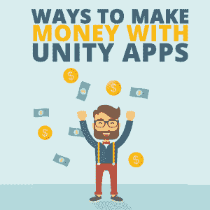
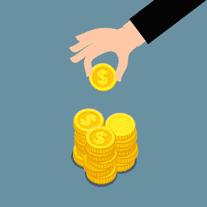

# 使用 Unity 应用赚钱的方法

> 原文：<https://simpleprogrammer.com/monetizing-unity-apps/>

Unity has made creating apps for the Apple App Store and Google Play extremely easy with its Unity editor and tools. [You only need to create one codebase](https://simpleprogrammer.com/app-cross-platform-development/) to distribute to all the stores. And they have even developed services to allow for extending your apps and adding additional streams of revenue into the project even easier.

但是，哪种流适合您和您的应用程序呢？它的潜在收入与你的金钱目标、商业目标和发展技能一致吗？从长远来看，如果能让你赚更多的钱，成本更高、需要更多开发工作的货币化方法会是更好的选择吗？

这个关于开发者从他们的 Unity 应用中赚钱的典型方式的讨论将帮助你回答这些问题。

## 货币化方法

有许多方法可以将你的 [Unity](https://unity3d.com/) 应用货币化。然而，我将讨论那些众所周知的:

*   足价
*   Unity IAP
*   免费增值
*   统一广告
*   Unity 资产商店

### 以全价出售你的应用

当 App Store 在 2008 年 7 月首次推出时，将你的应用程序货币化的唯一方法就是以全价出售。

2008 年，苹果应用商店内只有大约 2.3 万个应用和游戏，而 2018 年的应用和游戏总数约为 220 万个。

早期的收入潜力要高得多。售价 1.99 美元的小而短的简单应用程序足以吸引开发者放弃他们的日常工作。这是因为竞争和市场都很小，用户群在应用程序的高质量内容方面没有那么成熟。

全价商业模式仍然是最容易建立和预测你的应用销售的。由于苹果和谷歌 Play 的分成，你产生的收入是你的应用程序全价的 70%(这不包括任何货币兑换费用)。考虑到这一点，你可以粗略地计算出，下载的应用程序数量的总价格与你将产生的收入有 10:7 的关联。

如果你想为你的 Unity 应用设置这个，你不需要做任何具体的事情。只需创建您的版本，然后上传到适当的应用程序商店，并设置您想要的价格。

### Unity IAP

2011 年，引入了应用内购买(IAP)。这些项目可能很小，比如外观升级，也可能很大，比如解锁完整版应用程序的能力。

除了您可以提供的 IAP 规模之外，目前还有三种不同类型的 IAP:

*   消费品
*   非消耗品
*   签署

易耗品是指使用时减一的物品。它们只能被使用一定的次数(通常是一次)。比如 King 的[糖果粉碎传奇](https://play.google.com/store/apps/details?id=com.king.candycrushsaga)里用的海蜇就是消耗品。非消耗品可以多次使用。一个例子是升级你的角色的盔甲。一旦购买，角色将一直使用它。订阅项目是指用户每月、每年或按开发者设定的频率支付一定费用的项目。订阅选项于 2016 年首次推出。例如，每月获取应用程序中所有更新和所有解锁内容的权限都是通过订阅完成的。

Unity IAP 需要更多的开发工作来设置，但这意味着你可以从你创建的任何一个应用程序中获得更多的收入。通过加入 IAPs，你将不会仅仅局限于在 app store 中为一个应用销售赚取一笔钱；相反，你可以赚取多倍，这取决于你设置了多少个 IAP 以及它们可以被购买多少次。

要为您的 Unity 应用设置此功能，您需要从 Unity 项目的服务窗口中选择应用内购买选项。接下来，您需要选择适当的 COPPA 选项，然后保存更改。

您需要先在适当的 app store 中创建应用，才能设置您的应用 ID 和应用内购买。一旦通过验证，您就可以设置您的应用 ID，并在 Unity 中将您的应用内购买设置为与 app store 中相同的类型和费用。

如果你在全价应用中提供 IAP，那么用 IAP 赚的钱总是额外的。最大化 IAP 收入的最好方法是仔细观察你卖的 IAP 和多少钱。如果你发现 1.99 美元的商品比 4.99 美元的商品卖得多，你可能要考虑改变 4.99 美元商品的价格或提高 1.99 美元商品的价格。

在调整商品价格和选择删除某些商品时，一年中的时间、外部因素(例如，每年的事件)以及商品本身都应该考虑在内。确保你看了所有的证据(希望有你的应用程序分析的支持！)在你做出改变之前。

所以，一开始潜在的收入是不可预测的，但是如果你找到一个模式，你可以从一个应用程序中赚很多额外的钱。

### 免费增值

Freemium means that you offer an app as a free download and provide the user with an IAP option within the app. This business model combines a free app with an IAP option.

免费增值现在被应用程序开发者普遍使用，因为用户喜欢在购买前尝试。这让他们在决定购买更多产品之前，可以自由选择测试一些应用功能。

这里的开发工作量与使用 IAP 的应用程序相同。

这种商业模式是不可预测的。尽管你可以根据之前的应用程序销售额进行预测，但你无法确定有多少免费下载会转化为付费应用程序内购买销售额。最大化你的机会是很重要的，通过设计你的免费产品来展示你最好的特性，而不是马上免费赠送一切。

### 统一广告

很难找出广告是什么时候被引入应用程序的，但就我所见，它们几乎从一开始就存在了。然而，这种货币化方式本身已经变得多样化，现在有不同类型的广告可以选择集成到你的应用程序中。通过 Unity Ads，您可以选择与您的应用程序更相关的广告类别，以便您的受众更有可能参与其中。有关更多信息，请参见 [Unity 广告发布商](https://support.unity3d.com/hc/en-us/articles/213079383-Can-I-filter-Ads-that-appear-in-my-game-?mobile_site=true)页面。以下是不同类型的 Unity 广告。

**填隙式**

插播广告是静态或动态的基于图像的广告。当它们处于活动状态时，它们会填满您设备的整个屏幕，并被设置为在应用程序运行期间的特定时间触发。

**受到奖励的**

激励性广告给用户一个与广告互动的理由。例如，作为与广告互动的回报，他们可能会获得应用内货币或物品的奖励。

**横幅**

横幅广告是最古老的广告类型。这些通常会占据设备屏幕的下六分之一，并随时显示，甚至在应用程序会话的整个持续时间内都是如此。这些广告对用户的应用程序会话干扰最小，通常看起来也不是最有趣的。这可能是因为它们的设计不会将太多的注意力从应用程序的主要功能上转移开。

**视频**

视频广告通常是激励性的。但是有一些只是想让用户看广告，而不提供任何东西来吸引他们的注意力。

要将广告集成到您的 Unity 应用程序中，在 Unity 编辑器中，打开服务窗口并选择应用程序内购买选项。

广告都是为了获得点击量和浏览量。你拥有的越多，你能赚的钱就越多。但是为了从广告中赚很多钱，你需要更大的用户基础，因为支出通常来自成千上万的观看和点击。

### Unity 资产商店

资产商店是 Unity 开发者的独特市场。它提供了在你的项目中使用单个资产的对象，比如一个[箱子](https://assetstore.unity.com/packages/3d/environments/fantasy/chest-66524?aid=1100lGf7)来完成项目，比如[混乱的文字游戏。](https://assetstore.unity.com/packages/templates/scrambled-word-game-68934?aid=1100lGf7)

一旦您创建了您的项目或项目中的资产，如果您想尝试从您的努力中赚更多的钱，您可以尝试在资产商店中出售项目资产和/或整个项目(前提是您拥有项目资产的所有权利)。您从资产商店的销售中赚取 70%(Unity 抽取 30%)。

为此，您需要注册一个资产存储发布者帐户，并填写相关信息。当你上传你的资产时，你需要提供截图和其他元数据来帮助潜在买家了解更多关于你的资产的信息，以便他们购买。有关更多信息，请参见 Unity 网站上关于如何出售资产的说明。

## 什么适合你的项目？

The ways that you choose to monetize your app is a decision that must be thought about very carefully. It can affect the type of user your app attracts and the number that convert to buyers.

你需要确保你整合的盈利方式是你的目标用户所期望的、习惯的、想要使用的。因此，从他们那里获得关于他们以前购买应用程序的反馈可能会让你了解他们更喜欢使用的盈利方式，广告，订阅，或者 IAP。

提供一系列方法来试图抓住大多数用户可能很诱人，但是你添加的每种类型都可能需要更多的实现成本。开始时保持低成本，每个项目最多两个。

如果您仍然不确定在应用程序中使用哪些类型，请在应用程序目录中实现不同的类型。如果一种方法不太奏效，你会知道对你的听众来说这可能不是最好的选择。然后你可以把它换成性能更好的。这完全取决于你的反馈。

继续从你的用户那里直接或间接地获得反馈，以评估哪种货币化方法最适合你从你的项目中赚钱。