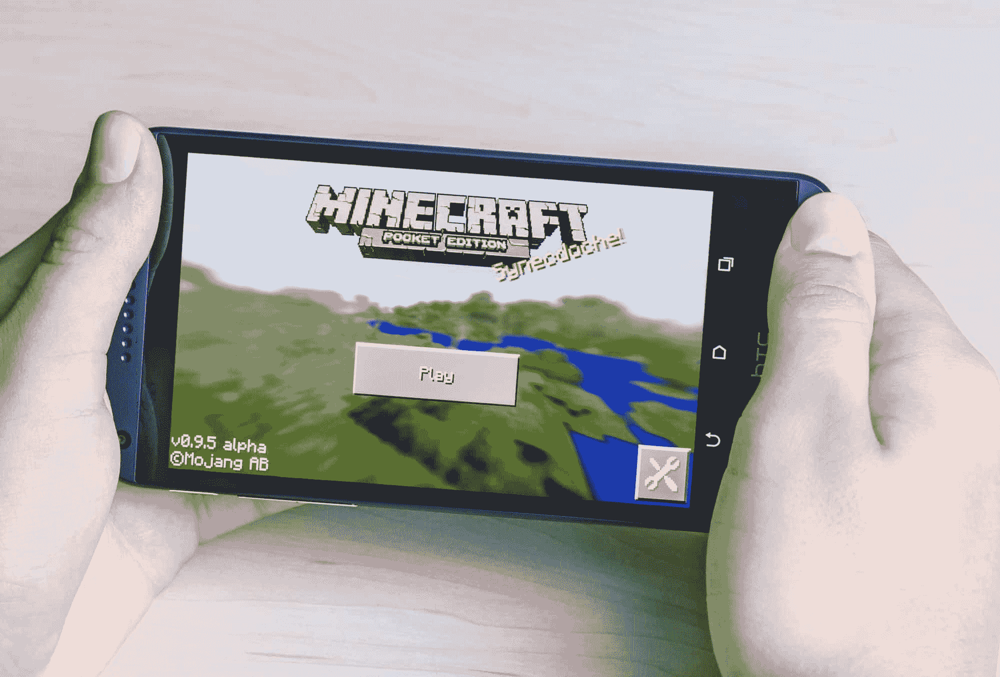
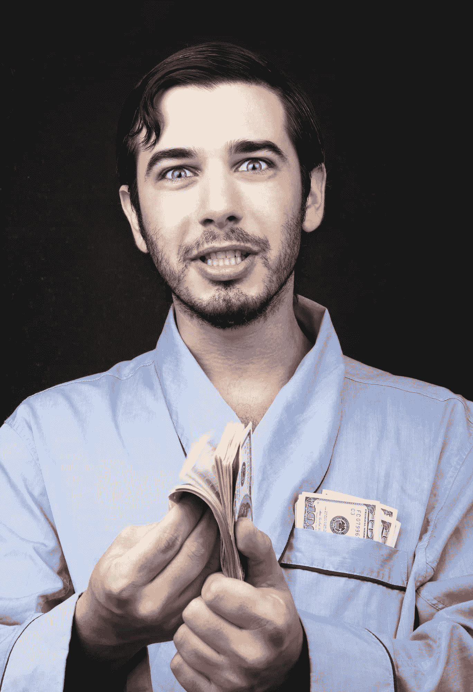

# 金钱不会让你快乐:程序员版

> 原文:[https://simple programmer . com/money-wot-make-you-happy-programmer-edition/](https://simpleprogrammer.com/money-wont-make-you-happy-programmer-edition/)

我们都听说过“金钱买不到幸福”这句话，但是我们当中有多少人真的相信这句话呢？

当然，从表面上看，我想我们大多数人都倾向于同意快乐不仅仅是拥有金钱，生活中有一些无形的、无价的东西是非常宝贵的。

但是…

在内心深处，我们大多数人真的相信更多的钱会解决我们所有的问题。

很难不去。我们生活中的很多事情都围绕着钱，并获得更多的钱。

我们每天上班是为了“养家糊口”

当我们下班回家时，我们有账单要付。

我们努力提高自己的技能，努力获得更好的工作或晋升，主要是为了赚更多的钱。

甚至当我们去度假的时候，我们经常会想到它花了我们多少钱——当我在这里参观如此昂贵的冰岛时，我是如此愉快地被提醒。

不要误解我，这一切都没有错。我的意思是，我们不能假装钱不重要。

但是错误地坚持认为有一些金钱甚至名誉会最终满足我们，让我们快乐，这是有问题的。

[我已经说了很久了](https://www.youtube.com/watch?v=6Nsl2bfSpOs)，但是我还没有一个真正好的案例研究用于软件开发世界，直到我今天偶然发现[一篇相当悲伤的文章](http://mashable.com/2015/08/29/markus-person-twitter-billionaire/)。

## **超过 10 亿美元，他仍然不开心…**

事实上，他比以前更沮丧了。

马库斯·佩尔松是瑞典程序员，他在 2009 年的一个周末创造了《我的世界》。

快进到今天，他最近以 25 亿美元的价格将自己的公司卖给了微软，轻松成为亿万富翁。

他应该高兴才对吧？

过着奢华的生活。尽情狂欢。每个人都喜欢他。他想要什么就有什么。他不用再工作了。

幸福的完美公式，对吗？

不对！

只需通读本文重点介绍的佩尔森的一系列推文[。事实上，快速浏览一下他的](http://mashable.com/2015/08/29/markus-person-twitter-billionaire/)[推特时间表](https://twitter.com/notch)。

我无意在此刻薄，所以不要误解，但当你翻看他的推特时间轴时，**他不只是看起来不开心，而是可怜。**

他似乎非常需要朋友。不顾一切地想让自己的生活有某种意义，他很不开心也很失落。

我认为这条推文总结得最好:

“得到一切的问题是你没有理由继续尝试，而且由于不平衡，人与人之间的互动变得不可能。”

## **马库斯甚至没有中彩票**

不，他实际上创造了一个游戏和一个公司，然后卖掉它来赚钱。这不仅仅是放在银盘里递给他的。

当然，他可能不需要像某些人那样努力工作来积累财富，而且他可能有一点幸运，但是他仍然可以为自己的成就感到非常自豪。

我的意思是，他实际上创造了一些在世界各地广受欢迎的东西。

他应该得到他得到的现金——他没有抢银行——但是他仍然不开心。

对我来说，这是一个发人深省的想法。

这真的让我思考我们都在为之奋斗的东西，以及它是否真的值得。

我远没有马库斯成功，我自己也感受到了。

我记得就在几年前，我还在想，如果我终于不用再工作了，那该有多好。我在想，如果辞掉工作，只做简单的程序员，并做兼职，那该有多好。

我记得当时在想写一本书并成为“一个真正的、出版的作者”会有多好

起初，这种感觉确实很好。

但是后来…就变得…嗯，正常了。

我发现，得到我一直希望并努力争取的一切并没有让我像想象的那样快乐。

我发现自己已经习惯了新的现实，甚至认为这是理所当然的。更糟糕的是，我发现自己想要得到更多。

就在那时，我真正意识到没有什么是足够好的。

这就是我们可以从马库斯的例子中学到的。

作为一名软件开发人员，很难想象会取得比他更大的成就。

他不仅开发了一款超级成功、高度上瘾的游戏，而且在他还相对年轻的时候就以数十亿美元的价格出售了这款游戏。

在某些方面，马库斯向我们展示了一些人的目标——让我们最疯狂的梦想成真——他向我们展示了它的黑暗面，以免为时过晚。

## 这并不意味着我们不应该努力获得成功

根本没有那个意思。

但这意味着我们需要意识到成功和金钱并不是最终会让我们快乐和满足的东西。

再说一次，我只有马库斯拥有的财富和成功的一小部分，但我已经感受到了小范围的影响。

你为一件事奋斗了又奋斗，最终得到了，然后你迷失了，你没有庆祝，反而觉得自己没有目标。

几年前，我开始了为期 12 周的身体改造挑战，我非常努力地让自己比以往任何时候都更好。

我吃了有史以来最严格的饮食，完美地遵循了我的锻炼计划，最终赢得了比赛，取得了优异的成绩。

一旦该说的都说了，该做的都做了，我开心吗？

不。事实上，恰恰相反。

我陷入了持续几周的深度抑郁，直到我找到了人生的另一个目的和目标，并意识到 12 周挑战的结束并不是我生命的结束，而是这一章的结束。

直到我找到了新的挑战和目标，我才再次找到了幸福。

向前投掷长矛，伸手去拿，捡起来，再投掷一次。

那是生活的关键。

快乐并不来自于拿起长矛或扔掷它，而是来自于一次又一次地追逐它。

我敢肯定，你已经听过这句话很多次了，但是生活是一次旅行，享受旅程吧。

是真的。

我们必须专注于旅程本身。

我们必须意识到我们现在所做的是有趣的部分。

## 即使我现在坐在这里写这篇文章，我也忘记了

对我来说，说“我这周必须写一篇博客”很容易，而不是说我*让*这周写一篇博客。

我忘了我其实有多喜欢写作。

我忘记了能够与成千上万的其他软件开发人员和程序员分享我的想法是一种多大的特权。

我忘记了，正是这种品质让写作变得艰难，也让写作变得值得并最终变得愉快。

然后我意识到我的事业也是如此。

我花了多少天时间**等待时钟滴答到下午 5:00**，而不是真正地生活和享受我写代码或解决问题的每一刻？

有多少次我“为周末而活”或者倒数着假期的到来？

(顺便说一下，MJ DeMarco 在 *[百万富翁浪子](http://www.amazon.com/exec/obidos/ASIN/0984358102/makithecompsi-20)* *，*一本真正的好书里对这个话题有一些睿智的话。)

我并不是说我从不喜欢我的工作——我确实非常喜欢它。我热爱编程，但我并没有充分享受它，因为我总是把它视为达到目的的一种手段，而不是目的本身。

## 你呢？

当你坐在办公桌前工作时，你是在期盼别的事情，还是能够完全拥抱和享受这一刻？

你认为你每天要做的是一句话还是一种特权？

它是达到目的的手段，还是你赋予它本身的价值？

你是否意识到，你从生活中获得的 90%的享受将来自于努力工作，只有 10%来自于享受它所带来的回报？

更重要的是，你学会与自己相处了吗？

或者你曾经如此努力地工作，被如此多的事情分散了注意力，以至于如果你突然有了一笔意外之财，这实际上是一记耳光？你会突然被迫照镜子，也许会发现你并不真正喜欢你所看到的。

再说一遍，我不是说“不要雄心勃勃。”

我不是说“不要给自己定高标准和高目标。”事实上，我是说你应该这么做。

但是我要提醒你的是你如何对待它。

不要认为达到下一个层次会带来幸福，就努力向前。

不要在你的生活中快进到好的部分，这样你才能最终放松下来，以正常的速度生活。(如果你这样做了，你会发现快进键坏了，不能慢下来。)

相反， **[关注当下](http://www.amazon.com/exec/obidos/ASIN/1577314808/makithecompsi-20)** **。**

专注于认识到你必须按照自己的意愿塑造自己的性格和思想，任何外在的东西都不能给你带来持久的快乐和满足，因为它们会被带走，你最终会习惯它。

意识到，此时此刻，在你所坐的当下，你的生活正在发生。

你不必等待它开始，也不能搁置它。

如果你碰巧在机场和我擦肩而过，或者在一个会议上看到我，**拦住我，也提醒我一下**，因为我总是可以使用提醒。