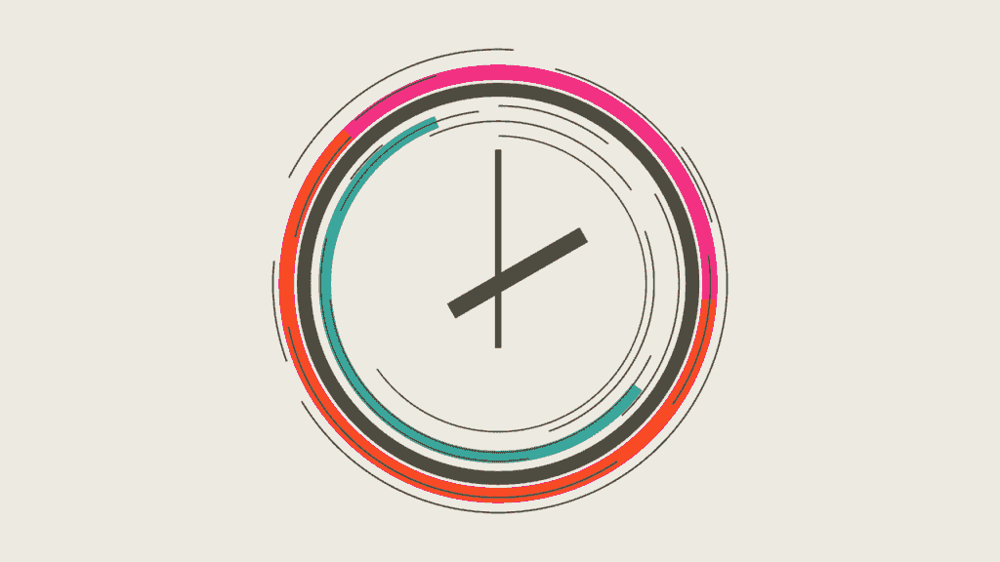
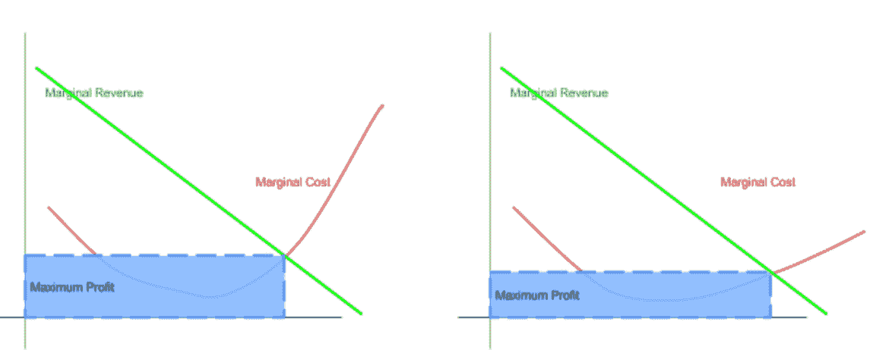

# 钱码:更快

> 原文：<https://simpleprogrammer.com/moneycode-faster/>

作为对《MoneyCode》系列的一个非常简短的再介绍，这里是它的核心问题:

> ***软件工程师如何更快地交付更多质量价值？**T3】*

[系列文章的第一篇](https://simpleprogrammer.com/2016/05/09/moneycode-really-worth/)关注交付。具体来说，它宣称唯一重要的事情是将软件投入生产。如果不进入生产阶段，首先就没有理由开发软件。

[本系列的第二篇文章](https://simpleprogrammer.com/2016/06/20/moneycode-quality-code/)强调了高质量部署的重要性。部署糟糕的代码只会给你留下糟糕的代码。

系列文章的第三篇，这篇文章强调了你收入流的最优化。它解释了如何确保您交付的代码具有尽可能高的价值。

作为本系列的结论，我将讨论如何确保您的客户从交付产品的报酬中获得最大价值。

我们将从优化成本的角度来探讨这一点。

你的工资很贵(至少，我希望如此)，那么你如何优化最重要的事情，以降低你和你的团队创建的所有软件的总拥有成本呢？

对我来说，越快投入生产，就越便宜。只要是好代码。

## 更快的

交付管道的优化有各种各样的文献和想法。

凤凰计划是我最喜欢的读物之一，作为对约束和流水线自动化理论的介绍。

总的来说，了解瓶颈在哪里是提高交付速度的关键。

如果你能找出你的流程的哪个部分经常阻塞你的交付，你就能优化那个部分。

交付时间的优化优化了成本，因为开发时间是任何公司都会支付的最昂贵的东西之一。

## 经济和会计成本

认识到客户面临的经济成本和会计成本之间的差异非常重要。

经济成本是购买产品时客户体验的损失和收益的组合。会计成本是你和你的团队为你的工作收到的实际报酬。

在软件开发的情况下，跨越会计和经济成本的最明显的费用是开发人员的工资。当谈到 MoneyCode 时，这种成本似乎是最合适的成本。

从表面上看，工资似乎是一项会计成本，但每项会计成本都变成了客户的经济成本。

你的雇主每支付你一美元的薪水，你就可以少花一美元投资于股票市场或其他多样化的商品。

尽管软件开发中最明显的成本来自会计成本，但你的雇主决定不花钱，而是雇用你的那些东西开始发挥作用。

将代码行转化为 MoneyCode 意味着确保我们优化我们的支出行。

### 人的因素

人类的投资成本很高。

这就是约束理论真正发挥作用的地方，甚至比保持软件运行的运营成本还要高。

在软件公司，最大的支出是开发人员的工资。

如果你曾经读过[神话人月](http://www.amazon.com/exec/obidos/ASIN/0201835959/makithecompsi-20)(或者即使你没有读过)，你会知道一个事实，给一个后期软件项目增加更多的程序员会使它更晚。

你在项目中增加的每一个开发人员都会成倍地威胁到代码质量与开发人员工资的比率。

如果你[还记得](https://spzone-simpleprogrammer.netdna-ssl.com/wp-content/uploads/2016/06/MarginalRevenueCost.jpg)[我的质量帖子](https://simpleprogrammer.com/2016/06/20/moneycode-quality-code/)中的那张奇特的图表，供给的弹性显示在成本曲线中。

约束理论和成本弹性都会影响一般的成本优化策略，从而影响边际成本曲线，进而影响最大利润。

以下是约束优化和运营优化对最大利润曲线的影响:

虽然这并不明显，因为右边的最大利润条比左边的更短更宽，但这些图表显示的是，当我们产生更多质量代码行时，最大利润发生在第二个图表上。

### 运营费用的优化

有时，你的团队面临的约束可能与人的低效无关。有时候，运营成本实际上是团队面临的最大障碍。

这使得性能测试变得非常重要。

高昂的运营费用会对最大利润产生负面影响。如果您能够优化运营费用和开发人员限制，它会改变成本曲线的形状，使其变平。

将两者(约束优化和运营优化)结合起来，你就能实现惊人的成本优化。

### 性能质量

性能是本系列前面没有讨论的质量的一个方面。您的应用程序在压力下的整体性能对您的解决方案的盈利能力有着巨大的影响。但是，性能质量的影响在客户的长期成本中可以感受到。

随着我们继续构建更多的软件，我们需要更多的硬件来支持我们部署的软件——至少在我最熟悉的 SaaS 产品中是这样。

随着我们运行越来越多的服务、微服务、批处理作业、数据库查询和其他东西，我们需要更多的专用机器马力来进行计算。

随着硬件越来越多，每个时钟周期的成本也越来越高。每千兆存储的价格、每核心的价格、每千兆 RAM 的价格——它们都遵循与边际成本曲线非常相似的曲线。

为了降低这些成本，您需要确保您的产品尽可能高效地运行。

## devo PS——不只是你身边的流行语！

虽然我确实觉得我们的行业已经采用了流行词 DevOps，但它不仅仅是一个流行词。对我来说，当谈到创建软件所涉及的成本曲线的优化时，它的重要性变得最为明显。

当您优化您的吞吐量约束时，等式的开发人员部分会得到改进。

当您优化硬件成本时，等式的运营部分会得到改善。

### 优化约束(开发)

约束理论告诉我们，我们越努力去完成一项任务，我们就应该越频繁地完成这项任务。

如果您纠结于代码过程的部署部分，您的团队应该一次又一次地进行部署。您将很快找到可以使用 Bamboo、Chef 和 vagger 等工具实现自动化的区域。最终，您将获得一键式部署。

更好的是，允许部署完全由您的管道决定，这样当您合并到开发分支时，代码将很快出现在生产中。

如果你纠结于质量，那就测试。一直在测试。您很快就会发现，像 Selenium、Gatling、JMeter 和您最喜欢的单元测试和模拟框架这样的工具可以取代开发管道中的人工干预。

要找到一个约束条件，你必须知道流程中的哪一步需要最长的时间来完成。因此，你需要衡量你的整个过程。

找到瓶颈。优化它，直到它不再是瓶颈。肥皂泡。冲洗。重复一遍。

### 优化运营(Ops)

DevOps 硬币的另一面侧重于基础设施。

像[亚马逊网络服务](https://aws.amazon.com)、 [Azure](https://azure.microsoft.com/en-us/) 和[谷歌云平台](https://cloud.google.com/)这样的工具使得以代码形式创建基础设施变得容易。这使得一键部署的整个概念更加现实。

但这不仅仅是简单易用的硬件，无论是虚拟化的还是其他的。最终，软件会超出你在硬件上的花费。

所以运营优化也很重要。

不仅仅是人类在处理过程中遇到瓶颈。计算机也有。

像 [New Relic](https://newrelic.com/) 这样的工具在这里真的大放异彩。它们以一种叫做 apdex 的易于使用的度量标准揭示了软件面临的最大操作瓶颈。

根据新遗迹网站上[的定义:](https://docs.newrelic.com/docs/apm/new-relic-apm/apdex/apdex-measuring-user-satisfaction)

> Apdex 是一个行业标准，用于衡量用户对 web 应用程序和服务的响应时间的满意度。这是一个简化的服务水平协议(SLA)解决方案，使应用程序所有者能够更好地了解用户的满意度，而不是像平均响应时间这样的传统指标，因为一些非常长的响应可能会扭曲这些指标。

一旦你有了类似 New Relic 的东西来识别你的瓶颈，你就可以使用 [BlazeMeter](https://www.blazemeter.com/) 、[或者它的等价物](https://www.blazemeter.com/)来帮助优化它们。BlazeMeter 是一个出色的云托管性能测试套件，它为您提供了各种强大的工具来挤压瓶颈，直到它们不再伤害您。

结合像 New Relic 和 BlazeMeter 这样的工具，你的开发团队可以为你的软件隔离出最大的摩擦点。最大限度地优化运营。

## 面向所有人的优化

MoneyCode 的意思是优化。[生产部署](https://simpleprogrammer.com/2016/05/09/moneycode-really-worth/)、[价值](https://simpleprogrammer.com/2016/07/27/moneycode-value/)、[质量](https://simpleprogrammer.com/2016/06/20/moneycode-quality-code/)和速度，当它们被充分优化时，会产生一个软件工艺团队，吟游诗人会歌颂它。

虽然我们可能有各种各样的 tla(三个字母的缩写)和 DevOps 之类的行话，但软件工艺专业确实可以归结为一件事:优化。

如果你想优化你钱包里的钱，优化你的团队构建代码的方式。优化代码生产:MoneyCode。还能简单到什么程度，真的？