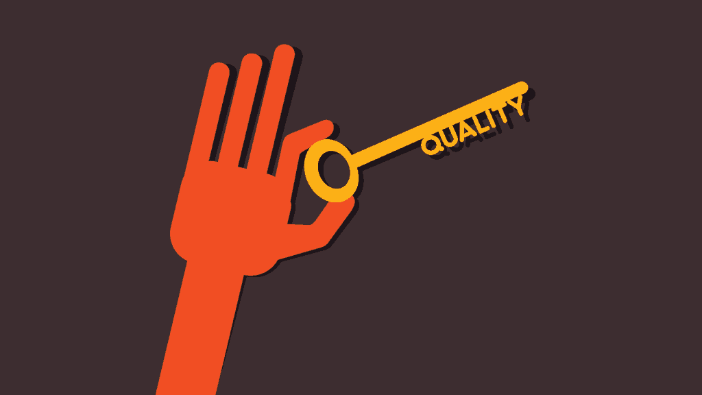
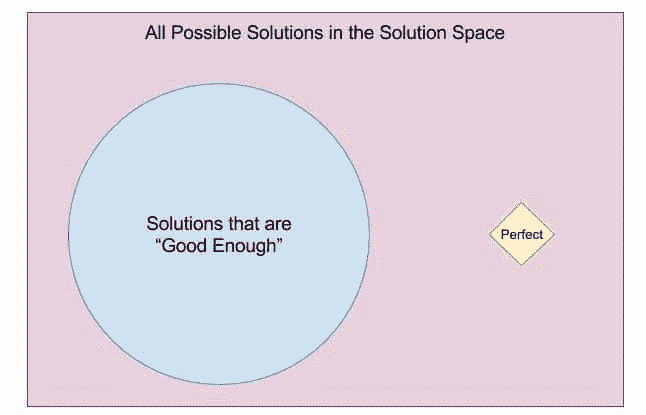
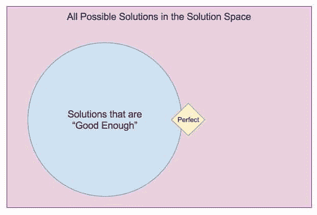
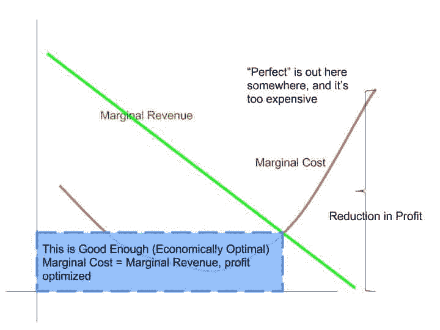

# 货币代码:质量代码

> 原文：<https://simpleprogrammer.com/moneycode-quality-code/>

作为对我在 MoneyCode 系列中的第一篇文章[的一个非常简短的介绍，这里的本质归结为一个问题:](https://simpleprogrammer.com/2016/05/09/moneycode-really-worth/)

> ***软件工程师如何更快地交付更多质量价值？*T3】**

本系列的第一篇文章关注交付。具体来说，将软件投入生产是唯一重要的事情。如果没有投入生产，首先就没有理由开发它。

但是生产交付本身并不能说明全部情况。生产中的低质量真的对交付毫无价值可言。因此，在生产中关注质量是必须的。

## 质量

这个词有各种各样的理由变得重要。

毕竟，问五个不同的工程师他们认为质量意味着什么，你会得到五个不同的答案——尽管主题相似。

说到底，谈质量还是钱的游戏。以下是我听说过的用来定义软件质量的一些不同的东西:

*   客户体验
    *   质量意味着实时响应客户的需求。
    *   顾客爱你，因为你爱他们。
*   非常低的缺陷:特征比率
    *   当客户使用软件时，他们不会发现缺陷。相反，他们举你的软件为例，说:“为什么不能每个人都把软件做得这么稳定？”
*   [用户体验](https://simpleprogrammer.com/2016/05/23/improve-ui-ux-application/)
    *   客户喜欢使用软件和界面。它很快，很容易，而且用起来很有趣。很整洁简单。

明白我的意思吗？质量意味着很多事情。所有这些都转化为公司或客户的底线，当你帮助改善这些(或许多其他)指标时，这转化为你口袋里的美元。

## 注意:质量并不意味着完美

在我和其他人讨论过的关于质量的事情列表中，似乎没有一个提到质量等同于完美软件的观点。这是有原因的。

我现在有一个产品经理非常喜欢这句话:

> “完美是足够好的天敌。”

下面是他在一个简单的图表中的意思(我喜欢在黑板上画画，并与任何愿意听我说的人讨论这个概念的优点):

这张图表显示，如果我们追求完美的解决方案，我们通常会浪费大量的时间和金钱，而这些时间和金钱本可以用来达到足够好的效果。通常是这种情况。

如果你幸运的话，有时候“完美”和“足够好”实际上是相互重叠的——所以在追求完美的过程中，你会到达“足够好”的区域，而不会浪费很多钱。

然而，以“完美”为目标有时会产生令人讨厌的负面后果。各位，抓紧你的拉绳——关于边际收益和边际成本的经济学课来了！

## 边际收入和成本

我试图尽可能简洁地定义这些，同时仍然确保我的经济学教授不会试图追捕我并夺走我长子的生命:

*   边际收入
    *   超越“足够好”的界限，朝着“完美”的目标逐步改进解决方案所获得的额外收入
*   边际成本
    *   花费在工程时间和测试时间上的时间逐渐将解决方案推向“足够好”边界之外的“完美”目标

我保证我没有胡言乱语。事实上，在经济最优化中，有一个很酷的概念，收入曲线和成本曲线。它们相交的地方，就是你停下来，称你的解决方案优化的地方。

当然，在我学到的经济理论中，这个模型被应用于销售的产品数量或者经营一个企业的时间。然而，这个教训也适用于软件。看啊。图表！

图表中有很多东西，所以让我为你进一步分解一下。

*   边际收入(向下的绿线)
    *   根据编写的代码的*质量*行，获得的收入金额——底线上的实际金额。
        *   代码行是一个可怕的度量标准。*质量*代码行是一个了不起的指标。这比“源文件中的字符数”要主观得多。
*   边际成本(向上的红色曲线)
    *   每一行代码的质量花费——付给工程师的实际费用。
        *   同样，代码行本身不会告诉您任何关于成本的信息。质量成本也是这里最好的衡量标准。
*   利润最大化(蓝色矩形)
    *   当每写一行高质量的代码所赚的钱正好等于创建这一行代码所花的钱时，利润就最大化了。任何少写的代码都是额外收入的损失。任何更多的编写代码都是成本大于收益，并减少利润。
*   完美的差距(括号在最后)
    *   完美往往与利润最优化的解决方案相去甚远，以至于追求完美的代码会导致净运营损失。没有哪家公司能以这种方式持续运营。

请记住——这是一个很高层次的速成班，涉及微观经济理论的很小一部分。我不指望你通过阅读这一篇文章就能完全掌握它——所以请查看一些额外的资源。我真的很喜欢可汗学院的这张照片。

如果你跳过了所有的经济学课程，这里是关键的要点:完美在经济上是不可行的，有很好的经济理论可以解释为什么。

所以，如果质量！=完美——让我们回到那些更有意义的事情上来解释什么是质量。

## 热情的客户——客户体验如何？

那么，什么是热情的顾客，它与质量有什么关系呢？

> [“赢得一个客户需要几年时间，失去一个只需几秒钟”——凯瑟琳·德芙瑞](http://www.greatmotivation.com/posts/it-takes-years-to-win-a-customer-and-only-seconds-to-lose-one-3)

如果你没有花时间把客户的期望放在第一位，那么就做好失去他们的准备。

如果我们不知道客户对我们提供的软件解决方案的看法，我们就不可能知道我们是否提供了正确的价值。

有各种各样的分析指标可以让我们看到我们的软件是如何被使用的，更重要的是，有多重要。我们需要专注于让最常用的东西给人留下最深刻的印象。最少使用的东西，嗯，它可能需要完全消失。

要做到这一点，我们必须不断快速地从客户那里获得反馈。此外，我们必须能够相对轻松地做出反应，以确保他们在联系我们时喜欢他们所看到的。

特别是有一家公司似乎真的知道如何给顾客提供他们想要的东西，以至于他们决定“纹身”。

如果你想举一个客户热情的例子，看看哈雷戴维森吧。我不确定我是否真的理解这种现象，但客户对哈雷戴维森的喜爱似乎远远超过拥有业内最好的摩托车。许多喜爱哈雷的人会高兴地将品牌标志永远“印”在身上。

我觉得这绝对不可思议，人们会想尽办法让人们知道他们真的很喜欢他们的哈雷。尤其是考虑到他们有一个哈雷纹身，还抱怨他们的自行车坏了。又来了。去想想。这就是我所说的客户体验。当客户可以说“这是一辆哈雷摩托车”时，他们不会在意维护因素

## 创建新特征时避免新的缺陷

无论你是有一个现实扭曲领域，还是你是一家客户把你的名字纹在身上的公司，你都会发现一个共同的线索，那就是不断地减少代码变更时产生的缺陷数量。

这就是我上面提到的缺陷少的原因。

起初，它有一个非常陡峭的成本曲线。获得一个有用的回归保护套件通常会将工程人员编写的可用代码行至少增加一倍，有时会增加一倍以上。

然而，许多经理不愿意支付前期成本来降低他们的总体缺陷率。

这是因为他们更喜欢“会计成本”(账本上的实际美元和美分)，而不是“机会成本”(失去变得更好的机会)。他们不再花更多的钱来防止回归，而是将特性的交付视为驱动因素，而不是缺陷减少的交付。

他们没有意识到的是，这几乎是拆东墙补西墙。通常，当你付钱给保罗时，你付的钱比你从彼得那里偷的钱要多得多。

手动回归测试既昂贵又耗时。它应该是所有测试解决方案中最不受欢迎的，但是它仍然是最常用的实现方案。

如果让我谈论任何一件事，那就是拥有高质量的回归保护套件。

是的，它的初始成本很高。但是在一次使用之后，它变成了一个主要的固定成本(除了增加更多测试或者更新失败测试的成本)。

每次从这里开始运行测试，测试每行代码的平均成本都会显著下降。尤其是与手工测试的成本相比。

## 现实扭曲力场启动

许多人都谈到了苹果的“现实扭曲场”——让我告诉你，它很强大。

那些人真的真的真的真的爱苹果…我的意思是真的，认真的，真的…爱苹果。他们在汽车上贴苹果贴纸，天啊！

然而，我在这里，在苹果产品上写下这些。我向你保证，这只是硬件。这是非常好的硬件，但它只是硬件。

我在使用苹果生态系统时遇到的问题和我在使用谷歌/安卓生态系统或微软生态系统时遇到的问题一样多。

与苹果的不同之处在于，他们让整体用户体验变得简单得愚蠢。他们不遗余力地让体验变得如此美妙，以至于用户可以忽略一个事实，即苹果与其他硬件/软件供应商并没有太大的不同。

如果你把用户体验(不要和顾客体验混淆)作为你质量门槛的一部分，你最终会在苹果的某个地方。

区分用户体验和客户体验的是一个非常清晰的界限，尽管这两个术语中都有“体验”这个词。简单地说，客户体验就是客户与你的团队互动时的印象。简单地说，用户体验意味着——你的客户与你的产品:软件交互的印象。

当你真正把顾客的惊喜因素放在第一位时，他们会让你闭嘴，然后拿走他们的钱。因为毕竟每个人都想要一个闪亮的苹果，对吧？

此外——无意冒犯任何把苹果看得比什么都重要的人。这是一个我非常了解的话题，许多人认为苹果作为开发者，几乎胜过一切。我只是碰巧不是其中之一。我的 Macbook 是我的雇主提供的。除此之外，我是一个生态系统不可知论者。

## 质量——不要留下没有质量的代码

我曾经在一位高层主管手下间接工作过，他喜欢说:“如果我们没有时间把事情做好，我们什么时候会有时间做第二次？”

第一次就获得正确的代码。

但是要确保你所针对的“正确”的版本属于“足够好”的范畴。这样，你和你的团队将成为利润最大化，[质量代码](http://www.amazon.com/exec/obidos/ASIN/B00GO4I9B8/makithecompsi-20)生产机器。

你的顾客会因此而喜欢你。

你们会因此而爱自己，因为你们让为需要的人做酷事变得容易。

最终，如果你能让质量(无论你和你的团队如何定义)成为你使命中的一个重要驱动力，钱就会出现在你的口袋里。

高质量的软件意味着金钱。

如果你积极地影响了底线上的美元，你就积极地影响了你口袋里的美元。质量必须是你实现自己的 MoneyCode 的内在动力的一个重要部分。