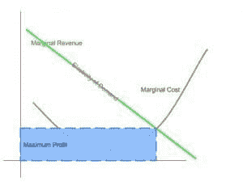
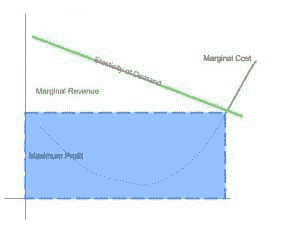
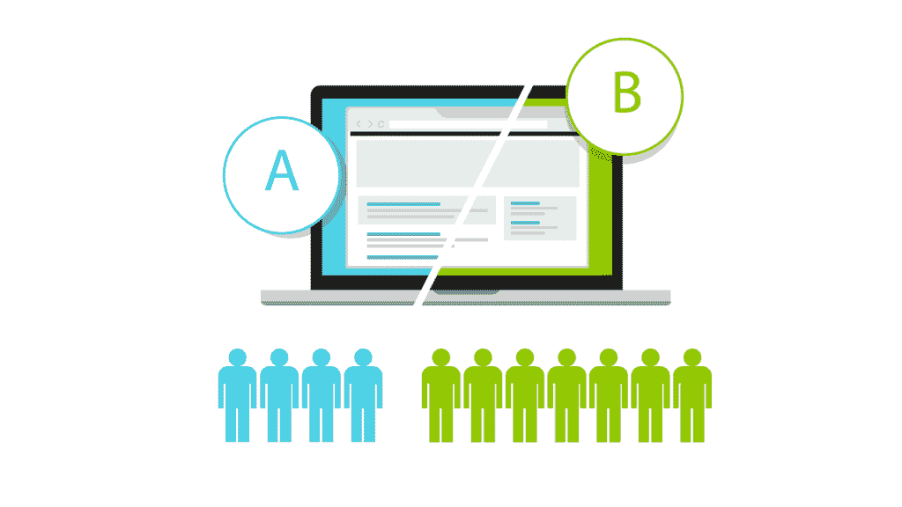

# 货币代码:价值

> 原文：<https://simpleprogrammer.com/moneycode-value/>

作为对[money code 系列](https://simpleprogrammer.com/2016/05/09/moneycode-really-worth/)的一个非常简短的再介绍，这里的本质可以归结为一个问题:

> ***软件工程师如何更快地交付更多质量价值？**T3】*

本系列的第一篇文章关注交付。具体来说，它宣称唯一重要的事情是将软件投入生产。如果没有投入生产，首先就没有理由开发它。

[本系列的第二篇文章](https://simpleprogrammer.com/2016/06/20/moneycode-quality-code/)强调了高质量部署的重要性。部署糟糕的代码只会给你留下糟糕的代码。

在这篇文章中，我想强调的是质量和交付并不是最重要的。假设您正在部署全球最高质量、部署速度最快的计算器，但您的客户想要一本字典。他们很快就不再是你的客户，[即使它是世界上最酷的计算器](https://en.wikipedia.org/wiki/OQO)，[，因为你没有给他们想要的产品](https://en.wikipedia.org/wiki/OQO)。

## 价值

价值到底意味着什么？根据你谈论的背景，价值可以来自各种各样的地方。

然而，如果我们将价值的上下文限制为经济价值，即“人们花钱买的东西”，事情就会变得简单一些。在谈论 MoneyCode 时，这似乎是最合适的一种价值。

根据维基百科上的定义:

> 经济价值是对商品或服务为经济主体提供的利益的衡量。它通常是相对于货币单位来衡量的，因此解释为“特定行为者愿意并能够为商品或服务支付的最大金额是多少”？

说什么？简单地说，经济价值意味着“人们花钱购买的东西”。

在一天结束时，确保人们在软件上花钱会让我们的钱包鼓起来。将字节码转化为金钱码实际上意味着确保人们想要我们所做的东西。

## 99 个问题，但是哪一个呢？

软件只做好一件事:自动化。

好吧，也许是两件事，但我不是一个游戏玩家，所以我生活在一个我们用软件来自动化事物的世界。

如果您愿意，请随意与我争论，但我真的认为自动化是软件中每个价值主张的核心:

*   人工智能？数学上复杂决策的自动化。
*   举报？数据聚合和交付的自动化。
*   即时通讯？烟雾信号的自动化。(开玩笑。大部分是。)

无论你在哪里看，如果你想一想软件真正做什么，在它的核心你会发现自动化。

甚至视频游戏，在某种程度上，也有自动化的核心。这是娱乐价值的自动传递。

当创建新软件时，问问自己，“软件解决什么问题？”有些问题真的没有自动化的意义，然而有些问题如果你能让它们消失，你会自然而然地看起来像个英雄。

我想起了亨利·福特的一句广为使用的名言:

> “如果我问人们想要什么，他们会说是更快的马。”

事实是，有时候你真的想让马跑得更快。

同样，你有时想发明一种新的交通方式，但你所在的行业必须首先为范式转变做好准备。

还记得我在上面指出的世界上最酷的计算器吗？是的，你从未听说过制造这些东西的公司——OQO。尽管它们基本上是智能手机的前身，但它们并没有持续很久。他们只是在行业还没有准备好，消费者还没有真正认识到它是什么的时候做的。

其他人都在专注于制造更快、更强的硬件。小型化竞赛在移动领域还没有真正开始，还没有产生重大影响。OQO 有正确的想法，但他们在错误的时间。

对他们产品的需求并没有使他们在经济上可行。在某种程度上，这是因为他们无法从生产的每件产品中获得足够的边际收益。

## 更多的经济学来了！

我真正谈论的*经济价值*是*需求弹性*。弹性？什么？我的意思是，是的，我吃了太多的甜点，现在我需要穿我的弹性腰带短裤，但这和钱有什么关系？

这其实只是一个花哨的术语，用来描述你对某样东西收取的*价格*是如何随着你生产的*数量*而降低的。消费者愿意为你的产品支付多少钱？

如果你[还记得来自](https://spzone-simpleprogrammer.netdna-ssl.com/wp-content/uploads/2016/06/MarginalRevenueCost.jpg)[我的质量帖子](https://simpleprogrammer.com/2016/06/20/moneycode-quality-code/)的那张奇特的图表，需求弹性在其中显现出来，但它是隐藏的，我不想让关于质量的经济争论变得过于复杂。

用数学术语来说，需求弹性是边际收入线的导数。这条线的斜率越大，就越难从多制造一个小部件或多生产一行高质量的代码中获利。

程序员喜欢在适当的时候进行优化。在这种情况下，当考虑经济价值时，我们谈论的是优化边际收入曲线。

正如上面并排的图表所示，我们的需求越接近“完全无弹性”(0 的导数)，我们生产的代码越多，获得的利润就越多。我们不能永远保持生产，因为随着时间的推移，尽管我们的代码有惊人的价值，但这样做的成本太高了。

> 注意:另一个经济学原理适用于优化收入:收益递减法则。简而言之，这意味着没有收入线会是平坦的。多生产一个单位的工作，其价值就会低于上一个单位。

既然我已经向您展示了经济学，那么作为程序员，我们有什么策略来使我们的服务的需求弹性尽可能的平坦呢？

## 

可测性

为了确保我们的客户使用我们制造的东西，并且我们制造的东西继续正常工作，我们必须对它们进行测量。

作为一名开发人员，最重要的一点是可衡量的结果。可以跟踪和汇总每一次点击、发布和数据库调用，以帮助我们了解客户如何以及为什么使用我们的产品。

这里有一篇关于可测量性的好文章，特别是关于 Etsy 当时使用的工具。虽然有点过时，但这里的主要观点是，作为开发人员，您必须度量您所做的一切，因为可度量性会转化为可操作的变化。

Etsy 使用的工具帮助我们了解客户把时间花在了哪里，以及哪些东西客户从不使用，我们需要关闭。

下面是我如何使用一些我现在很熟悉的工具，但是这肯定不是度量我们代码的工具的详尽列表。

### 谷歌分析

作为一名网络开发人员，这是一个免费的无脑。甚至还有像 AngularJS 这样的库的扩展，使得跟踪人们如何访问你的网站，他们访问了哪些页面，以及他们停留了多长时间变得非常简单。

跟踪用户在页面上的移动有助于您了解如何更好地集中注意力以实现稳定性和性能，并突出显示新创新可以真正让您占上风的领域。

### 新遗迹

有时候，这完全取决于你的网站的表现。在新遗迹监控和报告领域， [Apdex](https://en.wikipedia.org/wiki/Apdex) (应用性能指数)主宰一切。客户对你的页面和 API 的响应度的感觉说明了他们再次访问的可能性。

毕竟，人们在互联网上的注意力持续时间往往不到 5 秒，所以你最好确保你给客户的东西很快。New Relic 向您展示了什么时候您不在状态，并通过堆栈跟踪和最坏情况报告等功能帮助您了解应用程序的瓶颈。

### ELK (ElasticSearch，LogStash，Kibana)堆栈

坏事发生了。有时它们碰巧是好代码。您知道如何轻松找到您基础架构中运行的 n 节点应用程序的错误来源吗？

像 [LogStash 这样的日志聚合工具，当与 ElasticSearch 和 Kibana](https://www.elastic.co/webinars/elk-stack-devops-environment) 结合使用时，可以更容易地查明错误的来源，从而更容易确保您的客户所依赖的代码保持在线。

## 想法的时机和数量

OQO 有一个很棒的主意，但时机很糟糕。他们无法在市场上生存，因为他们在花太多钱生产之前没有适当地测试他们的价值主张。

当你有一个连续的交付管道时，有两种价值主张测试:A/B 测试和特性节流。

### A/B 测试

不管你是否意识到，如果你使用互联网，你可能已经参加了至少一两次 A/B 测试。

A/B 测试背后的概念是，有两种不同的方法来解决特定的问题或满足特定的需求。然后，我告诉你的分析工具(和其他工具)收集关于用户参与度、可用性和其他信息的统计数据。

有时在 A/B 测试结束时，一个非常简短的调查将决定用户对 UX 的看法。

在 A/B 测试中，两种方法中会出现明显的赢家。一般来说，对于 A/B 测试，您将有两个不同的特性来解决相同(或非常相似)的问题。一个会比另一个更受用户关注。随着时间的推移，这允许较弱的功能随着功能切换而消失，直到更强、更有吸引力的功能可以被适当地调节。这让我想到了特性节流。

### 功能节流

一旦某项功能成功通过 A/B 测试，功能限制允许您逐渐增加可以看到该功能“打开”的用户的百分比只要你看到新功能的用户参与度和乐趣不断提高，你打开它的次数就越多，你就越能控制它，直到它达到 100%。

这与过去“全有或全无”的部署大相径庭。有了 A/B 测试和特性节流，我们可以很容易地花时间证明 MVP(最低可行产品)在我们继续支持它的同时增加了底线收入(或降低了开支)。

## 产品所有权

软件管理的可测量的“操作”方面应该总是通知您的开发栈的积压。

你必须绝对确定你的团队和产品负责人理解团队的使命，并且总是朝着完成它的方向努力。

虽然许多团队觉得这有点“傻”，但为你的团队起草一份使命宣言确实有助于将重点放在你的团队如何创造价值上。

有了这份使命宣言，你可以随时问对方，“我正在做的这件具体的事情是如何给我们的产品增加价值的？”

### 社交媒体的影响

你有没有上过 Twitter，了解世界对你公司的看法？如果你是一家软件公司，你可能会发现它非常令人惊讶，以至于它会让你重新思考如何交付价值。

在社交媒体上看到你的公司是一个好消息——这通常意味着你已经产生了足够的影响，人们会关心你的所作所为。

另一方面，如果你对人们所说的没有反应，而他们一遍又一遍地看到问题，他们很可能会比昨天的 Snapchat 更快地抛弃你。

## 创造价值的价值

我们程序员优化一切。如果有人真的使用一大群迷你无人机和 Raspberri Pis 来自动化他们的整个早晨仪式，我不会感到惊讶——但我跑题了。

价值的优化取决于确保你在正确的时间创造正确的东西。你必须知道客户需要什么，你必须知道如何通过衡量你提供的一切来不断满足他们的需求。

即使你是一个个体经营者/自由职业者，你也必须意识到你写的代码。或许更是如此，[因为你的代码就是你的作品集，而编程是一种艺术形式](https://simpleprogrammer.com/2016/07/07/software-development-analytical-art/)。

因此，一定要理解代码是如何解决问题的，因为解决问题创造价值。价值创造金钱代码。

如果你想给自己的职业生涯一个提升，那么你可能会考虑开一个自己的博客。你可以查看我的课程，获得一些可靠的建议。T3】