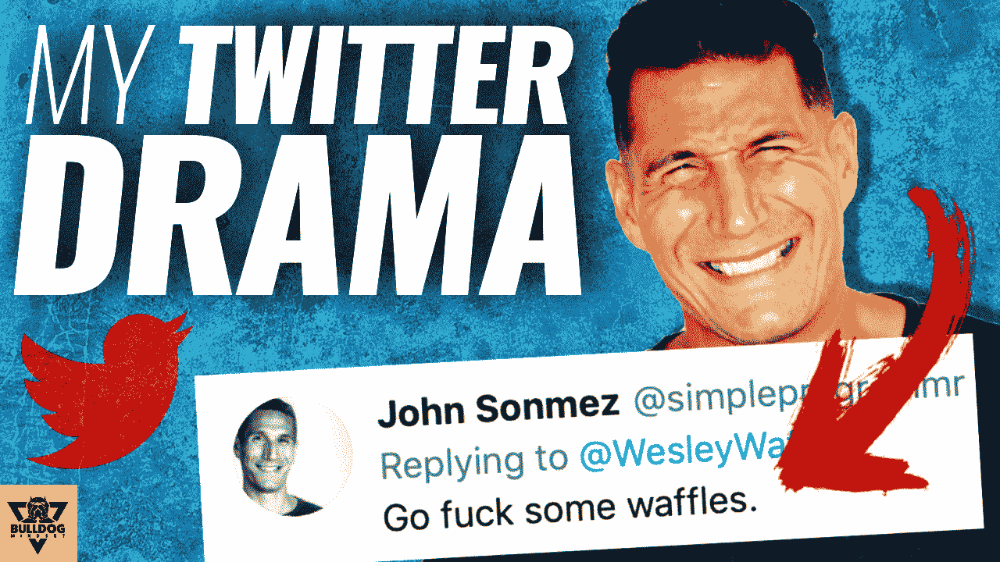
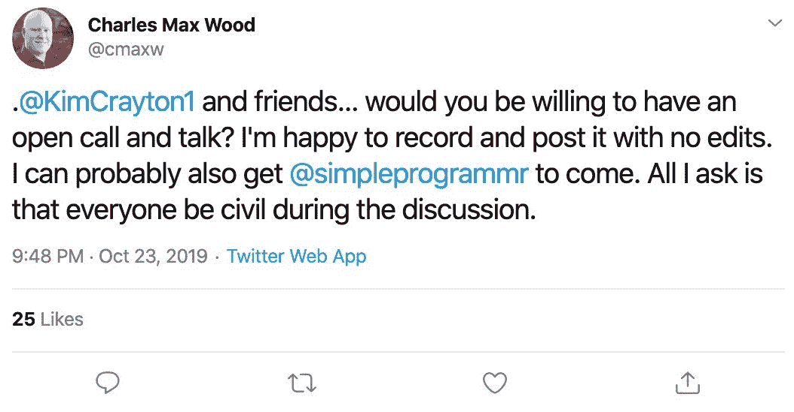
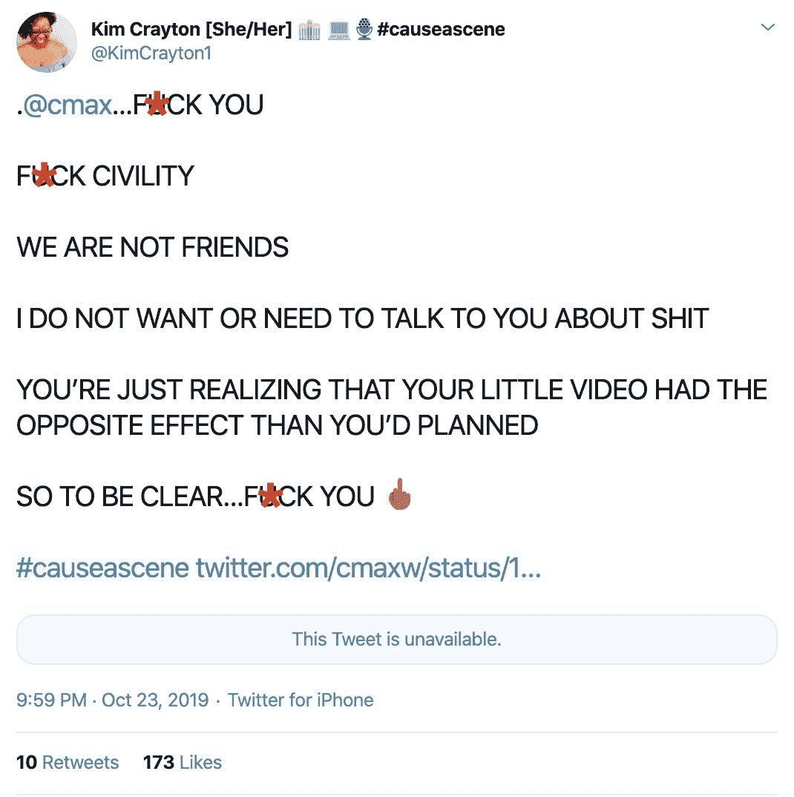

# 我是如何成为科技界最遭人恨的人的

> 原文：<https://simpleprogrammer.com/most-hated-man-in-tech/>

哇，自从我坐下来写一篇关于简单程序员的博客帖子已经有一段时间了，但现在是时候我解决技术行业中一个非常重要的问题了，一个非常重要的问题，它不仅分裂了我们所知道的技术世界，而且征服了它。

你可能听说过也可能没听说过我是如何成为科技界最遭人恨的人的故事——至少有几天是这样——所以，我就在这里说一说。不是因为我是文明和理性行为的完美典范，而是因为这个故事是关于真正的邪恶正在那些声称传播多样性和包容性信息的人们中间传播。

从哪里开始…从哪里开始。啊，让我想想，我第一次参与的时候。

那是一个漆黑的暴风雨之夜。我坐在我的键盘前，仔细思考我如何才能将更多的性别歧视和种族主义释放到技术社区中——就像我每天晚上坐在电脑前时所做的那样。

我的一个朋友在脸书给我发信息，问我是否看到了发生在我们共同的熟人 Aimee 身上的事情。

不，我当然没有看到它，因为作为一条规则——就像《黑客帝国》中的人类避开高速公路一样——我避开 Twitter。Twitter 是当今社会所有最卑鄙和虚假的事情的污水池。它是新马克思主义后现代胡言乱语的诞生地、摇篮、托儿所和寄宿学校。(我是不是有点过分露馅了？)

无论如何，他告诉我，那些围攻和攻击人们取消他们的人现在正在攻击 Aimee，并试图摧毁她的职业生涯和声誉。

我想耸耸肩，关闭我的浏览器，但我决定看一看线程。我是说真的，这有什么不好？

哎哟。我不喜欢我所看到的。艾米说了些激怒牛群的话。这是她的原话:

> “感谢我没有在 2019 年开始我的编程之旅。
> 
> 所有这些人都愤怒了，咒骂着，试图以同情和多样性的名义挑起争论…你的行为真的吓到了那些想进入这个行业的人。"

哦狗屎！这难道不是一种麻木不仁的种族主义和性别歧视吗？哇，艾米一定是个可怕的偏执狂，对吧？我是说她怎么敢对“边缘化”的人发表言论？她怎么敢有意见？

当然有一堆。她被公开羞辱。她的工作和生计受到了威胁。有人试图对她进行再教育。所有我期望看到的。但我没想到看到的是她向他们道歉。

我想是出于恐惧——我真的不能责怪她——她决定屈服。但这足以安抚嗜血的大众吗？显然不是。袭击仍在继续，甚至更加激烈。

在这一点上，我知道我已经走得太远了。我不能回来了。我不能简单地关闭我的浏览器，忽略这一点。

因此，我做了任何一个正派人都会做的事情，我掰着指关节，登录 LastPass，查找那个尘封已久的简单程序员 Twitter 帐户的旧密码，并发誓永远不再使用它，然后我登录了。

我的计划很简单:向每个攻击 Aimee 的人扔手榴弹，直到这群野兽转而攻击我。我想，嘿，我已经没什么可失去的了，但是…我有点，哦，有点小错误——以后再说。

不管怎样，我发表了一些评论，称那些人联合起来欺负她。我在推特上号召我的追随者们拿起武器，也…嗯…叫他们胆小鬼。(我好像一直依恋着那个词。)我向任何攻击 Aimee 的人和所有人开枪，成功了……哦，成功了吗。

很快火就直冲我的鼻子。我以前从未听说过的人转发了我的侮辱，并向我还击。我了解了各种我从未听说过的新迷因，有数百人在推特上说我是个混蛋。

然后，就在硝烟散尽的时候，在被告知闭嘴后，我在推特上对一个人(刚好是个黑人女性)说，她应该闭上嘴。我实际上说:

“是的，你应该这样做。你应该闭上你的嘴。我们都应该很高兴来到这里。而不是试图打倒任何指出真相的人。”

哦，我做了多么邪恶，性别歧视，种族歧视的事情。上帝禁止我让一个黑人女人闭嘴。但这里才是真正爆发的地方。另一个女人告诉我:

对任何人来说，这都是不可接受的说话方式。我对你的行为和让一个女人闭嘴的勇气感到厌恶。”

现在，我不知道你认为平等是什么，但在我看来，平等就是平等对待所有人，不管他们的肤色、性别等。所以当我看到一些关于我有勇气让一个女人闭嘴的事情时，我会想“什么？我应该因为一个人是女人而区别对待她吗？”

所以，当然，我回答说:

“闭上你的嘴。”

当我说你几乎可以听到所有人截屏那三条微博的时候——完全是断章取义，但这真的无关紧要，不是吗？

给你。证明。绝对证明约翰·桑梅兹是一个性别歧视，种族歧视的猪。在这里，他在 Twitter 上告诉女性闭上嘴(忘记他们也告诉我闭上嘴，然后删除了推文)。

现在，让我们坦诚相待。我在推特上说过刻薄的话吗？是的。绝对的。是民用的吗？不。我有没有尽我所能以最好最专业的方式处理这件事？不，不是真的。我完全承认自己有点混蛋，在推特上说了些不好的话。

但是，这真的是惊喜吗？我的意思是[如果你关注我一段时间](https://simpleprogrammer.com/about-simple-programmer/)你就会知道大多数时候我都很有礼貌。说白了，如果你跟我或者我认识的人搞，你最好准备好在草丛里打滚。

这是不是意味着我是一个性别歧视者，种族偏见者？不，一点也不。我雇佣了所有不同种族的人，男性和女性，我唯一感兴趣的是谁会做得最好。

所以，是的，指责我愚蠢和过分保护一个朋友，但我不确定接下来的反应是否恰当。

差不多就在我发了最后一条微博之后，Twitter 爆炸了。转发，转发，转发。谴责，死亡威胁，号召对我施暴。这真是太疯狂了。(有一部分还在，但是很多现在已经删了。)

但是，你看，这不仅仅是一个从群体思维行为中涌现出来的无组织的暴民；不，是有组织有经验。有几个人在幕后操纵，他们在做的事情上是有策略的。

很快方向就转向了试图摧毁我的事业和收入来源。人们开始在 Pluralsight 和 Manning 上发推特删除我的书和课程，问他们怎么能和像我这样的种族主义者和性别歧视者交往。

然后，他们开始呼吁任何与我有关的人，告诉他们不要追随我，谴责我。很快，许多甚至没有花时间给我发短信、发邮件或打电话的朋友公开声明与我保持距离。

尤其懦弱的是自由代码营的昆西·拉森，他删除了我的采访并公开谴责我。(顺便说一句，这仍然是一个很好的资源，而且是免费的。)

UML 的创始人 Grady Booch 说了一些挖苦的话。许多杰出的技术人物和以前的朋友也是如此。

我接到了 Pluralsight 和 Manning 的电话，他们都指责我违反了他们的行为准则和“指导原则”。从来没有问过我是不是我在发微博，或者我的账户是不是被黑了，他们甚至在听到我的说法之前就下定决心要撤掉我的内容。

公平地说，Pluralsight 给我打电话告诉我他们单方面的决定，但曼宁至少在取消出版我的书《软技能:软件开发人员的生活手册》之前，有一个代表听到了我的说法。

Pluralsight 从他们的平台上撤掉了我所有剩余的课程，并取消了我与他们的附属合作关系，没有考虑到我多年来对他们的支持，也没有考虑到那里大多数认识我的人，他们知道我一点也没有种族主义或性别歧视。

他们对暴徒畏缩不前。他们选择不把他们的决定建立在我的课程的技术价值甚至任何证据的基础上。事实上，我明确地说“你能给我一条你认为违反你的行为准则或原则或任何明显带有种族主义或性别歧视的确切推文或声明吗？”当然，他们甚至没有提供一份声明。相反，他们完全屈服于这群愤怒的暴民的压力。

与曼宁相似。他们宣布我的书绝版，并取消了我的合同。(幸运的是，在这种情况下,[这本书](https://simpleprogrammer.com/128-links-soft-skills-software-developers-life-manual/)的版权归还给我，我将通过简单的程序员自助出版它。)

同样，我刚刚与之达成协议的 O'Reilly Media 也从他们的在线平台上撤下了我的书。

我在一些主要技术播客上做的播客采访被删除了，因为这群暴徒试图通过将我从历史中抹去来取消我。

现在，不管你是否同意我的政治和政治观点，甚至是我在推特上处理自己和别人说话的方式，我想问你，这是一个公平公正的回应吗？

试图用诽谤和中伤的方式从经济上摧毁一个你不喜欢的人的名誉，说他是种族主义者和性别歧视者，这样可以吗？提倡和呼吁对那个人施暴可以吗？这是“宽容者”所提倡的宽容吗——请不要引用不宽容的悖论，那是相当多的马克思主义宣传，以证明讨厌你认为“坏”的人是正确的。

就我而言，我还好。他们可能给我造成了几十万美元的经济损失，但我不会低头；我不会道歉，我唯一的回应就是我第一次给他们的回应，挑衅的中指。

但是，不幸的是，余波并没有就此停止。

记住，在政治迫害中，你需要让其他人说出名字，谴责女巫，并在恐惧中畏缩；否则，整件事就完了。

其中一个被点名的人是我的朋友查尔斯·麦斯武德。现在查尔斯不像我了。他有大约 0%的屁眼。他是一个正统的摩门教徒，几乎是你见过的最善良、最好的人。

但是社会正义的暴民在乎吗？不。他们关心的是造成尽可能多的痛苦和破坏，所以他们攻击了他。

要求很简单:谴责约翰。停止与约翰做朋友；不要再和他来往了，公开声讨他……不然。

查克，作为一个正直的人，他没有指责我。但他确实做了一个视频，说他们没有权利说他可以和谁做朋友，不能和谁做朋友，他不赞同或同意我说的许多事情，但应该就这个话题进行文明的讨论。

他在 Twitter 上邀请一些相关人员就他的一个播客进行一次民间讨论，他提出让我也去那里发表我的观点。

你认为要求进行民事讨论的回应是什么？

是的。你猜对了。

事实上，下面是确切的对应关系:

现在是可怜的查克倒霉了。所有的愤怒都转向了他，他收到了各种针对他的讨厌的推文。

很快就有人打电话取消他的邀请，没过多久，他就失去了播客的赞助商，失去了他节目的整个面板，播客采访被取消，最后被禁止参加他已经注册的会议 Kubecon。

上面那个对他说去你妈的人，在 Linux 基金会 Kubecon 的组织者上发推特，怂恿他们禁止 Chuck 参加会议。哦，她还发了一张他在特朗普大厦前戴着 MAGA 帽子的照片。

这篇文章很好地报道了发生的事情。

Linux 基金会还禁止查克参加任何未来的活动。为什么？他们说他违反了他们的行为准则。当被问及如何和它的哪一部分，蟋蟀。

有消息称，他的“违规”行为是通过呼吁人们文明来维持治安。哇，这是一个非盈利组织对一个人采取极端政治诱导的行动，并公开这样做，进一步损害他的声誉。

我可以继续讲述这里正在发生的事情，以及为什么这对科技行业如此危险，但我鼓励你[观看这个关于文理学院常青树的视频系列](https://www.youtube.com/watch?v=FH2WeWgcSMk&)，以获得比我所能解释的更好的理解。

简而言之，言论自由受到了攻击。现在，今天，在社会上，如果你也有经济独立，你才真正有言论自由。这是一种耻辱。是的，我知道言论自由只适用于政府审查你，私人公司和个人可以做他们想做的事情。

是的，这是一个有效和公平的论点，但它并没有改变审查制度的单一文化正在我们眼皮底下发展的事实。这并没有改变一个事实，即人们害怕谈论任何有争议的话题，或者有一种不符合流行主流叙事的观点，或者有一小群人躲在面纱后面，声称他们正在促进技术的多样性。

有很多谎言被当作真理提出来，不同意思想警察会有严重的后果，你可以从我和查克的故事中看到，这不是孤立的事件。似乎每隔几周，同样的故事就会一遍又一遍地上演。

你听到这一个而不是其他一些的唯一原因是，恰克和我碰巧都有经济实力来承受攻击而不低头，并且仍然可以说出来而不被完全沉默。

这些愤怒的暴民的大多数受害者没有这么幸运。我想知道有多少人会因为在 Twitter 上说的一些不恰当的话而被逼自杀或更糟地看到自己的整个职业生涯和未来被摧毁。

这真的是我们想要生活的社会吗？这真的是我们想要支持并加入的技术社区吗？这真的是改变人心和促进多样性的方法吗？

看起来，也许肤色和生殖器的多样性是以最重要的多样性为代价的:思想的多样性。

无论如何，关于这个话题我还有很多可以说的，但是我现在就结束这篇文章。但在我走之前，我想再说几句。

首先，我不在乎你是否同意我的政治信仰。我欢迎你有不同于我的观点，我很重视这一点。我最看重的是言论自由，以及不同观点的人可以自由表达自己想法的环境，而不用担心被嘲笑、“被取消”或言语或身体虐待。

所以，如果你不同意我的观点，即使你认为我是个混蛋，我也会请你暂时把我们的分歧放在一边，至少看看这里发生了什么，你是否支持这种对不同政治观点和一些辱骂的回应？

你听不到另一边的声音，因为人们害怕。我收到许多电话、电子邮件和信息，人们说“我很想公开支持你，但是我要担心工作和家庭。我甚至害怕喜欢你的一条推文。”

第二，如果你想支持我，支持我与这群破坏科技的偏狭的人的斗争，你可以这么做:

1.  给 Pluralsight 发电子邮件，让他们知道你对发生的事情的感受。(support@pluralsight.com，抄送:aaron-skonnard@pluralsight.com)
2.  购买 *[完整的软件开发人员职业指南](https://amzn.to/2qSbSeK?__s=xxxxxxx&utm_source=drip&utm_medium=email&utm_campaign=The+Twitter+Drama&utm_content=How+I+became+the+MOST+HATED+man+in+tech...)* ，或者如果你已经有一本的话，给朋友买一两本。这本书是由简单的程序员自我出版，没有收入去曼宁。
3.  公开这件事。联系主流媒体渠道，让他们愿意让我在他们的平台上讨论这个问题，让人们意识到这一点。分享这篇博文，传播这个消息。我们不要让这一切在黑暗中发生。

我感谢并欣赏你们所有为正义而战的人。

我们可能不都同意，但我们可以体面地对待彼此，并学会看到每个人身上的人性。

附注—[这是我在事情发生后不久录制的一段视频，以了解更多背景情况](https://www.youtube.com/watch?v=HvjQ3Mx-jWg)。