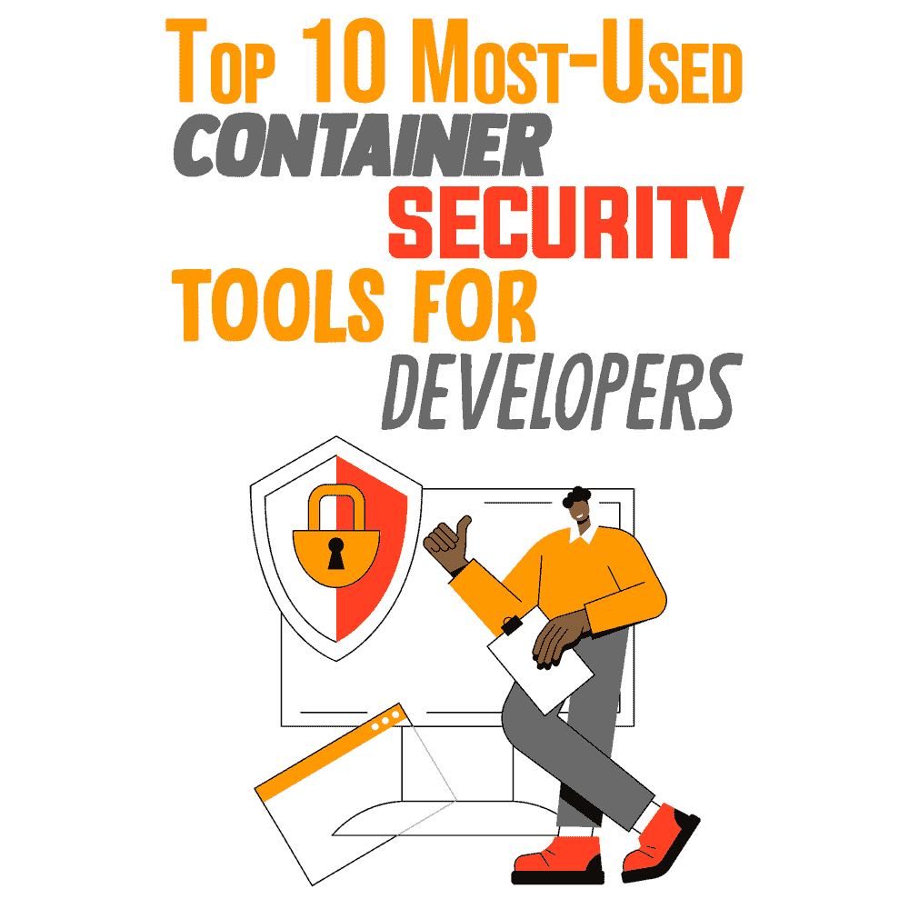
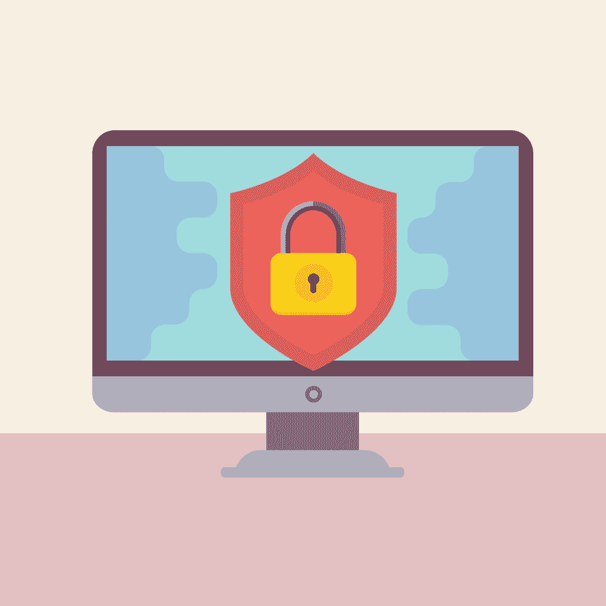

# 开发者最常用的十大容器安全工具

> 原文：<https://simpleprogrammer.com/most-used-container-security-tools-developers/>

[Containers](https://simpleprogrammer.com/containerization-trends/) have been one of the remarkable trends in the application development industry, as more organizations are opting for them to build, test, and deploy their applications faster without friction.

集装箱本身并不安全。尽管容器具有内置的安全特性，但它们仍然需要第三方工具来保护运行时和开发环境。随着过去几年对公司的网络攻击不断增加，保护应用程序变得比以往任何时候都更加重要。

有 10 个很棒的工具可以帮助你确保集装箱安全。但是在我们谈论这些之前，让我们从一些容器基础开始。

## 集装箱和集装箱化意味着什么？

容器化是对软件代码及其所有必需品的打包，如框架、操作系统库和其他依赖项，以便应用程序被隔离在它们自己的“容器”中容器化的目的是让容器中的应用程序可以在任何环境或操作系统中移动并一致运行。

容器是在一个操作系统或平台上编码的替代方案，这使得移动应用程序变得困难。容器充当一个计算环境，它包围着应用程序，并使它独立于其环境。容器还提供了一种逻辑打包机制，将应用程序从运行环境中抽象出来。

容器通常被称为“轻量级”的，因为它们共享机器的操作系统内核，并且不需要与每个应用程序相关联的操作系统开销。容器之所以如此受欢迎，是因为它们具有比虚拟机(VM)更小的固有容量，因此需要更少的启动时间，从而允许更多的容器在与一个 VM 相同的计算容量上运行。这推动了更高的服务器效率，同时降低了许可和服务器成本。

## 集装箱化的威胁是什么？

随着容器成为部署应用程序的重要部分，保护它们的必要性也相应增加。保护容器的真正问题与它们的性质有关。毫无疑问，代码在容器上运行更快，但是它的内部工作对操作是不可见的。

当运营团队无意中忽略了访问控制问题、威胁和其他安全问题，并且容器开发人员没有意识到他们代码中的问题点时，容器化中的安全挑战就出现了。

容器化环境中的一些常见威胁点是容器映像、机密、运行时特权、控制平面、名称空间或运行时特权的错误配置和暴露；漏洞，如加密挖掘、恶意软件安装或权限提升；运行时威胁；合规性审计失败。

## 什么是集装箱安全？

[容器安全](https://www.decipherzone.com/blog-detail/what-why-how-container-security)是在容器的不同生命周期阶段保护容器免受数据泄漏、恶意软件和其他威胁的过程。从构建容器映像到将容器加载到注册中心并部署到生产环境中，必须实现一些工具来确保容器的安全性，以抵御潜在的威胁。

为了避免任何安全冲突，开发人员使用容器安全工具，这些工具可以在开发和生产阶段扫描代码中的漏洞。容器安全工具有助于网络漏洞监控和检测、事件响应，以及在生产前和生产过程中测试源代码。

一些容器安全工具强调开发，而另一些强调运行时安全和威胁缓解。

## 十大集装箱安全工具

容器安全工具管理访问、测试安全性，并保护运行容器化应用程序的云计算基础设施。这里列出了最常用的容器安全工具，你可以用它们来保护你的容器免受安全威胁。

### Qualys

[Qualys Container Security](https://www.qualys.com/lp/secure-containers/) is one of the services that come under the umbrella of Qualys Cloud Platform. Qualys offers visibility into container host security and the ability to detect and prevent security breaches during runtime. It collects image registries, images, and containers spun from images. With Qualys Container Security, you can determine whether the images are cached on different hosts or not. Qualys also identifies whether a container on exposed network ports is running privileges.

**Qualys 主要特性:**

*   整合策略以阻止使用特定于漏洞的图像
*   识别具有高漏洞、旧版本或测试版本标签以及未经批准的软件包的映像
*   以集中的方式发现和跟踪容器及其映像
*   通过为 CI/CD 工具部署插件，允许持续检测 DevOps 管道中的漏洞。
*   提供威胁识别、影响评估和补救优先级

### 锚

ancore 为集装箱安全提供多种解决方案，包括集装箱漏洞扫描、集装箱注册扫描、 [Kubernetes](https://www.amazon.com/Learn-Kubernetes-Security-orchestrate-microservices/dp/1839216506/) 图像扫描和集装箱合规。Anchore 通过全面的 API 和 CLI 工具自动扫描开发环境、注册表、CI/CD 管道或运行时环境的容器。Anchore 还使用 Kubernetes 准入控制器来防止易受攻击的映像的部署。

**主要特性:**

*   提供准确的漏洞馈送、独特的反馈回路和优化的漏洞匹配，以减少误报和漏报
*   借助自动化补救工作流和建议，Anchore 可以快速查看、管理和修复容器映像中的安全漏洞
*   实施策略来标记不合规的映像
*   使用标记、repo 或其他元数据提供对注册表中容器的安全洞察
*   监控 Kubernetes 集群以检测活动容器中的漏洞
*   将自动合规性检查嵌入 CI/CD 管道

### 胶囊 8

[Capsule8](https://capsule8.com/solutions/containers/) 识别并阻止可能威胁 Linux 系统上容器化环境的不良活动。Capsule8 的威胁模型适用于主机和容器的工作负载。Capsule8 还使开发人员能够创建利用容器元数据的策略。

**胶囊 8 的主要特性:**

*   Capsule8 提供动态扩展的节点保护。
*   启用入侵防御系统(IPS)、防病毒和文件完整性监控(FIM)功能，并提供实时保护、容器感知、可见性和报告责任。
*   显示权限转换、进程沿袭和进程重命名，以识别受影响的容器。
*   保护编排器、容器运行时和云原生系统。
*   识别每个容器的有害活动。

### Sysdig

[Sysdig 的容器安全性](https://sysdig.com/products/secure/)通过将扫描集成到注册表和 CI/CD 管道中，在早期阶段阻止已知的漏洞。Sysdig 在运行时识别漏洞，标记它们，将它们映射回应用程序，并检测需要修复问题的团队。Sysdig 还帮助开发人员检测恶意活动，如不安全的配置、内部威胁、泄漏或脆弱的凭据以及运行时未打补丁的漏洞，并发送警报。

**主要特性:**

*   识别高严重性的操作系统和非操作系统漏洞、安全不良做法和错误配置
*   创建和维护运行时检测策略
*   使用机器学习来自动分析容器图像，以避免从头开始编写规则
*   为更好的第三方审计提供按需仪表板、评估和报告
*   将法规遵从性标准映射到 Kubernetes 和容器环境的某些控制措施

### 水上安全

根据定期更新的漏洞数据源流， [Aqua](https://www.aquasec.com/products/container-vulnerability-scanning/) container security 扫描集装箱图像，以确保广泛的覆盖范围，同时最大限度地减少误报。Aqua 还有助于检测恶意软件、OSS 许可证、嵌入的秘密和配置问题，以减少攻击的机会。

**主要特性:**

*   提供动态容器分析。
*   识别隐藏在第三方图像、开源包中的恶意软件。
*   防止基于容器的应用程序遭受凭据盗窃、数据泄露、加密货币挖掘和其他攻击。
*   通过静态和动态扫描创建灵活的映像保证策略，以决定允许通过管道并在集群中运行的映像。
*   Aqua Risk Explorer 显示 Kubernetes 集群中命名空间、应用程序、节点和部署的实时风险因素。
*   有助于降低风险并优先考虑补救效率。
*   整合了漂移预防和运行时策略。

### 克莱尔

Clair 是一个开源工具，它使用 docker 和 appc 中的静态漏洞分析来监控容器安全性。Clair 是一个基于 API 的分析引擎，它逐层扫描容器中已知的安全缺陷。Clair 定期收集漏洞数据并将其存储在数据库中，为已安装的软件包编制索引，并清理容器映像。如果映像中存在匹配的漏洞，Clair 会发送报告和警报，甚至阻止生产环境部署。

**主要特性:**

*   吸收漏洞数据源，如红帽安全数据、Debian 安全漏洞跟踪器和 Ubuntu CVE 跟踪器
*   提供全面的审计
*   索引容器映像中的功能列表，帮助开发人员向数据库传递与映像相关的漏洞的查询
*   具有灵活的功能集，可以根据项目需求进行定制

### 帕洛阿尔托网络 Prisma 云

[Prisma Cloud](https://www.paloaltonetworks.com/prisma/comprehensive-cloud-native-security-demo) 不断积累运行在主机、公共或私有云或容器即服务上的容器和 CI/CD 管道中的漏洞，并对其进行优先级排序。Prisma Cloud 扫描容器中的图像，并将策略作为 CI/CD 工作流的一部分。它持续监控注册表和存储库中的代码，同时保护托管和非托管运行时环境。

**主要特性:**

*   跨补救指南、已知的常见漏洞和暴露(CVE)以及图像分析确定风险优先级
*   维护审计历史
*   基于自定义策略和预先构建的控制构建和部署
*   实施专有检查和互联网安全中心(CIS)基准
*   扫描注册表和存储库的错误配置和漏洞
*   自动检测异常行为

### Snyk

SNYK 是一个容器安全工具，它是为开发者设计的。SNYK 检查 Docker 图像是否违反许可，并报告每个存储库包的漏洞。使用 SNYK，开发人员可以轻松地将依赖项、代码、容器和基础设施作为代码来保护。SNYK scanner 识别问题并建议补救措施，以便在 SNYK 验证更新的代码时轻松修复这些问题。

**主要特性:**

*   与 GitLab 和 GitHub 轻松集成
*   自动化开源安全扫描
*   提供多种集成
*   提供代码库的快速扫描
*   包括 CI/CD 管道集成

### 威胁堆栈

[威胁堆栈](https://www.threatstack.com/cloud-security-platform/container-security)集装箱安全解决方案发现 [Kubernetes](https://simpleprogrammer.com/kubernetes-and-rancher/) 、集装箱和 AWS Fargate 内部的安全和合规风险。威胁堆栈为快速响应提供实时环境。威胁堆栈提供的容器安全解决方案可以使用机器映像、配置管理工具或 daemonsets 部署到各种环境中。无论工作流程如何，威胁堆栈实施都会自动为您的容器提供安全保护。

**主要特性:**

*   提供单一空间来监控容器、主机、Kubernetes、云管理控制台和应用程序
*   在容器和云管理控制台中提供应用程序级别的深入可见性
*   跨基础架构层调查事件，提供全栈云安全

### 神经向量

[NeuVector](https://neuvector.com/products/container-security/) offers full lifecycle container security for organizations to completely secure their container infrastructure. NeuVector simplifies data protection from pipeline to production, implements compliance, and gives visibility, as well as automated controls, to overcome security threats.

**主要特性:**

*   在容器的整个生命周期中提供连续扫描
*   提供自动化的审计就绪评估和法规遵从性报告
*   阻止已知和未知的威胁
*   通过 CI/CD 管道提供完整的合规性扫描、漏洞管理和准入控制
*   创建虚拟墙来分隔网络报告中的私人信息和个人信息

## 是时候保护你的集装箱了

随着容器化已经发展成为一种流行的开发风格，使用适当的安全工具来保护这些容器的需求变得非常重要。这 10 个工具涵盖了许多不同的环境，它们将为您的下一个项目解决容器安全问题。

这些工具的强度取决于您需要多深的容器安全性。因此，选择最适合您的项目的工具，并确保您的所有容器都是安全的。