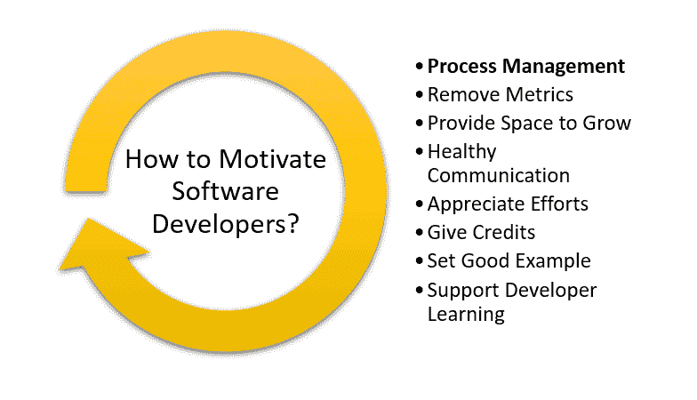

# 如何激励软件开发团队

> 原文:[https://simple programmer . com/motivate-team-software-developers/](https://simpleprogrammer.com/motivate-team-software-developers/)

积极和快乐的软件工程师表现得更好。但是是什么让软件工程师保持快乐和动力呢？确实是一个价值百万的问题。

在这种远程/零工经济中，留住有价值的人才是一项更加棘手的工作。

当乒乓球桌、厨师和其他花哨的现场津贴无法达到目的时，我们需要考虑如何保持员工的积极性以及如何提高他们的工作质量。

在本文中，我将向您展示保持软件开发团队积极性的驱动因素。

## 流程管理而不是人员管理

软件开发人员必须做的不仅仅是编码，比如参加会议、记录进度和发送电子邮件。一些开发人员认为这些事情分散了他们对手头软件问题的注意力。

当然，这些活动对于解决一天中出现的具体问题是必要的。然而，管理层应该设计程序并[塑造工作环境](https://www.amazon/dp/1454918721/makithecompsi-20)，这样开发人员就可以把大部分时间花在他们的项目上。管理者应该信任他们的系统，让开发人员专注于生产力，而不是监督个人的任务和工作习惯。过多的主动管理降低了个人责任感。

开发人员的工作围绕着解决问题。他们仔细分析特定的场景，寻找所有可能的解决方案，并努力实现最佳解决方案，这需要自主性。

管理者必须在过程管理而不是人员管理方面训练自己。指导人们做什么和不做什么经常会剥夺他们的自主权。

相反，给开发人员一个挑战，并给他们适当的时间来解决它。例如，假设一个项目需要[集成一个消息应用](https://www.simform.com/how-to-build-messaging-app-whatsapp-telegram-slack/)，但是集成中的一个问题阻碍了进度。在这种情况下，大多数经理会变得以产出为导向，而不是乐于助人。他们可能会指示他们的开发人员采用另一种技术来解决这个问题。

但是有许多其他的方法可以解决这个问题。经理应该给开发人员适当的时间来自己解决问题，而不是提供指导。这将激发开发人员的自由感和责任感。

它让他们进一步参与更高层次的思考，这有利于整体进步并保持他们的积极性。

“自由和责任是网飞商业战略的核心。”T3】

## 摆脱不合理的衡量标准

许多经理通过不同的标准来衡量软件开发人员的表现，比如记录的小时数、修复的错误数或编写的代码行数。

这似乎很有趣，但是开发时间跟踪应用程序的组织也为他们的软件开发人员实现了时间跟踪。

软件开发人员并不总是喜欢在工作中使用时间跟踪软件。他们认为这是基于时间衡量绩效的前提。然而，时间跟踪机制应该被用作允许开发人员测量进度和改进自己的工具，而不是评估性能的方法。

通过根据上述衡量标准设定任意的目标，你最终会创造出一种有缺陷的方法来衡量创造性专业人士的工作。开发人员需要时间来产生新的想法，测试他们的工作效率，有时会失败，然后重新开始。

开发人员可以在一个小时内生成一段代码，但这一个小时的代码是持续努力的结果，可能需要几个小时到几天。

这个过程应该定性、精确、分段，而不是量化绩效。例如，在项目级别，经理应该让开发人员了解组织过程和标准，鼓励他们以模块化的方式工作。因此，开发人员将获得一个适当的空间来与管理人员讨论他们的问题以及他们在特定模块上的表现。管理人员和开发人员一起，可以找到开发人员作为专业人员持续改进的方法。

为了保持软件开发人员的积极性，公司还应该提供一个积极的反馈机制来[吸引他们，并帮助他们基于他们对性能的自然驱动力来提高](https://www.inc.com/hillel-fuld/how-to-engage-your-team-be-a-great-leader-not-just-a-manager.html)——例如，在开发人员表现不佳的情况下。经理应该指出改进业绩的方法，而不是指出错误。管理者不应该在琐碎的事情上批评开发人员，而应该帮助他们解决问题，实现目标。

***“git lab 只关心输出和结果。它不在乎你花了多少时间工作，也不在乎你是否整天查看脸书和推特。”**T3】*

## 提供成长空间

Companies often focus on day-to-day tasks so much that they don’t offer their developers any space to explore anything beyond their job profile, both professionally and personally.

对个人来说，一个重要的激励因素是自尊和自我实现。除了满足基本的生存需求之外，获取更多的成长知识是任何专业人士的自然愿望。随着时间的推移，软件开发人员需要增强他们的技能和能力。

为了实现这一点，公司应该为软件开发人员的成长提供合适的环境。例如，像谷歌这样的公司在设计他们的工作场所时，感觉不仅仅是工作。员工可以在室内找到他们需要的一切，而不是出去吃午餐、娱乐和放松。

谷歌还鼓励自主，允许员工在他们喜欢的任何环境中工作。他们可以在休息区、自助餐厅、豆袋椅上或任何他们想去的地方工作。

谷歌的员工真心喜欢上班，这有助于他们身心的成长。

## 适当和健康的交流

交流的语言对开发人员的工作有着重要的影响。开发团队应该对他们的交流媒介感到舒适。

公司应该注意不要使用任何让开发人员不舒服的交流媒介。此外，他们应该确保管理人员不使用听起来具有支配性、刺耳、粗鲁或控制性的词语，让开发人员感到紧张和沮丧。像这样的语言不利于团队的动力。

公司应该致力于创造一个环境，让领导者寻求开发者的意见或建议，而不是主导或控制。他们应该鼓励队友更有效地沟通，让他们感到舒服。

例如，与团队进行例行的 scrum 会议，讨论项目的进展。允许团队成员就项目中可能实施的任何问题或任何新想法畅所欲言。这将鼓励他们批判性地思考任何问题，并提出新的想法。接受他们对项目的意见。

这将有助于保持开发人员的积极性和快乐，让他们感觉作为团队的一部分被倾听和重视，并为团队的成功投资。

“良好的沟通是早期工作的一个重点。”T3】

## 欣赏并给予信任

当开发人员受到激励时，他们会提出新的和创新的想法。即使项目已经步入正轨，您仍然需要创造性的想法来实现新的功能和技术。

如果你接受每个人的反馈，你会很快发现你是在和最优秀的技术人才一起工作。欢迎新的和创新的想法将帮助您无缝地运行您的项目。但是，最重要的是，这些小小的举动会让你的软件开发团队感到被赏识，并保持他们的积极性。

表扬某人会对他们的动机产生巨大的影响。需要时，向开发人员表示认可。使用恰当的语言向你的员工展示你真诚地欣赏他们的努力和重视他们的才华。向他们展示他们是如何帮助推动项目进一步完成的。这将大大增强他们的信心，提高他们的士气，从而保持他们的积极性和生产力。

## 指明方向，树立好榜样

有时，团队的项目领导在项目工作时不会给开发人员一个明确的方向。如果没有给软件开发人员一个最终目标，他们就不会以最佳状态工作，从而导致低生产率。

管理层应该与团队成员就项目及其发展方向进行沟通，并在有任何变化时及时更新，让每个人都保持一致。与一个充满热情和动力的领导者一起工作会让团队发挥出最佳水平。

有时，如果一个团队发现他们的领导没有尽职尽责，他们甚至会反对他们。所以，为你的团队树立一个好榜样，让他们保持动力。

## 支持学习和发展

即使您已经在您的组织中组建了合适的开发人员团队，您也必须确保为他们的成长提供合适的条件。

作为一名领导者，你应该努力让你的开发团队不会因为工作或其他事情而感到压力过大。这样做的时候，你需要很大的耐心。

例如，假设您正在进行的项目要求开发人员包含实时聊天功能。

虽然任务很简单，但是由于项目中的一些其他问题，开发人员无法集成它，并且开发人员无法解决这个问题。在这种情况下，经理必须保持很大的耐心。

经理应该通过检查代码并找出问题来为开发人员提供帮助，或者应该从其他来源——开发人员、在线论坛等——寻求帮助。这将给开发人员一种信任感，并激励他们以饱满的热情工作。保持高昂的情绪，确保团队中的开发人员在他们的工作环境中感到舒适。这将提高整体生产力。

The developers need to learn and update their skills to cope with the fast-pacing world. New languages, new tools, and new frameworks are introduced in the ecosystem as the [technology is updated](https://www.appvelocity.ca/blog/agile-software-lifecycle-2020) every day. To implement new tech into the project, developers need to upgrade their technological skills.

一个组织应该鼓励开发人员学习新技术。他们应该给开发人员提供适当的空间和时间来提升他们的技能。他们还应该鼓励开发人员接受各种认证计划，接受编码挑战，参与各种技能开发活动，等等。

这将有助于开发人员建立对组织的信任和对工作的兴趣，并保持他们有动力做好工作。

## 不要控制，把控制权交给你的团队

多年来，人们观察到，包括作家、设计师、战略家和开发人员在内的创造性专业人士在被赋予自主、掌控和目标感时会茁壮成长。

任何以控制软件专业人员表现的惩罚和奖励的旧模式运作的组织都弊大于利。换句话说，他们遵循有害的技术，损害而不是提高他们的表现，从而远离了最优秀的人才。

我希望这些建议能帮助你提高团队士气。最后，动力不是上帝赐予的。它应该定期补充，以保持人们的幸福和繁荣。