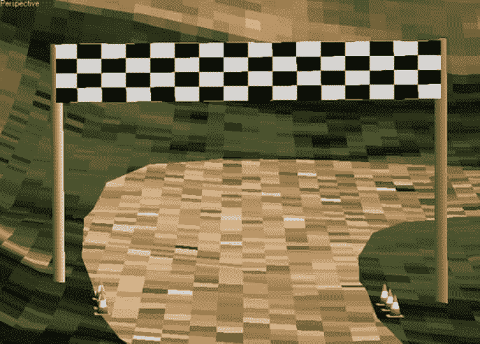

# 移动终点线

> 原文：<https://simpleprogrammer.com/moving-the-finish-line/>

**问题**:你如何让一个 Scrum 团队失去动力？

**回答**:移动终点线。

让我给你画一幅画…想象你正在赛跑。100 码短跑。你一直在训练，练习起跑，为大赛做准备。

你在街区，准备爆炸，听到枪声就开始跑。

枪发出“砰”的一声。

你沿着跑道起飞。

90 码

70 码

40 码

30 码，你现在可以清楚地看到终点线…快到了

20 码，继续冲刺就到了！

50 码，wtf？终点线刚刚移动了吗？

60 码，嗯？它又动了吗？！

此时你是继续拼命跑，还是开始走？如果你和大多数人一样，你会开始走路。如果你和大多数 Scrum 团队一样，你会开始走。

现在，想象一下如果每次冲刺都这样。很快训练就变得不那么重要了。你发现自己甚至没有使用积木，因为这无关紧要。经过几次这样的迭代之后，团队从一开始就在走，甚至根本不是在跑。

不要移动终点线。不要这样做。