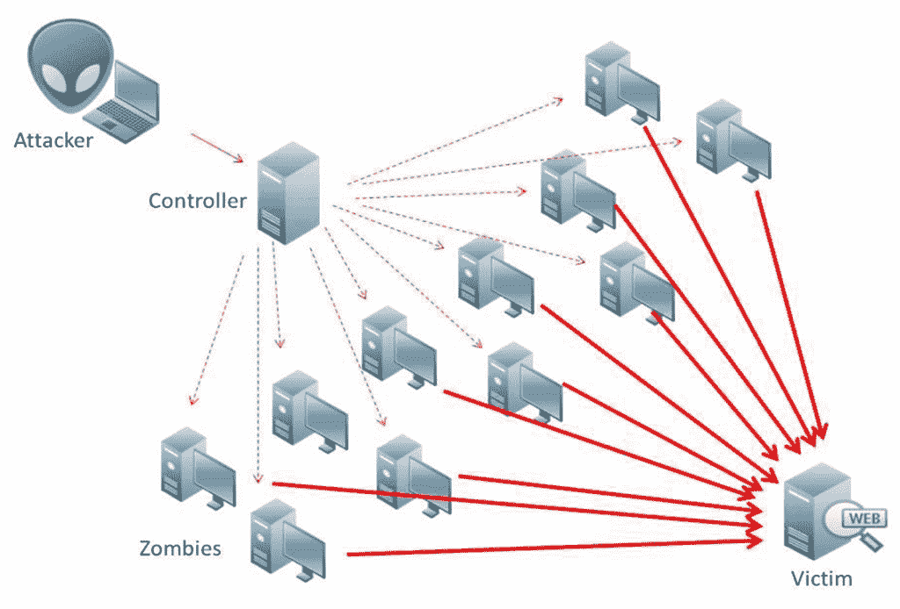
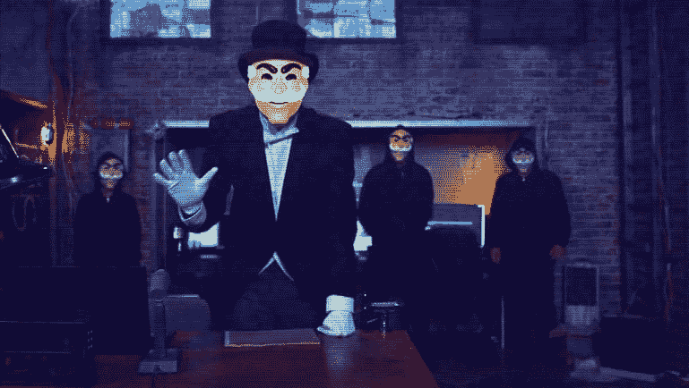

# 机器人先生:黑客、工具和赛博朋克

> 原文:[https://simple programmer . com/Mr-robot-hacking-tools-and-cyber punk/](https://simpleprogrammer.com/mr-robot-hacking-tools-and-cyberpunk/)

自从黑客在 80 年代被引入以来，好莱坞已经设法不断地歪曲他们。他们被描绘成坐在电脑前快速打字的反社会天才。

幸运的是，电视节目《机器人先生》来纠正这个问题了。该节目非常接近代表一个有点可信的黑客的世界。

虽然它适合大多数观众，但只有程序员能够跟进节目中的所有细节。其中一些包括短暂出现在显示器上的短代码行，或者一些角色使用的软件。由于创建者山姆·艾斯梅尔采纳了熟练程序员的建议，你在那里看到的大部分内容都是准确的。

这让我们想到了赛博朋克的复兴。

想想吧。

曾经被认为是“赛博朋克”的小玩意现在成了消费设备。一些例子包括机器人肢体、虚拟现实耳机、微芯片植入物和神经接口。80 年代赛博朋克小说、电影和漫画中丰富的未来概念已经开始与我们自己的现实密切相关。这种类型的一个伟大代表是雷德利·斯科特著名的银翼杀手。

起初，成为一名赛博朋克意味着成为一名使用高科技设备在未来的反乌托邦中生存的下等人。今天，作为一个赛博朋克意味着离线，脱离网格，并控制数据流。这就是机器人先生的部分内容。

好莱坞终于全面地探索和描绘了一个赛博朋克黑客在现代社会中的生活。他对罪犯和(显然)合法公司都是一种威胁。

那么,《机器人先生》中有哪些有趣的元素，它们是如何增加这部电视剧的真实性的呢？

## 真正的黑客

埃利奥特是这部连续剧的主角。他白天是白帽黑客，晚上是黑帽义务警员。

摘自:http://www . USA network . com/sites/USA network/files/Mr robot _ show _ 2560 x 1440 . jpg

创作者已经通过让 Elliot 成为一家名为 Allsafe 的网络安全公司的雇员获得了一些信誉。我们可以有把握地说，要为这样的公司工作，一个人必须是一个非常熟练的工程师。这就像是为苹果、安然和通用汽车联合雇佣的网络安全巨头工作。e 公司代表美国最大的公司。这个想法本身就让主角更加可信。埃利奥特开发了各种各样的黑客技能，使他像他一样强大。让我们看看其中的一些，看看它们是否能在现实世界中应用。

### Tor 的故事

埃利奥特是一种善用超能力的黑客。

例如，在拦截了当地一家咖啡馆的 Wi-Fi 网络后，他发现店主实际上正在运营一个大型儿童色情网站。Avast 安全专家 Pedram Amini [解释说](https://blog.avast.com/2015/06/25/are-the-hacks-on-mr-robot-real/)通过一个开放的 Wi-Fi 热点被黑的可能性很高。任何人只要从网上下载一个免费软件就可以做到，如果你没有使用安全的 VPN，你可能会被黑客攻击。

当然，前面提到的罪犯并没有那么鲁莽。埃利奥特不得不拦截来自之前设置的 Tor 出口节点之一的流量。这就是他如何找到罪犯的位置，并对他进行一次小小的“友好”拜访。对于那些不知道的人来说，Tor 网络是用来伪装一个人的在线身份的。它通过在不同的服务器之间重新定位和加密网络流量来防止追踪。

然而，Tor 的故事缺少的是其顶级隐藏服务和“公共互联网”之间的区别。Tor 的隐藏服务提供了一种端到端的加密方法。如果一个人要控制网络的很大一部分，他们可能会发现用户的 IP 和隐藏的服务通过他们的相关性。

Tor 的设计方式使得它无法阻止来自那些能够测量网络输入和输出流量的人的攻击。如果你能看到这两种流量，那么使用简单的统计方法来测量它们就很容易了。

正如我们在 Tor 设计论文中读到的，程序本身并不打算对抗端到端的交集或计时攻击。这就是为什么在 2014 年有一群继电器被认为试图去匿名化用户。使用 Tor 隐藏服务的用户是主要目标。

### 克里斯塔是一个坐以待毙的人

让我们回到埃利奥特身上。他是个反社会者。他通过黑掉遇到的人来探索世界。这是他了解他们和参与社会互动的方式。通过运用他的黑客力量，他在社会中扮演了他的角色。

> “我不只是黑你，克里斯塔。我黑每个人。”

埃利奥特的治疗师克里斯塔是个容易下手的目标。他说黑她很简单。她的密码是她最喜欢的艺术家的名字，加上她倒写的出生日期。这有多明显？

这样做的问题是，全世界有很多人认为密码太简单了。他们没有意识到在疯狂地网上冲浪或下载某个优惠券时，他们留下了多少信息。社交媒体账户也充满了有价值的个人信息。它可以被输入到一个简单的密码破解工具中，这个工具在大多数情况下足以破解密码。

### 你呢，布鲁图？

克里斯塔的男友迈克尔也未能幸免。他受到了有效的暴力攻击。当然，使用旨在检索加密数据的密码分析攻击是因为加密系统中没有其他漏洞。

对于那些不知道的人来说，暴力攻击在本质上类似于字典攻击，而后者使用更具体的目标系统。举个例子，暴力攻击是臭名昭著的[名人丑闻](https://en.wikipedia.org/wiki/ICloud_celebrity-photo_leaks)的罪魁祸首。

这些天你也要小心你不出名的背后。其中一种方法是使用某种离线存储设备。

埃利奥特使用光盘来避免将数据存储在云中。这在今天可能看起来很荒谬，尤其是因为你可以找到许多具有可靠加密系统的云存储应用程序。我会推荐 Mega，4Shared，或者 pCloud(甚至设置了黑客挑战来证明其不可穿透)。不过，在阅读了一些[4 共享评论](https://www.cloudswave.com/collaboration/s/4shared-premium-account/reviews/)后，我决定在其他评论中尝试一下，仍然保持原样。

当然，对于有经验的黑客来说，任何类型的数字存储都是容易攻击的目标。你必须小心你的数字足迹和你下载的文件。因为这是 Elliot 使用 CD 的原因，并且可能是一个全新的文章主题，让我们回到我们的机器人先生分析。

### E 公司的黑客

大公司也容易受到更有经验的黑客的攻击。就连 Allsafe 的客户，跨国企业集团 E Corp，也遭遇了灾难性的安全漏洞。讽刺的是，该公司遭受了 DDoS 攻击。这次攻击是基于污染了大量服务器的 rootkits。

什么是 DDoS 攻击？

分布式拒绝服务(DDoS)攻击的目标是通过向服务器发送过多的服务请求来禁用服务器。这些类型的攻击是由僵尸网络发送的，目的是使服务器过载。服务器本身无法承受如此多的请求，因此变得没有响应，最终变得无用。这些类型的攻击非常有效，因为人们可以很容易地猜测一家公司通过其员工发出的信息模式。例如，如果一封电子邮件看起来像“name.surname@ecorp.com ”,黑客只需查看该公司所有员工的列表，就可以轻松猜出其余数百封电子邮件。一旦他收集了所有的信息，攻击者就可以通过密码破解软件运行这些信息，并接管路由器的控制权。

摘自:http://lifars.com/

DDoS 攻击大多针对较大的企业；然而，黑客也倾向于使用单独的路由器来促进他们的攻击。你可能在不知不觉中帮助了一个罪犯！事实上，就在我们“说话”的时候，[数以百万计的消费者路由器](http://www.computerweekly.com/news/2240217386/Millions-of-routers-open-to-criminal-exploitation-study-shows)被发现容易受到这种网络安全威胁。

### 实际编码

系列中的[黑客](http://null-byte.wonderhowto.com/how-to/mr-robot-hacks/)被尽可能准确地刻画出来。程序员正在通过查看在整个节目中随机出现的各种命令的截图来分析埃利奥特的行为。关于这几行代码是否完全准确，存在很多分歧。看起来有一些漏洞，但这些只是允许许多有趣的新想法在互联网上传播。接下来是机器人先生中使用的一些命令的列表。

*   root@elliot—Elliot 选择 root 而不是 sudo，但是这有意义吗？由于他试图在网络上找到一台机器，由于各种必要的 ping 开关，他可能不得不使用 root。
*   astsu–info-backup-short—该命令实际上是该系列独有的，它很可能代表服务器状态实用程序。命令是不言自明的:info(服务器信息)；备份(打印出备份服务器)；简短(细节会很简短)。输出也没什么特别的(他应该用-b 或者 backup)。有点奇怪的是，他花在输出上的时间没有花在解析输入参数上的时间多。
*   astsu–ifconfig–disable—Elliot 喜欢他的空间。他显然禁用了以太网接口。
*   astsu-open port:*-persistent-astsu 命令确实很强大！埃利奥特用它关闭了服务器上的所有端口。我想知道命令是否使用 iptables？
*   astu-RM-no recycle/root/fsociety/—Elliot 几乎删除了他的整个根目录。在这里，我们看到他跳过了回收站，但及时取消了命令。

虽然有一些小的不一致，但这些都是可以原谅的，因为创作者在实际的黑客攻击中非常注重细节。现在让我们来看看埃利奥特的一些黑客工具。

### 机器人先生里的黑客工具

该系列的创作者在基本的好莱坞娱乐和刻画黑客所需的技术准确性之间找到了合理的平衡。让我们看看他们有多专业。以下是我们可以在系列中看到的一些黑客工具:

**Canbus 黑客攻击**

在其中一张[截图](https://hackertarget.com/mrrobot/canbus-hack.png)中我们可以看到 candump。这是一个用于查看 canbus 消息的 Linux 实用程序。Canbus 黑客现在非常流行，因为它被用于白帽汽车黑客。安全专家也用它来测试汽车电脑的漏洞。

**卡莉 Linux**

在整个节目中多次提到 Kali Linux。这是一个专门用于渗透测试的操作系统。它带有预配置的黑客工具，非常适合初学者，因为它很容易配置。然而，您必须熟悉 Linux 终端，并且做一些阅读和研究。当然，该程序应该仅用于学习目的，除非您是网络安全专家，需要进行大量的笔测试。

**蓝牙扫描仪**

该工具是 Linux 发行版的一部分，用于在不配对的情况下从蓝牙连接设备获取尽可能多的数据。正如我们从[窗口的标题栏](https://hackertarget.com/hacker-tools-mr-robot/)中看到的，Kali Linux 显然是他们的首选操作系统。

**Metasploit 框架网络**

Meterpreter 是 Rapid7 必不可少的渗透测试工具。它的外壳使攻击者能够完全控制一个人的系统，并在网络中自由移动。这是一个强大的工具，它出现的时间[很短，足以引起人们的注意。](https://hackertarget.com/mrrobot/meterpreter.png)

**网景导航器**

Elliot 提到，他在进行第一次黑客行动时使用了 Netscape Navigator 和 Windows 95。这个浏览器对主角来说非常有用，因为它很简单。此外，这是埃利奥特用过的第一个浏览器。它是由一个名叫马克·安德森的黑客在 1993 年发明的。Netscape Navigator 对于社会工程和 web 应用程序攻击特别有用，但是你必须大量阅读[才能真正掌握它的能力](https://simpleprogrammer.com/2010/07/02/the-importance-of-always-reading/)。我们可以看到埃利奥特分析一个来源时，浏览器的[截图。](https://hackertarget.com/mrrobot/windows95-netscape.png)

**Bluesniff**

这是另一种用于攻击配备蓝牙的设备的工具。[在这里](https://hackertarget.com/mrrobot/bluesniff-police-car.png)，我们可以看到通过受害者的蓝牙键盘进行的中间人攻击。然后将一个 Meterpreter 外壳放到系统上，以便访问网络。

**社会工程师工具包**

社会工程工具包(SET)用于使社会工程攻击更容易。钓鱼攻击、无线接入点和诱饵网站都可以通过 set 的系统设置。以下是该系列中使用的[短信模块](https://hackertarget.com/mrrobot/social-engineer-toolkit.png)的示例。

**一个简单的 USB 驱动器**

埃利奥特的同伙在警察局停车场丢了一大堆优盘。接下来发生的事太棒了。一名保安拿起其中一个硬盘，将其注入他的电脑。在网络访问受限的情况下，这是一种偷偷摸摸但有效的传递代码的技巧。

这些工具大部分都是开源的，很容易获得。网上有大量的教程和文档。正是这些工具的结合使得《机器人先生》中的黑客行为更加真实。

## 赛博朋克世界

80 年代是赛博朋克作为一种流派蓬勃发展的时期。这种类型本身涉及一个反乌托邦的未来，其中个人受到压迫，被迫走出自动化和无脑消费社会的限制。

今天，赛博朋克又回来了。但这一次，它不是一部科幻小说，而是我们的现实，正如山姆·艾斯梅尔所说。在这个 Reddit AMA 中，他解释说他想让赛博朋克回归。

### 他们是怎么做到的？

他们在故事中融入了许多赛博朋克元素。有人会说这种设置类似于[神经癌](http://www.amazon.com/exec/obidos/ASIN/0441569595/makithecompsi-20)。埃利奥特是反社会、[内向的](https://simpleprogrammer.com/2015/12/14/psychology-for-programmers/)黑客对抗者，患有精神分裂症和毒瘾问题。他准备用他的编程技能打倒庞大的邪恶集团，拯救数十亿人的生命。剧中另一个经典角色是亚洲黑客 Whiterose，一个在法拉第笼外操作的变性人！埃利奥特的妹妹达琳也是一个真正的叛徒。她看起来像个麻烦，是 fsociety 团队的真正成员。她凶猛、大胆、博学、无情。除此之外，她看起来像一个网络嬉皮士朋克，化着深色的妆，打着耳洞。

山姆·艾斯梅尔使用了一个基本的 80 年代赛博朋克故事的前提，但这部剧之所以如此受欢迎，是因为它与我们当前的现实有联系。该节目的创作者想揭示我们这个世界的不可思议之处。我们现在是我们曾经设想和害怕的反乌托邦未来的参与者。

埃利奥特是当代赛博朋克。曾经离网的现在下线了。你越是隐藏你的踪迹，你就越有机会保护你的信息隐私，防止它变成大数据。大数据在当今世界具有巨大的价值。公司收集它来分析消费者的需求，埃利奥特用它来摧毁这些企业。

### 反社会的一面

我们能逃离体制吗？我们能黑进矩阵吗？fsociety 和 E Corp 的战斗类似于大卫和歌利亚的战斗。但是大卫在现实世界中真的会赢吗？

无法逃离他鄙视的世界的想法使埃利奥特抑郁，甚至疯狂。他屈服于吗啡成瘾，并在整场演出中饱受折磨。当谈到传达为什么他们对现实如此沮丧的信息时，主角和他的团伙的反社会方面是极其重要的。

所有的角色都处于崩溃的边缘。达琳几乎太专注于摧毁 E 公司，但这种绝望是必要的，以使角色可信。她的生活取决于它，取决于那个故事情节。她也是一个熟练的黑客和团队合作者，并试图不惜一切代价为 fsociety 的行为辩护。

达琳也是这个系列中最大的转折，但我不会透露太多。

### 越真实越好

当谈到我们这个时代黑客的准确描述时，机器人先生无疑是最好的节目。一些人认为这可能是 2015 年最好的节目。它以真实、无缝的方式呈现角色。该剧成功的一部分是与角色的联系，这是我们作为观众在整个赛季都能感受到的。

此外，机器人先生中的黑客使用真实的工具和软件，不像在大多数好莱坞作品中可以看到的那样。这就是这个系列对软件工程师如此有吸引力的原因——我们也可以欣赏它，因为一些最好的工程师参与了这个节目的创作。

赛博朋克又来了，我们应该感谢山姆·艾斯梅尔出色地指出了这一点。

就像黑客一样，营销往往会带来不好的名声。别担心，这不是一个肮脏的词。如果你正在努力做一份低估你价值的工作，看看我的课程[“如何作为一名软件开发人员推销自己”。](https://simpleprogrammer.com/store/products/how-to-market-yourself/)T3】