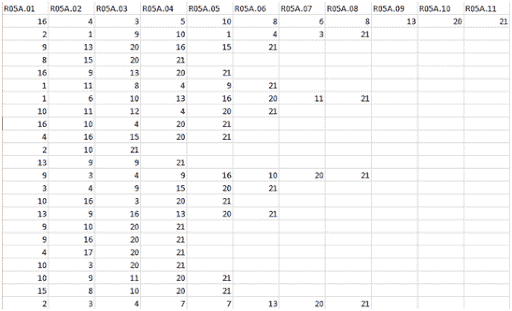
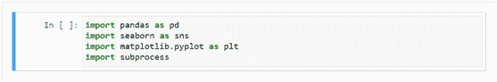
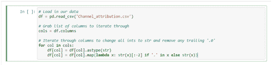
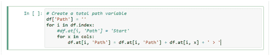
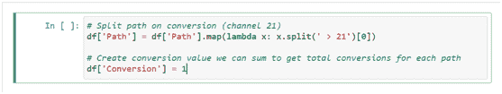
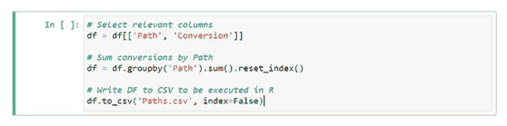
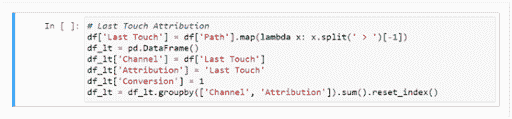
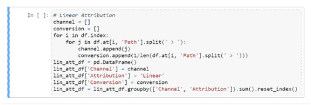

# 如何用 Python 制作多渠道归因模型

> 原文:[https://simple programmer . com/multi-channel-attribute-model-python/](https://simpleprogrammer.com/multi-channel-attribution-model-python/)

Shopping patterns have changed drastically in recent years. Nowadays, informed customers do research before investing in any item and make online purchases only after going through multiple channels and websites to get the best deals for themselves. However, this makes it difficult for marketers to correctly determine how much of each marketing channel the customer was exposed to before making a conscious choice.

如果我们确定了客户在购买他们喜爱的产品之前所经过的渠道路径，我们就可以使用渠道归因模型来分析哪个渠道帮助了他们进行购买。这样的多渠道报告将为我们提供两个重要的转化价值:最后点击转化和辅助转化。

在这篇文章中，我将向您展示如何使用 [Python](https://simpleprogrammer.com/5-benefits-of-python/) 来构建一个多渠道属性模型，然后应用该模型来检索我上面提到的有价值的信息。这将大大有助于任何企业甚至个人卖家的营销策略。

## 传统电子商务归因模式

在我向您展示如何基于 [Python](https://simpleprogrammer.com/get-started-learning-python/) 构建您的归因模型之前，先快速浏览一下一些传统的电子商务归因模型会很有帮助。

由于客户变得更加注重研究，并且在沉迷于某个产品之前更喜欢探索所有渠道，市场机构首先使用营销归因模型来跟踪影响客户购买的渠道:

*   **首次接触归因模式**–第一个渠道被给予 100%的信任，因为它被认为是负责客户购买决策的第一个营销渠道。
*   **最后一次接触归因模型**–在该模型中，最后一个渠道或最后一个接触点被给予 100%的信任，因为它被认为是最后一个接触的营销渠道决定了客户的购买选择。
*   **线性接触归因模式**–在这种归因模式中，客户旅程中出现的所有营销渠道都被给予同等的信任。每个渠道都被认为同等地影响着顾客的购买选择。
*   **U 形或浴缸归因模型**–该模型将 40%分配给第一个和最后一个渠道，20%平均分配给其余渠道。这种渠道在电商公司最为常见。

显然，每个模型都可以对客户行为给出不同的见解。具体情况在一定程度上取决于所涉及的业务，但这正是多渠道归因模型的价值所在，因为它让我们能够了解在给定的背景下什么是最合适的。

现在，我们已经简要了解了各种模型，是时候看看如何构建我们自己的[多渠道归因](https://www.amazon.com/dp/0655409971/makithecompsi-20)模型了。

## Python 代码构建多渠道归因模型

让我们看下面的数据集。在列中，我们有参与活动，在一行中我们有参与的渠道。该数据集按时间顺序排列。我们为每个营销渠道分配了一个固定的数值，并以这样的方式显示它们:在 x 列中，x 的参与度是从具有相应营销渠道的用户处获取的。

我们已经转换了 21 频道的数据。因此，数据集包含了用户转化的过程。

让我们迈出第一步，导入必要的库。在这里，您必须导入 Pandas 库进行数据操作， [Seaborn](https://seaborn.pydata.org/) 进行数据分析， [Matplotlib](https://www.w3schools.com/python/matplotlib_pyplot.asp) 进行数据可视化，以及创建新流程的子流程。

下一步是加载数据集，这可以使用 pd.read_csv()函数来完成。现在，您需要使用 df.columns 来获取列列表。之后，必须清理数据点。

这里，你需要使用马尔可夫链框架；因此，您需要将用户旅程放在一个变量中。你需要把它看成是第一渠道>第二渠道>第三渠道等等的形式。下一段代码将执行此活动。

在数据集中，通道号 21 是转换事件。因此，我们需要将这个通道从原始路径中分离出来。之后，您必须创建另一个转换变量来保存成功转换的次数。下面的代码块将完成这一任务。

恭喜你，你已经完成了数据处理过程！

现在，您必须获取下一步需要转发的列的子集，因为您的数据集仍然有原始的列。您还需要在这里对您的用户数据进行分组，因为许多用户可以进行相同的旅程。

您的转换变量将分别包含每个客户旅程的转换号。此外，我们需要创建另一个 CSV 文件来存储路径数据。您可以使用这个 CSV 文件来运行属性方法。

现在，你有两个选择。第一种是使用 pip 安装频道属性模块。要安装这个模块，只需进入你的终端，写下以下内容:
 `pip install --upgrade setuptools
pip install Cython
pip install ChannelAttribution` 

第二个选择是自己用 [Python](https://www.amazon.com/dp/1775093328/makithecompsi-20) 创建马尔可夫网络/链。尽管如此，将 Python 代码与 R 编程语言中的“ChannelAttribution”库集成起来会更快。这个库包含了频道属性的所有可执行组件。您可以使用 Python 库子流程来实现这一点。

如果您想计算第一次触摸的属性，下面的代码块将帮助您。

类似于第一次触摸，也可以计算最后一次触摸的归属。下面的代码块将完成这一任务。

此外，如果需要计算线性属性，可以运行下面这段代码。

现在，您可以使用 Python 编程语言按照循序渐进的步骤构建一个多渠道归因模型[。试试看，看看效果。](https://www.codingninjas.com/courses/online-python-course)

## 实施数据驱动的归因模型的挑战

领先的营销人员依赖于数据驱动的归因模型，因为它可以有效地确定接触点对客户旅程的影响。品牌现在可以获取他们需要的数据并进行分析，因为这有助于他们根据客户的见解改进营销策略。

然而，在实施数据驱动的归因模型时，您可能会面临各种挑战。其中包括:

*   在采取行动和获得洞察力之间的两难选择可能是你将面临的根本性挑战。你总是想添加一个新的数据点，给你更多的见解。它会导致缓慢的改进和升级。
*   有各种不同的归因模式。所以你需要**从各种选项**中选择。很多时候，特定的归因模式会导致优化的结果。因此，找到完美的模型具有挑战性，需要更多的研究。
*   您将发现各种工具来实现。但是你需要选择一个完美的组合。你的团队必须有足够的知识来克服这个挑战。
*   你需要**整合线下和线上的接触点**来获得正确的客户洞察。因此，您可能会面临许多挑战，例如准确记录客户洞察、确定每个接触点的唯一键、影响问题等。

每种情况都需要一个独特的解决方案。分析问题以得出最佳解决方案需要耐心。每个公司可能有不同的需求，团队成员之间需要很好的协调和同步来满足特定的需求。

在任何时候都不要放弃，这会让你达到最终目标。取得微小的进步总有一天会让你获得巨大的成功，所以保持热情，用积极的心态和乐观的观点面对每一个挑战。

## 知识就是力量

在这篇文章中，我向您展示了如何使用 Python 制作多渠道归因模型。正如你所看到的，有各种各样的电子商务归因模式在使用，每一个都有自己的特点。

此外，使用数据驱动的归因模型涉及到一定的挑战，从采取行动或获得洞察力之间的困境，到您将不得不做出的各种选择。

尽管如此，知识就是力量:理解客户的旅程为你提供了采取适当行动的资源。希望这篇文章能为你的知识提供最好的结果，并很好地服务于你的目的。