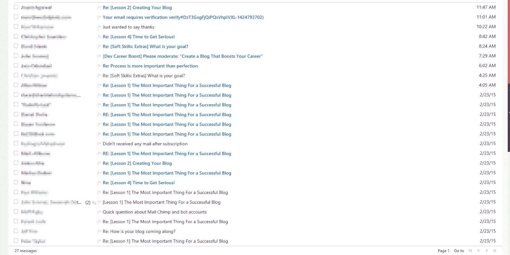

# 用这个免费的博客课程改变你的生活

> 原文:[https://simple programmer . com/my-free-blogging-course-getting-unless-results/](https://simpleprogrammer.com/my-free-blogging-course-is-getting-unbelievable-results/)

大约在 2014 年 12 月中旬，我决定推出一个[完全免费的博客课程，将在 3 周内通过电子邮件提供。](http://devcareerboost.com/blog-course/)

我不知道博客课程会有多受欢迎和成功。([这里有一本好书，来看看](http://www.amazon.com/exec/obidos/ASIN/0692236511/makithecompsi-20)

在写这篇文章的时候，**将近 3000 名软件开发人员已经注册了**这门课程，**100 多名开发人员已经创建了新的博客**或者恢复了他们现有的博客。

每天**我的电子邮件收件箱**都塞满了已经报名参加课程并正在采取行动的程序员发来的邮件！

对我来说，这是一个巨大的惊喜！

创建这个博客是我一生中做过的最好的事情之一。

不，说真的。我没跟你开玩笑。

以下是这个博客给我带来的一些机会:

*   创建[超过 55 个多视球场](https://simpleprogrammer.com/pluralsight)
*   找一份在家工作的工作
*   受邀在会议上发言
*   受邀在播客上发言
*   写一本[传统出版的书](https://simpleprogrammer.com/softskills)
*   辞职，完全为自己工作
*   遇见各种各样的牛人

我的生活彻底改变了，因为有一天我决定坐下来开始定期在这个博客上写东西。

那是五年前的事了。

当我刚开始写这个博客的时候，第一个月我有 44 次页面浏览量，第二个月有 373 次页面浏览量，T2 有 373 次。

仅这个月，我就有超过 24 万的页面浏览量。(部分原因是我的[简单程序员测试帖子](https://simpleprogrammer.com/2015/02/16/joel-test-programmers-simple-programmer-test/)造成的)。)

总的来说，自从我开始写作以来，我的博客已经有了将近 300 万的浏览量。(下个月，我将突破 300 万大关。)

我总共写了 **436 篇博文**，相当于每周大约 **1.5 篇博文。**

是的，这需要大量的工作和承诺。

是的，[我并不总是想写博文](https://simpleprogrammer.com/2015/02/02/im-not-writing-blog-post-week/)。

但是，**回报**远远超过**成本**。

## 如果每个人都开始写博客会怎样？

我知道很多阅读这篇文章的人会认为这个世界很小，空间只够容纳这么多软件开发博客。

但是，让我告诉你。世界是一个巨大的地方。

你有足够的空间来创建自己的博客，尤其是如果你听从我的建议和 T2 的话。

有数百万程序员，而且这个数字每天都在增长。

如果这个博客课程取得了巨大的成功，并让 10 万名软件开发人员开设了一个新的博客，那么仍然会有足够的空间给你。

就推销自己而言，拥有一个博客——你会定期更新——仍然会让你成为软件开发人员中排名前 1%的人。

但是，事实是，它甚至比这更好。

不仅不太可能有近 100，000 名开发人员注册我的博客课程，而且即使注册了，也可能只有 10%的人会真正创建博客，只有 1%的人会真正维护博客并保持活跃。

那么，这对你意味着什么？

这意味着有很多机会。

这个湖还没有完全被“捞出来”,也不会——永远不会。

我们永远不会达到每个软件开发人员都有一个每周更新一次的博客的地步。

这是不可能的。

所以，不要再以此为借口不开自己的博客了——说真的。

你有足够的空间取得和我一样的成绩，甚至做得更好，因为你将从我的经历中学习。

如果你还没有报名参加我的免费的为期 3 周的课程，学习如何创建一个博客来促进你的职业生涯，现在就报名吧。

不要等着找借口。([一本关于如何停止找借口的好书](http://www.amazon.com/exec/obidos/ASIN/1933662808/makithecompsi-20)

相信我，这是值得的。

## 查看所有从我的电子邮件课程毕业的开发人员的博客

在我的电子邮件课程中，我保证如果你写了一篇关于电子邮件课程的博文，我会从我的博客创建一个链接到你的博客。

我一直在等待，直到有足够多的博客链接，但现在我有一个相当大的列表，我计划保持更新。

So, [check out this list of all the blogs created by software developers who have signed up for my free blogging course!](https://simpleprogrammer.com/blogging-course-graduates/)  

我对这些开发者感到非常兴奋，他们不仅注册了课程并创建了新的博客，还采取了额外的步骤，承诺定期写作——这是成功的主要关键之一。

你也可以通过阅读他们的博客文章来了解我在课程中所讲的内容。

所以，[看看这个列表](https://simpleprogrammer.com/blogging-course-graduates/)，一定要留下评论，让他们知道你已经读过了——这将意味着很多。