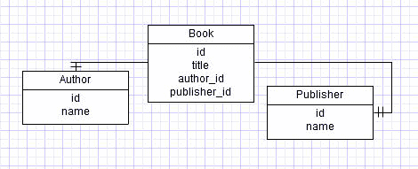
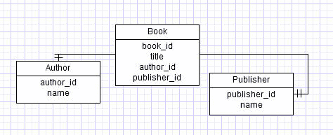

# 命名数据库列，何时违反 DRY

> 原文:[https://simple programmer . com/naming-database-columns-when-to-violate-dry/](https://simpleprogrammer.com/naming-database-columns-when-to-violate-dry/)

干=不重复自己。

在很大程度上，这是一个很好的遵循原则。但是，有一个特殊的例子，我觉得重复自己的话会让事情变得更清楚。

对我们来说，记住原则很重要，但最终它们是非常强有力的指导方针，而不是绝对的。(很难想象我刚才是这么说的，因为我通常是在争论原则的是非曲直，但我跑题了。)

## 传统

特别是，在创建数据库表和命名数据库列时，大多数人会创建一个如下所示的表结构:

看起来完全正常和良好。但是，我不喜欢。假设您必须将这些表连接在一起以创建一个查询。(这是很常见的事情。)

你发现我上面的错误了吗？大概不会。大多数人会忽略它。有了上面的 ER 图，表格上没有太多的列，就更容易看到了。

很容易混淆哪个表是父表，哪个是子表。很容易把。id 位于 join 子句的错误一侧。正确的 SQL 应该是:

## 逆势而为

现在看看这个 ER 图:

从该数据库中选择的对应 SQL 是:

这是一个很小的变化，但却有很大的不同。编写 SQL 来连接表要容易得多，也更难出错。是的，我在这里重复自己，但我这样做是有很好的理由的。我让 SQL 更加清晰，让谈论这些表变得更加容易。

回想一下您最近一次关于数据库表的对话。你说的是 *id* 吗？然后你必须限定你所说的那个 *id* 吗？如果你从来没有*【id】*，你就消除了大量的歧义。

反对我建议的主要论点是，您不需要将*书的 *id* 命名为*、 *book_id* ，因为它是 book 上的一个列，所以您知道 id 指的是书的 *id* 。我不反对这一点。在很大程度上，这个原则是合理的。然而问题是“哪一个更容易读、写和谈论？”