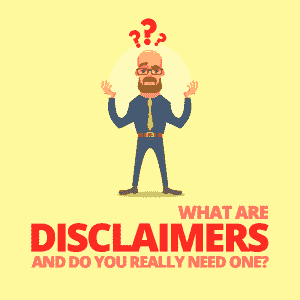

# 什么是免责声明，你真的需要一个吗？

> 原文：<https://simpleprogrammer.com/need-disclaimers/>

Have you ever seen one of those *No Trespassing*, *Slippery When Wet*, or *Beware of Dog* signs?

你当然有——像这样的迹象无处不在，我们在日常生活中几乎每天都会遇到。当我们看到它们时，我们会格外小心，以免与它们发出的警告发生冲突。

但是这些标志到底在说什么呢？使用它们的人只是无私地关心你的健康和幸福吗？

可悲的是，答案是:可能不会。

事实是，这些标志是免责声明的基本形式，张贴这些标志的人只是想在最坏的情况发生时保护自己免受法律责任。

但这些标志看起来或感觉起来不像我们习惯于在我们遇到的每个网站和移动应用程序的页脚和菜单中看到的充满法律术语的文件。

那么有什么区别呢——为什么每个人都如此担心诉讼和责任呢？

无论你是一名自由职业者还是自己做生意的开发人员，你都可能是一个诚实的人——你几乎肯定不需要在你的房产上放一个警告危险狗的标志——所以你真的需要在你的网站上放一个免责声明吗？

不幸的是，答案并不是非黑即白的，要真正了解你的网站或你创建的移动应用是否需要一个免责声明，你必须首先了解什么是免责声明，以及它们能为你做什么。

下面，我全面概述了什么是免责声明，以及为什么你的网站或移动应用程序可能需要一个。但我要指出的是，尽管我为开发者提供咨询，为他们的应用量身定制法律政策，但我不是律师。虽然这些考虑对你的移动应用或在线业务至关重要，但向真正的法律专业人士寻求法律咨询也很重要。

## 什么是免责声明？

免责声明仅仅是一份声明，旨在限制显示该声明的个人或实体的法律责任和/或义务。此陈述的长度和复杂性完全取决于小企业主提供的产品、服务、内容和功能。

基本上，业务、服务或软件程序越复杂，其免责声明就需要越长、越全面。

它应该清楚地指出你的业务或服务的某些方面，这些方面可能会被你的顾客或客户误解或曲解为他们没有的东西，并声明你对这种误解不承担责任。

以其他行业为例。律师、医生、营养师和其他专业人士必须对他们发布的内容特别谨慎，因为这可能会被误解为专业建议。当然，这种建议只能通过适当的、特许的披露来给出。

虽然人们可能对某个网站提供的信息很有信心，但那些根据这些信息行事的人——尤其是在有免责声明称这不是专业建议的情况下——这样做是不负责任的，风险自负。

[免责声明警告读者，网站内容](https://termly.io/disclaimer/sample-disclaimer-template-guide/)仅供参考，用户不应根据他们在网站上读到的信息采取行动，也不应将其理解为可行的建议。根据您的定位或您提供的服务，您的网站将需要特定的免责声明来保护您免于民事责任，并符合您所在行业的特定法规。

在网上营销你的业务——无论你是从事软件开发，作为自由职业者或顾问提供服务，还是仅仅经营一个关于软件开发的利基博客——都伴随着独特的风险，其中之一就是潜在的法律责任。免责声明是您的数字武器库中的防御性武器之一，有助于保护您免受诉讼和责任。每个企业、网站和软件都需要一份免责声明——不管它有多复杂——如果仅仅是为了保护你自己免于为你的内容或服务中的任何错误承担责任。

但是在你开始用那些在线免责声明生成器之一[建立你的策略之前，你需要了解它们为你做了什么，以及你的软件、服务或在线业务的哪些具体方面需要一个。](https://termly.io/disclaimer/disclaimer-generator/)

## 免责声明对您有什么帮助？

Disclaimers shield you, your software, and your website from liability—civil or otherwise. They serve as both a warning and a mitigation of risk.

任何访问您的网站、使用您的软件或利用您提供的服务的人都将能够看到您的政策并了解持续光顾的潜在风险。他们也将不敢对你采取法律行动，不仅是因为在免责声明中被警告有风险，也是因为在某些事情上免除你责任的语言。

虽然你可以[在一个全面的条款和条件部分](https://termly.io/terms-and-conditions/sample-terms-and-conditions-templates-guide/)中包含你的免责声明，但这两者都是非常重要的文档，值得拥有自己的页面。**此外，独立的免责声明更有可能在法庭上得到支持，因为它更有可能被你网站的访问者看到、访问和理解。**

为了充分保护您自己，您的免责声明必须涵盖所有可识别的潜在风险领域。您的免责声明中需要解决的一些问题包括:

*   **第三方责任**—如果您允许您网站上的广告、用户内容提交、您博客上的评论或任何其他形式的第三方内容，包括涵盖这些第三方的行为、不行为或错误的免责声明，可以保护您的业务。
*   **内容所有权**—完全属于您的内容以及您编写或付费的内容应在免责声明中得到认可，以帮助保护您免受内容被盗以及内容被复制或被盗的指控。
*   **内容的准确性**—即使您网站内容中的非故意错误也可能使您的企业承担法律责任。通过发布免责声明，你不保证你的网站上的信息的准确性，你将保护自己免受一点风险和暴露。
*   **物理责任**—如果您提供移动应用程序、软件即服务(SaaS)或任何类型的软件，包括一份免责声明，概述您不对软件中的任何缺陷或可能对用户机器或其数据造成的任何物理损坏负责，这一点至关重要。此免责声明还应表明，您对用户对软件的任何误用不负任何责任。

## 有哪些常见的免责声明？

以下是您的在线业务需要考虑的一些免责声明类型:

### 证明书

这些免责声明阐明[您网站上的推荐和评论并不保证](https://termly.io/disclaimer/testimonial-disclaimer-examples-how-to-guide/)，也不反映每个人将如何体验产品、服务或结果。[美国联邦贸易委员会(FTC)规定](https://www.federalreserve.gov/boarddocs/supmanual/cch/ftca.pdf)如果你在你的网站上包括推荐或评论——付费或其他——你还必须提供一份免责声明，声明用户体验可能与推荐中描述的不同。

### 接纳

如果您有任何关联关系——无论是入境还是出境——必须根据 FTC 法规在您网站的显著位置披露。你不仅要公开你参与这种关系的事实，还要公开你会从这种关系和你的用户与你的网站的互动中获利。

### 合法的

对于那些包含法律相关内容的网站，本免责声明表明您仅提供一般信息，不应将其视为实际的法律建议。律师网站和其他[法律网站可能需要广泛的免责声明](https://onward.justia.com/2015/09/02/six-disclaimers-you-may-need-to-include-on-your-legal-website-or-blog/)来解决这些问题。

### 健康、健身和医疗

These disclaimers should be on all health-related websites—from amateur blogs to physicians’ sites—to let readers know that the materials on your site are for informational and educational purposes only, and are not a substitute for professional advice from a health care provider.

与健康免责声明一样，这些声明应该放在[医生、辅助提供者和医疗相关博客](http://www.tbtam.com/2011/09/fine-line-between-blogging-giving-medical-advice-or-why-i-finally-wrote-disclaimer.html)的网站上，并且非常相似，除了它们专门涉及医疗而不是健康相关内容。通过声明内容仅用于教育目的，您将在用户根据您网站上的信息采取行动并遭受负面影响的情况下限制您的责任。

健身免责声明也像医疗和健康免责声明一样，它们表达了您网站的内容仅用于信息和教育目的，不应被视为专业的健身建议。健身房、私人教练、医生、理疗师和任何与健康和健身有关的企业都可以使用这些工具。

### 外部链接

这种类型的免责声明限制了与第三方网站的任何链接以及来自您网站上的页面、博客或广告的内容相关的责任。它让您网站的访问者知道，您对这些外部链接所指向的网站内容不负任何责任，也不对这些网站的合法性或其内容的准确性负责。

### 电子邮件

电子邮件免责声明[应该与你的定位](https://www.exclaimer.com/email-signature-handbook/10065-email-disclaimer-examples)相关，有些是法律强制要求的——特别是 [CAN-SPAM](https://www.ftc.gov/tips-advice/business-center/guidance/can-spam-act-compliance-guide-business) 和[加拿大的反垃圾邮件立法](http://fightspam.gc.ca/eic/site/030.nsf/eng/home)——取决于你的业务性质。这些可以涵盖保密性，病毒，雇主责任，误报，等等。这些免责声明应说明您的企业对营销电子邮件(如时事通讯)的使用，并强调参与此类沟通是可选的。电子邮件免责声明的扩展是包含描述用户为什么会收到电子邮件的文本，以及底部的“取消订阅”按钮。

### 专业的

很像医疗和健康免责声明，这种类型的免责声明是一个一般的警告，你的网站不包含实际的建议，并不能代替寻求合法的，专业的建议。

## 需要免责声明吗？

对于你的软件、自由职业服务或网站，有各种各样的免责声明和条款需要考虑。你可能只需要一个，或者你可能需要几个的组合来保护你自己免受潜在的责任。虽然有些可能是你的律师推荐的，但其他的可能是法律强制要求的，这取决于你网站的内容。

具体来说，作为开发人员，您需要包括一个免责声明，详细说明您的软件、应用程序或 SaaS 是按原样提供的，这意味着您没有义务提供增强、更新或支持。虽然我们非常欢迎您提供这些内容，但无论您的商业决策如何，拥有这样的免责声明都将保护您的地位。

您还应该确保自动发送给您的用户的任何电子邮件都包含一个免责声明，说明他们收到该电子邮件的原因，以及一个退订选项。根据 CAN-SPAM 法案，这是一项法律要求。

如果你是一名自由职业者或顾问，你需要确保你的网站有适当的免责声明，以避免对你的内容中的错误承担责任。您还需要放弃对网站内容的责任，同时声明所提供的信息仅用于教育用途。如果你在你的网站上包含推荐，你需要发布一个免责声明，声明推荐中描述的体验不是典型的，不一定反映普通用户的体验。

尽管免责声明对于软件开发人员来说并不总是法律上的必需品，但是拥有一个免责声明并不会有什么坏处。考虑到最近的数据泄露和对信息隐私和数据控制者责任的强烈抗议，包括一个免责声明作为保护您的地位的额外保护层现在是比以往任何时候都更明智的选择。

## 安全胜于遗憾:附上免责声明

没有免责声明的网站很容易承担潜在责任。

最好的开始是通过考虑谁访问你的网站以及他们可能如何使用你提供的信息来自我评估你的风险暴露。您确定的风险领域应指导您选择要包含的免责声明及其包含的详细信息。

[如果你不确定你的风险领域是什么](https://simpleprogrammer.com/4-legal-questions-mobile-app/)或者你无法自己评估风险，考虑咨询律师来讨论风险评估——即使你没有请律师起草免责声明。风险咨询可能成本相对较低，甚至可能是希望赢得业务的律师的免费或低价咨询的一部分。

无论哪种方式，咨询的成本与未来法律诉讼的潜在成本相比都是微不足道的。

即使您提供的软件和服务是值得信赖和安全的——并且您没有光滑的地板或野狗——在软件开发中开展业务总是存在风险，一份全面的免责声明可以大大降低风险并保护您的投资。