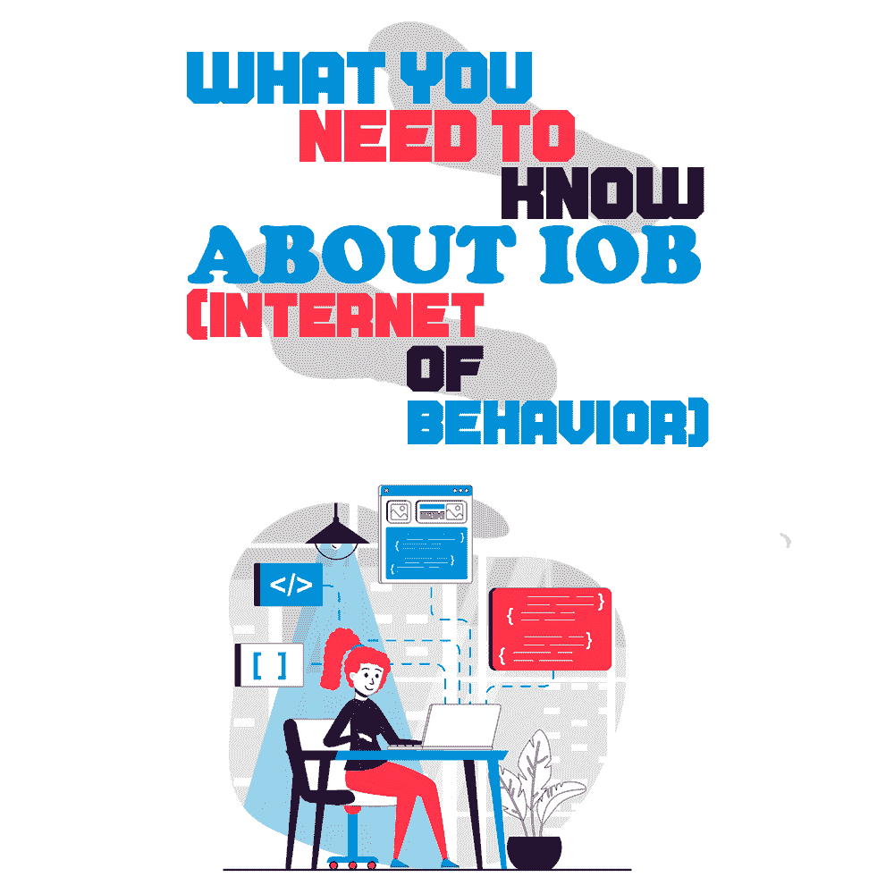

# 关于 IoB，你需要知道什么(行为互联网)

> 原文:[https://simple programmer . com/need-to-know-internet-of-behavior/](https://simpleprogrammer.com/need-to-know-internet-of-behavior/)

Ranked among the [Top 9 Strategic Technological Trends for 2021](https://emtemp.gcom.cloud/ngw/globalassets/en/information-technology/documents/insights/top-tech-trends-ebook-2021.pdf) by Gartner, the Internet of Behavior or IoB is a subject of rising interest. An area of research and development, IoB aims to delve deeper into understanding human behavior to improve human-technology interaction.

IoB 是物联网的延伸，物联网是近年来我们熟悉的技术。基本上，IoB 围绕着分析物联网设备产生的大量数据，并利用它们来理解人类行为。

用户数据在今天是非常重要和无价的，因此 IoB 有着巨大的潜力。这篇文章将阐明 IoB 的重要性，它在各个领域的使用，以及在该领域的挑战和机遇。

## 什么是工作

IoB 这个术语是由赫尔辛基大学的心理学教授哥特·尼曼在 2012 年创造的。为了更好地理解人类行为，尼曼教授引入了 IoB 的概念，这是三个领域的结合:技术，数据分析和行为科学。

IoB 可以定义为收集、分析和使用数据来理解、预测和驱动人类行为。数据是从物联网设备和其他来源收集的，如互联网、家用设备和可穿戴设备。然后，根据行为心理学对数据进行解释，以了解个人行为，并用于影响人们的决策。

根据尼曼教授的说法，对于每个行为，都可以分配一个地址，类似于物联网设备。一旦一个地址被分配给一个行为，不同类型的数据可以链接到它。这些数据可能是物联网数据、生物特征数据、社交媒体互动和购买数据等。IoB 数据分析也可以像物联网设备一样集成到中央数据库中。

## 理解 IoB 的重要性

数据是无价的，但很少是原始格式的。当数据被分析并转化为知识时，它就成为了一种资产。IoB 非常重要，因为它可以影响整个[客户体验](https://simpleprogrammer.com/machine-learning-customer-experience/)，从初始阶段到最终接触点。由于 IoB 从不同的接触点提供用户信息，识别用户的发现点，跟踪用户的旅程和分析他们的行动变得很容易。

这对企业意味着什么？强大的洞察力使用户接触点引人入胜，并提供个性化信息！结果呢？更多的互动和参与。凭借广泛的行为分析及其上下文应用，IoB 为用户和企业提供了卓越的价值。因此，公司正在 IoB 大量投资，以改善他们与用户的基本关系。

总而言之，IoB 可以在几个方面受益，例如:

*   通过个性化营销快速完成销售
*   更好地了解用户行为，从而快速解决用户关注的问题
*   消除耗时的用户调查
*   通过来自多个渠道的数据获得目标用户的全面形象
*   对用户进行实时定位，以提高销售额

## IOB 在各个部门的作用

由于人类行为是许多行业的一个基本方面，无论一家公司卖什么或规模有多大，IoB 都扮演着一个有影响力的角色。本节将讨论 IoB 在某些部门的作用，但绝不是一份详尽的清单。底线是，只要有人类的参与，IoB 就有影响力。

### 保险

保险公司可以使用 IoB 来防止酒后驾驶事故，识别医疗紧急情况，并监控司机的活动。IoB 可以帮助准确分析事故场景，并确定是否是由于司机的失误。

许多保险公司已经在使用司机跟踪工具。IoB 可以通过其行为评估将其提升到一个新的水平，使保险机构受益。

### 数字营销

数字营销是一个需要多种类型的人密切参与的领域。因此，IoB 为[行为分析和解释](https://www.amazon.com/dp/1398606480/makithecompsi-20)提供了有效的工具，增强了对最终用户的影响力，从而提高了转化率。

例如，IoB 可以用来分析和优化营销活动。有了 IoB 数据，就有可能全面了解人们的行为。因此，可以进行个性化营销，使得每个人都有吸引他们注意力的广告。

事实上，谷歌和 YouTube 已经在使用 IoB 向人们展示定向广告。还记得在浏览谷歌或 YouTube 时，与你搜索的产品相关的广告是如何出现的吗？是的，这是 IoB 在行动。

IoB 还可以用来生成实时营销通知，这已被证明是一个伟大的销售发电机。了解个人行为并在适当的时候发送通知会大大增加转化的机会。要看一个实际的例子，想想你有多少次从一个应用程序订购食物，仅仅是因为他们在你的午餐时间发送了一个通知！

### 生产

从分析客户行为到员工行为和对产品的需求，IoB 在生产中的作用是多方面的。IoB 数据可用于分析生产人员的行为，以发现提高生产质量和效率的新方法。

此外，分析关于客户行为以及他们如何与产品互动的数据可以提供有用的见解，以提高客户满意度和安全性。IoB 还可以用来分析行为数据，确定产品需求，在此基础上可以规划生产。这可以消除库存过剩或不足的问题。

### 卫生保健

As technology is advancing in the healthcare industry, creating diagnoses with minimum error margin is a key focus area of healthcare platforms. IoB can impact this area significantly. [UI UX design services](https://aufaitux.com/services/) can make use of IoB to perform cohesive user research and build digital applications addressing user challenges and concerns such as ease of consultation and finding the right doctors.

跟踪患者的活动，从中收集见解，并以一种有凝聚力的方式与医生分享，这大大有助于诊断的准确性。

IoB 还大力协助医疗保健提供商持续监控患者行为和转发实时数据。对于患有慢性疾病或需要术后护理的患者，IoB 是一个有用的工具。此外，iOB 可用于跟踪患者对治疗的反应或药物的影响。

### 政府

政府可以利用 IoB 技术聚集公民的集体利益，从而调整政策制定。

此外，IoB 可以通过追踪威胁社会安全运行的个人或团体来执行法律和秩序，从而降低犯罪率。虽然政治或司法方面是另一回事，超出了本文的范围，但从技术角度来看，IoB 的这种应用肯定是可能的。

## IoB 的挑战

Gartner 预测，到 2023 年，全球 40%的人口将处于数字追踪之下。IoB 将是一个真正的游戏规则改变者，虽然它承诺了巨大的机会，但也有一些严重的隐私和安全问题与之相关。

物联网追踪敏感个人信息的程度让许多人感到不安。大多数人不喜欢这种程度的侵扰。此外，许多公司与其子公司在幕后共享数据的做法也令人担忧。

IoB 必须应对的三大挑战是:

*   **法规:**必须制定跨辖区的明确法规，以解决数据隐私问题。
*   价值:如果人们愿意为了更好的体验而放弃他们敏感的个人信息，他们得到的价值一定是物有所值的。
*   安全:对于攻击者来说，IoB 打开了另一个攻击区域。必须采取措施消除数据泄露和攻击。

## 该领域的机会和所需技能

随着 IoB 技术的日益普及，该领域的就业机会也在增加。IoB 领域的一些热门职位包括 IoB 建筑师、IoB 开发者、IoB 解决方案工程师以及传感器建筑师和设计师。对技术人员的需求也在不断增加，因为需要部署和管理大量设备。

进入 IoB 领域所需的技能包括分析技能、行为科学、数据管理、传感器开发以及数据采集和管理。Python、JavaScript 和嵌入式语言的编程知识也是在 IoB 领域开始职业生涯的一项重要技能。拥有软件开发和测试技能的人可以尝试在 IoB 抓住机会。

## IoB 的未来

根据 Gartner 的研究，到 2025 年，超过一半的全球人口将与至少一个 IoB 系统交互。个性化信息是未来向人们提供独特体验的关键。

预计未来两年将有超过 30 亿人与 IoB 技术互动，它对提高服务效率的影响看起来很有希望。通过以尽可能好的方式应对它所带来的挑战，IoB 将为人们带来与企业一样多的价值。

正如 Gartner 高级副总裁兼全球研究主管 Peter Sondergaard 所说，*“信息是 21 世纪的石油，分析是内燃机。”*