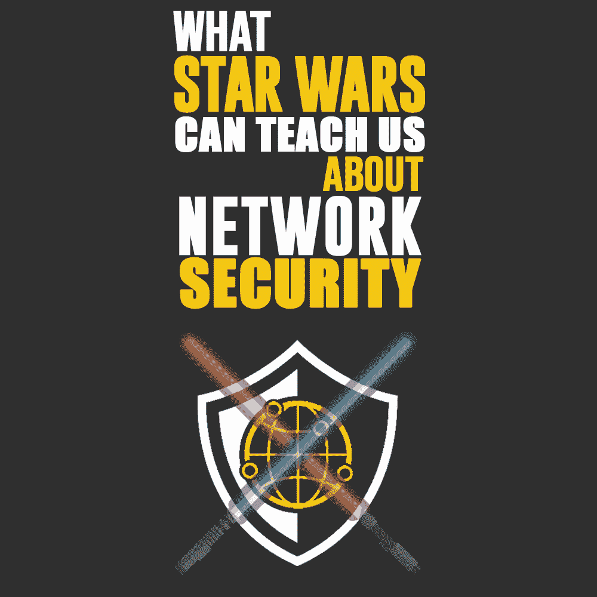
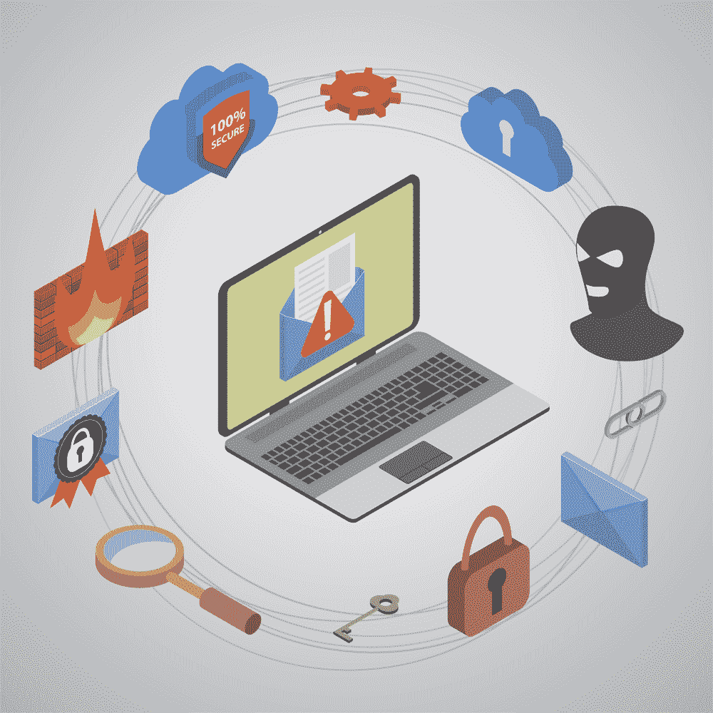

# 关于网络安全，星球大战能教给我们什么

> 原文：<https://simpleprogrammer.com/network-security-star-wars/>

****

**【红五号，待命】**

在全球数百万影迷期待《星球大战》三部曲的第三部电影《星球大战：天行者崛起》的上映后，有一个非常重要的事实需要记住:这一切都始于一个被忽视的安全漏洞。

你可能还记得乔治·卢卡斯第一次带我们去“一个很远很远的星系”时，死星(帝国的行星毁灭卫星)上一个未受保护的热排气口让卢克·天行者成为英雄，并让他走上了绝地武士的道路。

遵照欧比-万·克诺比“使用原力”的建议，卢克开枪射击——射入死星表面一个直径仅两米的洞——大约有一只 womp rat 的[大小——这引发了连锁反应，](https://starwars.fandom.com/wiki/Womp_rat)[摧毁了死星](https://www.youtube.com/watch?v=DOFgFAcGHQc)，挽救了义军同盟免于覆灭。

一个简单的行动，却以灾难告终(当然是为了坏人！)应该是各地的管理员、IT 主管和一线数据库用户的一个教训。只需要一个小小的缺口，一个毫无防备的漏洞，就能摧毁你努力建立的一切。意识、审视和关注细节会让你的小世界安全无虞——不管你的敌人会如何努力。

## 专家对网络安全的看法

一位专家认为，解决这个问题的第一步是重新思考你如何看待数据。

“人们需要明白，数据并不像他们想象的那样存在，”电子自由前沿的消费者隐私工程主管安德烈斯·阿里埃塔说。

凭借其电信工程师的职业生涯，Arrieta 加入了总部位于旧金山的非营利组织，该组织近 30 年来一直致力于提高互联网市场的透明度，保护消费者隐私和言论自由权。Arrieta 致力于提高人们对导致隐私泄露的结构性故障的认识，并创建防范这些故障的工具。

“当人们访问一个数据文件时，他们认为他们是从数据库中获得的，当他们使用完它时，他们会把它放回数据库，并一直保存到他们再次取出它，”他说。“但事情不是这样的。”

Arrieta 解释说，数据库不是孤立工作的。它们链接到其他数据库，这些数据库相互通信。因此，虽然一个特定的文件可能在一个数据库中有它的“家”，但在一般意义上，它也可以“存在于”与其家相连的所有其他数据库中。

## 抽屉的例子

为了理解这种现象，想象一个房间里摆满了文件柜，编号从 1 到 100。你需要的文件在 33 号文件柜最上面的抽屉里。但是当你打开 33 号文件柜最上面的抽屉时，你不仅仅看到那个抽屉的内容或者 33 号文件柜每个抽屉的内容；你可以看到所有文件柜抽屉里的东西。Arrieta 解释说，这就是数据库网络的工作方式。

许多人(甚至许多 IT 安全专家)不理解的是，要保护 33 号文件柜顶层抽屉中的文件，你必须保护房间中每个文件柜的每个抽屉。也就是说，数据库中的每个接入点都必须是安全的，否则整个网络都处于危险之中。

Arrieta 描述了一个他见过很多次的场景，两个网络连接在一起，一个包含非常敏感的私人数据，另一个没有。虽然“敏感”网络在其入口点可能具有高级别的安全性，但非敏感网络却没有。即使 IT 团队知道非敏感网络连接到敏感网络，他们也可能不知道一个网络的安全与另一个网络的安全紧密相连。

“例如，一家医院可能有几个网络，”阿里埃塔说。“一个是患者数据，包括病史、检查结果和私人信息。另一个可能是医院的空调系统和物联网控制。因此，控制医院周围温度和气流、连接病床和其他设备以监控患者护理的网络与处理所有私人数据的网络相连。控制网络可能没有同样的安全级别。”

Arrieta 说，这个教训是，每个网络，每个网络的网络，都只有其最不安全的组件才是安全的。

## 网络的黑暗面

这种情况在现实生活中发生了，发生在 2019 年最严重的医疗保健数据泄露事件中。美国医疗收款机构(“AMCA”)是一家与美国各地的医院、诊所、诊所和实验室签有合同的账单公司。在 2018 年 8 月至 2019 年 3 月期间，它成为黑客攻击的目标，不仅攻击了 AMCA，还攻击了其许多客户的数据库。总之，至少 21 家公司的大约 2500 万份病人档案被泄露，迫使 AMCA 破产，并引发国会调查。

虽然尚不清楚最初的入侵发生在哪里，是在 AMCA 还是通过其客户公司，但 Arrieta 表示，AMCA 数据泄露事件表明，一个数据库的安全故障会影响许多其他数据库。

## 不要认为你的安全是理所当然的

It serves as an important learning opportunity for security administrators everywhere. If you [rely on the belief that “your” network is safe](http://www.amazon.com/exec/obidos/ASIN/B01N6E0BG2/makithecompsi-20), you may find yourself becoming a victim anyway. A [recent report](https://staysafeonline.org/small-business-target-survey-data/) issued the National Cyber Security Alliance, based on a Zogby Analytics survey of 1008 small businesses with up to 500 employees, found that after suffering a data breach 10% went out of business, 25% had to file for bankruptcy and 37% experienced a financial loss.

如果您的网络连接到任何其他网络，您的网络和其他网络以及该网络连接的每个网络一样容易受到攻击。

为了最大限度地保护您的安全，您可以采取一些简单的步骤:

*   经常重新评估你的安全系统
*   定期监控其有效性
*   更新您的硬件、固件和软件，以确保它以最佳状态运行
*   遵循数据库访问身份验证的最佳实践，包括随机化用户名和密码
*   对所有员工进行系统培训，以确保遵守安全协议和实践

此外，正如阿里埃塔和 AMCA 的例子告诉我们的，你必须准备要求你的合作者和伙伴也这样做。因为你的[业务的安全](http://www.amazon.com/exec/obidos/ASIN/1491960388/makithecompsi-20)依赖于他们和你一样的警惕，而黑暗面总是等着利用弱点(尽管在*这个*例子中，是光明面利用了弱点！)