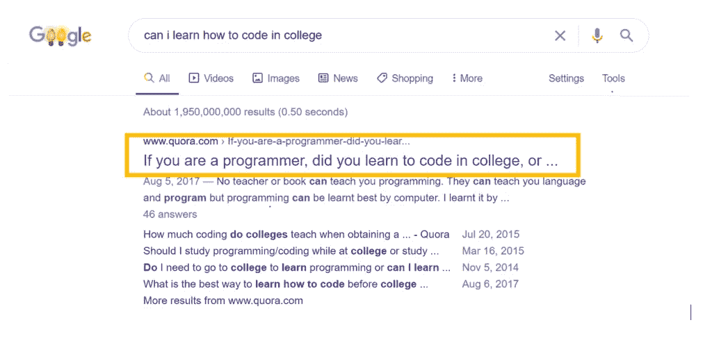
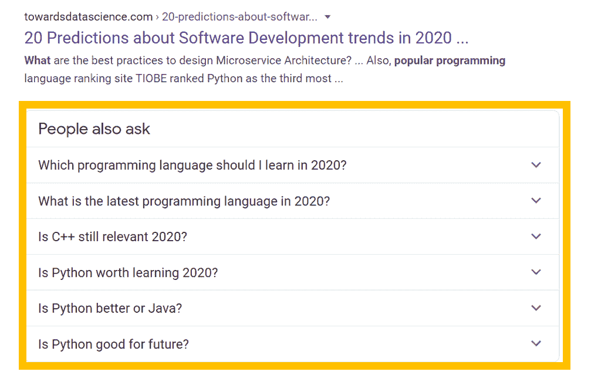

# 如何让你的编程博客永远不落主题

> 原文:[https://simple programmer . com/never-run-out-of-topics-programming-blog/](https://simpleprogrammer.com/never-run-out-of-topics-programming-blog/)

As your programming blog starts to grow, you might reach a point where ideas for content begin to dry up. That can happen when you’ve been blogging for awhile.

这也可能发生在你开始写博客的时候。这通常是因为选择了一个太具体的利基市场，很难想到内容。但是，如果你对自己的领域没有想象中的那么有热情，会发生什么呢？

或者，如果你筋疲力尽，想不出任何新的文章创意会怎么样？

这些都是值得关注的问题，如果你想成为一名受欢迎的软件开发人员，你需要意识到这些问题。如果你的定位太具体，就不会有太大的回旋余地。例如，如果你的博客是关于 Python 的，并且你写了所有关于它的知识，那么会发生什么呢？

为了避免陷入没有任何新想法的困境，你必须有一个内容策略。你必须找到一种方法，在不迷惑你的观众的情况下，从利基市场中脱颖而出。幸运的是，这篇文章将为开发者详细介绍博客的“软技能”。

## 什么是内容策略，我如何使用它？

内容策略是为你的博客规划和开发书面内容。这就是你想出新话题的计划。

如果你写博客已经有一段时间了，你的内容策略应该是这样的:

*   花时间找出你的听众喜欢的其他话题。
*   在社交媒体上发布调查，直接问你的读者想要什么。
*   使用你的电子邮件列表，看看人们喜欢什么，不喜欢什么。
*   不要完全停止写你的利基。
*   慢慢开始拓展你的业务。
*   从创建与编程相关的其他内容开始。
*   然后，交替写你的利基再次。
*   重复这个过程。

既然你已经有了观众，你就不能失去他们。这里的重点是慢慢来。

同样，如果你是博客的新手，你的内容策略会类似，但更简单。前几点并不适用，因为新博客通常没有受众。

如果你是一个博客新手，采取这种方法:

*   不要完全停止写你的利基。
*   一旦你开始厌倦你的领域，就写一些不同的话题。
*   从创建与编程相关的其他内容开始。
*   然后，交替写你的利基再次。
*   重复这个过程。

对于新的和成熟的博客来说，内容策略的要点是轮换不同的文章，同时保持和增加你的读者群。这样，你就给了读者他们想要的东西，同时也防止了你自己筋疲力尽。

只要记住，如果你的博客已经有了大量的读者，就要更加谨慎。

当你把内容策略记下来之后，就是时候弄清楚当你卡住的时候，到底该怎么找话题了。

## 使用论坛

为了保持编程博客上的新鲜内容，你应该做的第一件事就是使用论坛。论坛是 2021 年寻找博客话题的首选方式。如果你的博客是新的，使用它们会更好。对于一个新网站来说，今天在谷歌上开始排名的最好方法是找到具有体面搜索量的竞争较少的主题。论坛将帮助你找到这些话题，因为它是人们提问的第一个地方。

谷歌将 Quora 和 Reddit 主题排在第一页，因为许多人都在问同样的问题，但没有得到回答。这就是你的工作所在。

要想出要问的问题，只要把自己放在一个搜索编程的人的位置上。我们都会时不时地用谷歌搜索一些随机的东西。每当你脑海中出现一个关于编程的问题，就在搜索中键入它。

如果你在第一页看到这个论坛，就意味着你可以对这个话题进行排名。例如，如果我在谷歌上搜索“我能在大学里学习如何编程吗”，首先出现的是有人问其他程序员在大学里学习代码好还是自己学习好。

如果你再向下滚动一点，你会在 Reddit 上看到同样的问题。这是一个绝佳的机会，让你写一篇关于在大学里学习代码的详细文章，而不是自己写。

如果你想下次再看的话，记得把这个页面加入书签。

如果你的网站是新的，因为它不能对更有竞争力的话题进行排名，或者如果你是一个需要一些新鲜内容的知名博主，这是一个很好的策略。

## 写下你作为开发人员的经历

写下你作为开发人员的经历是不断发布高质量帖子的另一种方式。想象一下，作为一个没有经验的开发人员，开始一个编程博客，并选择 JavaScript 作为利基。很明显，你的大部分内容应该集中在 JavaScript 的教学上，但是你也可以集中在你个人的一些使用经验上。

例如，想象写一篇关于你正在做的项目的文章。它可以是任何东西，从游戏到网站，甚至是应用程序。开发那个应用程序对你来说很难吗？在时间管理、压力和实现目标的时间方面，你经历了什么？这些是人们想知道的事情。

看看 David Walsh 就知道了，他是网络上比较知名的 JavaScript 博客作者之一。如果你去他的网站，他的一些帖子分享了他个人生活的更新。就像这篇关于他作为一个“开发爸爸”的经历的文章。

他的情况是相关的，因为他与他的读者分享了他在抚养孩子时作为一名开发人员所学到的东西。如果他的观众大多是他这个年龄的人，那么他们会想知道，因为他们可能也有孩子。

作为一名程序员，你的生活中总会有一些事情可以分享。

另外，记得详细描述你经历的失败和成功。

告诉人们你试图开发和销售一款失败的独立游戏。或者你是如何尝试学习马尔博尔格语的，它是最难的语言之一，并且成功了！写这些类型的文章将会与你的读者建立信任，并提供无尽的话题来讨论。

## 撰写新闻和趋势话题

为你的编程博客寻找一致话题的最好方法之一就是写新闻。科技行业总是在变化。你可以利用这一点。

这是一个发表你对流行话题看法的机会。读者想听听你要说什么。看看像 hub.packtpub.com 这样提供节目新闻的网站。他们最近的一篇文章是关于用。Net 是一个开发者平台，它使用不同的工具和编程语言来开发游戏。你可以去看看，写下你的想法。

现在，很明显，如果编程界发生了什么大事，你也应该谈谈。有什么想法就说出来，不要怕有点争议。

此外，你可以在谷歌上输入“2020 年编程趋势”，看看会弹出什么。

从搜索结果来看，人们似乎关心一些事情:

*   应该学习哪些编程语言？
*   最新的编程语言是什么？
*   C++还有相关性吗？
*   Python 比 Java 好吗？
*   Python 对未来有好处吗？

所有这些都是编程博客的潜在主题。看起来人们大多想知道一些语言的未来。因为这个行业的变化如此之快，所以他们问这个问题是有道理的。您可以每年更新这些帖子，让其他人知道哪些编程语言仍然相关。

与其让读者去另一个博客获取新闻，为什么不让他们呆在附近从你这里获取呢？

## 写博客

这种类型的内容可能更适合那些已经建立了追随者，但想不出更多博客帖子想法的人。但不管怎样，你知道每个博主都有资格写些什么吗？博客本身！没错，如果你写博客，你可以写博客，并建议别人如何写博客。但是作为开发者，你有优势。

怎么会？嗯，大部分程序员不喜欢写作或者营销。这不属于他们的研究领域，这也是为什么他们中的许多人对开始写博客犹豫不决。然而，你已经完成了工作，并成为这方面的专家。你可以教其他开发者如何写博客和推销自己。

他们为什么不想听你的建议呢？不是每个博客都是一样的。开发者应该从其他开发者那里获得博客建议。

另外，这是天生的一对。没有人会怀疑你为什么在你的博客上谈论你的博客。然而，只要确保你已经写了很多文章。

就像我说的，这对于那些已经有了一批读者的成熟博客更有效。

## 写博客的技术方面

写博客的发展方面是另一个很好的选择。它对新老博主都适用。毕竟，程序员写代码并不奇怪。

你可以帮助其他拥有技术问题网站的企业家。撰写关于常见技术问题以及如何解决这些问题的文章。或者更好的是，分享网站所有者可以用代码定制网站外观的方法。

招聘开发人员可能会很贵。大多数企业主没有那么多现金，尤其是在刚开始的时候。向人们展示如何使用代码并获得真正独特的外观设计。

教没有经验的博客写手如何编码是获得更广泛受众的好方法。它将吸引不仅仅是对科技感兴趣的读者。

这将有助于一个新博客获得成长初期所需的牵引力。对于老博客来说，他们可以与新文章和新读者保持联系。

## 记日记

A journal is a must-have tool for any writer. Likewise, many professional developers use journals for work. They're useful for keeping notes when working on projects. But, you can also use the journal as a diary.

考虑每天写日记。你可以写任何你想写的东西，只要确保坚持下去。这样做不仅能提高你的写作技巧，还能帮助你构思文章。

试着记录下你作为开发人员的日常工作，并以此作为灵感。你会惊讶地发现，有多少好主意因为没有记下来而被浪费了。

一旦你没有话题可写的时候，拿出那本日记。那些旧笔记将为文章提供有价值的主题目录。

从爱因斯坦到达芬奇，最聪明的人都写日记。他们写信是为了不忘记自己的想法。

您可以使用包含所有编程笔记的同一本日记。或者你可以买一本新的，专门当日记用。

## 创建一个 YouTube 频道

现在，我知道你在想什么:我想不出博客主题，你想让我开始新的东西？是的，原因如下。

首先，现在是开发者开始自己的 YouTube 频道的时候了。看看 YouTube 上的编程社区。它在成长，更多的程序员开始意识到这一点。现在甚至还有人在做直播流的编码。蒂姆的技术做了一个 12 小时的编码直播，他用 Python 创作了一个游戏。该流点击量突破 200 万次。

换个角度来看，如果你看看去年《使命召唤》发布时的流量，蒂姆的流量比所有人都多。其他开发人员自己做代码，也在视图上与游戏流竞争。

这太疯狂了。

其次，YouTube 给了老博客一个新的开始。通过利用你的渠道作为一个独立的平台，成熟的博客可以尝试新的话题。

从制作你博客之外的视频开始。如果程序员喜欢你的 YouTube 内容，那么考虑将其中的一部分整合到你的博客中。对于年长的博客作者来说，这是远离他们原来的定位和扩大读者群的完美方式。

最后，你可以比博客更快地发展 YouTube 频道。这对新博客来说是一个巨大的好处，因为博客可能需要几年的时间来建立牵引力。

YouTube 视频在谷歌上的搜索引擎优化排名是即时的。它甚至能让你出现在竞争话题的第一页，这是大多数新网站做不到的。

这意味着你可以讨论那些很难在你的博客上排名的竞争性话题。从一开始，你能找到的主题越多，就越容易从你的领域中脱颖而出。

## 接受客座博文

保持博客内容持续流动的最好方法可能是接受客座博文。毕竟，有什么比有人为你写文章更好的呢？

对于努力创作内容的新老博主来说，客座文章都是一个很好的方法。如果你是一个博客新手，接受客座博文将有助于你建立关系网，让人们链接到你的网站。

作为一个成熟的博客写手，客座博文也是很棒的。你已经建立起来的观众将会体验到不同程序员的观点。

要找到在你的博客上发帖的人，你必须做一点网络工作。以下是您可以开始的方式:

*   定期评论其他博客。
*   为其他编程网站写客座博文。
*   请博客的主人回礼。

或者您可以:

*   开始一个播客，这可以导致采访和与其他程序员的合作。
*   邀请您的播客嘉宾在您的博客上发布嘉宾文章。

然而，如果你不是博客新手，你真正要做的就是在你的博客上创建一个“为我们写作”的页面。当然，我假设你的网站已经很出名了。

如果是这样的话，人们会想为你的网站写作，因为他们会得到一个高质量的反向链接。

## 内容策略意味着永远不会没有话题

Coming up with great content ideas for your programming blog will take practice. Start by getting comfortable with writing about different topics outside of your niche.

记得保留大部分与编程相关的内容[。你可以通过博客来记录你的成就、失败、新闻、趋势等等。](https://simpleprogrammer.com/personal-branding-for-programmers/)

仅仅因为你在一个特定的领域开了一个博客，并不意味着你被它所限制。写些私事和其他编程话题也没问题。然而，最重要的是你喜欢写博客。因为如果你不这样做，那么你的博客就会失败。

如果你不再喜欢你的利基或者想不出更多的主意，现在就计划一个内容策略。这样做会让你的博客在未来几年里保持相关性。