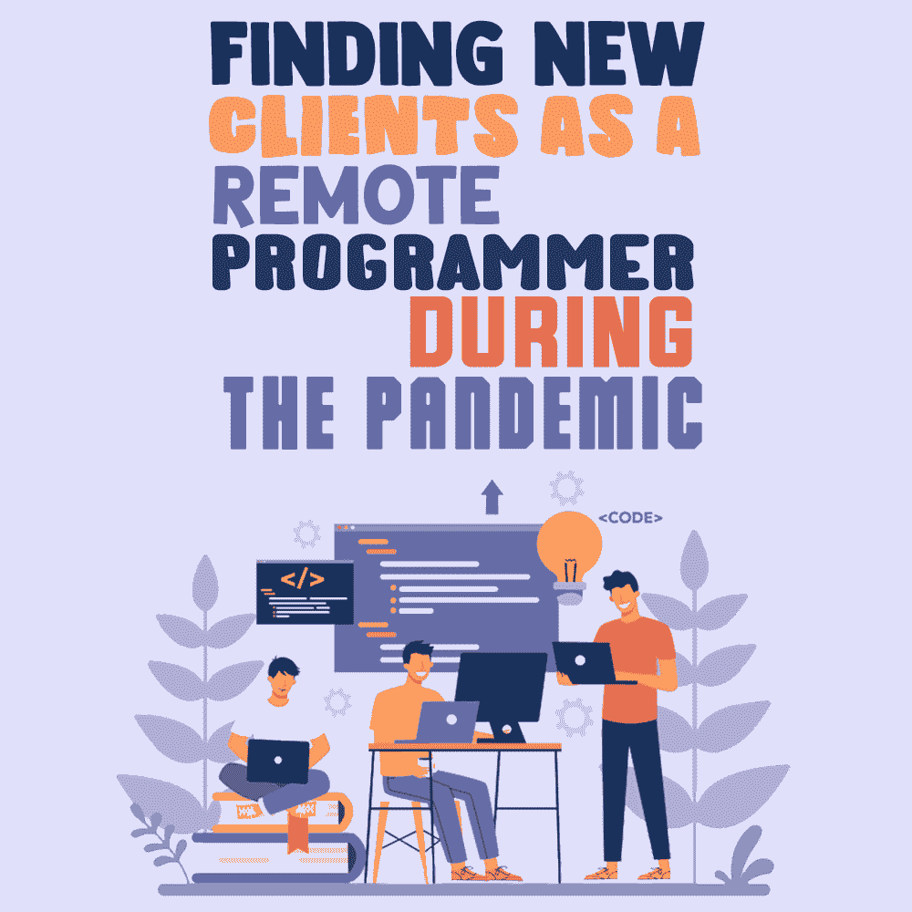

# 在疫情期间作为远程程序员寻找新客户

> 原文:[https://simple programmer . com/new-clients-remote-programmer-疫情/](https://simpleprogrammer.com/new-clients-remote-programmer-pandemic/)

As the COVID-19 pandemic is taking charge, businesses around the world are experiencing a major crisis, with many going bust.

随着新冠肺炎疫情席卷全球，我们已经看到了对各地企业的毁灭性影响。股票市场陷入混乱，金融困境普遍存在。人们已经失去了工作，而且还在继续失去工作，金融专家指出，未来一段时间情况会变得很糟糕。

现在，作为一名远程自由程序员的生活已经充满了不确定性，在等式中加入一个疫情会导致绝对的惨败。因为如果你客户的生意不景气，这不可避免地意味着你自己的自由职业也会受到影响。

你可能已经开始失去客户的常规工作，你仍然拥有的客户可能会要求降低利率或延期付款，所有这些都意味着你的艰难时期。所以，如果你还没有开始寻找新客户，现在是时候了。寻找新客户，尤其是在经济危机时期，可能是一项艰巨的任务，所以你需要比以往更加努力。

虽然没有简单的答案来告诉你如何通过强大的客户基础和稳定的收入来恢复，但我们从各种来源收集了专家的建议，这里有四个最佳实践，可以帮助你在冠状病毒危机期间作为远程程序员找到新的客户。

## 利用你的关系网

首先，没有必要表现得一切顺利。你可能会觉得，公开你作为一个人的企业所面临的困难不会对你的网上个人品牌有任何好处，但从长远来看，保持漂浮比仅仅为了保持形象而淹死要好。也就是说，不要害怕在社交媒体上发布你有新的机会或者对新客户开放。

你现有的前同事、远程程序员和以前的客户网络是一个非常有用的资源。他们中的许多人可能面临着类似的挑战，并且可能已经找到了克服这些挑战的方法，所以他们可能能够提供帮助。

例如，[目前不能雇佣你的老客户](https://austinchurch.flywheelsites.com/follow-up-with-clients-without-being-annoying-email-templates/)可以把你介绍给能雇佣你的人。或者，你的一位前同事可能在一家需要你提供合同服务的公司有推荐人。或者，一个自由职业者同行可能有他们觉得不是他们工作类型的要求，或者他们因为某种原因不能承担，所以他们可以传递给你。同样，你也必须成为你人际网络中其他人的资源——如果你知道一份工作不适合你，但可能适合其他人，积极主动地把它送给那个人。

即使没有具体的工作或工作机会出现在你的人际网络中，你肯定会得到支持或指导，为你指明正确的方向。例如，你可以简单地问他们正在做什么来应对这些测试时间。你也可以受益于政府平台提供的商业指导和支持，如[小企业管理局](https://www.sba.gov/)。

## 磨练你的推销技巧，坚持不懈

还记得当你第一次开始远程编程时，你是如何每周发出多个冷建议和跟进，并最终在所有这些努力中找到一点点成功的。你精炼并个性化了你的推销，尝试了那些不起作用的东西(并排除了它们)，并且凭借良好的毅力，你能够找到一个或少数几个确实支付不错的客户。

那些日子也很艰难。但是，正是因为你坚持不懈，并注意到你的外联宣传，你得到了你的第一批客户，最终导致稳定的工作和业务。

虽然在疫情期间冷场推销可能不是你的最佳选择，但在向那些推荐人和你的人际网络中的人推销之前，每天花大量时间磨练你的推销(让它真正令人信服),可能会有很大的不同。如果你觉得你的推销是一流的，但你仍然被拒绝，那么从你的同行那里获得反馈是一个好主意，告诉他们如何可以做得更好。当然，很有可能你的推销被拒绝仅仅是因为潜在客户目前不能雇佣任何人。

此外，坚持是关键，当你在忍受干旱期时，求助于在线平台上的旧投标方式没有什么错。如果你是一名经验丰富的程序员，你可能会觉得你的业务已经超越了那些菜鸟技巧(比如在 LinkedIn 上申请一份合同工作)，但如果推荐目前没有帮助，你必须尽一切努力让船漂浮起来。

## 处理你的后台任务

除了完善你的推销和直接努力争取新客户，还有很多幕后工作会帮助你继续前进。因为，本质上，你是一个人的生意。

因此，为了保持事情顺利进行，并保持对获取新客户的主要关注，您需要确保所有的管理工作都做得很好。也就是说，现在是一个很好的时机来重组你的业务，让你的预算井然有序，并审查和精简你的开支。您可以考虑寻找更具成本效益的替代工具和软件订阅，以取代您目前用于业务运营的工具和软件。

此外，你可以花些时间改造你的投资组合网站，学习需求日益增长的[有用技能](http://www.amazon.com/exec/obidos/ASIN/1617292397/makithecompsi-20)或[编程语言](http://www.amazon.com/exec/obidos/ASIN/B073X6GNJ1/makithecompsi-20)，或者获得在线认证或证书，让自己更有市场。你甚至可以从[远程工作手册](https://www.toptal.com/remote-work-playbook)中学到一两个技巧，如何创建一个合适的企业级远程工作环境，为你的成功做准备。

直接或间接地，所有这些都将有助于你在疫情及以后寻找新客户。

## 考虑更加灵活

暂时放下固守一个特定利基的想法如何？这听起来可能并不吸引人，但是让你的服务多样化可能是马上获得新客户的关键。

如果你的远程编程利基恰好在一个遭受病毒肆虐的行业(如旅游和零售)，考虑一下你如何才能转向服务于一个目前有更大机会的行业(如医疗保健和教育技术)。评估你的可转移技能，将它们与你接触过的行业相匹配，然后采取行动。

此外，例如，如果你只专注于提供远程前端 web 开发，也许现在你也可以做一些后端编程，如果有人有要求。

此外，灵活性不仅仅是横向扩展您的服务。也许过去有一些潜在客户你选择不与之合作，也许是因为他们的要求与你想要做的不太匹配，或者也许他们提供的价格比你认为自己的价值低一点。

不要犹豫，联系那些以前的线索。这种灵活性和精明可以帮助你在疫情期间获得更多的工作，并建立长期的业务关系。

## 是的，你仍然可以找到新的客户

The timeline of the novel COVID-19 pandemic is still hazy. No one really knows how long we need to endure these trying times — is it a question of weeks, months, or even years? Regardless of what happens, now is the time to get practical and implement strategies that keep you in the game, such as:

*   利用你的前同事和客户网络来获得推荐和指导
*   磨练你的冷外展技巧，坚韧不拔
*   改造你的投资组合，提升你自己的技能，精简你的开支
*   转向不同的利基市场，为仍在蓬勃发展的行业服务，横向扩展您的服务，在定价/支付方面更加灵活

许多企业无论大小都无法成功，但如果你坚持不懈，适应力强，并利用你的网络，你就有很大的机会成功。一旦你成功度过这场危机，你将变得比以往任何时候都更强大，更有竞争力。