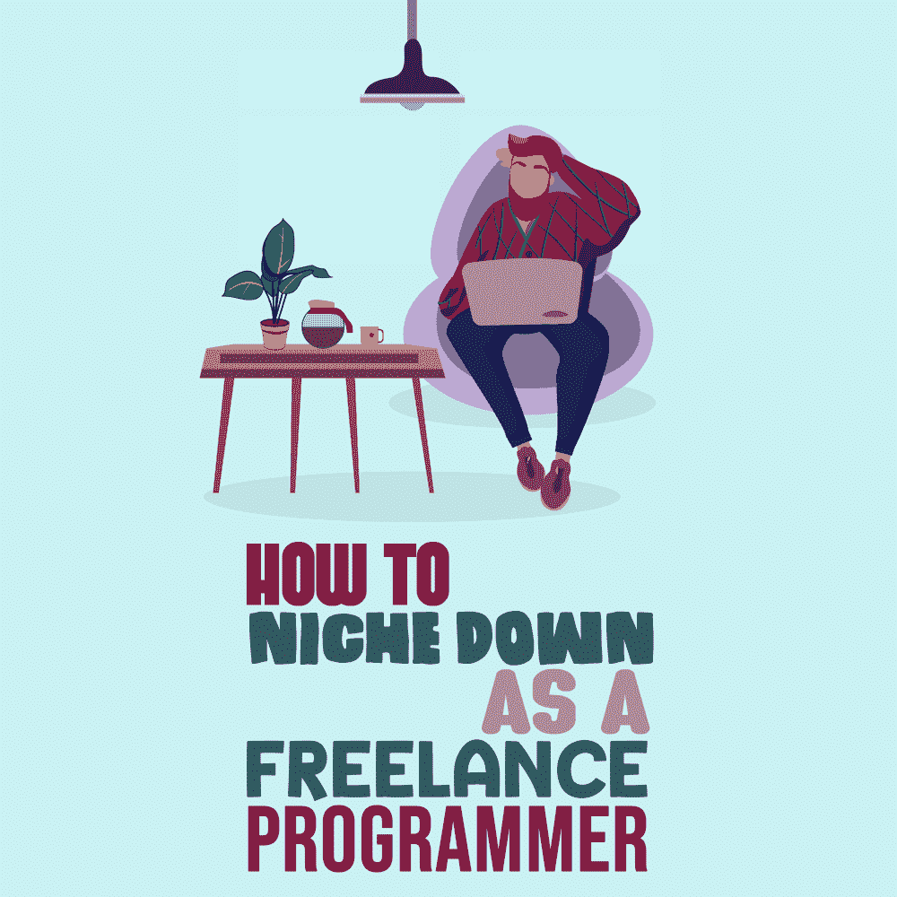

# 如何成为一名自由程序员

> 原文:[https://simple programmer . com/niche-down-freelance-programmer/](https://simpleprogrammer.com/niche-down-freelance-programmer/)

Being a specialist is one of the best things you can do for your career or your freelance business as a programmer. People respect specialists, as they are experts in a given area in which they have more experience than the generalists. And not only that, but specialists can do the job more efficiently and command higher rates in their respective areas.

谁是专家呢？让我用医生来说明专家和多面手的区别。任何有医学学位的人都可以被称为医生，但并不是每个人都是脑外科医生。

专家是某个非常狭窄领域的专家，而多面手通常知道不同领域的许多事情，但在其中任何一个领域都没有深入的知识和丰富的经验。

作为程序员如何成为专家？

答案很简单:你选择一个你想擅长的领域，然后开始只在那个领域做项目，尽可能多地获得经验。

在自由职业者的世界里，这被称为“细分”在这篇文章中，我想向你介绍利基的概念，以及为什么利基下来可能是一个最好的决定，你可以为你的自由职业者业务。

## 什么是小众？

利基市场(或利基市场)本质上是一般市场的子集，由它自己的一套特征来定义。这听起来可能有点太抽象了，让我来解释一下。

拥有 1000 多名客户的会计公司的软件开发就是一个利基市场的例子。这是更大的软件开发市场的一个子集。这个利基市场有一个明确定义的客户角色——一家拥有 1000 多个客户的会计事务所。

另一个利基的例子是 [React.js](https://www.amazon/dp/172004399X/makithecompsi-20) 开发服务，这是一个更广泛的专业 [JavaScript](https://www.amazon/dp/0596517742/makithecompsi-20) 开发服务的一个更小的子集。

我来解释一下[不同类型小生](https://www.bigcommerce.com/ecommerce-answers/what-is-a-vertical-market-online-selling-and-business-niches/)的区别。

### 水平壁龛

想象一下，一个专门使用 Node.js 构建后端应用程序的 web 开发人员，他为各行各业的公司做这件事。他不把自己限制在与特定行业或特定类型的公司合作，而是只提供一种类型的服务。这是横向利基的一个很好的例子。

这种方法有一个优势:如果你选择一种相当受欢迎的技术，你就有一个非常大的潜在客户池。

这种方法的缺点是，如果这项技术在几年内消亡，你将失去你的客户，并且可能需要学习一项新的技术。这在编程世界里经常发生，不是吗？

### 垂直壁龛

相反，垂直利基专注于定义您的客户档案，而不是专注于特定的技术。例如，一个为非营利组织建立网站的程序员就是一个选择垂直利基的人的好例子。

在这种情况下，你不会像关注可交付成果那样关注技术。某一年你可能正在使用 PHP 和 WordPress 建立一个网站，而下一年你可能会使用 ASP.Net MVC 框架或者像 Keystone.js 这样的无头 JavaScript CMS

这种方法的一个主要优点是，如果一种特定的技术过时了，你不需要改变营销方法中的很多东西。

如果你已经因为为非营利组织建立优秀的网站而闻名，那么你将继续吸引这些类型的客户。

事实是，大多数客户并不关心你使用的技术。他们关心的是价格和你将带给他们的结果。

这种方法的缺点是你需要适应技术市场的变化。框架和编程语言不断发展变化。一个很好的例子是 jQuery，这是一个 JavaScript 框架，过去几乎在每个网站上都可以实现，现在被 PWA 方法和 React.js、Angular 和 Vue.js 等新框架所取代。

## 为什么你应该考虑利基下来

People become experts by developing very deep knowledge in a particular category. As you realize, experts are typically more in-demand in their respective areas of expertise and more expensive to hire than the generalists.

让我给你一些你应该考虑作为一名自由程序员的理由:

*   无论你选择垂直还是水平利基，你都会更快获得经验。如果您决定专攻某项特定技术，并且只从事使用它的项目，您将会更经常地遇到各种不同类型的场景和问题。一旦你学会如何克服或预防它们，企业就会更容易雇佣你，因为风险更小。
*   你的效率水平将会提高。如果你一直在利用某项技术，你就会了解它的长处和短处。不仅如此，作为程序员，你自然会[变得更有效率](https://blog.hubspot.com/marketing/how-to-be-efficient)，因为你每次都会重复某些程序。你变得越有效率，你就能越快地完成项目，你就能得到更高的报酬。
*   营销对你来说会更容易。作为一名自由程序员，你可能知道营销在建立品牌、建立信任和吸引更好的客户方面很重要。当你决定专业化时，你给世界的信息将会更加清晰和一致。你创建内容会容易得多，因为你会确切地知道你的营销信息的中心主题。
*   **你会变得更有参考价值**。想象一下，你有两个朋友是开发人员:一个是普通的前端开发人员，另一个是 React 原生开发人员，专门构建光速移动应用。如果一家公司的 CEO 想用 React Native 开发一款移动应用，并让你推荐一个人，你会推荐你的哪个朋友？

一旦你确信利基下来是值得考虑的事情，接下来要做的事情将是决定什么利基最适合你。

## 如何决定什么样的小众最适合自己？

这往往是自由职业者面临的最艰难的选择。他们害怕一旦他们缩小了自己的市场，就会失去所有的工作和客户。

我们倾向于认为，我们提供的越少，我们的线索就越少，因此业务和工作就越少。虽然这在新的市场中可能是正确的，但在非常饱和的市场中却不是这样，在那里你的大多数竞争对手都提供与你完全相同的服务。

如果你目前提供多种不同的服务，并发现很难获得新的线索，那么如果你找到合适的位置并尝试六个月，会有什么伤害呢？

相反，对于一些自由开发人员来说，找到合适的位置是很容易的。他们可以只看一眼他们的客户群，看看他们中的大多数属于哪个类别，然后决定只与该类别的客户合作。

对于其他人来说，这可能是一个更困难的选择。这里有一些标准，你可以用来为自己选择合适的职位:T2。leader-2-multi-119{border:无！重要；显示:屏蔽！重要；浮动:无！重要；行高:0；边距-底部:15px！重要；左边距:0！重要；右边距:0！重要；margin-top:15px！重要；最大宽度:100%！重要；最小高度:250px 最小宽度:250 像素；填充:0；文本对齐:居中！重要}

*   你擅长什么？审核你的技能和你过去使用过的技术或框架，看看哪些是你擅长的。例如，如果你擅长 React.js 这样的框架，就选择它。
*   你想从事什么类型的项目？你更喜欢短项目还是长项目？你喜欢和初创公司还是公司一起工作？有没有一个特定的行业是你热爱的，你想从事的？彻底考虑一下，写下你想合作的客户和项目类型。
*   市场上有需求吗？下一步是考察市场，看看[你的利基市场是否足够好](https://simpleprogrammer.com/programming-niche-good-enough/)。看看招聘网站，和你所在行业的其他自由职业者和专家聊聊。如果你这样做，你应该对是否有需求有很好的感觉。

理想情况下，以上三个标准应该完全匹配。例如，如果屋顶公司不需要，那么专门使用 React Native 为他们构建移动应用程序就没有意义。所以继续检查和研究，直到你找到这三个标准之间的一个很好的重叠。

## 我是如何从利基市场中获益的

我从 2017 年 7 月开始作为 WordPress 开发者从事自由职业。如果你曾经是一名自由职业者，你会知道在开始的时候很难获得高质量和高收入的客户。建立你的投资组合和信誉需要很多时间。

直到 2019 年 12 月，我也就那样了。我加入了自由职业平台 [Codeable](https://codeable.io/) ，我已经赚到了足够的钱来维持生计。然而，我想进步，得到更好的客户，并能够竞争一些高薪项目。

所以，在 2019 年 12 月中旬，我决定缩小专业范围，开始专注于建立 WordPress 会员和电子学习网站。我没有试图专攻某类项目，所以你可能会说这是一个横向利基的例子。

当我开始时，我的投资组合中没有任何会员网站，但我看到这些类型的项目在 Codeable 上相当受欢迎，没有太多竞争。

我认为，如果我开始寻找这些项目，最终我会建立一个良好的投资组合，随着时间的推移，这将帮助我赢得更多更大的项目。除了看文档和网上看一些乱七八糟的教程，没有做什么特别的训练。

However, I was always confident that I could deliver good work, because I have a very solid programming background and can develop features that some plugins were missing.

那是我做决定的时候。回想起来，我可以说这是我自由职业生涯中最好的决定。

在不到七个月的时间里，我通过创建一个网站，并为寻找会员网站开发者的人量身定制文案，赚了我在整个 2019 年赚的两倍。它已经成为一个很好的转换工具，因为我能够把自己和其他人区分开来。

竞争项目已经变得容易得多，我能够更快地对项目进行评估，因为我更了解将要使用的技术。

## 今天就开始定位吧

如果你是一名自由程序员，我希望你能看到选择一个利基市场并成为 it 专家的好处。如果你真的想成为一名受欢迎的专家，这可能是你自由职业生涯中能做的最好的事情之一。

它会帮助你获得更多优质项目，找到更好的客户，赚更多的钱。不仅如此，一旦你有了足够的线索，你也将能够决定你想接手的项目。

我强烈建议你至少考虑细分市场，尝试六个月左右。一旦它开始起作用，你唯一的遗憾就是你没有早点这么做。